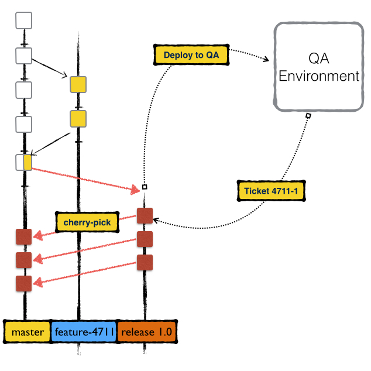

Vorwort
-------

| Git ist die wahrscheinlich wichtigste Neuerung im Bereich
  Softwareentwicklung der letzten 10 Jahre (Stand 2013). Es gibt bereits
  unzählige Bücher, Tutorials, Videos und Schulungen zu diesem Thema.
| Warum also nochmal ein Buch?

Dieses Buch behandelt Schritt für Schritt alle Themen rund um Git, die
Sie als Entwickler brauchen werden, um produktiv zu arbeiten. Um richtig
effektiv zu sein müssen Sie verstehen, wie Git intern funktioniert.
Dieses Buch behandelt die Themen nicht nur an der Oberfläche, sondern
erklärt tatsächlich das “Warum” und “Wie”.

Das Buch entspricht vom Inhalt einer eintägigen Git-Schulung im
Tutorial-Format. Selbst wenn Sie bereits mit Git arbeiten rate ich
Ihnen, das Buch von Anfang bis Ende zu lesen. Die beiden Protagonisten
Lars und Karl haben selbst für erfahrene Git-User brauchbare Tipps
parat.

Lars arbeitet bereits sehr lange und intensiv mit Git. Karl ist neu im
Team und hat überhaupt keine Erfahrung mit dezentraler
Versionskontrolle. Am besten lernt man mit einer neuen Technologie
umzugehen indem man damit arbeitet.

| Die beiden setzen sich also zusammen an einen Tisch und fangen beim
  Aufsetzen und Klonen eines Repositories an und hören erst auf, wenn
  die ersten Features fertig implementiert und gepusht sind.
| Lars versucht von Anfang an zu erklären, wie Git arbeitet und
  funktioniert. Karl entwickelt sehr schnell ein fundamentales
  Verständnis für die Idee hinter dem dezentralen System.

| Das Buch verzichtet fast komplett auf Grundlagen zu diesem Thema und
  fokussiert sich auf die praktische Anwendung und die Fälle, die
  Entwickler in der täglichen Arbeit betreffen.
| Für theoretische Abhandlungen gibt es bereits genügend andere Bücher.

Tag 1
--------

Der Hintergrund
~~~~~~~~~~~~~~~~~~~~

Karl ist Freiberufler, Consultant und Softwareentwickler aus
Leidenschaft. Er arbeitet seit vielen Jahren sehr produktiv mit
verschiedenen Frameworks und für verschiedene Kunden.

| Karl lebt mit seiner Frau und seinem Sohn in einer kleinen Wohnung in
  München.
| Der Beruf bringt es leider mit sich, dass Karl gelegentlich Projekte
  auch außerhalb Münchens annehmen muss.

Heute startet ein neues Projekt für Karl und zwar in Nürnberg. Karl
überlegt meistens sehr lange, ob er Projekte annehmen soll die mit
Reisezeit, Pendeln und Übernachtungen verbunden sind. Das Projekt in
Nürnberg jedoch ist technologisch so interessant, dass Karl die
Unannehmlichkeiten hierfür in Kauf nimmt.

Aufgrund seines Sohnes möchte Karl aber vermeiden, die ganze Woche in
Nürnberg im Hotel zu übernachten. Aus diesem Grund pendelt er morgens
nach Nürnberg und abends wieder zurück. Das bedeutet, Karl verbringt
jeden Tag 2,5 Stunden im Zug. Zeit die produktiv genutzt werden will.

Wie es der Zufall will arbeitet das Team von Karl mit dem dezentralen
Versionskontrollsystem `*Git* <http://www.git-scm.org/>`__.

Einer der Vorteile die ein dezentrales System mit sich bringt ist
*Offline-Fähigkeit*.

.. admonition:: Tip

  Ein bekannter Scherz unter GIT-Nutzern ist, dass die Offline-Fähigkeit von Git nur in der Theorie gegeben ist, da man Git ohne Google nur schwer auf der Kommandozeile verwenden kann.   |

*Offline-Fähigkeit* wird oft gleichgesetzt mit der Möglichkeit ohne
Netzwerk zu arbeiten. Im Fall von Karl ist dies korrekt und auch
wichtig, da Karl so auch im ICE nach Nürnberg produktiv in seinem
Repository arbeiten kann.

Ein viel wichtigerer Aspekt ist jedoch die Möglichkeit, *lokal* mit Git
zu arbeiten. Die meisten Operationen in Git sind lokale Operationen und
nur ein ganz kleiner Teil ist wirklich mit einer Remote-Operation
verbunden. In zentralisierten Systemen wie *Subversion* benötigen im
Gegensatz alle Operationen eine Verbindung zum zentralen
Repository-Server.

Git Basics
~~~~~~~~~~~~~~~

Karl kommt in Nürnberg an und freut sich, seine neuen Kollegen zu
treffen. Die erste und wichtigste Aufgabe eines Entwicklers in einem
neuen Projekt, neben dem obligatorischen Kaffeetratsch in der Küche, ist
das Auschecken des Projektrepositories und das Einrichten des
Arbeitsplatzes.

Karl hat bisher keinerlei Erfahrung mit Git und freut sich, dass sich
sofort alle Kollegen bereit erklären, ihn bei der Einarbeitung zu
unterstützen.

Erster Ansprechpartner für Karl ist Lars, der für Neuzugänge im Team
eine Art Mentorenrolle übernimmt.

Karl und Lars setzen sich zusammen an Karls Tisch und richten den
Arbeitsplatz ein.

» *Karl, zunächst solltest Du dir Git installieren. Git wird in den
nächsten Monaten dein wichtigstes Tool werden*.

» Das habe ich bereits zu Hause gemacht, wir hatten ja vereinbart, dass
ich mit meinem eigenen PC hier im Büro arbeite, richtig? Soweit ich das
bei unserem letzten Gespräch verstanden habe arbeiten die meisten
Entwickler bei euch ja mit Windows.

» *Ja, das stimmt, es gibt einige Entwickler, die mit Linux arbeiten,
aber die meisten arbeiten auf Windows Systemen.*

» Ich würde gerne mit meinem Mac-Book arbeiten. Wie ist das denn eurer
Erfahrung nach? Sind die verschiedenen Git-Implementierungen kompatibel?

» *Soweit ich weiß hatten wir bisher nie Probleme mit Git und
verschiedenen Systemen. Unsere Windows-Entwickler arbeiten mit*
`*Git-For-Windows* <https://git-for-windows.github.io/>`__\ *. 
Die Linux-Entwickler arbeiten mit der normalen Git-Version oder
teilweise auch mit EGit unter Eclipse. Alle arbeiten bisher problemlos
zusammen.*

» Das klingt gut, ich habe natürlich versucht, mich ein wenig schlau zu
machen. Ich habe gelesen, dass es des öfteren mal zu Problemen zwischen
Windows und Linux/BSD Systemen kommt, weil Windows das Zeilenende anders
behandelt?

» *Ja das stimmt, die verschiedenen Systeme behandeln Zeilenumbrüche
jeweils unterschiedlich. Man könnte jetzt natürlich denken, dass dies
ein Problem ist, wenn ein Entwickler auf einem Linux-Rechner eine Klasse
öffnet, die auch einem Windows-Rechner erstellt wurde, gerade wenn es um
einheitliche Formatierung geht.
Git kümmert sich aber darum. In der Standardeinstellung, mit der wir
hier auch arbeiten wird Git für jede Datei, die du eincheckst jedesmal
alle Zeilenenden in das Linux-Format konvertieren. Beim auschecken
werden die Zeilenenden wieder in das Format für dein aktuelles System
konvertiert.*

» Ziemlich intelligent gemacht. Ich würde sagen, wir fangen einfach
direkt an zu arbeiten und klären weitere Fragen dann, wenn sie
auftauchen?

Klonen
^^^^^^^^^^^^^

Karl möchte natürlich schnellstmöglich mit der Arbeit starten. Bevor er
aber anfangen kann muss er sich zunächst den Source-Code des Projektes
besorgen, an dem er arbeiten soll.

| Würde das Team mit Subversion arbeiten würde sich Karl eine Revision
  aus dem zentralen Repository auschecken. Eine Revision entspricht
  einem bestimmten Entwicklungsstand zu einem bestimmten Zeitpunkt.
| Jedesmal wenn ein Entwickler in das zentrale Repository eincheckt wird
  der globale Revisionzähler hochgezählt. Das funktioniert deshalb, weil
  sich alle Entwickler über das zentrale Repository synchronisieren. Es
  gibt keine Möglichkeit, Commits zu machen ohne mit dem zentralen
  Repository zu sprechen.

Das Team arbeitet aber **Git**-sei-Dank nicht mit Subversion sondern mit
Git. Um sich den Sourcecode des Projektes zu holen muss Karl das
Projektrepository klonen. Die *Clone*-Operation unterscheidet sich
fundamental vom Auschecken einer Revision in Subversion, da nicht nur
ein bestimmter Entwicklungsstand geladen wird sondern das komplette
Repository inklusive jeglicher Historie, aller Commits, aller Tags und
Branches und allem was jemals in diesem Repository geschehen ist.

| Karl klont sich also das Team-Test-Repository unter Anleitung von
  Lars.
| Das Test-Repository ist eine Spielwiese auf der neue Enwickler sich
  zunächst mit Git vertraut machen können.

.. code-block:: bash

  git clone ssh://karl@repository-server.intern.com/repos/test-projekt.git mein-test-projekt.git

  Cloning into 'git-ws-repos-local'...

  done.

  Checking connectivity... done

Im Team ist der Zugriff auf das Repository über SSH gesteuert. Über SSH
lassen sich problemlos Zugriffsrechte auf Maschinenebene und notfalls
auch auf Repository-Ebene über Unix-File-Permissions steuern.

.. admonition:: Tip

  Für kleine Teams mit einfachen Zugriffsrechten ist dies eine passende Lösung. Für komplexere Teams mit vielen unterschiedlichen Rollen und Rechten sollte hierfür ein System wie Stash oder Gitosis verwendet werden.   |

.git/config
^^^^^^^^^^^

Mit der Klon-Operation hat sich Karl das komplette Repository zu sich
lokal auf den Rechner geholt.

» *Karl, da du mit Git noch nicht so vertraut bist empfehle ich dir, mal
einen Blick in das .git-Verzeichnis zu werfen.*

» Es gibt ein .git-Vereichnis?

» *Ja genau, in diesem Verzeichnis ist das eigentliche Repository zu
finden. Schau dir das mal an.*

.. code-block:: bash

  HEAD <b>(1)</b>
  branches <b>(2)</b>
  config <b>(3)</b>
  hooks/<b>(4)</b>
  index<b>(5)</b>
  objects/<b>(6)</b>
  ref<b>(7)</b>

  1. Referenz auf den obersten Commit, auf dem das Repository aktuell steht.
  2. Deprecated, wurde früher zum Speichern von Branches verwendet
  3. Konfiguration für dieses Git-Repository
  4. Hooks
  5. Git-Index Binary
  6. Objekt-Datenbank
  7. Referenzen auf Branches

» *Es würde jetzt nichts bringen, wenn ich dir das alles erkläre. Mit
den meisten dieser Dateien und Verzeichnisse wirst du in den nächsten
Tagen sowieso in Berührung kommen. Die wichtigste Datei, die du dir
vielleicht gleich mal anschauen solltest ist die .git/config Datei. In
dieser Datei befindet sich die Konfiguration für dein Repository.*

.. code-block:: bash

  [core] <b>(1)</b>
    repositoryformatversion = 0
    filemode = true
    bare = false
    logallrefupdates = true
    ignorecase = true
    precomposeunicode = false
  [remote "origin"] <b>(2)</b>
    url = ssh://karl@repository-server.intern.com/repos/test-projekt.git
    fetch = +refs/heads/\*:refs/remotes/origin/\*
  [branch "master"] <b>(3)</b>  
    remote = origin
    merge = refs/heads/master

  1. Core-Konfiguration, für Entwickler meist uninteressant
  2. Remotes – hier ist konfiguriert, dass unter dem Namen “origin” ein
     Repository mit der hinterlegten url zu finden ist.
  3. Branch Tracking Information – hier ist hinterlegt, dass sich der
     Branch “master” automatisch mit dem Remote-Repository “origin”
     verbinden soll.

» *Zugegeben, Karl, für Deine tägliche Arbeit wirst du die Informationen
hier selten brauchen. Aber glaub mir, es ist gerade auch für Entwickler
enorm wichtig zu verstehen wie Git tatsächlich funktioniert. Und das
beispielsweise “origin”, was du sehr oft sehen wirst nichts anderes als
ein Name für ein Repository hinter einer URL ist. Man könnte das
Repository auch `Karl_Remote` nennen.*

» *Das Einzige was du zwingend konfigurieren musst ist dein Name und
deine E-Mailadresse, damit Git weiß, wen es als Autor in den Commit
schreiben soll.*

.. code-block:: bash

  git config user.name "Karl"
  git config user.email "Karl@effectivetrainings.de"

.. epigraph::

  -- Lars

   » *Diese Konfiguration landet übrigens auch in der .git/config. Schau dir das nochmal an!*.

» Lars: *Diese Konfiguration landet übrigens auch in der .git/config. Schau
dir das nochmal an!*.

.. code-block:: bash

  [user]
    name = Karl
    email = karl@effectivetrainings.de

Daily Work
~~~~~~~~~~~~~~~

| Karl möchte natürlich schnellstmöglich seinen ersten Commit machen. Da
  wir uns im Test-Repository befinden ist das auch kein Problem. Zunächst verschafft sich Karl einen Überblick über das Repository.

.. code-block:: bash

  git status
  On branch master
  nothing to commit, working directory clean

| Wir sehen hier bereits wichtige Informationen.
| Initial befinden wir uns auf dem Branch *master*, der automatisch
  angelegt wurde. Der *master*-Branch ist vergleichbar mit dem
  Subversion-Trunk.

.. warning:: 

  master ist nur ein Name und der master-Branch ein Branch wie jeder andere. Der Name *master* ist nur Konvention und hat ansonsten keine Bedeutung.

Weiterhin sehen wir, dass wir derzeit keine lokalen Änderungen in
unserem Repository haben. Der Stand des lokalen Repositories entspricht
also dem des entfernten Repository.

Log
^^^^^^^^^^

Eine Übersicht über die bisher im Repository gemachten Commits bekommt
Karl mit Hilfe von *git log*.

.. code-block:: bash

  git log
  Commit: cea024d4f4af1080b2a4d52f8477c6dc6647cdef <b>(1)</b>
  Author: dilgerm <martin@effectivetrainings.de> <b>(2)</b>
  Date: (54 minutes ago) 2014-01-15 09:34:09 +0100 <b>(3)</b>
  Subject: initial commit <b>(4)</b>

  1. Der Hash-Wert des Commits
  2. Der Autor
  3. Datum und Uhrzeit des Commits
  4. Die Commit-Message

| Je nach Bedarf ist dies aber bereits zu viel Information. In 90% der
  Fälle möchte Karl nicht alle Information sehen, sondern beispielsweise
  nur wann der letzte Commit im Repository gemacht wurde.
| Das *log*-Kommando lässt sich bis zur `*Unkenntlichkeit
  parametrisieren* <https://www.kernel.org/pub/software/scm/git/docs/git-log.html>`__.
| Es gibt jedoch einige Parameter die von den meisten Entwicklern im
  Team fast täglich verwendet werden.

One Liner
'''''''''

.. code-block:: bash

  git log --oneline <b>(1)</b>
  cea024d initial commit

  1. Zeigt einen abgekürzten Hash-Wert und nur die Commit-Message.

File-History
''''''''''''

.. code-block:: bash

  git log --oneline README <b>(1)</b>
  cea024d initial commit

  1. Zeigt nur die Commits, die die Datei README betreffen.

  git log --oneline -- README<b>(1)</b>

  cea024d initial commit

  1. Zeigt nur die Commits, die die Datei README betreffen, funktioniert
       auch wenn die Datei README nicht mehr vorhanden ist.

.. Tip:: 

  Der *–* Operator dient als Trennung bei vielen Git-Kommandos und trennt die Kommandoparameter von den betroffenen Dateinamen.   

Author-Commits
''''''''''''''

.. code-block:: bash

  git log --author=dilgerm -- README<b>(1)</b
  cea024d initial commit

  1. Zeigt nur die Commits, die vom Autor *dilgerm* sind.

Daily Standup
'''''''''''''

.. code-block:: bash

  git log --oneline --since '1 day ago' --no-merges --author $(git config --get user.name) <b>(1)</b>

  1. Zeigt alle Commits des Autors und des letzten Tages ohne Merges.
     (Beispiel von `*https://coderwall.com/p/vyl8zg)* <https://coderwall.com/p/vyl8zg)>`__

Vom Change zum Commit – Developer Workflow
''''''''''''''''''''''''''''''''''''''''''

Höchste Zeit, dass sich Karl ein wenig intensiver mit der Arbeitsweise
mit Git vertraut macht.

.. code-block:: bash

  echo 'Karl was here' >> Karl.txt <b>(1)</b>
  git status <b>(2)</b>
  # On branch master
  # Untracked files:
  # (use "git add <file>..." to include in what will be committed)
  #
  # Karl.txt <b>(3)</b>

  1. Erzeuge eine neue Datei mit Inhalt und Entwicklernamen.
  2. Überprüfe den Status des Repositories
  3. Status zeigt an, dass eine neue (“untracked”) Datei vorhanden ist.

| Die Datei *Karl.txt* ist Git bisher nicht bekannt.
| Das ändern wir, indem wir sie zum Index hinzufügen.

.. code-block:: bash

  git add Karl.txt <b>(1)</b>
  git status
  On branch master
  # Changes to be committed:
  # (use "git reset HEAD <file>..." to unstage)
  #
  # new file: Karl.txt <b>(2)</b>
  #

  1. Karl macht Git mit der Datei Karl.txt bekannt.
  2. Karl sieht nun nicht mehr untracked-files sondern *Changes to be
     Committed*. Die Datei Karl.txt ist also für den nächsten Commit
     vorgemerkt.

Karl kann jetzt endlich seinen ersten Commit machen.

.. code-block:: bash

  git commit -m "Karls first Commit" <b>(1)</b>
  [master 85f37a2] Karls first Commit <b>(2)</b>
  1 file changed, 1 insertion(+) <b>(3)</b>
  create mode 100644 Karl.txt

  1. Schreibt alle vorgemerkten Änderungen in das Git Repository (Commit)
  2. Zusammenfassung des Commits
  3. Statistik des Commits

.. code-block:: bash

  git log --oneline
  85f37a2 Karls first Commit
  cea024d initial commit

Zuletzt sorgt ein *git status* nochmal für Sicherheit.

.. code-block:: bash

  git status
  # On branch master
  # Your branch is ahead of 'origin/master' by 1 commit.
  # (use "git push" to publish your local commits)
  #
  nothing to commit, working directory clean

| Karl sieht, dass nach dem Commit das Working-Directory wieder sauber
  ist. Git erkennt sogar, dass unser lokaler Branch einen Commit weiter
  ist als
| der zugeordnete Remote-Branch. Dies funktioniert nur, wenn das
  *Tracking* der Branches richtig initialisiert ist. Ein Branch kann
  jederzeit mit einem beliebigen Remote-Branch verbunden werden.

.. code-block:: bash

  git branch -u origin/master <b>(1)</b>

  1. Verbindet den aktuell ausgecheckten Branch mit dem origin/master
     Branch. Funktioniert leider erst ab Git 1.8.x

Für ältere Git-Versionen (1.7.x) war noch dies notwendig.

.. code-block:: bash

  git branch --set-upstream master origin/master

Karl kann sich auch den Vergleich mit dem Remote-Tracking-Branch explizit anzeigen lassen.

.. code-block:: bash

  git branch -v
  * master 85f37a2 [ahead 1] Karls first Commit

| Hiermit sieht Karl, auf welchem Commit der aktuelle Branch steht, um
  wieviele Commits der lokale Branch vom Tracking-Branch abweicht und
  was die Commit-Message war.
| Zugegeben, diese Information hätte man besser in *git log*
  untergebracht, aber Git ist leider nicht bekannt für seine Konsistenz.

Der typische Entwickler-Flow sieht also folgendermaßen aus.

|image3|

| Diesen Flow durchläuft jeder Entwickler im Team jeden Tag dutzende Male.
| Je länger ein Entwickler mit Git arbeitet, desto kleiner und feingranularer werden üblicherweise   
  die Commits im Repository.

.. admonition:: **Übung**

  - Erzeugen Sie genauso wie Karl in einem Repository Ihrer Wahl eine neue Datei <IhrName>.txt
  - Schreiben Sie beliebigen Inhalt in diese Datei.
  - Überprüfen Sie, wie sich das Repository verändert mit Hilfe von *git status* und *git log*.
  - Committen Sie Ihre Änderung.
  - Überprüfen Sie Ihren Commit erneut mit Hilfe von *git log*.
  - Überprüfen Sie mit Hilfe von *git status* dass keine weiteren Änderungen mehr in Ihrem   
    Repository vorhanden sind.

Internals
~~~~~~~~~~~~~~

Karl scheint zufrieden.

» [Karl] Das ist ja ganz einfach!

» [Lars] *Ja das ist es. Aber es ist trotzdem auch wichtig, dass Du verstehst,
was genau jetzt passiert ist. Git ist nicht immer einfach, aber immer
logisch.
Bevor wir weitermachen, würde ich gerne mit dir über einige Dinge
sprechen, die jetzt im Repository passiert sind. Je genauer du
verstehst, wie Git arbeitet, desto leichter wirst Du dir später tun,
wenn die ersten Probleme auftreten.*

» [Karl] Liebend gern, Lars. Was muss ich wissen?

» [Lars] *Am besten du wirfst einen Blick in dein .git-Verzeichnis. Und hier
speziell in das /objects-Verzeichis.*

» [Karl] Ah ja, objects klingt gut, ist Git denn objektorientiert programmiert?

| » [Lars] *Nein, das hat nichts mit den Objekten einer Programmiersprache zu
  tun. Vielleicht ist dieses Verzeichnis auch einfach nur unglücklich
  benannt.
  Alle Objekte, die du in Git speicherst, also primär Dateien und
  Verzeichnisse, werden als Objekte bezeichnet.*
| *Git kennt hauptsächlich 4 Arten von Objekten – Blobs, Trees, Commits
  und Tags.*
| *Wenn Du in dein objects-Verzeichnis schaust solltest Du etwas in der
  Art sehen.*

|image4|

» [Karl] Wow, das sieht aber kompliziert aus.

| [Lars] » *Ja stimmt, wenn man nicht weiß, was das ist könnte man denken, Git
  ist total kompliziert oder? Dabei wirst du sehen, dass Git
  grundsätzlich kinderleicht zu verstehen ist, weil das Prinzip dahinter
  so einfach ist.*
| *Du siehst also viele seltsame Verzeichnisse, die nur aus jeweils zwei
  Zeichen bestehen, beispielsweise 05, richtig?*

» [Karl] Ja genau!

| » [Lars] *Wir hatten schon darüber gesprochen, dass Git sehr unterschiedlich
  ist zu beispielsweise dem zentralen System Subversion.*
| *In Subversion synchronisieren sich alle Entwickler über das zentrale
  Repository. Deswegen ist es einfach eine Revision zu verwalten. Die
  Revision wird einfach immer weiter nach oben gezählt, jedesmal wenn
  ein Entwickler einen Commit macht. Was meinst du, würde das in Git
  auch funktionieren?*

| » [Karl] Hm, gute Frage, da alle Commits zunächst lokal sind müsste die
  Revision lokal hochgezählt werden. Wenn ich jetzt aber an einem neuen
  Feature arbeite und Du gleichzeitig an einem anderen, dann würde bei
  uns beiden die Revision lokal hochgezählt werden. Probleme hätten wir
  erst, wenn wir versuchen würden unsere Arbeit
| zusammenzubringen, richtig? Welche Revision würde dann gewinnen?

» [Lars] *Sehr gut aufgepasst, Karl. Wir arbeiten dezentral, wir können also
unmöglich eine globale Revision verwalten. Git muss sogar sicherstellen,
dass die Revisions weltweit funktionieren, egal wieviele Entwickler an
einem Projekt arbeiten.*

» [Karl] Das hat was mit diesen Hash-Werten zu tun, die wir hier sehen, oder?

» [Lars] *Perfekt! Genau, Git arbeitet anders. Git berechnet den
SHA-1-Hash-Wert über die Inhalte aller am Commit beteiligter Dateien
jedesmal neu wenn wir committen.*

» [Karl] Ja, das könnte funktionieren. Wenn wir beide aus Versehen die gleiche
Änderung machen, ich bei mir und Du bei dir am PC, dann hätten diese
beiden Commits also den gleichen Hash-Wert und somit die gleiche
“Revision” in Git?

» [Lars] *Genau Karl, das kann man so sehen. Die Revision in Git ist der
Hash-Wert des Commits. Das ist aber noch nicht alles. Ich zeig dir mal
was.*

.. code-block:: bash

  git hash-object Karl.txt
  058f0f82590adfebbd4d4fc2c55ede64771390d3

» [Lars] *Mit Hilfe von git hash-object lässt sich der SHA-1 Hash eines
Objektes berechnen. Vergleiche doch diesen Wert mal mit den Verzeichnissen in deinem objects-Verzeichnis.*

» [Karl] Warte mal, ich sehe ein Verzeichnis “05” und eine Datei `8f0f82590adfebbd4d4fc2c55ede64771390d3`. Das kann kein Zufall sein.
Kann es sein, dass Git den Hash-Wert meiner Datei berechnet hat, die
ersten zwei Zeichen des Hash-Wertes als Verzeichnis nimmt und den
restlichen Hash-Wert als Dateinamen?

» [Lars] *Genau Karl, so ist es. Git verwendet die ersten beiden Zeichen als
Verzeichnisnamen um Betriebssystem-Beschränkungen zu umgehen. Es können
nunmal nicht unendlich viele Dateien in einem Verzeichnis gespeichert
werden. Den Rest des Hash-Wertes verwendet Git als Dateinamen. Kannst Du
dir vorstellen, was Git genau speichert?*

» [Karl] Ich nehme an, einfach meine Textdatei?

» [Lars] *Nicht ganz, versuch doch mal die Datei zu öffnen*

.. code-block:: bash

  cat .git/objects/05/8f0f82590adfebbd4d4fc2c55ede64771390d3
  xK??OR04a?N,?Q(O,V?H-J?O6?

» [Karl] Hm, sieht binär aus?

» [Lars] *Genau, Git speichert die Dateien nicht im Rohformat sondern packt
alles nochmal sehr effizient mit Hilfe von ZLib zusammen. Die Dateien
liegen also binär vor und Git entpackt die Dateien nur wenn notwendig.*

» [Karl] Ok, verstanden. Aber eine Frage hätte ich dann doch noch?

» [Lars] *Und die wäre?*

» [Karl] Wenn ich mir den Commit mit *git log* anschaue.

.. code-block:: bash

  git log
  Commit: ff3e2ea55c4cda9ebdb9f87d5b7e1dfa26b6393e
  Author: Karl <karl@effectivetrainings.de>
  Date: (33 minutes ago) 2014-01-15 13:55:37 +0100
  Subject: Karls first Commit

» [Karl] Der Hash-Wert des Commits ff3e2ea55c4cda9ebdb9f87d5b7e1dfa26b6393e stimmt doch nicht überein mit dem Hashwert 058f0f82590adfebbd4d4fc2c55ede64771390d3 meiner Datei?

» [Lars] *Sehr gut beobachtet! Wir haben uns bisher nur den Hash-Wert deiner Textdatei angesehen. Ich habe aber vorhin schon erwähnt, dass Git 4 Arten von Objekten kennt. Erinnerst Du dich noch?*

» [Kar] Ja, Commits, Trees, Blobs und Tags?

» [Lars] *Korrekt, wir haben uns jetzt deinen ersten Blob angeschaut. Das siehst du auch, wenn du dir den Typen der Datei anschaust.*

.. code-block:: bash

  git cat-file -t 058f0f82590adfebbd4d4fc2c55ede64771390d3
  blob

» [Lars] *Jede Datei die mit Git gespeichert wird landet als Blob in der
Objektdatenbank. Was ist jetzt ein Tree? Du kannst dir das einfach als
Repräsentation eines Verzeichnisses vorstellen. Du siehst den Tree
sogar, indem du den Hash-Wert des Commits mit cat-file -p betrachtest.
Das* **p** *steht für “pretty”. Das Kommando* **git cat-file** *ist ein
sogenanntes* **Plumbing-Kommando**\ *.*

.. warning::

  Kommands in Git sind nach dem **Composite-Pattern** aufgebaut. Sie sind unterteilt in sogenannte **Plumbing oder Low-Level-** und **Porcellain-Kommandos**. In den meisten Fällen arbeiten Entwickler nur mit dem “guten Porzellan”. Es macht aber Sinn, sich durchaus auch mit den Low-Level Operationen wie **cat-file** zu beschäftigen.   

.. code-block:: bash

  git cat-file -p ff3e2ea55c4cda9ebdb9f87d5b7e1dfa26b6393e
  tree 64c4b2cbdcbc14b6b14e04f1e787c21bfc8fc802
  parent cea024d4f4af1080b2a4d52f8477c6dc6647cdef
  author Karl <karl@effectivetrainings.de> 1389790537 +0100
  committer Karl <karl@effectivetrainings.de> 1389790766 +0100
  Karls first Commit

» [Lars] *Hier siehst du den Tree. Den können wir uns jetzt nochmal genauer betrachten.*

.. code-block:: bash

    git cat-file -p 64c4b2cbdcbc14b6b14e04f1e787c21bfc8fc802
    100644 blob 058f0f82590adfebbd4d4fc2c55ede64771390d3 Karl.txt
    100644 blob 304360caba487e6f7b707b5aa96774f85bf17b77 README

| » [Lars] *Siehst du? Der Tree referenziert also die beiden Blobs, genauso wie
  das Verzeichnis die beiden Dateien referenziert. So einfach ist das.
  Ein Commit referenziert immer einen* **Tree**\ *, ein Tree
  referenziert immer einen oder mehrere* **Blobs** *oder auch weitere*
  **Trees** *als Unterverzeichnisse.*
| *Eine letzte Sache noch, wir haben uns vorher mit Hilfe von*
  **cat-file -p** *den Commit selbst angeschaut. Eine Sache hierbei war
  interessant und ist dir vielleicht entgangen.*

.. code-block:: bash

  git cat-file -p ff3e2ea55c4cda9ebdb9f87d5b7e1dfa26b6393e
  tree 64c4b2cbdcbc14b6b14e04f1e787c21bfc8fc802
  parent cea024d4f4af1080b2a4d52f8477c6dc6647cdef
  author Karl <karl@effectivetrainings.de> 1389790537 +0100
  committer Karl <karl@effectivetrainings.de> 1389790766 +0100
  Karls first Commit

| » [Lars] *Der Commit referenziert seinen Parent-Commit. Commits in Git
  schweben nicht irgendwie im luftleeren Raum sondern sind miteinander
  über eine Parent-Child Hierarchie verbunden. Jeder Commit hat entweder
  keinen, genau einen oder beliebig viele Parent-Commits.*
| *Kein Commit ist klar, dies kann nur für den allerersten Commit im
  Repository der Fall sein.*
| *Die meisten Commits haben genau einen Parent-Commit, nämlich der
  direkt vorangegangene Commit.*
| *Werden Branches zusammengeführt entstehen sogenannte Merge-Commits.
  Commits haben die Eigenschaft so viele Parents zu haben wie Branches
  zusammengeführt wurden. In den meisten Fällen also zwei, das erkläre
  ich dir aber, wenn wir dazu kommen. In Ordnung?*

» [Karl] Ja, in Ordnung. Mir ist zwar noch nicht ganz klar, wozu ich diese
ganzen Informationen brauche, aber ich denke, das wird mir später klar.

Branches
~~~~~~~~

| Karl hat von Lars bereits einen sehr guten Überblick über die
  grundsätzliche Arbeitsweise mit Git erhalten.
| Jetzt wird es höchste Zeit, dass Karl seine Arbeit als Entwickler
  aufnimmt.
| Der erste Schritt besteht nun darin, sich das Projekt-Repository
  auszuchecken.

.. admonition:: Übung

  - Klonen Sie sich das Repository unter `*https://github.com/dilgerma/effective-git-workshop* <https://github.com/dilgerma/effective-git-workshop>`__ in ein Verzeichnis *Projekt.git*

  - git clone https://github.com/dilgerma/effective-git-workshop Project.git

Gib mir ein Ticket – ich starte
^^^^^^^^^^^^^^^^^^^^^^^^^^^^^^^^^^^^^^

Karl möchte am liebsten sofort loslegen. Lars muss ihn ein wenig
bremsen.

» [Lars] *Karl, wir arbeiten nicht direkt auf dem master branch. Der master ist
der aktuelle[Lars]Entwicklungsstand, es sollten aber nur fertige Features
zurückgeführt werden. Der master sollte zumindest stabil sein.*

» [Karl] Ok, verstanden. Das bedeutet, dass wir auf eigenen Feature-Branches
arbeiten? Ist das nicht ganz schön kompliziert?

» [Lars] *Nur solange du mit Subversion arbeitest. Nein, Scherz beiseite. Das
Arbeiten mit Branches ist quasi* **DAS** *Feature von Git. Branches sind
so schnell und leichtgewichtig, dass es wirklich Spaß macht damit zu
arbeiten.*

» [Karl] Mit Branches zu arbeiten macht Spaß? Wow, das hör ich tatsächlich
wirklich zum ersten Mal.

| » [Lars] *Ich zeige dir mal, wie Branches funktionieren. Es wird nämlich
  schnell klar, wieso Branches in Git so einfach sind, wenn man weiß wie
  sie funktionieren.*
| *Am besten wäre es, du wirfst einen Blick in das .git/refs
  Verzeichnis.*

.. code-block:: bash

  #alle Verzeichnisse
  ls .git/refs
  heads<b>(1)</b>
  remotes<b>(2)</b>
  tags

  #alle Branch-Dateien
  ls .git/refs/heads/
  master <b>(3)</b>

  #Enthalten jeweils Hash-Wert eines Commits
  cat .git/refs/heads/master
  ad261f23894095de696ffd43a0d01af1e7249a02 <b>(4)</b>
  #Zeige obersten Commit im aktuellen Branch
  git log --oneline
  ad261f2 Initial commit <b>(5)</b>

  1. Hier sind Branches konfiguriert
  2. Hier sind Remote-Repositories konfiguriert
  3. Für jeden Branch befindet sich hier eine eigene Datei
  4. In der Datei steht jeweils nur ein Hashwert
  5. Der Hash-Wert des obersten Commits des aktuell ausgecheckten Branches
     entspricht dem Hash-Wert in refs/heads/<branchname>

» [Karl] Das verstehe ich nicht, warum brauch ich einen Hash-Wert in einer Datei?

| » [Lars] *Es ist ganz einfach. Git braucht irgendeine Art Mapping, um Branch
  und Commit zusammenzubringen. Wir referenzieren den master-Branch als
  master und nicht als ad261f2. Git arbeitet fast komplett File-basiert.
  Das Mapping besteht also darin, dass wir eine Datei master haben, in
  der der Hash-Wert ad261f2 steht. Dadurch
  weiß git, dass der Branch master exisitiert (weil die Datei vorhanden
  ist) und der oberste Commit im Branch master den Hash-Wert ad261f2 hat
  (weil dieser Hash-Wert in der Datei steht).*

| [Lars]*Erzeugen wir uns doch einfach einen Feature-Branch. Ich habe dir
  gestern bereits ein sehr einfaches Ticket herausgesucht, an dem du
  heute arbeiten kannst. Branches haben bei uns immer eine feste
  Bezeichnung. Normalerweise arbeiten wir mit*
  `*GitFlow* <http://www.effectivetrainings.de/blog/2012/04/22/git-flow-einfaches-arbeiten-mit-dem-perfekten-git-workflow/>`__\ *,
  aber für den Anfang ist es glaube ich besser, wenn wir das erst ein
  paar Mal manuell machen, als Fingerübung quasi.*

.. code-block:: bash

  git branch feature-4711 <b>(1)</b>
  git branch <b>(2)</b>
  feature-4711
  * master <b>(3)</b>

  1. git branch <branch-name> erzeugt einen neuen Branch
  2. git branch ohne Parameter zeigt die lokal verfügbaren Branches
  3. Der * zeigt den aktuell ausgecheckten Branch an.

[Karl] » Lars, kannst du mir sagen, wie ich jetzt auf meinen neuen Branch wechseln kann?

[Lars] » *Klar, das geht mit checkout. Du checkst dir quasi einen Branch aus.*

.. code-block:: bash

  #wechsel auf branch feature-4711  
  git checkout feature-4711
  #Wechsel und neu erzeugen eines Branches
  git checkout -b feature-4711

.. Tip:: 

  Checkout hat je nach Kontext und Parametern ganz unterschiedliche Bedeutungen. Weitere Bedeutungen werden später noch erläutert.   |

.. admonition:: Übung

  - Was hat sich durch das Erzeugen des Branches im `.git/refs/heads`-Verzeichnis verändert?
  - Erzeugen Sie den Branch *feature-4711* vom master.
  - Editieren Sie die README-Datei auf dem Branch feature-4711.
  - Committen Sie Ihre Änderung.

Wie hat sich das .git/refs/heads-Verzeichnis verändert?

.. code-block:: bash

  #Eine neue Datei ist entstanden
  ls .git/refs/heads/
  feature-4711
  master
  #Da wir den Branch vom master branch gezogen haben stehen sowohl master als auch feature-4711 aktuell auf dem gleichen Commit.
  cat .git/refs/heads/master
  ad261f23894095de696ffd43a0d01af1e7249a02

  cat .git/refs/heads/feature-4711
  ad261f23894095de696ffd43a0d01af1e7249a02

  #Branch Wechsel mit checkout
  git checkout feature-4711

  #editiere readme und commit.
  git commit -m "Adjusted Readme"
  [feature-4711 bebc4db] Adjusted Readme
  1 file changed, 2 insertions(+)

  #Die Dateien unterscheiden sich, weil der Feature-Branch einen Commit weiter

  cat .git/refs/heads/master
  ad261f23894095de696ffd43a0d01af1e7249a02

  cat .git/refs/heads/feature-4711
  bebc4dbc18cb05d7fd2df59db7cf249bc793dbf0

[Karl] » Das ist interessant. Wie weiß denn Git, welchen Branch ich aktuell ausgecheckt habe?

[Lars] » *Gute Frage, dazu wirst Du am besten einen Blick in dein .git-Verzeichnis.*

.. code-block:: bash

  git log HEAD <b>(1)</b>
  Commit: bebc4dbc18cb05d7fd2df59db7cf249bc793dbf0
  Author: dilgerm <martin@effectivetrainings.de>
  Date: (37 minutes ago) 2014-01-15 16:57:42 +0100
  Subject: Adjusted Readme

  #Welcher Branch aktuell ausgecheckt ist steht in der Datei HEAD

  cat .git/HEAD
  ref: refs/heads/feature-4711

  1. HEAD ist nur eine andere Bezeichnung für den aktuell obersten Commit
     in der Historie

[Lars] » *Um zu wissen, auf welchem Commit mein Repository aktuell steht
schreibt Git jedesmal, wenn ich den Branch wechsel den Pfad der Branch-Datei aus
`refs/heads` in die Datei HEAD in meinem .git-Verzeichnis. Um zu wissen auf welchem Branch wir uns aktuell befinden macht Git intern etwa folgendes.*

.. code-block:: bash

  Pfad = Lade Dateipfad aus .git/HEAD
  Commit-Hash = Lese Datei aus Pfad
  Branch-Name = Lese Dateinamen aus Pfad
  Setze obersten Commit im Repository auf Commit-Hash

Branch nachträglich erstellen
^^^^^^^^^^^^^^^^^^^^^^^^^^^^^^^^^^^^

[Lars] » *Karl, du wirst sehen, du wirst dich sehr schnell an das Arbeiten mit
Branches gewöhnen. Spätestens in 3 Wochen wirst du dich fragen, wie du
jemals ohne Arbeiten konntest.*

[Karl] » Ich werde dich in ein paar Wochen nochmal darauf ansprechen.

[Lars] » *Im Eifer des Gefechts passiert es übrigens jedem mal, dass er die Umsetzung einer Story aus Versehen auf dem* **master** *startet. Da das relativ oft passiert, auch mir zum Beispiel noch, zeige ich dir noch schnell, wie du das ganz einfach lösen kannst.*
*Nehmen wir für diesen Fall an, du willst von deinem aktuellen Branch auf einen weiteren Branch wechseln. Stell dir einfach vor, du arbeitest mit zwei anderen Kollegen an diesem Feature und möchtest etwas ausprobieren. Dazu möchtest Du gerne einen eigenen Branch erzeugen, auf dem du lokal bei dir arbeiten kannst. Leider hast Du bereits zwei Commits auf dem aktuellen Feature-Branch gemacht, von denen du nicht sicher bist, ob du sie behalten möchtest.*
*Das ist sehr einfach zu lösen indem du vom aktuellen Branch einen weiteren Branch `feature-4711-experiment` ziehst und dann den Branch `feature-4711` um die beiden fraglichen Commits zurücksetzt.*

[Karl] » Du sagst immer, dass das alles ganz einfach ist. Für mich klingt das ganz schön kompliziert.

[Lars] » *Keine Sorge, das sind nur die ganzen Begriffe, du wirst dich sehr schnell daran gewöhnen.*
[Lars] *Erzeuge doch bitte mal die zwei Commits deines Experimentes auf dem aktuellen Branch.*

.. code-block:: bash

  git branch
  * feature-4711
  [...]
  #erster commit
  echo "Karls erster Commit" >> Karls-experiment.txt
  git add Karls-experiment.txt
  git commit -m "erster experiment commit"
  [feature-4711 5f5a42d] erster experiment commit
  1 file changed, 1 insertion(+)
  create mode 100644 Karls-experiment.txt

  #zweiter commit
  echo "Karls zweiter Commit" >> Karls-experiment.txt
  git add Karls-experiment.txt
  git commit -m "zweiter experiment commit"
  [feature-4711 a1dbcc2] zweiter experiment commit
  
  1 file changed, 1 insertion(+)
  
  #log
  git log
  Commit: a1dbcc20f620573097866445302991d877e76232
  Author: dilgerm <martin@effectivetrainings.de>
  Date: (63 seconds ago) 2014-01-21 18:02:57 +0100
  Subject: zweiter experiment commit
  Commit: 5f5a42da684db9c5fa4f50c390bd2c78946c8238
  Author: dilgerm <martin@effectivetrainings.de>
  Date: (2 minutes ago) 2014-01-21 18:01:44 +0100
  Subject: erster experiment commit
  [...]

[Lars] » *Sehr gut Karl. Jetzt möchtest Du diese beiden Commits aber nicht auf
deinem aktuellen Branch, sondern auf dem Branch `feature-4711-experiment` haben, weil du dir nicht sicher bist, ob deine Idee für die Umsetzung in die richtige Richtung geht.*

.. code-block:: bash

  git checkout -b "feature-4711-experiment"
  Switched to a new branch 'feature-4711-experiment'
  git branch
  feature-4711
  * feature-4711-experiment
  [...]

  #log
  git log
  Commit: a1dbcc20f620573097866445302991d877e76232
  Author: dilgerm <martin@effectivetrainings.de>
  Date: (4 minutes ago) 2014-01-21 18:02:57 +0100
  Subject: zweiter experiment commit
  Commit: 5f5a42da684db9c5fa4f50c390bd2c78946c8238
  Author: dilgerm <martin@effectivetrainings.de>
  Date: (5 minutes ago) 2014-01-21 18:01:44 +0100
  Subject: erster experiment commit
  [...]

[Lars]» *Die Branches sind identisch und beide haben die zwei Commits des Experimentes. Jetzt wechselst du einfach zurück auf deinen “feature-4711″-Branch und setzt den Branch mit Hilfe von* **reset** *um die zwei Commits zurück, die du dort nicht haben möchtest. Am besten du machst einfach was ich dir sage, ich werde dir* **reset** *später noch genauer erklären.*

.. code-block:: bash

  git checkout feature-4711
  #branch um zwei commits zurücksetzen
  git reset --hard HEAD~2
  HEAD is now at bebc4db Adjusted Readme

[Lars]» *Damit hast du genau die Situation, die du wolltest. Die beiden Commits des Experimentes sind auf dem richtigen Branch und der Feature-4711-Branch sieht so aus als wäre nie etwas passiert. Ich weiß, das ging alles ein wenig schnell, stell dir für jetzt einfach vor,* **git reset** *ist eine Möglichkeit, jeden beliebigen Branch auf einen Commit deiner Wahl zu setzen. Beispielsweise den Commit, der “vor zwei Commits” gemacht wurde.*

Merge
^^^^^^^^^^^^

[Karl] » Interessant, so langsam glaube ich bekomme ich ein ungefähres Bild und eine Idee, wie das mit Git tatsächlich gedacht ist.

[Lars] » *Ok, machen wir weiter und gehen zurück auf den “feature-4711″-Branch. Auf dem haben wir jetzt eine Änderung gemacht. Irgendwann ist der Zeitpunkt gekommen, diese Änderung wieder auf den master zurückzubringen. Wann dieser Zeitpunkt gekommen ist, darüber lässt sich streiten. Es gibt Teams, die eine frühestmögliche Integration neuer Features zurück in den master bevorzugen. Wir gehören auch dazu, allerdings möchten wir nur Features zurückführen, die tatsächlich abgeschlossen sind.*

*Andere Teams arbeiten direkt auf dem master. Der Vorteil ist, dass jeder Entwickler spätestens beim Update sofort sieht, ob zwei Features miteinander in Konflikt stehen. Der Nachteil ist klar, der master-Branch ist nicht mehr stabil, da auch halbfertige Features zurückgeführt werden.*

*Wir bevorzugen allerdings einen stabilen master und nehmen dafür auch in Kauf, dass wir Merge-Konflikte erst etwas später bemerken und auflösen.*

[Karl] » Ich denke, das befürworte ich. Frühe Integration ist immer gut, aber stabile Branches sind wichtiger. Vor allem könnt ihr dann auch Features zurückhalten, wenn diese beispielsweise bereits implementiert sind, aber erst später den Kunden zur Verfügung gestellt werden sollen. Ich habe hierfür früher immer Feature-Flags einbauen müssen.

[Lars] » *Ja, Feature-Flags sind eine Alternative und haben auch ihre Daseinsberechtigung. Ich persönlich habe aber schon lange keine mehr verwendet.* *Genug geredet, was müssen wir tun um den Branch zurückzuführen?*

[Karl ]» Lass mich raten, die Operation nennt sich *Merge*?

[Lars] » *Das ist korrekt. Zunächst wechseln wir zurück auf den master.
Um das Ganze ein wenig interessanter zu machen provozieren wir einen
Merge-Konflikt.*

.. code-block:: bash

  git checkout master
  #edit README.md
  git merge feature-4711
  Auto-merging README.md
  CONFLICT (content): Merge conflict in README.md
  Automatic merge failed; fix conflicts and then commit the result.

[Lars] » *Wir haben den ersten Konflikt in unserem Repository.*
[Lars] » *Am besten du schaust dir mal den aktuellen Stand deines Repositories
an.*

.. code-block:: bash

  git status
  # On branch master
  # Your branch is ahead of 'origin/master' by 1 commit.
  # (use "git push" to publish your local commits)
  #
  # You have unmerged paths. <b>(1)</b>
  # (fix conflicts and run "git commit")
  #
  # Unmerged paths: 
  # (use "git add <file>..." to mark resolution)
  #
  # both modified: README.md <b>(2)</b>
  #

  1. Git zeigt einen Konflikt an
  2. Git benennt die Dateien, die Konflikte enthalten.

[Karl]» Kann ich mir anschauen, was den Konflikt verursacht hat?

[Lars] » *Natürlich, dazu gibt es wie fast immer in Git mehrere Möglichkeiten.
Eine einfache Möglichkeit ist diff.
Diff zeigt dir ohne weitere Parameter die Änderungen zwischen deinem
Workspace und dem Repository an. Tritt ein Merge-Konflikt auf
schreibt Git beide Änderungen in die betroffenen Dateien getrennt mit
“=======”.*

.. code-block:: bash

  git diff
  diff --cc README.md
  index da95ff7,c3eb4a8..0000000
  --- a/README.md
  +++ b/README.md
  @@@ -1,3 -1,4 +1,9 @@@
  effective-git-workshop
  ======================
  ++<<<<<<< ours <b>(1)</b>

  +Das ist eine Änderung, die einen Konflikt verursachen sollte.

  ++||||||| base

  ++======= <b>(2)</b>
  +
  + Simple Effective Git Workshop Tutorial
  ++>>>>>>> theirs <b>(3)</b>

  1. Änderung auf dem aktuellen Branch
  2. Trenner zwischen beiden Konflikten
  3. Änderung auf dem Branch der gemerged werden soll

[Lars] » *Die Anzeige mit Diff ist aber wirklich schwer zu lesen. Eine weitere
Möglichkeit ist die Anzeige im Mergetool.
Du kannst das Mergen starten indem du git merge-tool aufrufst.*

.. code-block:: bash

  git mergetool
  
  'git mergetool' will now attempt to use one of the following tools:

  opendiff kdiff3 tkdiff xxdiff meld tortoisemerge gvimdiff diffuse
  ecmerge p4merge araxis bc3 codecompare emerge vimdiff <b>(1)</b>

  Merging:

  README.md <b>(2)</b>
  Normal merge conflict for 'README.md': <b>(3)</b>
  {local}: modified file
  {remote}: modified file

  1. Mögliche Tools, Git prüft nicht, ob diese Tools tatsächlich alle
     installiert sind.
  2. Die Datei die den Merge-Konflikt verursacht hat
  3. Art des Merge-Konfliktes. In diesem Fall wurde die Datei auf beiden
     Branches editiert. Andere Möglichkeiten wären beispielsweise das
     Löschen der Datei.

|image5|

[Karl] » *Ok, wir haben den Konflikt gelöst, wir müssen das aber unbedingt noch
Committen. Das wird gerne vergessen.
Am besten wir prüfen vorher nochmal schnell den Status des
Repositories.*

.. code-block:: bash

  git status
  # On branch master
  # Your branch is ahead of 'origin/master' by 1 commit.
  # (use "git push" to publish your local commits)
  #
  # All conflicts fixed but you are still merging. <b>(1)</b>
  # (use "git commit" to conclude merge)
  #

  # Changes to be committed:  
  #
  # modified: README.md
  #

  1. Git erkennt, dass wir den Merge-Konflikt aufgelöst haben und weiß,
     dass wir bisher vergessen haben, diese Änderung zu committen.

.. admonition:: Übung

  - Wechseln Sie auf den master-Branch.
  - Editieren Sie die Datei README.md, so dass ein Merge Konflikt mit der Änderung auf feature-4711 entsteht.
  - Führen Sie den Branch zurück und lösen Sie den Merge-Konflikt.
  - Welche Besonderheit erkennen Sie in der Historie?

  .. code-block:: bash
  
    git checkout master
    echo "Das ist eine Änderung, die einen Konflikt verursachen sollte."
    >> README.md  
    git merge feature-4711
    Auto-merging README.md
    CONFLICT (content): Merge conflict in README.md
    Automatic merge failed; fix conflicts and then commit the result.

[Lars] » *Karl, wenn Du dir jetzt mal die Historie auf dem master betrachtest
siehst du eine kleine Besonderheit. Sehr einfach siehst Du das zum
Beispiel mit folgendem Kommando.*

.. code-block:: bash

  git log --graph
  * Commit: bb2d3b275870e891a76b73d2597efc0a10fa373d <b>(1)</b>
  |\ Author: dilgerm <martin@effectivetrainings.de>
  | | Date: (67 seconds ago) 2014-01-16 16:51:54 +0100
  | | Subject: merged fb-4711
  | |
  | |
  | * Commit: bebc4dbc18cb05d7fd2df59db7cf249bc793dbf0 <b>(2)</b>
  | | Author: dilgerm <martin@effectivetrainings.de>
  | | Date: (24 hours ago) 2014-01-15 16:57:42 +0100
  | | Subject: Adjusted Readme
  | |
  | |
  * | Commit: 817e46017f4094a4f33fc1f5dd423257a20a7c99 <b>(3)</b>
  |/ Author: dilgerm <martin@effectivetrainings.de>
  | Date: (23 hours ago) 2014-01-15 18:06:18 +0100
  | Subject: Konflikt
  |
  * Commit: ad261f23894095de696ffd43a0d01af1e7249a02
  Author: Martin Dilger <martin.dilger@googlemail.com>
  Date: (25 hours ago) 2014-01-15 06:56:25 -0800
  Subject: Initial commit

  1. Der entstandene Merge-Commit, der zwei Parents hat
  2. Der Commit, den Karl auf dem Feature-Branch gemacht hat
  3. Der Commit auf dem master, der den Konflikt verursacht hat.
  
[Lars] » *Ein Merge-Commit entsteht immer dann, wenn wir zwei oder mehr Branches zusammenführen und kein sogenannter Fast-Forward-Merge möglich ist.*

[Karl] » Was bitte ist ein Fast-Forward-Merge?

[Lars] » *Ein Fast-Forward-Merge, beispielsweise vom Feature-Branch auf den master, ist dann möglich, wenn auf dem master nichts passiert ist seit wir den Branch gezogen haben. Der komplette master-Branch ist also bereits in unserem Feature-Branch enthalten. In diesem Fall ändert Git
beim Merge auf den master einfach den Inhalt der Datei* **master** *in* **/refs/heads** *auf den Hash-Wert des obersten Commits unseres Feature-Branches. Es kann kein Konflikt auftreten und es muss auch kein* **Merge-Commit** *erzeugt werden. Damit ist der Merge bereits abgeschlossen und der Branch vollständig zurückgeführt. Das ist der einfachste Fall eines Merges.*

[Karl]» Hm, Lars, ich bin mir nicht sicher, ob ich das richtig verstehe.
Können wir das kurz am Whiteboard durchsprechen?

[Lars] » *Gute Idee, wir verwenden das sowieso viel zu selten.*
[Lars] *Also pass auf. Nehmen wir einfach mal an, wir hätten den Merge noch nicht gemacht. Das sah ja ungefähr so aus, richtig?*

|image6|

[Lars] » *Jetzt nehmen wir weiterhin an, wir hätten keinen Commit auf dem master gemacht und hätten folglich auch keinen Merge-Konflikt beim Merge gehabt.*

[Lars] *Alles was Git jetzt machen muss ist den Branch-Zeiger auf den neuesten Commit in meinem Branch zu setzen. Damit sind alle Commits aus dem Branch auch auf dem master verfügbar.*

|image7|

Rebase
^^^^^^

[Karl]» Danke, Lars, ich glaube, Merges hab ich verstanden. Es ist wirklich
einfacher als gedacht.

[Karl]» Ich habe aber auch gelesen, dass es in Git mehrere Möglichkeiten gibt,
Branches zu zusammenzubringen. Was war das? Rebase?

[Lars] » *Ah, davon hast Du also auch bereits gehört. Es scheint schwierig, die Konzepte zu vestehen, vor allem da auf den ersten Blick Merge und Rebase ein recht ähnliches Ziel verfolgen – das Zusammenbringen von mindestens zwei Branches.*

[Lars]*Die scheinbare Komplexität liegt aber definitiv auch an den kryptischen Bescheibungen, die für Rebase im Web zu finden sind.*

- **Forward-port local commits to the updated upstream head** aus Git Rebase MAN Page
- **Rebase is recreating your work of one branch onto another.** von www.fiveminutes.eu

[Lars] » *Meine einfache Erklärung für Rebase ist diese: "Hätte ich meinen Branch doch nicht gestern sondern heute gezogen".*
*Karl, nehmen wir an, Ich erzeuge einen neuen Feature-Branch vom master weg und arbeite auf diesem. Währenddessen arbeitest Du auf dem master weiter und machst einige wichtige Änderungen, die die Performance der Anwendung ernorm verbessern.*

|image8|

[Lars] » *Am nächsten Morgen denke ich mir, dass die Änderungen von dir wirklich praktisch wären. Eine Möglichkeit wäre zu mergen. Eigentlich denke ich mir aber – “Hätte ich den Feature Branch doch nicht schon gestern gezogen sondern erst heute“.* *In diesem Fällen ist ein Rebase das Tool der Wahl.*

|image9|

[Lars]» *Wenn ich ein* **Rebase** *auf meinen Feature-Branch gegen den master
mache, dann nimmt Git meine beiden orangen Commits zur Seite und holt
die Commits vom master auf meinen Feature-Branch. Die beiden Branches
sehen also kurzzeitig gleich aus.
Anschließend nimmt Git die Commits, die es zuvor zur Seite gelegt hat
und packt sie wieder oben drauf. Die lokalen Commits (port-local-commits
aus der Beschreibung) sind also immer die obersten auf dem Branch nach
dem Rebase.*

|image10|

[Lars]» *Zugegeben, das war alles sehr theoretisch, höchste Zeit dass wir wieder zurück an deinen Schreibtisch gehen und das Ganze mal praktisch ausprobieren.* *Ich habe noch einen weiteren Task, den wir zusammen bearbeiten können, das Feature-4811.*

.. admonition:: Übung

  -  Sie sollen das Feature 4811 implementieren.
  -  Erzeugen Sie einen neuen Feature-Branch *feature-4811*
  -  Erzeugen Sie eine neue Datei feature-4811.txt auf dem Branch mit beliebigem Inhalt.
  -  Erzeugen Sie einen Commit mit der Message *feature-4811 – done*
  -  Gehen Sie zurück auf den master
  -  Erzeugen Sie eine Datei master.txt mit beliebigem Inhalt
  -  Erzeugen Sie auch hier einen Commit
  -  Gehen Sie zurück auf Ihren Branch und führen Sie die beiden Branches zusammen

[Lars]» *Ok, legen wir los. Zunächst würde ich vorschlagen, wir erzeugen einen neuen Feature-Branch.*

.. code-block:: bash

  git checkout -b feature-4811
  Switched to a new branch 'feature-4811'

[Lars] » *Dann implementieren wir das Feature. Keine Angst, es ist ganz einfach.*

.. code-block:: bash

  echo 'done' >> feature-4811.txt
  git add feature-4811.txt
  git commit -m "feature-4811 - done"
  [feature-4811 a499d61] feature-4811 - done
  1 file changed, 1 insertion(+)
  create mode 100644 feature-4811.txt

[Lars] » *Anschließend gehen wir zurück auf den master. Denk dran, was wir machen möchten ist ein Update vom Feature-Branch gegen den Master. Um das machen zu können müssen wir auf dem master einige Commits machen.*

.. Important::   

  Oft brauchen wir Commits um experimentieren zu können. Ein einfaches Skript ist beispielsweise folgendes und kann mit “git makeCommits <Anzahl Commits>” verwendet werden. Legen Sie dieses Skript am besten irgendwo in Ihrem Pfad ab und nennen es “git-makeCommits”. Git sucht im Pfad nach Skripten die dem Muster “git-<Skriptname>” folgen. All diese Skripte können dann automatisch “git <skriptName>” aufgerufen werden und sehen wie native Git-Kommandos aus. Für das **makeCommits**-Skript wäre der Aufruf also beispielsweise “git makeCommits 4″.   |

  .. code-block:: bash
  
    #!/bin/bash
    for ((i=1;i<=$1;i++))
      do
        echo "commit $i" >> file$i.txt
        git add file$i.txt

        git commit -am "committing file $i"

      done

[Lars]» *Wir wechseln also zurück auf den Master.*

.. code-block:: bash

  git checkout master
  Switched to branch 'master'
  makeCommits 5
  [master 47bbeff] committing file 1
  1 file changed, 1 insertion(+)
  create mode 100644 file1.txt
  [master 4242232] committing file 2
  1 file changed, 1 insertion(+)
  create mode 100644 file2.txt
  [master 7c31a49] committing file 3
  1 file changed, 1 insertion(+)
  create mode 100644 file3.txt
  [master f6137c2] committing file 4
  1 file changed, 1 insertion(+)
  create mode 100644 file4.txt
  [master af4c0d0] committing file 5
  1 file changed, 1 insertion(+)
  create mode 100644 file5.txt
  #show log
  git log --oneline
  af4c0d0 committing file 5
  f6137c2 committing file 4
  7c31a49 committing file 3
  4242232 committing file 2
  47bbeff committing file 1
  bb2d3b2 merged fb-4711
  817e460 Konflikt
  bebc4db Adjusted Readme
  ad261f2 Initial commit

[Lars] » *Wir haben jetzt zwei Möglichkeiten, die beiden Branches zusammenzubringen.
Ein Merge würde so aussehen.*

.. code-block:: bash

  git checkout feature-4811
  Switched to branch 'feature-4811'
  git merge master

  Merge made by the 'recursive' strategy.
  file1.txt \| 1 +
  file2.txt \| 1 +
  file3.txt \| 1 +
  file4.txt \| 1 +
  file5.txt \| 1 +

  5 files changed, 5 insertions(+)
  create mode 100644 file1.txt
  create mode 100644 file2.txt
  create mode 100644 file3.txt
  create mode 100644 file4.txt
  create mode 100644 file5.txt

[Lars] » *Das Problem ist, wieder ist ein Merge-Commit entstanden. Wenn wir jedesmal einen Merge-Commit erzeugen, wenn wir ein Update gegen den master-Branch machen ist unsere Historie bald nicht mehr zu lesen.*

.. code-block:: bash

  git cat-file -p HEAD
  tree 6e82111762c37110f5c8a979164624c9a17c5ea7
  parent a499d6178cd0115fe92aaa169f708578fe0e10db <b>(1)</b>
  parent af4c0d0f1bccb91fa59eae43a5323299ad47a776 <b>(2)</b>
  author dilgerm <martin@effectivetrainings.de> 1389898629 +0100
  committer dilgerm <martin@effectivetrainings.de> 1389898629 +0100
  Merge branch 'master' into feature-4811

  1. MASTER Branch
  2. FEATURE-Branch

[Lars] » *Um die Historie sauber zu halten machen wir hier im Team alle Updates auf unseren Branches von entfernten Repositories grundsätzlich über Rebase und nicht über Merges.*

.. Tip::   

  Als Faustregel gilt: Updates auf dem Branch auf dem ich gerade arbeite mache ich über Rebase, alles andere über Merge.   

[Lars] » *Am besten, wir gehen nochmal einen Schritt zurück und tun so, als ob
wir den Merge nicht schon gemacht hätten.*

.. Tip::   

  Git erlaubt es, beliebig weit in der Zeit zurückzureisen mit **reset**.

.. code-block:: bash

  git log --oneline
  1e2f263 Merge branch 'master' into feature-4811 <b>(1)</b>
  af4c0d0 committing file 5 <b>(2)</b>
  f6137c2 committing file 4
  7c31a49 committing file 3
  4242232 committing file 2
  47bbeff committing file 1
  a499d61 feature-4811 - done <b>(3)</b>
  bb2d3b2 merged fb-4711
  817e460 Konflikt
  bebc4db Adjusted Readme
  ad261f2 Initial commit

  #reset merge commit
  git reset --hard HEAD~1 <b>(4)</b>
  HEAD is now at a499d61 feature-4811 - done
  #log
  git log --oneline
  a499d61 feature-4811 - done <b>(5)</b>
  bb2d3b2 merged fb-4711
  817e460 Konflikt
  bebc4db Adjusted Readme
  ad261f2 Initial commit

  1. Der Merge-Commit vereint die beiden Branches
  2. Der oberste Commit vom master, der gemerged wurde
  3. Der oberste Commit auf dem Feature Branch ist viel weiter unten.
  4. Wir setzen den Commit-Zeiger des Branches einen Commit (HEAD~1) vom
       obersten Commit zurück.
  5. Der Merge ist Rückgängig gemacht.

[Lars]» *Karl, nochmal, mit Reset beschäftigen wir uns später. Wir haben das
Update vom master auf dem Feature-Branch jetzt rückgängig gemacht.*

[Karl]» Ja, unglaublich wie einfach das ging.

[Lars]» *Das kannst du so allerdings nur machen, wenn deine Arbeit noch nicht
auf ein zentrales Repository gepusht wurde.*

.. Tip::   

  Grundsätzlich gilt – Sie dürfen nur Ihre eigene Geschichte verändern, nicht die von anderen. Sobald Sie einen Commit veröffentlicht haben sollten Sie nicht mehr unbedacht mit **reset** oder **rebase** arbeiten.   

[Lars]» *Solange du lokal arbeitest kannst du aber fast alles machen.* *Ok, jetzt versuchen wir das Update mit rebase.*

.. code-block:: bash

  git rebase master
  First, rewinding head to replay your work on top of it...
  Applying: feature-4811 - done

[Lars]» *Karl, schau dir das an, hier siehst du genau, was ein rebase
eigentlich macht.
Zunächst sagt git “rewinding HEAD”. Das bedeutet, Git setzt den Zeiger
auf den obersten Commit des Branches, gegen den der Rebase gemacht wird.
In diesem Fall der master.
Soweit verstanden?*

[Kar]» Ja, ich denke, das ist klar.

[Lars]» *Die beiden Branches sind dann also für einen ganz kurzen Moment
identisch. Dann sagt Git “Applying: <Commit>”. Die Commits, die du also
auf dem Feature-Branch gemacht hast werden auf den neuen Stand vom
master wieder aufgespielt.*

[Karl]» Ziemlich genial.

[Lars]» *Ja nicht wahr? Am besten, wir schauen uns kurz an, was genau jetzt passiert ist.*

.. code-block:: bash

  git log --oneline
  f1aa978 feature-4811 - done
  af4c0d0 committing file 5
  f6137c2 committing file 4
  7c31a49 committing file 3
  4242232 committing file 2
  47bbeff committing file 1
  bb2d3b2 merged fb-4711
  817e460 Konflikt
  bebc4db Adjusted Readme
  ad261f2 Initial commit

[Lars]» *Siehst du? Wir haben eine saubere Historie. Es gibt aber ein Problem.
Fällt dir etwas auf?*

[Karl]» Nein, für mich sieht das ziemlich gut aus.

[Lars]» *Wirf einen Blick auf den Hash-Wert des Commits “feature-4811″, und
vergleiche den mit dem Hash-Wert den der Commit zuvor hatte.*

[Karl]» Die unterscheiden sich?

[Lars]» *Genau, vorher hatte der Commit den Hash-Wert* **a499d61** *, jetzt
hat der den Wert* **f1aa978** *. Durch den Rebase verändert sich alles.*

[Karl]» Ist das ein Problem?

[Lars]» *Das kommt darauf an, Karl. Stell dir vor, der Commit wäre bereits veröffentlicht, und ein anderer Entwickler im Team hat bereits ein Update gemacht. Stell dir weiterhin vor, du machst jetzt bei dir lokal ein rebase gegen einen anderen Branch. Der Hash-Wert des Commit verändert sich hierdurch. Jetzt habt ihr zwei Commits mit identischem Inhalt aber unterschiedlichen Hash-Werten. Git würde versuchen, diese beiden Commits zu mergen. Es könnte funktionieren, muss aber nicht. Dies ist meiner Erfahrung nach die größte Fehlerquelle bei der Arbeit mit Git. Ein rebase an der falschen Stelle kann zu den kuriosesten Fehlern führen und glaub mir, ich habe schon Entwickler weinen sehen, weil Sie nicht mehr weiter wussten.*

[Lars] *Hinzukommt, dass alles in Git sehr einfach wieder rückgängig gemacht werden kann. Das hast du vorher bereits an dem Merge gesehen. Das gilt für alles bis auf Rebase. Ein Rebase ist nicht mehr ohne Weiteres rückgängig zu machen, da du die commits veränderst. Wir haben hier im Team festgelegt, dass rebase die Strategie der Wahl ist, wenn es um Updates von entfernten Repositories geht. Aber bitte immer mit Bedacht. Falls Du dir nicht sicher bist, frag lieber einen Entwickler, denn die haben genau dasselbe wie Du durchgemacht.*

[Lars]» *Wo wir gerade beim Thema update von entfernten Repositories sind. Vielleicht zeig ich dir einfach mal kurz, was alles möglich ist.*

Remotes
~~~~~~~

[Lars] » *Wir hatten ja bereits kurz über Remote-Repositories gesprochen. Du erinnerst dich an die config-Datei in deinem .git-Verzeichnis?*

.. code-block:: bash

  [remote "origin"]
  url = https://github.com/dilgerma/effective-git-workshop
  fetch = +refs/heads/\*:refs/remotes/origin/\*

[Karl]» Ich versuch das mal zu erklären, dann sehen wir auch gleich, ob ich es
verstanden habe.

[Karl]» Ein Remote-Repository kann irgendein Repository sein, das nicht mein aktuelles ist, richtig?

[Lars] » *Ja, das ist korrekt.*

[Karl]» Das Repository kann also auch auf dem gleichen Rechner und nur in einem anderen Verzeichnis sein?

[Lars] » *Genau.*

[Karl] » Jedes Repository hat einen festgelegten Namen. In diesem Fall “origin”. Origin ist ein beliebiger Name, der aber meistens für das Haupt-Repository verwendet wird, richtig?

[Lars]» *Genau, du hast es verstanden.*

[Karl]» Jedes Repository kann aber nur ein Remote-Repository haben?

[Lars]» *Nein, überhaupt nicht. Git gibt hier überhaupt keine Einschränkungen vor. Stell dir vor, du hast dein Remote namens “origin”. Das ist das Entwickler-Repository. Hier findet die Entwicklung statt. Es ist jetzt durchaus möglich, ein weiteres Repository “release” zu definieren, in das nur gespusht wird, wenn wir ein Release machen. Das ist nur ein Beispiel, wir machen das hier nicht so, weil für diesen Use-Case Branches verwendet werden, aber möglich ist alles.*

[Lars]» *Um dein Repository mit einem weiteren Remote-Repository zu verbinden
machst du einfach folgendes.*

.. code-block:: bash 

  #bsp: git remote add backup ../backup.git
  git remote add <Name> <URL>

[Karl]» Ok, soweit verstanden. Kannst du mir auch erklären, was das bedeutet?

.. code-block:: bash

  fetch = +refs/heads/*:refs/remotes/origin/*

[Lars] » *Klar, das ist die sogenannte* **Refspec** *. Die Refspec definiert, wie genau die Repositories miteinander kommunizieren. Diese Refspec gibt nur an, dass wir Updates für alles lokalen Branches unter /refs/heads vom Repository “origin” updaten.*

[Karl] » Und was bedeutet **fetch**?

[Lars] » *Gute Frage! Wir haben noch gar nicht über die verschiedenen Befehle gesprochen, mit denen Du mit entfernten Repositories kommunizieren kannst.*

Fetch
^^^^^

» *Ein Fetch ist die einfachste Remote-Operation in Git. Es bedeutet eigentlich nichts anderes, als das wir uns vorsorglich schonmal alle Änderungen aus dem Remote-Repository holen, um später damit arbeiten zu können. An unserer Working-Copy und am ausgecheckten Branch ändert sich
hierdurch nichts.*

[Karl]» Interessant, gibt es eine vergleichbare Operation in Subversion?

[Lars] » *Nein, gibt es nicht, denn das ist eines der Vorteile von dezentralen Systemen. Wir haben alles lokal verfügbar. Durch ein fetch holen wir uns nur, was wir nicht sowieso schon haben. Wir haben bereits über das* **objects** - Verzeichnis gesprochen, du erinnerst dich? Im  **objects** -Verzeichnis speichert Git alle Objekte, also Commits, Trees, Blobs und Tags als binär-Daten. *

[Lars]» Wenn Du ein fetch machst, dann holt sich Git alle Objekte, die im Remote-Repository verfügbar sind aber noch nicht bei dir lokal. Nichts weiter, die Objekte liegen dann nur in deinem* **objects** *-Verzeichnis und du kannst sie jederzeit verwenden. Aber erst, wenn du sie brauchst, nicht vorher.*

[Lars] » *Ein guter Use-Case für einen* **Fetch** *bei mir ist immer Freitagabend. Ich arbeite öfter mal am Wochenende. Oft stecke ich aber Freitagsabends kurz vor dem Wochenende noch mitten in einer Story, die ich umsetzen möchte. Da wir für Entwickler keine Möglichkeit anbieten, sich per VPN einzuwählen mache ich grundsätzlich, bevor ich ins Wochenende gehe nochmal ein* **fetch** *gegen das Remote-Repository. So habe ich alle Änderungen lokal am Rechner verfügbar, die bis zu diesem Zeitpunkt eingecheckt waren.*

[Lars] » *Überprüfen wir doch mal, ob sich in der Zwischenzeit etwas im Remote-Repository getan hat. Da wir bereits einige Stunden hier sind, sollten die ersten Commits bereits gemacht worden sein.*

.. admonition:: Übung

  Simulieren Sie einen Commit auf dem entfernten Repository.

  -  Klonen sie sich das Remote-Repository erneut in ein anderes Verzeichnis
  -  Erstellen Sie eine neue Datei remote.txt mit dem Inhalt “remote
     commit” auf dem master
  -  Committen Sie diese Datei
  -  Pushen Sie diese Datei mit “git push origin master”

[Lars] » *Karl, der nächste Schritt besteht nun darin, das Update zu machen.*

.. code-block:: bash

  git fetch origin
  remote: Counting objects: 4, done.

  remote: Compressing objects: 100% (2/2), done.
  remote: Total 3 (delta 0), reused 3 (delta 0) <b>(1)</b>
  Unpacking objects: 100% (3/3), done.

  From https://github.com/dilgerma/effective-git-workshop
  ad261f2..b93516d master -> origin/master <b>(2)</b>

  1. Git zählt die Objekte, die remote- aber noch nicht lokal verfügbar
     sind.
  2. Git zeigt an, welcher Branch von welchem Commit (ad261f2) auf welchen
       Commit (b93516d) upgedatet werden würde.

[Lars]» *Karl, Frage – kannst du mir sagen, wieso Git genau 3 Objekte geladen hat?*

.. Important::  
  
  Können Sie erklären, wieso genau 3 Objekte geladen wurden?   |

[Karl]» Ha, das ist einfach. Im Remote-Repository war ein neuer Commit
richtig? Du hast mir heute morgen erklärt, dass ein **Commit** immer aus
mindestens 3 Teilen besten. Der **Commit** selbst, der **Tree** für das
Verzeichnis und der **Blob** für die Datei. Also 3 Objekte.

[Lars]» *Perfekt, du hast es wirklich verstanden. Der Remote-Commit hat den
Hash-Wert* **b93516d** *. Schau doch mal in dein objects-Verzeichnis.*

.. code-block:: bash

  cd .git/objects
  cd b9
  ls
  3516dc1b3bda32ced75dd9c0883735e4b7ea64

[Lars]» *Du siehst, der Commit ist lokal vorhanden. Mach nochmal ein* **log** *, damit wir sehen, ob sich etwas geändert hat.*

.. code-block:: bash

  git checkout master
  git log --oneline -n 1
  af4c0d0 committing file 5

[Lars]» *Du siehst, der oberste Commit auf dem master ist nach wie vor* **af4c0d0** *.* *Lokal hat sich also nichts geändert. Willst du die Änderungen in deinem Workspace haben musst du sie aktiv mergen.*

.. code-block:: bash

  git merge origin/master
  Merge made by the 'recursive' strategy.
  remote.txt \| 1 +
  1 file changed, 1 insertion(+)
  create mode 100644 remote.txt
  #log
  git log --oneline -n 1
  bea3c24 Merge remote-tracking branch 'origin/master'

[Karl]» *Ein Update besteht also immer aus einer* **fetch** *und einer* **merge** *-Operation.*
[Karl]» Das heißt, ich muss jedesmal fetchen und mergen, wenn ich ein Update machen möchte?

[Lars]» *Das wäre ziemlich kompliziert, oder? Zunächst hatten wir ja definiert, dass wir Updates nicht mit* **merge** *sondern mit* **rebase** *machen, in Ordnung?*

*Und die Entwickler von Git wissen natürlich auch, dass zwei Operationen für ein Update gegen das entfernte Repository ziemlicher Overhead ist. Deswegen gibt es das* **pull** *-Kommando.*

Pull
^^^^

[Lars] » *Das* **pull** *-Kommando verwenden wir generell, um Updates von einem entfernten Repository zu machen. Die Syntax ist identisch mit allen Git Remote Operationen.*

[Lars] » *Ein* **pull** *kombiniert* **fetch** *und* **merge** *und macht intern nichts anderes als erst ein* **fetch** *gegen das Remote-Repository auszuführen und anschließend einen* **merge** *in den aktuell ausgecheckten Branch zu machen.*

.. code-block:: bash

  git pull origin master <b>(1)</b>
  From https://github.com/dilgerma/effective-git-workshop
  * branch master -> FETCH_HEAD

  Already up-to-date.
  git pull <Remote-Repository> <Branch>

[Lars]» *Ist unser Branch als Tracking-Branch konfiguriert brauchen wir nur folgendes.*

.. code-block:: bash

  git pull
  Already up-to-date.

[Lars]» *Durch die Tracking-Branch Konfiguration ist die Angabe des Remote-Repositories und des Branches obsolet. Karl, du siehst verwirrt aus. Das wird dir aber nochmals klar, wenn du dir die config anschaust.*

.. code-block:: bash

  cat .git/config
  [core]
    repositoryformatversion = 0
    filemode = true
    bare = false
    logallrefupdates = true
    ignorecase = true
    precomposeunicode = false
  
  [remote "origin"]
    url = https://github.com/dilgerma/effective-git-workshop
    fetch = +refs/heads/\*:refs/remotes/origin/\*
  
    [branch "master"] <b>(1)</b>
    remote = origin <b>(2)</b>
    merge = refs/heads/master <b>(3)</b>

  1. Tracking Branch Information
  2. Branch tracked welchen Remote?
  3. Branch tracked welchen Branch?

.. admonition:: Übung

  Erinnern Sie sich noch, wie ein Branch als **Tracking-Branch** konfiguriert wird?

[Karl]» Aber du hast gesagt, wir verwenden **rebase** und nicht **merge** für updates?

[Lars]» *Korrekt, dazu kommen wir jetzt. Was du natürlich machen könntest wäre folgendes.*

.. code-block:: bash

  git rebase origin/master

[Lars]» *Damit würdest du deinen lokalen Branch gegen den master-Branch im
Remote-Repository* **origin** *rebasen. Das Problem ist nur folgendes.*

.. code-block:: bash

  cat .git/refs/remotes/origin/master

  b93516dc1b3bda32ced75dd9c0883735e4b7ea64

» *Der* **rebase** *macht kein Update vorher. Wir würden also gegen
unseren lokalen Stand rebasen, was nicht unbedingt der letzte Stand aus
dem Remote-Repository sein muss. Was fehlt ist ein* **fetch** *zuvor.
Wir möchten aber nicht jedesmal ein fetch machen müssen, wenn wir ein
Update machen möchten.*

[Karl]» Gibt es denn einer Alternative?

[Lars]» *Ja die gibt es, wir können auch für* **rebase** *das* **pull** *-Kommando verwenden.*

.. code-block:: bash

  git pull --rebase origin master

[Lars]» *Mit der Option* **–rebase** *macht der Pull statt* **fetch** *+* **merge** *ein* **fetch** *+* **rebase** *.*

[Karl]» Aha, das klingt interessant, machen das alle im Team so?

[Lars]» *Wir haben diese Option als Standard konfiguriert. Am besten machen wir das bei dir genauso. Dann sparst du dir, ständig diese Option mit anzugeben.*

.. code-block:: bash 

  git config --global branch.autosetuprebase always <b>(1)</b>
  #for existing branches
  git config branch.master.rebase true

[Lars]» *Damit ist ein Pull immer auch ein Rebase. Für Branches die bereits existieren müssen wir das automatische rebase manuell aktivieren. Alle Branches die du von jetzt an neu erzeugst sind bereits auf* **rebase** *umgestellt.*

[Karl]» Klasse, danke Lars.

[Lars]» *Kein Problem, am besten du versuchst mal einen* **Rebase** *-Update gegen das Remote-Repository.*

.. code-block:: bash

  git pull
  First, rewinding head to replay your work on top of it...
  Applying: Adjusted Readme
  Applying: Konflikt
  Using index info to reconstruct a base tree...

  M README.md
  Falling back to patching base and 3-way merge...

  Auto-merging README.md
  CONFLICT (content): Merge conflict in README.md
  Failed to merge in the changes.
  Patch failed at 0002 Konflikt
  
  The copy of the patch that failed is found in:
  When you have resolved this problem, run "git rebase --continue".
  If you prefer to skip this patch, run "git rebase --skip" instead.  
  To check out the original branch and stop rebasing, run "git rebase
  --abort".

[Karl]» Ich habe einen Merge-Konflikt?

[Lars]» *Ja, interessant oder? Kannst du dir erklären, wo der herkommt? Das ist übrigens genau die Stelle, wo sich die meisten Entwickler erstmal hilfesuchend umschauen und nicht weiter wissen.*

[Karl]» Tut mir leid, das verstehe ich nicht. Es sieht so aus, als wäre dies
genau der gleiche Merge-Konflikt den wir bereits vorhin beim Merge auf
den Feature-Branch gelöst haben?

[Lars]» *Sehr gut erkannt!*

[Karl]» Aber den haben wir doch bereits aufgelöst?

[Lars]» *Richtig, aber erinnere dich, was wir gerade besprochen haben. Wir
funktioniert ein* **rebase** *intern?*

[Karl]» Ok, ich versuche das mal zu erklären. Du hast gesagt, Git nimmt meine
Commits, die ich auf dem Branch gemacht habe und legt sie beiseite.

[Lars]» *Ja genau*.

[Karl]» Anschließend holt sich Git alle Commits aus dem entfernten Repository und setzt den Branch-Zeiger für meinen aktuellen Branch in **.git/refs/heads** auf den neuesten Commit des Branches im Remote-Repository gegen den ich den Rebase mache. Es werden also alle Commits Schritt für Schritt wieder hinzugefügt.

[Lars]» *Genau, du hast es fast. Mit dem* **rebase** *linearisieren wir die
Historie. Die Merge-Commits verschwinden faktisch. Die Lösung des Merge-Konfliktes war aber in dem entsprechenden Merge-Commit. Dieser kann aber von* **rebase** *nicht verwendet werden. Da Git die Commits Schritt für Schritt wieder einspielt treten alle Konflikte erneut auf, die wir bereits aufgelöst haben.*

[Karl]» Ist das etwa immer so?

[Lars]» *Normalerweise ist das kein Problem. Vielleicht machen wir uns das Ganze nochmal klarer. Wir brechen den* **rebase** *am besten ab.*

.. code-block:: bash

  git rebase --abort

.. Tip:: 
  
  Mit **git rebase –abort** kann jeder Rebase abgebrochen werden, egal wieviel schon gemerged und verändert wurde. Nach dem **abort** ist der Status des Repository exakt wie vor dem Start des Rebase. 

[Lars]» *Wenn Du dir jetzt die Historie anschaust.*

|image11|

[Lars]» *Du siehst den Commit “Adjusted Readme” und den zugehörigen
Merge-Commit “merged-fb-4711″?*

[Karl]» Ja.

[Lars]» *Du siehst auch, dass der Merge-Commit bisher nur lokal verfügbar ist? Wenn wir jetzt einen* **rebase** *machen wird Git zunächst alle Commits aus* **origin/master** *zu uns lokal holen. Anschließend wird es alle Commits, die bisher nur lokal verfügbar sind wieder neu hinzufügen. Unser Commit “Adjusted Readme” würde also auf den Commit “Remote Commit”
gesetzt werden. Der Merge-Commit “merged-fb-4711″ verschwindet einfach. Da sich beim Rebase die Hash-Werte der beteiligten Commits ändern kann Git die Lösung des Merge-Konflikts nicht wiederverwenden, denn die gilt nur für die beiden Commits mit den alten Hash-Werten. Soweit klar?*

[Karl]» Ja, ich denke das habe ich verstanden.

[Lars]» *Sehr gut, es ist also zu erwarten, dass der Konflikt erneut auftritt und in diesem Fall müsstest Du den Konflikt erneut auflösen, was wir jetzt auch tun werden.*

.. Tip:: 
  
  Würde Karl jetzt aber seine Änderungen pushen, könnte er den nächsten Rebase problemlos machen, da dann keine Commits ausschließlich lokal verfügbar sind und beim **rebase** keine Probleme auftreten.   |

.. admonition:: Übung

  -  Machen Sie ein Update gegen origin
  -  Lösen Sie den Merge-Konflikt
  -  Bringen Sie den rebase zu Ende.

.. code-block:: bash

  git pull
  First, rewinding head to replay your work on top of it...
  Applying: Adjusted Readme
  Applying: Konflikt
  Using index info to reconstruct a base tree...
  M README.md
  Falling back to patching base and 3-way merge...
  Auto-merging README.md
  CONFLICT (content): Merge conflict in README.md
  Failed to merge in the changes.
  Patch failed at 0002 Konflikt
  #merge
  git mergetool

[Lars]» *Ganz wichtig, Karl. Wir sind noch nicht fertig. Stell dir vor wir wandern jetzt in der Historie von unten nach oben. Wir sind jetzt genau an der Stelle, wo der Merge-Konflikt auftritt.*

.. code-block:: bash

  git log --oneline
  5b90802 Adjusted Readme
  b93516d Remote Commit
  ad261f2 Initial commit

» *Wir müssen Git jetzt explizit sagen, dass wir fertig sind und weiter machen möchten.*

.. code-block:: bash

  git rebase --continue
  Applying: Konflikt
  Applying: committing file 1
  Applying: committing file 2
  Applying: committing file 3
  Applying: committing file 4
  Applying: committing file 5

[Lars]» *Das Update ist damit vollständig und die Historie sieht so aus.*

|image12|

[Lars]» *Ich kann gut verstehen, wenn dir das alles noch ein wenig kompliziert
vorkommt, aber ich verspreche dir, das wird sich bessern. Für heute ist
es nur wichtig, dass du das Prinzip verstehst.*

[Karl]» Das habe ich verstanden, ich werde mir das dann nochmal in Ruhe anschauen. Was ich mir merke ist auf jedenfall, wenn ich ein **rebase** gegen einen Branch mache, dann kann es passieren, dass Merge-Konflikte die schon gelöst sind erneut auftreten.

[Lars]» *Genau, allerdings nur in seltenen Fällen.
Wir haben jetzt schon zwei Features fertig implementiert. Karl, höchste Zeit, dass Du deine Sachen auch den anderen Entwicklern zur Verfügung stellst. Die Operation hierfür ist* **push** *.*

Push
~~~~

[Lars]» *Bevor wir lange reden, würde ich vorschlagen, du pushst Deine Commits zunächst.*

.. code-block:: bash

  git push origin master
  Counting objects: 23, done.
  Delta compression using up to 4 threads.
  Compressing objects: 100% (16/16), done.
  Writing objects: 100% (21/21), 1.82 KiB | 0 bytes/s, done.
  Total 21 (delta 6), reused 0 (delta 0)
  To https://github.com/dilgerma/effective-git-workshop
  b93516d..6e5a1d7 master -> master

[Lars]» *Ab jetzt stehen deine Commits allen Entwicklern zur Verfügung.
Es gibt aber einige Besonderheiten zu beachen beim Push. Zunächst stellt Git sicher, dass du nur pushen kannst, wenn Du zuvor ein Update gemacht hast. Ist dein Stand auf dem lokalen Branch älter als der auf dem Remote-Repository, wird Git den Push verbieten.*

[Karl]» Ok, das ist bei Subversion nicht anders, ich hätte eigentlich erwartet, dass Git damit umgehen kann.

[Lars]» *Nein, das kann es nicht. Stell dir das so vor. Der Branch, also beispielsweise der master im Remote-Repository zeigt auf einen bestimmten Commit, seinen HEAD. Dein lokaler Branch genauso. Ein* **push** *macht nichts anderes, als alle Objekte aus deinem objects-Verzeichnis auf den Server zu kopieren
und dann den HEAD-Zeiger des Branches neu zu setzen.*

[Karl]» Ok, soweit hatten wir das alles schon besprochen.

[Lars]» *Genau, wenn du aber einen* **push** *ausführst obwohl im Remote-Repository bereits neuere Commits da sind würdest du den HEAD-Zeiger überschreiben und die neuen Commits verschwinden einfach, weil diese in deiner lokalen Historie nicht vorkommen.*

[Karl]» Ach so, ja stimmt. Gut, das ist ja sogar gut das Git das nicht kann.

[Lars]» *Oh, Git kann das sehr wohl. Das nennt sich* **forced push** *. Vielleicht versuchen wir das einfach mal?*

[Karl]» Bis du sicher?

[Lars]» *Ja, keine Angst, wir verwenden ein Spielzeug-Repository hierfür. Das Szenario lässt sich ganz einfach bauen. Wir definieren uns lokal auf dem Rechner ein zweites Remote-Repository das den gleichen Stand wie unser Repository hat. Dann setzen wir bei uns den Commit-Zeiger einige Commits in die Vergangenheit und versuchen zu pushen.*

.. admonition:: Übung

  -  Erzeugen Sie lokal ein leeres Repository
  -  Deklarieren Sie dieses Repository als Remote in Ihrem Entwickler-Repository
  -  Pushen Sie Ihren aktuellen Stand in dieses Repository
  -  Setzen Sie Ihren Commit-Zeiger auf HEAD~3 (*git reset –hard*)
  -  Versuchen Sie erneut zu pushen
  -  Was geschieht?

[Lars]» *Ok, Karl, versuchen wir das zusammen?*

.. code-block:: bash

  mkdir testremote.git
  cd testremote.git/
  #init bare repository
  git init --bare
  Initialized empty Git repository in
    /Users/martindilger/development/git/workshops/testremote.git/

  #print directory
  ls
  HEAD
  branches
  config
  description
  hooks
  info
  objects
  refs

.. Tip::

  Wichtig, Remote-Repositories sollten immer als Bare-Repository mit **–bare** deklariert werden.   |

[Karl]» Kannst du mir den Unterschied zwischen einem Bare- und einem normalem Repository erklären?

[Lars]» *Besser du nennst sie Bare- und Entwickler-Repository. Ein Bare-Repository hat keine Working-Copy. Das haben wir auch gerade gesehen. Das was du in deinem Entwickler-Repository im .git-Verzeichnis findest liegt bei einem Bare-Repository direkt im Root-Verzeichnis. Es gibt also keine Möglichkeit, Dateien zu bearbeiten oder zu Committen. Das Bare-Repository ist einzig und allein da um darauf* **zu pushen** *oder davon zu* **pullen** *.*

[Karl]» Interessant, können auch Entwickler-Repositories Remotes sein oder geht das sowieso nur mit Bare-Repositories?

[Lars]» *Gute Frage! Auch Entwickler-Repositories können Remotes sein. Das macht beispielsweise Sinn, wenn sich zwei Entwickler gegenseitig als Remote deklariert haben und sie direkt zusammenarbeiten. Es gibt aber
eine wichtige Einschränkung.
Bevor wir uns um unser echtes Remote-Repository kümmern machen wir vielleicht einen kleinen Ausflug und erzeugen uns ein weiteres Remote-Repository als Entwickler-Repository.*

.. code-block:: bash

  mkdir dev-remote
  cd dev-remote
  git init <b>(1)</b>
  #connect
  git remote add dev-remote ../dev-remote/
  git push dev-remote master
  Counting objects: 28, done.
  Delta compression using up to 4 threads.
  Compressing objects: 100% (20/20), done.
  Writing objects: 100% (28/28), 2.34 KiB \| 0 bytes/s, done.
  Total 28 (delta 7), reused 0 (delta 0)
  remote: error: refusing to update checked out branch: refs/heads/master
  ! [remote rejected] master -> master (branch is currently checked out)

  1. Achtung, diesmal ohne –bare

[Lars]» *Das Entwickler-Repository verweigert den Push auf den aktuell ausgecheckten Branch. Kannst du mir sagen warum?*

[Karl]» Ich denke das Problem ist, dass der Entwickler wahrscheinlich gerade
auf diesem Branch arbeitet, oder?

[Lars]» *Ja, das geht schon in die richtige Richtung.*

[Karl]» Würden wir jetzt auf den master pushen auf dem der Entwickler aktuell arbeitet, würden wir ihm seine bereits lokal gemachten Commits einfach überschreiben, weil wir den Commit-Zeiger einfach auf unseren obersten Commit setzen würden der aber bereits sehr alt sein kann, richtig?

[Lars]» *Perfekt, Karl. Ich hätte es selbst nicht besser erklären können. Genau aus diesem Grund brauchen wir Bare-Repositories als Remotes, weil für Bare-Repositories diese Einschränkung nicht gilt.*

[Karl]» Danke, das klingt einleuchtend, wir wollten uns aber eigentlich mit **forced-pushes** beschäftigen, richtig?

[Lars]» *Ja genau, lass uns das Entwickler-Repository wieder aus der Remotes-Liste löschen und stattdessen das Bare-Repository deklarieren.*

.. code-block:: bash

  #remove dev remote
  git remote rm dev-remote
  #add bare remote
  git remote add test-remote ../testremote.git

[Lars]» *Anschließend pushen wir unseren aktuellen Stand auf dieses Repository.*

.. code-block:: bash

  git push test-remote
  Counting objects: 28, done.
  Delta compression using up to 4 threads.
  Compressing objects: 100% (20/20), done.
  Writing objects: 100% (28/28), 2.34 KiB | 0 bytes/s, done.
  Total 28 (delta 7), reused 0 (delta 0)
  To ../testremote.git
  * [new branch] master -> master
  
[Lars]» *Soweit so gut und nichts neues, richtig?*

[Karl]» Ja, das kenn ich bereits.

[Lars]» *Was wir jetzt machen ist, wir gehen ein wenig zurück in die
Vergangenheit.*

.. code-block:: bash

  git log --oneline
  6e5a1d7 committing file 5
  0d01e62 committing file 4
  22ea185 committing file 3
  8b46f14 committing file 2
  932e981 committing file 1
  4ef00cd Konflikt
  5b90802 Adjusted Readme
  b93516d Remote Commit
  ad261f2 Initial commit
  #reset
  git reset --hard HEAD~3
  HEAD is now at 8b46f14 committing file 2
  #log again
  git log --oneline
  8b46f14 committing file 2
  932e981 committing file 1
  4ef00cd Konflikt
  5b90802 Adjusted Readme
  b93516d Remote Commit
  ad261f2 Initial commit

» *Mit Hilfe von* **git reset** *gehen wir vom HEAD, das ist der jeweils
oberste Commit in einem Branch, zum angegebenen Commit.*

.. Caution::

     **git reset** muss mit vorsicht verwendet werden.

[Lars]» *Karl, es gibt fast unzählige Varianten wie man für* **reset** *angeben kann, wohin man resetten möchte. Wir haben schon gesehen,* **HEAD~3** *geht vom obersten Commit 3 Commits zurück. Wir hätten das genauso gut als* **HEAD^^^** *schreiben können, oder aber wir hätten direkt mit dem Hash-Wert des Commits arbeiten können.*

[Karl]» Ok, das schlage ich dann in der `*Dokumentation* <https://www.kernel.org/pub/software/scm/git/docs/git-rev-parse.html>`__ nochmal nach. Kann ich jetzt pushen?

[Lars]» *Ja, versuch es bitte.*

[Lars].. code-block:: bash

  git push test-remote
  To ../testremote.git
  ! [rejected] master -> master (non-fast-forward)
  error: failed to push some refs to '../testremote.git'

[Lars]» *Genau, hier siehst du es sehr schön. Das ist ein sogenannter* **Non-Fast-Forward** *-Push. Das bedeutet nichts anderes als das auf dem Remote-Branch Commits liegen, die wir lokal noch nicht haben. Das macht auch Sinn, weil wir lokal mit* **reset** *einige Commits zurückgegangen sind. Wir simulieren damit praktisch, dass jemand Commits auf den Master gepusht hat, die wir bei uns noch nicht vorliegen haben.
In diesem Fall ist ein Update notwendig. Oder in ganz, ganz seltenen Fällen ein* **forced-push** *. Ich zeige dir das jetzt nur, damit du es mal gesehen hast. Bitte immer vorher mit einem Kollegen absprechen.*

.. code-block:: bash

  git push -f test-remote master
  Total 0 (delta 0), reused 0 (delta 0)
  To ../testremote.git
  + 6e5a1d7...8b46f14 master -> master (forced update)

[Lars]» *Ein* **forced-push** *mit der Option* **-f** *überschreibt den Commit-Zeiger im Remote-Repository ohne Rücksicht. Es gibt nur ganz wenige Fälle, in denen das Verhalten gewünscht ist.*

[Karl]» Ist das nicht ganz schön gefährlich?

[Lars]» *Genau, das ist es. Bei uns sind in allen Remote-Repositories* **forced-pushes** *generell ausgeschaltet und werden nur bei Bedarf aktiviert. Per Default sind forced-pushes leider erlaubt und müssen
manuell deaktiviert werden.*

.. code-block:: bash

  git config receive.denyNonFastForwards true

[Karl]» Aber haben wir jetzt nicht alle unsere Commits verloren?

[Lars]» *Erstmal ja, denn wir haben unser Repository lokal zurückgesetzt und jetzt auch das Remote-Repository überschrieben. Auf den ersten Blick gibt es keine Möglichkeit mehr, die fehlenden 3 Commits wieder
zurückzubekommen, richtig?*

All is Lost – Reflog
~~~~~~~~~~~~~~~~~~~~~~~~~

[Lars]» *Keine Sorge Karl, Git hat ein Sicherheitsnetz genau für diese Fälle. Das sogenannte* **Reflog**\ *. Das Reflog ist quasi ein Logbuch über alle Aktionen, die du in deinem lokalen Repository durchgeführt hast.
Schau dir am besten mal dein Reflog an.*

.. code-block:: bash

  git reflog
  8b46f14 HEAD@{2}: reset: moving to HEAD~3 <b>(1)</b>
  6e5a1d7 HEAD@{3}: rebase finished: returning to refs/heads/master<b>(2)</b>
  6e5a1d7 HEAD@{4}: rebase: committing file 5
  0d01e62 HEAD@{5}: rebase: committing file 4
  22ea185 HEAD@{6}: rebase: committing file 3
  8b46f14 HEAD@{7}: rebase: committing file 2
  932e981 HEAD@{8}: rebase: committing file 1
  4ef00cd HEAD@{9}: rebase: Konflikt
  [....]

  1. Dies ist der Stand nach dem **reset**
  2. Dies war der Stand vor dem **reset**

[Lars]» *Das Einzige was wir brauchen um unseren alten Stand wieder herstellen zu können sind die Hash-Werte der verlorenen Commits. Git löscht keine Daten. Nur weil die Commits nicht mehr in der Historie sind, sind sie
trotzdem noch eine ganze Weile verfügbar.*

.. Caution:: 

  Git führt regelmässig **Garbage Collections** durch. Commits die nicht verankert sind, also keine Parents haben sind nach einer Garbage-Collection tatsächlich unwiderbringlich verloren.   |

[Lars]» *Karl, du siehst dass der Hash-Wert des Commits vor dem* **reset** *`6e5a1d7` war. Den alten Stand wieder herzustellen ist jetzt ganz einfach.*

.. admonition:: Übung

  - Stellen Sie den alten Stand im Repository wieder her.
  - Bringen Sie das Remote-Repository wieder auf den alten Stand

  .. code-block:: bash

     git reset --hard 6e5a1d7
    HEAD is now at 6e5a1d7 committing file 5
    #log
    git log --oneline
    6e5a1d7 committing file 5
    0d01e62 committing file 4
    22ea185 committing file 3
    8b46f14 committing file 2
    932e981 committing file 1
    4ef00cd Konflikt
    5b90802 Adjusted Readme
    b93516d Remote Commit
    ad261f2 Initial commit
    #recover remote
    git push test-remote
    Counting objects: 10, done.
    Delta compression using up to 4 threads.
    Compressing objects: 100% (6/6), done.
    Writing objects: 100% (9/9), 864 bytes | 0 bytes/s, done.
    Total 9 (delta 2), reused 0 (delta 0)
    To ../testremote.git
    8b46f14..6e5a1d7 master -> master

[Karl]» Wow, das ist Klasse, ich kann mir gut vorstellen, dass dieser Tipp schon oft für zu Seufzern der Erleichterung geführt hat.

[Lars]» *Ja, das Reflog als Recovery-Tool solltest Du dir wirklich merken. Man braucht es nicht jeden Tag, aber wenn man es braucht ist man jedesmal heilfroh, dass es da ist.*

Best Practices
~~~~~~~~~~~~~~

[Lars]» *In Ordnung Karl, bist du noch aufnahmefähig?*

[Karl]» Ja klar, ich finde das alles total interessant.

[Lars]» *Sehr gut, wir haben auch noch einiges vor. Bevor wir dazu kommen, wie wir hier im Team mit Branches arbeiten und wie wir unsere Releases machen würde ich dir gern noch einige Best-Practices zeigen, die sich
einfach im Lauf der Zeit herauskristallisiert haben.*

[Karl]» Super, ich bin ganz Ohr.

Interactive Rebase
^^^^^^^^^^^^^^^^^^

[Lars]» *Du hast schon gesehen, dass Git dir wirklich viele Möglichkeiten bietet, Commits lokal zu verändern.*

[Karl]» Ja, das ist wirklich Klasse.

[Lars]» *Es geht sogar noch besser, denn jeder Entwickler hier bei uns im Team sollte das Ziel haben, eine möglichst saubere Historie zu hinterlassen. Wir wollen es allen so einfach wie möglich machen zu verstehen, was wann von wem und wieso implementiert wurde.*

[Karl]» Da ich bin voll und ganz bei dir, Lars.

[Lars]» *Zumindest mir geht es aber oft so, dass ich meine Zwischenergebnisse gerne sichern möchte. Wozu haben wir schliesslich ein dezentrales System?*

[Karl]» Ok, ich verstehe. Das war etwas, was mich bei Subversion immer gestört hat. Ich hatte nie die Möglichkeit, einen Stand quasi einzufrieren ohne ihn gleich committen zu müssen.

[Lars]» *Ha, siehst du! Genau das meine ich, mit Git kannst du lokal so viele Commits machen wie du möchtest. Dein lokales Repository gehört allein dir und niemand kann sehen, was du für Experimente machst.*

[Karl]» Ja schon, aber das Problem ist, dass ich manchmal auch gerne einen unfertigen Stand einfrieren möchte, weil ich vielleicht gerne etwas ausprobieren möchte. Ich will aber nicht, dass dieser Stand dann später im Repository als Commit erscheint. Commits sollten ja immer funktionsfähig sein, oder?

[Lars]» *Ja, da hast du vollkommen recht. Trotzdem sollst und darfst du lokal so viel committen wie du nur möchtest. Es gibt eine schöne Regel –* **Commit often, Polish later, Push once** *.*

.. Tip:: 
  
  Commit often, Polish later, Push once.

[Karl]» Klingt interessant, kannst du das näher ausführen?

[Lars]» *Erinnerst du dich an das Skript, das wir vorhin verwendet haben um automatisch eine Menge von Commits zu erzeugen als wir über Rebase gesprochen haben? Das machen wir jetzt einfach nochmal. Erzeuge doch mal bitte so 10 Commits in deinem Repository mit beliebigem Inhalt.*

.. code-block:: bash

  git log --oneline
  8104dbc committing file 10
  66e8695 committing file 9
  fe2164f committing file 8 
  c3dd9d3 committing file 7
  c772573 committing file 6
  976bd5a committing file 5
  2c8772a committing file 4
  fcb8147 committing file 3
  b1e3c66 committing file 2
  696c994 committing file 1
  6e5a1d7 committing file 5
  0d01e62 committing file 4
  22ea185 committing file 3
  8b46f14 committing file 2
  932e981 committing file 1

[Lars]» *Nehmen wir an, Commit “file 10″ und “file9″ sowie “file 5″, “file 4″ und “file 3″ sind nur Zwischenstände. Die würden wir also gerne zusammenfassen.*

[Lars]*Nehmen wir weiterhin an, Commit “file 2″ ist zwar in Ordnung, soll aber eigentlich im Nachhinein eine andere Commit-Message haben.*
*Ok, wie würdest Du das mit Subversion machen?*

[Karl]» **Grins** Machst du Witze?

[Lars]» *Ja.*
[Lars]»*Das was wir jetzt machen werden machst du typischerweise kurz bevor du deinen Stand pushen möchtest.* **Commit often** *hast du bereits getan, jetzt sind wir quasi im* **Polish later** *-Schritt.*
[Lars]»*Am besten wir machen es einfach der Reihe nach. Zunächst fassen wir die Commits “file 10″ und “file 9″, also die obersten beiden Commits zusammen. Das Tool was wir hierfür brauchen ist ein* **interactive rebase** *.*

.. code-block:: bash

  git rebase -i HEAD~2 <b>(1)</b>

[Lars]» *Die Notation* **HEAD~2** *kennst du schon. Damit geben wir an, dass wir die letzten beiden Commits bearbeiten möchten.*
[Lars]*Ein* **interactive rebase** *ist quasi ein rebase eines Branches mit sich selbst. Wir haben vorhin darüber gesprochen, wie ein rebase funktioniert.*

[Karl]» Ja genau, Git legt die lokalen Commits zur Seite, macht ein Update und
packt die zur Seite gelegten Commits dann einfach wieder oben auf.

[Lars]» *Exakt, das funktioniert nicht nur mit entfernten Repositories, sondern auch mit dem Branch selbst. Du kannst quasi einen Rebase auf einem Branch gegen sich selbst machen.*

[Karl]» Wow, klingt ziemlich abgefahren.

[Lars]» *Ja vielleicht, ist aber eines der besten Tools, die Git zu bieten hat.*
[Lars]»*Schau dir doch die Ausgabe des interactive rebase mal an.*

.. code-block:: bash

  pick 66e8695 committing file 9
  pick 8104dbc committing file 10
  # Rebase fe2164f..8104dbc onto fe2164f
  #
  # Commands:
  # p, pick = use commit <b>(1)</b>
  # r, reword = use commit, but edit the commit message <b>(2)</b>
  # e, edit = use commit, but stop for amending <b>(3)</b>
  # s, squash = use commit, but meld into previous commit <b>(4)</b>
  # f, fixup = like "squash", but discard this commit's log message <b>(5)</b>
  # x, exec = run command (the rest of the line) using shell <b>(6)</b>

  1. Behalte den Commit so wie er ist. → Default.
  2. Commit soll erhalten bleiben, aber die Commit-Message kann verändert werden.
  3. Git wird anhalten und bietet die Möglichkeit, Dateien in der Working-Copy zu editieren.
  4. Bietet die Möglichkeit, zwei aufeinanderfolgende Commits zusammenzufassen. Die Commit-Message bei beiden 
     bleibt erhalten.
  5. Ähnlich wie Squash, jedoch bleibt nur die Commit-Message des letzten Commits erhalten.
  6. Gibt erlaubt es, ein Skript auszuführen. Wird nur selten gebraucht.

[Lars]» *Du siehst, Git öffnet dir einen Editor und ganz oben stehen die beiden betroffenen Commits* **66e8695** *und* **8104dbc** *.*
[Lars]»*Vor jedem Commit siehst du das Wort “pick” geschrieben. Solange dort “pick” steht, bleibt der Commit so erhalten wie er ist.*
[Lars]»*Du siehst aber weiter unten die verschiedenen Optionen.*

[Karl]» Ich glaube ich verstehe, Git fordert uns quasi auf, festzulegen, was mit den Commits geschehen soll?

[Lars]»» *Ja, das kann man so sehen. Wir möchten “file 10″ und “file 9″ zusammenfassen. Wie würdest Du das jetzt machen?*

[Karl]» Ich würde im Editor folgendes ändern.

.. code-block:: bash

  pick 66e8695 committing file 9
  s 8104dbc committing file 10

[Lars]» *Perfekt, ich bin beeindruckt, Karl. Dadurch dass du für den Commit `file 10` die Option* **pick** *im Editor auf* **s** *änderst, wird Git diesen Commit durch den Rebase mit `file 9` verschmelzen. Da du dich für einen* **Squash** *entschieden hast, bleiben beide Commit-Messages erhalten.*

[Karl]» Ich habe den rebase jetzt gestartet. Es geht nochmal ein Editor auf?

.. code-block:: bash

  Rebasing (2/2)
  # This is a combination of 2 commits.
  # The first commit's message is:
  committing file 9
  # This is the 2nd commit message:
  committing file 10

  
[Lars]» *Genau, Git zeigt dir an, was passieren wird. Für einen Squash sind
wir bereits fertig. Wir könnten jetzt aber auch die Commit-Messages noch
beliebig ergänzen und ändern, indem wir einfach beispielsweise eine
weitere Zeile hinzufügen.*

.. code-block:: bash

  git log -n 1
  Commit: bca4d8a021ef805d1403479ba31bd770eeafb9a3
  Author: dilgerm <martin@effectivetrainings.de>
  Date: (27 minutes ago) 2014-01-17 17:17:18 +0100
  Subject: committing file 9
  committing file 10
  
  Eine neue Zeile 3

[Karl]» Wow, das ist wirklich praktisch, kann ich den zweiten Fall versuchen?

[Lars]» *Ja klar, leg los, wir möchten jetzt die Commits “file 5″, “file 4″ und “file 3″ zusammenfassen.*

.. admonition:: Übung

  Fassen Sie 3 beliebige Commits in Ihrer Historie zusammen.

.. code-block:: bash

  git rebase -i HEAD~10
  pick 696c994 committing file 1
  pick b1e3c66 committing file 2
  pick fcb8147 committing file 3
  pick 2c8772a committing file 4
  pick 976bd5a committing file 5
  pick c772573 committing file 6
  pick c3dd9d3 committing file 7
  pick fe2164f committing file 8
  pick bca4d8a committing file 9

[Karl]» Ja, ich sehs schon, das muss ich nur ändern in folgendes.

.. code-block:: bash

  git rebase -i HEAD~10
  pick 696c994 committing file 1
  pick b1e3c66 committing file 2
  pick fcb8147 committing file 3
  f 2c8772a committing file 4
  f 976bd5a committing file 5
  pick c772573 committing file 6
  pick c3dd9d3 committing file 7
  pick fe2164f committing file 8
  pick bca4d8a committing file 9

[Lars]» *Genau, Karl, sehr gut. Der Commit “file 3″ muss erhalten bleiben, die anderen beiden sollen einfach zusammenschmelzen.*

.. code-block:: bash

  git log --oneline
  eb76c89 committing file 9
  7d3b543 committing file 8
  15e4590 committing file 7
  bbfeb8d committing file 6
  3656b4d committing file 3 <b>(1)</b>
  b1e3c66 committing file 2
  696c994 committing file 1

  1. Die Commits “file 4″ und “file 5″ sind im Commit `file 3` aufgegangen.

[Lars]» *Ok, Karl, zuletzt wollen wir noch die Commit-Message von Commit “file 2″ ändern und nur diese. Welche Option wäre hierfür die richtige?*

.. admonition:: Übung

  Welche Interactive Rebase Option erlaubt das Ändern einer Commit Message wobei der Commit vollständig erhalten bleibt?

  .. code-block:: bash

    git rebase -i HEAD~7
    pick 696c994 committing file 1
    pick b1e3c66 committing file 2
    pick 3656b4d committing file 3
    pick bbfeb8d committing file 6
    pick 15e4590 committing file 7
    pick 7d3b543 committing file 8
    pick eb76c89 committing file 9

[Karl]» Ich glaube, das muss ich jetzt ändern in folgendes.

.. code-block:: bash

  git rebase -i HEAD~7
  pick 696c994 committing file 1
  r b1e3c66 committing file 2
  pick 3656b4d committing file 3
  pick bbfeb8d committing file 6
  pick 15e4590 committing file 7
  pick 7d3b543 committing file 8
  pick eb76c89 committing file 9

[Lars]» *Genau, Karl. Du hast es verstanden,* **r** *ist die richtige Wahl für* **reword**\ *. Damit änderst Du nur die Commit-Message, der Commit bleibt erhalten.*

[Karl]» Aha, es öffnet sich wieder der zweite Editor, wie bei Squash.

[Lars]» *Genau, das Prinzip ist dasselbe. Hier kannst du jetzt die Message beliebig ändern.*

.. code-block:: bash

  git log --oneline
  85df518 committing file 9
  f0e3d46 committing file 8
  1608f8e committing file 7
  2dcb0f3 committing file 6
  7ef9186 committing file 3
  cedf325 committing file 2 - changed by Karl in interactive rebase
  696c994 committing file 1
  6e5a1d7 committing file 5
  0d01e62 committing file 4
  22ea185 committing file 3
  8b46f14 committing file 2
  932e981 committing file 1

.. Caution::  

  Achten Sie darauf, dass sogar beim Ändern der Commit-Message sich der Hash-Wert des Commits vollständig verändert.   

[Karl]» Wow, Lars, ich bin begeistert. **Interactive Rebase** ist eine wirklich tolle Sache.

[Lars]» *Ja, für mich das wichtigste Tool, dass ich täglich sehr oft verwende. Mein typischer Workflow ist der, pass auf.*

.. code-block:: bash

  #hack,hack,hack
  #Stand ist gut, also commit
  git add .
  git commit -m "First draft"
  #hack, hack, hack
  #Stand ist wieder gut
  git add .
  git commit -m "egal"
  git rebase -i HEAD~2 <b>(1)</b>
  #hack, hack, hack
  #Idee war gut, aber nicht brauchbar, also zurück zum letzten Stand
  git checkout -f <b>(2)</b>

  1. Sehr oft fasst Lars einfach die letzten beiden Commits zusammen
  2. git checkout -f geht zurück zum letzten Commit, also dem letzten stabilen Stand.

Cherry-Pick
^^^^^^^^^^^

[Lars]» *Ein weiteres wichtiges Tool was ich wirklich sehr oft verwende ist* **cherry-pick** *.*

[Karl]» Cherry-Pick? Klingt interessant.

[Lars]» *Ja, mit Cherry-Pick hast du die Möglichkeit, dir von beliebigen Branches einzelne Commits auf deinen aktuellen Branch zu holen. Stell dir vor du arbeitest an einem Feature, und auf dem Master wurde ein Bugfix gemacht, den du jetzt gut brauchen könntest. Du willst dir aber jetzt nicht den ganzen master in deinen Feature-Branch mergen, weil du weißt, dass gerade ein Feature zurückgeführt wurde, das in Konflikt mit
deinem steht. Das Auflösen dieser Merge-Konflikte willst du später machen, jetzt willst du erst mal dein Feature fertig bekommen. Das ist der perfekte Use-Case für Cherry-Pick, weil du dir damit nur den einen Commit holen kannst, der den Fix enthält, die anderen holst du dir später mit dem regulären Merge.*

[Karl]» Aber führt das dann nicht zu Merge-Konflikten beim nächsten Merge?

[Lars]» *Wir versuchen das einfach mal, oder? Ich würde vorschlagen, du ziehst einen neuen Feature-Branch, ein Feature schaffen wir heute noch. Anschließend machst du ein update auf deinem master in der Hoffnung, dass einige neue Commits kommen. Und dann machen wir einfach ein Cherry-Pick einzelner Commits damit Du ein Gefühl dafür bekommst.*

.. admonition:: Übung

  -  Erzeugen Sie einen neuen Feature Branch (Erzeugen und Switch auf den Branch in einem Kommando)
  -  Erzeugen Sie 5 Commits auf dem master
  -  Holen Sie sich den 2. Commit vom master und nur diesen auf Ihren Feature-Branch

  .. code-block:: bash

    git checkout -b feature-4911
    Switched to a new branch 'feature-4911'
    #zurück zum master
    git checkout master
    Switched to branch 'master'
    #erzeuge commits
    makeCommits 5
    [master e4fbace] committing file 1
    1 file changed, 1 insertion(+)
    [master 678af97] committing file 2
    1 file changed, 1 insertion(+)
    [master ae3003b] committing file 3
    1 file changed, 1 insertion(+)
    [master fab0445] committing file 4
    1 file changed, 1 insertion(+)
    [master 3753cdc] committing file 5
    1 file changed, 1 insertion(+)
    #wieder zum Feature Branch
    git checkout feature-4911
    Switched to branch 'feature-4911'
    #Was ist auf dem master passiert?
    git log --oneline master
    3753cdc committing file 5
    fab0445 committing file 4 
    ae3003b committing file 3
    678af97 committing file 2
    e4fbace committing file 1
    [...]

[Lars]» *Ok, Karl, wir haben jetzt genau das Szenario für einen Cherry-Pick bei dir. Wir möchten gerne den Commit* **678af97** *(“committing file 2″) auf unserem Feature-Branch haben aber nicht die ganzen anderen Commits. Kriegst du das hin mit* **cherry-pick**\ *?*

[Karl]» Ich denke schon.

.. code-block:: bash

  git cherry-pick 678af97
  [feature-4911 2621a70] committing file 2
  1 file changed, 1 insertion(+)
  #log
  git log --oneline
  2621a70 committing file 2 <b>(1)</b>

  1. Der Commit ist da, hat aber natürlich einen komplett anderen Hash-Wert

[Lars]» *Das geht auch mit mehreren Commits, hol dir jetzt mal bitte die Commits* **ae3003b** *(“committing file 3″) und* **fab0445** *(“comitting file 4″) auf deinen Feature-Branch.*

.. admonition:: Übung

  Holen Sie die beiden Commits **ae3003b** (“committing file 3″) und **fab0445** (“comitting file 4″) mit nur einem Cherry-Pick auf Ihren Feature-Branch.

  .. code-block:: bash
  
    git cherry-pick ae3003b fab0445
    [feature-4911 b685085] committing file 3
    1 file changed, 1 insertion(+)
    [feature-4911 6c5474b] committing file 4
    1 file changed, 1 insertion(+)
    #log
    git log --oneline
    6c5474b committing file 4
    b685085 committing file 3
    [...]

[Lars]» *Karl, es ist übrigens interessant was passiert, wenn jetzt nochmal
den ersten Cherry-Pick durchführst. Kannst du mir erklären, was
passieren müsste?*

.. admonition:: Übung

  Was müsste passieren, wenn Sie den ersten Cherry-Pick erneut ausführen?

  .. code-block:: bash

    git cherry-pick 678af97
    # On branch feature-4911
    # You are currently cherry-picking.
    # (all conflicts fixed: run "git commit")
    #
    nothing to commit, working directory clean
    
    The previous cherry-pick is now empty, possibly due to conflict resolution.

    If you wish to commit it anyway, use:

[Karl]» Aha, das ist interessant. Lars, ich versuche dir das mal zu erklären und du korrigierst mich, wenn ich falsche liege, in Ordnung?

Ich glaube, dadurch, dass wir zuerst den cherry-pick auf den Commit 678af97 gemacht haben, und anschließend auf die beiden Commits ae3003b und fab0445 bekommt der Commit 678af97 beim erneuten Cherry-Pick wieder einen anderen Hash-Wert.

[Lars]» *Perfekt, Karl, genauso ist es. Der Hash-Wert basiert unter anderem auf dem Parent-Commit. Wir haben jetzt zweimal den gleichen Commit mit jeweils einem anderen Parent. Der Commit muss also nach dem Cherry-Pick einen anderen Hash-Wert bekommen. Da Git aber Änderungen trackt und nicht Commits versuchst du jetzt quasi einen leeren Commit zu machen, weil alle Änderungen aus diesem Commit bereits vorhanden sind. Git ist so klug und fragt wenigstens nach. In den meisten Fällen willst du keine leeren Commits haben und machst dann einfach* **git reset** *.*

[Karl]» Ok, das macht Sinn, so langsam glaube ich wirklich, dass Git total einfach ist, wenn man versteht wie es gedacht ist.

[Lars]» *Genauso ist es. Die Architektur ist wirklich durchdacht und wenn wir ehrlich sind, Linus Torvalds ist nicht unbedingt bekannt dafür, schlechte Tools zu entwickeln.*

[Karl]» Interessant, was ich mich jetzt noch frage ist, was passiert wenn bei einem Cherry-Pick ein Merge-Konflikt auftritt?

[Lars]» *Gute Frage! Das probieren wir einfach aus.*

.. admonition:: Übung

  Bereiten Sie die Datei “file5.txt” auf dem Feature-Branch so vor, dass es einen Merge-Konflikt mit den Änderungen auf dem master gibt.

.. code-block:: bash

  git log --oneline master
  3753cdc committing file 5
  [...]
  #cherry pick
  git cherry-pick 3753cdc
  error: could not apply 3753cdc... committing file 5
  hint: after resolving the conflicts, mark the corrected paths
  hint: with 'git add <paths>' or 'git rm <paths>'
  hint: and commit the result with 'git commit'
  #merge
  git mergetool
  #add
  git add file5.txt
  git commit -m "cherry picking"
  [feature-4911 9882a14] cherry picking
  1 file changed, 1 insertion(+)

[Lars]» *Ok Karl, du hast den Merge-Konflikt aufgelöst. Soweit so gut. Das wird uns aber später noch Probleme machen sobald wir das Update gegen den master machen.*

[Karl]» Ach ja?

[Lars]» *Ja, du kannst dir schonmal überlegen warum.*

.. admonition:: Übung

  Was würde passieren, wenn jetzt ein Rebase gegen den master gemacht wird?

[Lars]» *Cherry-Pick ist ein gutes Tool, sollte aber nur in Ausnahmefällen verwendet werden. Das Problem haben wir vorher schon erkannt. Wir erzeugen für jeden Cherry-Pick einen neuen Commit mit neuem Hash-Wert. Damit machen wir uns das Leben manchmal unnötig schwer.*

[Karl]» Kannst Du mir hierfür ein Beispiel sagen?

[Lars]» *Klar, oft interessiert dich beispielsweise, in welchen Commits sich dein Feature-Branch vom master unterscheidet. Das Tool der Wahl hierfür ist* **cherry** *.*

» Cherry wie Cherry-Pick?

Cherry
''''''

[Lars]» *Nein, einfach nur cherry. Die Anwendung ist ganz einfach, du bist noch auf deinem Feature-Branch?*

[Lars]» *Ok, dann mach einfach mal folgendes.*

.. code-block:: bash

  git cherry master
  - 2621a700381577e930e2633a9c06b997018ec832
  - b6850850fc163738732236496653f7e2946621d7
  - 6c5474bafa098ddf7d8f1244ef57cc2a1df6a766
  + 2e2f7da17c173a95787cb1c0a5f38d6fb223c030
  + 2c597887ffd990ee27543f33f17da26d55c5cf65

[Lars]» *Du siehst hier Commits, von denen Git weiß, dass sie nur auf deinem Feature-Branch sind an dem vorangestellten “+”, Commits deren Änderungen bereits auf dem master aber in einem anderen Commit enthalten sind erkennst du an einem vorangestellten “-“.*

[Lars]*Betrachten wir die Commits nochmal ein wenig genauer.*

.. code-block:: bash

  git log 2621a700381577e930e2633a9c06b997018ec832 -n 1
  Commit: 2621a700381577e930e2633a9c06b997018ec832
  Author: dilgerm <martin@effectivetrainings.de>
  Date: (43 minutes ago) 2014-01-18 07:43:49 +0100
  Subject: committing file 2

[Lars]» *Der Commit* **2621a70** *entspricht dem Commit* **678af97** *vom master, das vorangestellte “-” ist also richtig.*

Welcher Branch hat welchen Commit
'''''''''''''''''''''''''''''''''

[Lars]» *Ein echtes Problem haben wir dann, wenn wir herausfinden möchten, auf welchem Branch welche Commits verfügbar sind. Commits werden nunmal durch ihre Hash-Werte identifizert.*

.. code-block:: bash

  git branch --contains 678af975b23f
  master

[Lars]» *Siehst du, eigentlich würde ich hier gerne sehen, dass der Commit sowohl auf dem master als auch auf meinem Feature-Branch ist. Das funktioniert aber leider nicht, das sich die Hash-Werte unterscheiden.*

Konflikte
'''''''''

[Lars]» *Karl, wir hatten vorher einen Konflikt provoziert.*

[Karl]» Ja, du meintest, da würden wir in Probleme laufen, sobald wir ein Update gegen den master machen.

[Lars]» *Ich hab dir schon erklärt, dass wir updates mit Rebase machen. In
diesem Fall möchten wir aber den master in den Feature-Branch mergen.*

.. Tip::  

  Updates vom eigenen Branch werden mit Rebase gemacht. Updates gegen andere Branches grundsätzlich mit Merge.  

[Lars]» *Merge doch einfach mal den master in deinen Feature-Branch.*

.. code-block:: bash

  git merge master
  Auto-merging file5.txt
  CONFLICT (content): Merge conflict in file5.txt
  Automatic merge failed; fix conflicts and then commit the result.

[Karl]» Tatsächlich haben wir den gleichen Konflikt nochmal?

[Lars]» *Ja, das Problem ist dass wir Git nicht genügend Hilfestellung bieten können um zu erkennen, dass wir diesen Konflikt bereits gelöst haben. Durch den cherry-pick und den Merge-Konflikt haben wir einen völlig neuen Commit erzeugt. Git kann keine Verbindung zwischen diesen beiden Commits herstellen. Es bleibt also leider nichts anderes übrig, als den Merge-Konflikt nochmals zu lösen.*

.. Tip:: 

  Merge-Konflikte bei Cherry-Pick ziehen fast immer Konflikte und Probleme nach sich, in diesem Fall sollte ein Merge wenn möglich bevorzugt werden.   

.. index:: Hooks

Hooks
~~~~~

[Lars]» *Warte Karl, bevor du wieder nach Hause fährst, sollten wir uns unbedingt noch kurz über* **Hooks** *unterhalten. Hooks kennst du vielleicht sogar aus Subversion, da gibt es sie auch. Hooks sind Shell-Skripte, die an bestimmten Zeitpunkten von Git automatisch ausgeführt werden. Beispielsweise wenn du einen Commit machst, nachdem du erfolgreich gemerged hast oder wenn du deine Änderungen in das* **Remote-Repository** *veröffentlichst.*

[Karl]» Interessant, ja ich weiß, dass es so etwas in Subversion auch gibt. Welche Hooks habe ich denn bei Git genau zur Verfügung?

[Lars]» *Das siehst du ganz einfach in deinem* **.git**\ *-Verzeichnis.*

.. code-block:: bash

  ls .git/hooks/
  applypatch-msg.sample <b>(1)</b>
  post-update.sample <b>(2)</b>
  pre-commit.sample <b>(3)</b>
  pre-rebase.sample <b>(4)</b>
  update.sample <b>(5)</b>
  commit-msg.sample <b>(6)</b>
  pre-applypatch.sample <b>(7)</b>
  pre-push.sample <b>(8)</b>
  prepare-commit-msg.sample <b>(9)</b>

  1. Skript wird ausgeführt wenn ein Patch eingespielt wird.
  2. Skript wird ausgeführt, nachdem ein Update (fetch) erfolgreich durchgeführt wurde.
  3. Skript wird ausgeführt, bevor bei einem Commit die Objekte ins **objects** Verzeichnis geschrieben werden.
  4. Skript wird ausgeführt, bevor ein **rebase** gemacht wird.
  5. Skript wird ausgeführt, wenn ein Update (**fetch**) durchgeführt wird.
  6. Skript wird ausgeführt, wenn ein Commit gemacht wird und direkt bevor die Commit-Message geschrieben wird.
  7. Skript wird ausgeführt, direkt bevor ein **Patch** eingespielt wird
  8. Skript wird ausgeführt, direkt bevor ein **Push** die Daten in ein Remote-Repository schreibt
  9. Skript wird ausgeführt, wenn die Commit-Message geparsed wird.

[Karl]» Mir fallen sofort einige Use-Cases ein, die uns das Leben erleichtern können. Habt ihr denn aktuell bereits Hooks im Einsatz?

[Lars]» *Nur teilweise. Leider arbeiten nicht alle Entwickler im Team auf der Konsole. Wir haben die Wahl der Tools bewusst nicht begrenzt.* **Hooks** *werden leider nicht von allen Tools gleichermaßen unterstützt. Ehrlich gesagt, ist die Unterstützung in den meisten Tools sogar ziemlich schlecht. Eclipse zum Beispiel unterstützt sie derzeit überhaupt nicht. Es macht also keinen Sinn, sich darauf zu verlassen.*

[Karl]» Aber Lars, du zum Beispiel, du arbeitest auf der Konsole. Mit welchen Hooks arbeitest du?

Task-Nummer in jeder Commit-Message
^^^^^^^^^^^^^^^^^^^^^^^^^^^^^^^^^^^^^^^^^^^

[Lars]» *Ich habe einige Hooks im Einsatz. Der praktischste kümmert sich darum, dass in jeder Commit-Message die Task-Nummer steht, für den dieser Commit gemacht wurde.*

[Karl]» Oh ja, sehr praktisch, kannst du mir erklären, wie das funktioniert? Das würde mich tatsächlich sehr interessieren.

[Lars]» *Natürlich, eine einfache Commit-Message könnte beispielsweise so aussehen.*

.. code-block:: bash

  #Feature
  echo "Besseres File-Name Handling" >> file-handling.txt
  #add
  git add file-handling.txt
  #Commit
  git commit -m "Correct handling of Uploaded File names."
  [master 68c2a3c] Correct handling of Uploaded File names.
  1 file changed, 2 insertions(+)
  create mode 100644 file-handling.txt
  #log
  git log --oneline -n1
  68c2a3c Correct handling of Uploaded File names.

[Lars]» *Stell dir vor, du siehst nur diesen Commit und die Commit-Message in der Historie und möchtest wissen, wieso wir diese Änderung überhaupt gemacht haben. Es ist relativ schwer, das ohne Kontext nachzuvollziehen. Was wir eigentlich brauchen, ist die Task-Nummer in Jira, richtig? Was ich persönlich gerne hätte wäre eine Commit-Message, die so aussieht:*

.. code-block::bash

  68c2a3c [4711] Correct handling of Uploaded File names.

[Lars]» *Es ist natürlich relativ umständlich, für jeden Commit die Task-Nummer mit aufzunehmen. Es wird viel zu oft vergessen und ich bin ein Fan davon, so wenig manuelle Tasks wie möglich in der täglichen Arbeit auszuführen. Mit* **Hooks** *lässt sich das relativ einfach automatisieren. Wir gehen davon aus, dass unsere Branches die jeweils passende Bezeichnung haben, etwas wie “fb-4711-beschreibung”. Das heisst, wir können für jeden Commit die Task-Nummer aus dem jeweils ausgecheckten Branch extrahieren.*

.. admonition:: Übung

  Können Sie aus der Liste der Hooks erschliessen, welcher Hook geeignet ist, um die Commit-Message anzupassen, bevor der Commit in der Historie landet?

  | applypatch-msg.sample
  | post-update.sample
  | pre-commit.sample
  | pre-rebase.sample
  | update.sample
  | commit-msg.sample
  | pre-applypatch.sample
  | pre-push.sample
  | prepare-commit-msg.sample

[Lars]» *Der passenden Hook ist* **prepare-commit-msg** *, da dieser ausgeführt wird genau bevor die Commit-Message in den Commit aufgenommen wird. Wir haben also die Möglichkeit, die Message nochmal anzupassen. Ich habe mir hierfür ein kleines Shell-Skript geschrieben.*

.. code-block:: bash

  #!/bin/sh
  #author Martin Dilger - EffectiveTrainings.de
  #get the original commit msg
  orig_msg=$(cat $1) <b>(1)</b>
  #expects branchnames in the form fb_task-4711_some_description
  branchName=$(git rev-parse --abbrev-ref HEAD) <b>(2)</b>
  #branches may start with fb\_task and then have "-1234"
  regexpForBranches='^fb-[0-9]-' <b>(3)</b>
  branchMatches=$(echo $branchName \| grep -E $regexpForBranches)<b>(4)</b>
  if [ "$branchMatches" ] ;
    then
      echo "matched branch";
      #split branchname by underscore and take the second chunk
      task=$(echo $branchName \| cut -f 2 -d '-') <b>(5)</b>
      #prepend task name to original msg
      msg="[$task] - $orig\_msg" <b>(6)</b>
      echo "$msg" > "$1" <b>(7)</b>
  else
    echo "[ATTENTION] - branch name does not match, no task number in branch but committing"; <b>(8)</b>
  fi

  1. Lade die Original-Commit-Message (funktioniert nur wenn der Befehl `git commit -m *Commit Message* `) verwendet wird.
  2. Lade den aktuellen Namen des ausgecheckten Branches
  3. Definiere eine passende Regular-Expression für Branch-Namen. Für unseren Fall gilt 
     fb-<Task-Nummer>-<Beschreibung>
  4. Prüfe ob der aktuelle Branch-Name dem Schema entspricht und ob die Task-Nummer extrahiert werden kann
  5. Extrahiere Task-Nummer aus Branch-Namen
  6. Erzeuge neue Commit-Message in der Form *[4711] Original Message*
  7. Überschreibe den ersten Parameter, so dass Git die neue Commit-Message verwendet
  8. Gib eine Meldung aus, wenn der Name des Branches nicht dem Schema entspricht und die Task-Nummer nicht extrahiert werden kann.

[Lars]» *Du musst das Skript gar nicht im einzelnen verstehen. Um es zu verwenden kopierst du es einfach in die Datei* **prepare-commit-msg.sample** *im .git/hooks-Verzeichnis deines Git-Repositories. Um das Skript zu aktivieren benennst du es dann noch von* **prepare-commit-msg.sample** *in* **prepare-commit-msg** *um. Git ignoriert alle Skripte, die auf* **.sample** *enden.*

.. admonition::Übung

  - Entfernen Sie zunächst alles aus der Datei **.git/hooks/prepare-commit-msg.sample**.
  - Kopieren Sie das Skript in die nun leere Datei
  - Benennen Sie die Datei von **prepare-commit-msg.sample** in **prepare-commit-msg**
  - Erzeugen Sie einen neuen Branch mit dem Namen "fb-0815-new-feature"
  - Machen Sie einen Commit mit der Message “New Feature”
  - Prüfen Sie die Commit-Message, sie sollte “[0815] New Feature” lauten.

.. code-block:: bash

  vi .git/hooks/prepare-commit-msg.sample
  #Datei leeren und Skript einfügen
  mv .git/hooks/prepare-commit-msg.sample .git/hooks/prepare-commit-msg
  #erzeuge Branch

  git checkout -b fb-0815-new-feature
  Switched to a new branch 'fb-0815-new-feature'
  #Feature
  echo "new Feature" >> new-feature.txt
  git add new-feature.txt
  git commit -m "New Feature"
  matched branch <b>(1)</b>
  [fb-0815-new-feature ed3e17a] [0815] - New Feature <b>(2)</b>
  1 file changed, 1 insertion(+)
  create mode 100644 new-feature.txt
  #log

  git log --oneline -n 1
  ed3e17a [0815] - New Feature

  1. Name des Branches konnte erfolgreich geparsed werden
  2. Die neue Commit-Message

[Lars]» *Karl, ich glaube, damit hast du alle Tools die du brauchst um hier bei uns produktiv zu arbeiten. Das war wirklich ein sehr produktiver Tag, ich habe viel erklärt und du hoffentlich viel gelernt.*

[Karl]» Ja klar, Lars. Das war wirklich Klasse.

Daily Alias
~~~~~~~~~~~

[Lars]» *Eins zeige ich dir vielleicht noch. Ich habe mir im Lauf der Zeit einige Git-Shortcuts zugelegt, mit denen ich noch produktiver bin.*

[Karl]» Was ist denn ein Git-Shortcut?

[Lars]» *Du kennst sie wahrscheinlich unter* **Alias**\ *. Je länger du mit Git arbeitest, desto öfter wirst du feststellen, dass du bestimmte Befehle immer und immer wieder ausführst. Beispielsweise das Wechseln zwischen verschiedenen Branches.*

.. code-block:: bash

  git checkout "mein_branch"

[Lars]» *Meistens macht es Sinn, für Befehle die du oft verwendest Shortcuts festzulegen. Dafür lässt sich ganz einfach ein* **Alias** *definieren.*

.. code-block:: bash

  git config alias.go "git checkout" <b>(1)</b>

  1. **go** ist kürzer als **checkout**
  #checkout fb-branch
  git checkout fb-0815-new-feature
  Switched to branch 'fb-0815-new-feature'
  #git go
  git go master
  Switched to branch 'master'

[Karl]» Das ist interessant, wahrscheinlich sammeln sich da im Lauf der Zeit ziemlich viele Shortcuts an, oder?

[Lars]» *Manche Entwickler haben hunderte Shortcuts. Ich persönlich konzentriere mich auf einige wenige und arbeite wo immer möglich und produktiv mit den Standard-Befehlen.*

[Karl]» Welche Shortcuts hast du denn noch definiert?

.. admonition:: Übung

  Alle Shortcuts lassen sich anzeigen mit

  .. code-block:: bash

    git config --get-regexp alias

  Definieren Sie einen Alias *shortcuts* um Shortcuts anzuzeigen.

  .. code-block:: bash

    git config alias.shortcuts "git config --get-regexp alias"

    git shortcuts
    alias.logtree log --graph --oneline --decorate --all <b>(1)</b>
    alias.gc git commit <b>(2)</b>
    alias.gcm git commit -m <b>(3)</b>
    alias.st git status <b>(4)</b>
    alias.clearfile git reset --hard -- <b>(5)</b>  
    alias.sq git rebase -i HEAD~2 <b>(6)</b>
    alias.msg git commit --amend <b>(7)</b>
    alias.stage git commit -am <b>(8)</b>
    alias.go checkout <b>(9)</b>

  1. Log mit Graph-Funktion
  2. Commit
  3. Commit mit Message
  4. Status
  5. File zurücksetzen
  6. Die obersten beiden Commits zusammenfassen
  7. Commit-Message neu schreiben
  8. Alles hinzufügen und Committen
  9. Branches wechseln

Git-Extras
^^^^^^^^^^

» *Es gibt ein interessantes Projekt* `*Git
Extras* <https://github.com/visionmedia/git-extras>`__\ *, das einige
Alias-Definitionen mitbringt, die tagtäglich sehr hilfreich sein
können.*

Tag 1 endet
~~~~~~~~~~~~~~~~~

[Lars]» *Nachdem wir heute die Grundlagen besprochen haben werden wir uns morgen mit einigen fortgeschrittenen Themen beschäftigen. Wir müssen uns unbedingt noch über die verschiedenen Branching-Modelle unterhalten. Außerdem würde ich dir gerne zeigen, mit welchen Tools wir hier arbeiten. Viele kennst du wahrscheinlich sowieso schon.*
[Lars]*Aber ich denke, für heute ist es wirklich genug. Ich sehe, du hast dir sehr viele Notizen gemacht, das finde ich gut. Wir haben ein Wiki für unser Team, vielleicht kannst du ja das eine oder andere ins Wiki übertragen.*

[Karl]» Das ist ein hervorragende Idee, ich werde die Zugfahrt zurück nach München heute nutzen, um die Notizen nochmal zusammenzufassen. Wars das dann für heute?

[Lars]» *Ja Karl, wir sehen uns morgen, komm gut nach Hause.*

Karl macht sich also auf den Heimweg nach München und freut sich bereits
auf seine Familie. Der Tag war anstrengend doch äusserst lehrreich. Karl
hatte heute morgen noch keine Ahnung von Git. Jetzt kennt er bereits die
wichtigsten Befehle.

Er nutzt die Zeit im Zug um seine Notizen neu zu strukturieren. Er verwendet hierfür die Technik des `*Sketchnoting* <http://de.wikipedia.org/wiki/Sketchnotes>`__ und erstellt folgendes Diagramm.

|image13|

Er weiß jetzt, wie man

-  ein Repository klont (**git clone**)

-  sich die Historie betrachtet (**git log**)

-  Branches erzeugt (**git branch**)

-  Branches merged (**git merge**)

-  die Historie linearisieren kann (**git rebase**)

-  mit entfernten Repositories kommuniziert (**git remote, git push, git fetch, git pull**)

-  einzelne Commits zwischen Branches austauschen kann (**git cherry-pick**)

-  verlorene Commits wiederfindet (**git reflog**)

-  mit Hooks arbeitet

Für einen Tag ist das bereits eine ganze Menge. Karl ist aber schon sehr
gespannt auf den nächsten Tag im Team.

.. admonition:: Übung

  - Betrachten Sie alle Befehle, die Karl am ersten Tag gelernt hat.
  - Verstehen Sie grundsätzlich, wozu jeder dieser Befehle verwendet werden kann?
  - Könnten Sie jeden dieser Befehle anwenden?

Tag 2
-----

Karl hat einen entspannten Abend mit seiner Familie verbracht und befindet sich jetzt wieder auf dem Weg nach Nürnberg. Er nutzt die
Fahrzeit um sich weiter mit Git vertraut zu machen. Er kann dank dem dezentralen System problemlos auch ohne Verbindung ins Büro *offline*
arbeiten. Die Zeit verfliegt und somit steht Karl schon bald wieder rechtzeitig zum *Daily Scrum* im Büro und wird herzlich von seinen neuen
Teamkollegen begrüsst.

[Lars]» *Hallo Karl, schön dass du wieder da bist. Ich hoffe mit der Rückfahrt
hat alles soweit geklappt?*

[Karl]» Hallo Lars, ja, alles problemlos. Was ist der Plan für heute?

[Lars]» *Wir werden uns heute zunächst mal mit unserem Branching Modell
befassen. Hast du bereits von* `*Git
Flow* <http://www.effectivetrainings.de/blog/2012/04/22/git-flow-einfaches-arbeiten-mit-dem-perfekten-git-workflow/>`__
*gehört?*

[Karl]» Ja, Git Flow hab ich schon öfter gehört. Ich kann dir aber nicht erklären, was sich dahinter verbirgt.

[Lars]» *Kein Problem, denn genau das erkläre ich dir jetzt.*

Git Branching Modelle
~~~~~~~~~~~~~~~~~~~~~

[Lars]» *Zunächst stellt stellt sich jeder Entwickler normalerweise die Frage, wieso man überhaupt etwas wie ein Branching-Modell braucht. Wie habt ihr
denn bisher gearbeitet?*

[Karl]» Naja, in den Projekten in denen ich bisher gearbeitet habe war durchweg Subversion als Versionskontrollsystem im Einsatz. Über konkrete Branching-Modelle habe ich mir bisher ehrlich gesagt wenig Gedanken gemacht. Wir haben eigentlich immer direkt auf dem **trunk** entwickelt.

[Lars]» *Ja, das ist meistens so. Wie war denn dein Eindruck davon?*

[Karl]» Prinzipiell habe ich damit keine Probleme gehabt. Jeder Entwickler checkt seinen Stand ein, wenn er denkt, dass er eine Art Meilenstein in seinem aktuellen Feature erreicht hat. Das Schöne ist, man sieht sofort
im Code, woran die Kollegen gerade arbeiten. Das nennt sich dann wohl auch *Continuous Integration*.

[Lars]» *Konflikte zwischen verschiedenen Features werden möglichst früh entdeckt und bereits aufgelöst. Das ist ein echter Vorteil. Hattet ihr Probleme mit der Stabilität des* **trunk**\ *?*

[Karl]» Das ist die Kehrseite der Medaille. Da die Entwickler natürlich ständig auf dem *trunk* einchecken sind dort natürlich auch halbfertige Features, die zwar bauen aber nicht funktional abgeschlossen sind.

[Lars]» *Von welchem Branch habt ihr üblicherweise eure Releases gemacht?*

[Karl]» Es gab bestimmte Zeitpunkte, an denen ein **Release Branch** gezogen wurde.

[Lars]» *Ok, jetzt kommen wir der Sache schon näher. Lass und das am
Whiteboard aufzeichnen.*

|image14|

[Lars]» *So ähnlich sieht das üblicherweise in Projekten aus. Alle arbeiten auf dem trunk, irgendwann entscheidet jemand der die Befugnis hat, dass es an der Zeit für das nächste Release ist. Es wird ein Release-Branch gezogen, der alle Features beinhaltet, die bis zu diesem Zeitpunkt abgeschlossen und auf dem trunk eingecheckt sind.*

[Karl]» Ja genau, ein Problem ist immer, den richtigen Zeitpunkt abzupassen. Normalerweise wird hierzu ein **Code-Freeze** ausgerufen. Es müssen alle eingecheckten Features fertig implementiert sein.

[Lars]» *Habt ihr dann auf dem Release-Branch die Features noch stabilisiert?*

[Karl]» Ja, üblicherweise wird die Version vom Release-Branch auf eine Testumgebung installiert, die zumindest ähnlich zur Produktionsumgebung ist. Dort wird sie dann von den Entwicklern und der QA-Abteilung verifiziert.

[Lars]» *Das ist das Standardvorgehen. Ich gehe davon aus, dass ihr Bugfixes und Stabilisierungen auf dem Release Branch sofort wieder zurück auf den trunk gemerged habt?*

[Karl]» Oh ja, das wurde oft vergessen, sollte aber natürlich gemacht werden. Der Release-Branch lebt genauso lange wie das Release. Sobald das nächste Release gemacht wird wird der Release Branch hierfür neu gezogen.

[Lars]» *Ok, lass uns das am Whiteboard ergänzen.*

|image15|

[Lars]» *Wie war das bei euch, Karl? Wer hat sich beispielsweise darum gekümmert, dass Bugfixes auf den trunk zurückgemerged wurden?*

[Karl]» Naja, im idealfall kümmert sich der Entwickler darum, der den Fehler behoben hat, oder?

[Lars]» *Im Idealfall, ja. Was ist beispielsweise, wenn beim Zurückmergen ein Konflikt auftritt? Den kann eigentlich nur der Entwickler selbst beheben.*

[Karl]» Ja, trotzdem gab es eigentlich in fast jedem Projekt jemanden, manchmal in einer eigenen Rolle **Release-Manager**, oft auch nur ein Entwickler, der eben zufällig dafür verantwortlich war.

[Lars]» *Es ist auf jedenfall ziemlich viel manueller Aufwand notwendig um Releases vorzubereiten, zu stabilisieren und zu finalisieren, richtig?*

[Karl]» Ich glaube, das kann man so sagen, ja. Soweit ich weiß, gibt es hier in der Subversion-Welt eigentlich kein standardisiertes Modell. Die meisten Entwickler wissen einfach intuitiv, was getan werden muss um das Release auszurollen.

Git Flow
~~~~~~~~

Im Jahr 2010 wurde die Idee des bis heute wahrscheinlich am meisten in Projekten eingesetzten Branching-Modells vorgestellt.

`**Git-Flow** <http://nvie.com/posts/a-successful-git-branching-model/>`__.

Der Einsatz von Git-Flow garantiert:

- Der master ist und bleibt stabil. Releases können jederzeit gemacht werden.
- Features werden getrennt voneinander auf Feature-Branches entwickelt.
- Es können beliebig viele Releases parallel gewartet werden.
- Neue Features für das *übernächste* Release können isoliert entwickelt werden.

[Lars]» *Karl, jetzt haben wir prinzipiell über Software-Entwicklung und Releases gesprochen. Ich würde dir jetzt gerne zeigen, wie wir wirklich arbeiten.*

[Karl]» Ja bitte, das würde mich sehr interessieren.

[Lars]» *Ich sags dir lieber gleich, es ist keine Magie was wir tun. Wir arbeiten nach dem Git-Flow Modell. Wenn du mich fragst ist Git-Flow nichts anderes als* **"Einmal richtig nachdenken, aufschreiben und dann
machen"** *. Das Modell macht Sinn und sorgt für produktives und strukturiertes Arbeiten.*

Das Arbeiten auf Feature Branches
^^^^^^^^^^^^^^^^^^^^^^^^^^^^^^^^^

[Lars]» *Ich hatte dir schon erklärt, dass wir alle neuen Features auf Feature-Branches entwickeln. Vielleicht versuchen wir, unsere Projektstruktur kurz zu skizzieren. Das was in Subversion der trunk ist, ist in Git der master. Jedes Projekt hat einen* **master** *.*

|image16|

[Lars]» *Für jedes Feature, das wir entwickeln ziehen wir einen neuen Feature-Branch vom master. Auf dem* **master** *selbst wird eigentlich nicht gearbeitet.*

|image17|

.. code-block:: bash

  git checkout -b "fb-4711-single-sign-on-customer-login"
  Switched to a new branch 'fb-4711-single-sign-on-customer-login'

[Lars]» *Wir achten hierbei darauf, dass wir uns an ein einheitliches Namensschema halten. Feature-Branches starten mit dem Kürzel "fb".*

[Lars]*Auf das Kürzel folgt grundsätzlich die Jira-Task Nummer, in diesem Fall* **4711** *. Es sollte keine Aufgabe ohne zugeordnete Jira-Tasknummer geben. Anschließend kommt eine kurze Beschreibung, so dass man problemlos bereits am Namen des Feature-Branches erkennen kann, woran dort gearbeitet wird.*

[Karl]» Die Features sind also komplett getrennt voneinander?

[Lars]» *Genau, alle Features für ein bestimmtes Release starten vom Stand des* **master** *-Branches. Die Features sind unabhängig voneinander.
Ein Feature wird erst dann zurückgeführt, wenn die Entwickler es für abgeschlossen erachten und das Zurückführen mit dem Team besprochen ist.*

.. code-block:: bash

  #branches
  git branch
  * fb-4711-single-sign-on-customer-login
  master
  #feature implementation
  git makeCommits 3
  [fb-4711-single-sign-on-customer-login 11a6e37] committing file 1
  1 file changed, 1 insertion(+)
  [fb-4711-single-sign-on-customer-login 9d2ee96] committing file 2
  1 file changed, 1 insertion(+)
  [fb-4711-single-sign-on-customer-login 730eac4] committing file 3
  1 file changed, 1 insertion(+)

[Karl]» Ok, das bedeutet, es kann sein, dass ein fertig umgesetztes Feature
eine ganze Weile auf einem Feature-Branch liegt, bevor es in den master
zurückgeführt wird?

[Lars]» *Theoretisch ja, in der Praxis kommt das eher selten vor, da wir die meiste Zeit an Features arbeiten, auf die unsere Kunden warten. Die Entwickler haben also ein berechtigtes Interesse daran, dass ihre Arbeit möglichst schnell zurückgeführt und produktiv wird.*

[Karl]» Nehmen wir an, Felix hat ein Feature abgeschlossen und fährt anschließend in Urlaub, hat aber vergessen seinen Teamkollegen bescheid zu geben, dass dieses Feature fertig aber noch nicht zurückgeführt ist. Die Entwickler möchten das Feature einige Tage später zurückführen, sind sich aber nicht sicher, dass Felix alles abgeschlossen hat. Sie haben erfolglos versucht, Felix telefonisch zu erreichen. Woher wissen die Entwickler jetzt, ob das Feature fertig ist oder nicht?

[Lars]» *Schönes Szenario! Das ist ein guter Punkt. Es wäre äusserst ineffizient, jedesmal die Anwendung zu starten und sich zu vergewissern, dass ein Feature tatsächlich abgeschlossen ist und funktioniert bevor es zurückgeführt wird. Zumal das bereits hoffentlich vom zuständigen Entwickler erledigt wurde. Wir verwenden hierfür Tags.*

[Karl]» Interessant, ich glaube wir haben noch gar nicht über Tags gesprochen, oder?

Tags
''''

[Lars]» *Genau, dann wird es höchste Zeit. Tags sind ein wichtiges Werkzeug. Tags in Git funktionieren vom Konzept her genauso wie in jedem anderen Versionskontrollsystem. Was ist ein Tag? Ein Tag ist immer eine Möglichkeit, einen bestimmten Punkt in der Historie für später zu
markieren um ihn leicht wieder auffindbar zu machen.*

[Karl]» Ich dachte bisher, Tags werden beispielsweise nur für Releases verwendet?

[Lars]» *Dazu kommen wir gleich. Wir verwenden Tags auch um fertig implementierte Features zu “markieren”. Am besten wir versuchen das einfach mal.*
[Lars]*Wir sind immer noch auf dem Feature-Branch für das Feature 4711, richtig?*

.. code-block:: bash

  git branch
  * fb-4711-single-sign-on-customer-login
  master

[Lars]» *Dieses Feature ist fertig implementiert, also taggen die Implementierung.*
[Lars]*Ein Tag in Git referenziert immer einen Commit, oder besser gesagt den Hashwert eines Commits. Git bietet leichtgewichtige und annotierte Tags. Über annotierte Tags sprechen wir später, für das Markieren von Features verwenden wir leichtgewichtige Tags, weil sie viel einfacher sind und eigentlich alles bieten was wir brauchen.*

[Lars]*Ein leichtgewichtiger Tag ist nichts anderes als eine Referenz auf den Hashwert eines Commits mit einem frei wählbaren Namen.*
[Lars]*Einen Tag erzeugst du einfach mit* **git tag <tag-name>** *. Damit taggst du den aktuell obersten Commit auf deinem Branch.*

.. code-block:: bash

  git tag fb-4711

[Karl]» Nichts passiert?

[Lars]» *Doch, am besten du öffnest kurz dein .git-Verzeichnis unter* **refs/heads/** *sollte es jetzt ein neues Verzeichnis* **tags** *geben.*

.. code-block:: bash

  ls .git/refs/
  heads remotes tags
  #inhalt von refs/tags
  ls .git/refs/tags/
  fb-4711

[Lars]» *Siehst du, Git hat eine neue Datei erzeugt mit dem Namen deines Tags. Schau dir bitte den Inhalt der Datei an.*

.. code-block:: bash

  cat .git/refs/tags/fb-4711
  730eac42835edcce3a431cca4dafc0ad275994c5

[Lars]» *Fällt dir etwas auf?*

.. code-block:: bash

  git log --oneline -n 1 <b>(1)</b>
  730eac4 committing file 3 <b>(2)</b>

  1. Zeige letzten Commit auf dem Branch
  2. Der letzte Commit ist 730eac4

.. admonition:: Übung

  Das Konzept von leichtgewichtigen Tags sollten Ihnen bereits unter anderem Namen bekannt sein. Leichtgewichtige Tags sind identisch mit …?

[Karl]» Warte mal, das kommt mir bekannt vor. Kann es sein, dass ein Tag nichts anderes ist als ein Branch?

[Lars]» *Hervorragend, Karl! Ich hatte gehofft, dass dir das auffällt. Das Konzept von Tags ist identisch mit Branches. Nur das Verzeichnis, in dem sie abgelegt werden ist eben nicht* **.git/refs/heads** *sondern*
  **.git/refs/tags**\ *.*

[Lars]*Du kannst dir das auch in der Historie betrachten. Die meisten grafischen Tools zeigen Tags an.*

|image18|

[Lars]» *Jetzt lässt sich sehr einfach überprüfen, ob ein bestimmtes Feature fertig implementiert ist, indem einfach nach dem Tag für die Task-Nummer gesucht wird.*

.. code-block:: bash

  git tag -l '*4711' <b>(1)</b>
  fb-4711

  1. git tag -l erwartet eine Regular Expression

[Lars]» *Es gibt allerdings ein Problem mit diesem Ansatz.*

[Karl]» Ich glaube ich weiß, worauf du hinauswillst. Der Tag referenziert einen Hashwert, richtig? Wir haben gestern bereits besprochen, dass wir nach Möglichkeit eine lineare Historie behalten möchten. Bevor ich also einen Feature-Branch zurückführe kann es passieren, dass ein Entwickler einen **rebase** gegen den master macht, richtig?

[Lars]» *Sehr gut Karl, genau darauf wollte ich hinaus. Es ist kein Problem, wenn ein fertiges Feature getaggt und anschließend direkt zurückgeführt wird. Normalerweise machen wir unmittelbar bevor wir ein Feature zurückführen einen* **rebase** *gegen den master.*
[Lars]*Was aber passiert, wenn der Entwickler das Feature abschließt, taggt und dann nicht direkt zurückführen kann?*
[Lars]*Nehmen wir an, in der Zwischenzeit sind auf dem master einige Commits gemacht worden.*

.. code-block:: bash

  git checkout master
  Switched to branch 'master'
  #in der Zwischenzeit gab es neue Commits auf dem master
  git makeCommits 3
  [master d9e44e8] committing file 1
  1 file changed, 1 insertion(+)
  [master 292e21f] committing file 2
  1 file changed, 1 insertion(+)
  [master 60ceee4] committing file 3
  1 file changed, 1 insertion(+)

[Lars]» *Spulen wir in Gedanken einige Tage nach vorne. Der Enwickler hat endlich Zeit und möchte sein bereits getaggtes Feature zurückführen. Was macht er zunächst?*

[Karl]» Er wird ein **rebase** gegen den master machen, damit der Feature-Branch auf einem aktuellen Stand ist.

[Lars]» *Genau.*

.. code-block:: bash

  # einige Tage später
  git checkout fb-4711-single-sign-on-customer-login
  Switched to branch 'fb-4711-single-sign-on-customer-login'
  #Zeige alle Tags, die den obersten Commit referenzieren
  git tag --points-at HEAD <b>(1)</b>
  fb-4711

  #update Feature Branch
  git rebase master
  First, rewinding head to replay your work on top of it...
  
  #Finde Tags
  git tag --points-at HEAD
  #keine Ausgabe

  1. git tag –points-at HEAD zeigt den Tag an, der auf den aktuell obersten Commit zeigt. Es zeigt nichts an,
     wenn es keinen Tag gibt, der diesen Commit referenziert.

.. admonition:: Übung

  Wieso ist der Tag verschwunden, der auf den letzten Commit auf dem Feature-Branch referenziert?

[Karl]» Ich glaube, das kann ich erklären. Durch den rebase hat sich der Hashwert des Commits geändert, oder?

[Lars]» *Hervorragend, genau.*

.. code-block:: bash

  git log --oneline -n 1
  60ceee4 committing file 3 <b>(1)</b>

  1. Der Hashwert **730eac4** hat sich geändert in **60ceee4**

[Kar]» *Der Tag selbst ist aber immer noch da und referenziert den alten Commit.*

.. code-block:: bash

  #zeige alle Tags
  git tag
  fb-4711
  #betrachte Tag
  git show fb-4711 <b>(1)</b>
  Commit: 730eac42835edcce3a431cca4dafc0ad275994c5 <b>(2)</b>
  Author: Markus <Markus@effectivetrainings.de>
  Date: (20 hours ago) 2014-02-08 17:18:24 +0100
  Subject: committing file 3
  diff --git a/file3.txt b/file3.txt
  index 68d1ef3..3720c95 100644
  --- a/file3.txt
  +++ b/file3.txt
  @@ -1 +1,2 @@
  commit 3
  +commit 3

  1. fb-4711 ist der Name des Tags
  2. Der Tag referenziert nach wie vor den alten Commit mit dem Hashwert 730eac

.. Tip  

  Sind auf dem master neue Commits vorhanden kann nach dem rebase der Stand des Feature-Branches nicht mehr gepusht werden (non-fast-forward push Problem) Der Rebase kann / darf nur direkt vor dem Zurückführen durchgeführt werden. Eine sichere Alternative ist ein Merge, mit dem Nachteil der nicht-linearen Historie. Wird ein Rebase gemacht, muss in diesem Fall auch der Tag aktualisiert werden. **Achtung**, diese Operation sollte im Idealfall nur in absoluten Ausnahmefällen notwendig sein.   |

.. code-block:: bash

  #remote Tag löschen
  git push origin :refs/tags/fb-4711 <b>(1)</b>
  #Tag aktualisieren
  git tag -f fb-4711 <b>(2)</b>

  Updated tag 'fb-4711' (was 730eac4)

  1. Bevor ein Tag aktualisiert werden kann muss er im Remote-Repository gelöscht werden, da ansonsten ein 
     **Push** nicht möglich ist.

  2. **git tag -f** aktualisiert einen bereits bestehenden Tag.

[Lars]» *Jetzt können wir den Feature-Branch zurückführen.*

.. code-block:: bash

  git checkout master
  Switched to branch 'master'
  #Feature abschliessen
  git merge fb-4711-single-sign-on-customer-login
  Updating ad261f2..60ceee4
  Fast-forward
  15 files changed, 18 insertions(+)

[Lars]» *Sehr gut Karl, damit haben wir das Feature abgeschlossen und der Tag ist auf dem master verfügbar. Es ist jetzt für jeden in der Historie sehr einfach zu sehen, wann das Feature zurückgeführt wurde.*

[Karl]» Ok, werden die Tags automatisch mit übertragen, wenn wir einen **push** machen?

[Lars]» Nein, das müssen wir explizit mit dem Parameter **–tags** angeben.

.. code-block:: bash

  git push --tags origin master
  * [new tag] fb-4711 -> fb-4711

[Lars]» *Es ist wichtig zu verstehen, dass wir hier nur mit einem leichtgewichtigen Tag arbeiten. Diese Art von Tag bietet im Gegensatz zu annotierten Tags keinerlei kryptografische Sicherheit und könnten jederzeit verändert werden. Wir verwenden diese Art von Tags hier nur aus praktischen Gründen. Für Releases sind leichtgewichtige Tags eigentlich ungeeignet. Das werden wir aber später sehen.*

[Karl]» Lars, ich habe mir jetzt folgendes aufgeschrieben um ein Feature zu implementieren.

.. code-block::

  #Feature Branch erzeugen
  git checkout -b "feature-4711"
  #hack hack hack
  #update gegen master
  git rebase master
  #Feature taggen
  git tag feature-4711
  #branch zurückführen
  git checkout master
  git merge feature-4711
  #Stand inkl. Tags pushen
  git push --tags origin master

[Lars]» *Genau, sehr gut Karl. Damit schauen wir uns an, wie wir* **Releases**
*machen.*

Release it!
^^^^^^^^^^^

[Lars]» *Releases werden bei uns auf einem eigenen Branch vorbereitet. Wenn es an der Zeit für eine neue Release-Version ist wird ein neuer Branch für die Stabilisierung des Releases vom master gezogen. Vielleicht gehen wir kurz nochmal am Whiteboard durch, wie wir vom master zu einem fertigen Release in Produktion kommen.*

|image19|

.. code-block:: 

  git checkout -b 'release-1.0'
  Switched to a new branch 'release-1.0'
  #deploy nach QA

[Lars]» *Vom Release-Branch wird ein Build direkt auf eine eigene QA-Umgebung installiert. Auf dieser Umgebung wird nochmal verifiziert, dass alles funktioniert und korrekt ist. Diese Verifikation nehmen sowohl unsere
Enwickler selbst als auch die QA Abteilung vor.*

|image20|

[Lars]» *Soweit ich mich erinnere ist es bisher noch niemals vorgekommen, dass wir während der Vorbereitung auf ein Release keine Bugfixes oder Improvements umzusetzen hatten. Üblicherweise wird von der QA Abteilung ein Bug- oder Improvement-Ticket eingestellt, das von uns bearbeitet wird.*

[Lars]*Bugfixes und Improvements werden direkt auf dem Release-Branch gefixt. Sobald der Bugfix auf den Release-Branch gepusht worden ist, müssen wir sicherstellen, dass der Commit auch vom Release-Branch auf den master gebracht wird. Auch auf dem master möchten die Entwickler natürlich von den Bugfixes vom Release-Branch profitieren.*

|image21|

.. code-block:: bash

  #bugfix
  git makeCommits 1
  [release-1.0 1cea586] committing file 1
  1 file changed, 1 insertion(+)
  #bugfix commit
  git log --oneline -n 1
  8708402 bugfix 4711
  #deploy nach Prod

[Lars]» *Üblicherweise versuchen wir, Bugfixes in einem Commit zu machen, damit problemlos mit* **Cherry-Pick** *gearbeitet werden kann. Der Bugfix wird direkt nach dem Push vom Release-Branch mit einem* **Cherry-Pick** *oder einem* **Merge** *auf den master gebracht. Natürlich gibt es auch Bugfixes, die ein wenig größer sind. Dann macht es natürlich Sinn, nicht direkt auf dem Release-Branch zu arbeiten, sondern einen eigenen Hotfix-Branch zu ziehen.*

|image22|

.. code-block:: bash

  git checkout master
  Switched to branch 'master'
  #cherry pick bugfix
  git cherry-pick 8708402
  [master 31d841b] bugfix 4711
  1 file changed, 1 insertion(+)
  On branch master

[Lars]» *Diese Prozedur wiederholt sich für alle Tickets, die während der Stabilisierung des Releases auftreten.*

|image23|

[Lars]» *Geben alle grünes Licht für das Release wird ein annotierter Tag erstellt und die Version live gestellt.*

|image24|

.. code-block:: bash

  git checkout release-1.0
  Switched to branch 'release-1.0'
  #Tag für Deployment
  git tag -a -m "release-1.0" release-1.0 <b>(1)</b>
  #Push Tag
  git push --tags origin release-1.0
  Counting objects: 6, done.
  Delta compression using up to 4 threads.
  Compressing objects: 100% (3/3), done.
  Writing objects: 100% (3/3), 388 bytes \| 0 bytes/s, done.
  Total 3 (delta 1), reused 0 (delta 0)
  To ../Projekt.git
  * [new tag] release-1.0 -> release-1.0

  1. Erstellung des annotierten Tags – git tag -a -m <message> <tag name>

[Lars]» *Der Release-Branch lebt genauso lange wie das Release selbst. Auch im laufenden Betrieb können natürlich Bugs auftreten, die bisher unentdeckt waren. Das passiert bei uns glücklicherweise sehr selten. Passiert es jedoch trotzdem einmal, gehen wir genauso wie in der Stabilisierungsphase vor.*

Annotierte Tags
'''''''''''''''

[Lars]» *Wir taggen Releases nicht leichtgewichtig, sondern mit annotierten Tags. Ein leichtgewichtiger Tag ist nur ein Zeiger auf einen Hashwert bzw. einen Commit. Das haben wir bereits beim Taggen von abgeschlossenen Features gesehen. Ein annotierter Tag hingegen ist ein eigener Objekt-Typ, der erstellt und in* **.git/objects** *abgelegt wird.*

[Lars]*Karl, lass uns mal genauer untersuchen, was jetzt passiert ist.*

.. code-block:: bash

  #tag datei wurde erstellt
  ls .git/refs/tags/
  fb-4711
  release-1.0
  #tag details
  git show release-1.0 <b>(1)</b>
  tag release-1.0 <b>(2)</b>
  Tagger: Markus <Markus@effectivetrainings.de> <b>(3)</b>
  release-1.0
  Commit: 8708402f583612dea23cef5d8d32711da93a26cb <b>(4)</b>
  Author: Markus <Markus@effectivetrainings.de>
  Date: (13 minutes ago) 2014-02-09 15:09:54 +0100
  Subject: bugfix 4711

  1. git show <tag-name>
  2. Tag Information
  3. Entwickler der den Tag erstellt hat
  4. Commit auf den sich der Tag referenziert.

Fehler gibt es immer – Bugfixes
^^^^^^^^^^^^^^^^^^^^^^^^^^^^^^^

[Karl]» Für mich klingt das alles ziemlich logisch.

[Lars]» *Genau, das habe ich dir ja bereits gesagt, Git-Flow ist keine Magie. Wenn man genau darüber nachdenkt ist es ganz natürlich so zu arbeiten.*
[Lars]*Wir haben jetzt unser Release ausgerollt. Wie würdest du jetzt vorgehen, wenn ein kritischer Bug im Live-Betrieb auftritt?*

[Karl]» Du hast ja vorhin bereits erwähnt, dass das Vorgehen für Bugfixes immer gleich ist. Ich gehe also davon aus, dass wir den Bug wieder auf dem aktuellen Release-Branch fixen?

[Lars]» *Genau, stellen wir uns vor, es tritt ein klassischer* **NullPointer** *in Produktion auf. Sehr hässlich.*

[Lars]*Die QA Abteilung stellt uns natürlich hierfür sofort das Ticket* **0815** *ein. Mir fällt leider gerade keine bessere Nummer ein.*

|image25|

[Lars]» *Ein Entwickler nimmt sich natürlich sofort der Sache an. Der Bug wird direkt auf dem Release-Branch gefixt und getaggt.*

|image26|

.. code-block:: bash

  #Checkout Release Branch
  git checkout release-1.0
  Switched to branch 'release-1.0'
  #Bugfix
  git makeCommits 1
  [release-1.0 eeef873] committing file 1
  1 file changed, 1 insertion(+)
  #Bugfix verifizieren und taggen
  git tag -a -m "Bugfix - Ticket 0815" fix-0815
  #Pushen
  git push --tags origin release-1.0
  Counting objects: 11, done.
  Delta compression using up to 4 threads.
  Compressing objects: 100% (3/3), done.
  Writing objects: 100% (4/4), 417 bytes \| 0 bytes/s, done.
  Total 4 (delta 1), reused 0 (delta 0)
  To https://github.com/dilgerma/effective-git-workshop
  8708402..eeef873 release-1.0 -> release-1.0
  * [new tag] fix-0815 -> fix-0815

.. admonition:: Übung

  Ist damit der Bugfix komplett? Welcher Schritt fehlt?

  [Karl]» Der Bugfix muss natürlich direkt auch zurück auf den **master** gebracht werden.

|image27|

.. code-block:: bash

  git checkout master
  Switched to branch 'master'
  #cherry pick bugfix
  git cherry-pick fix-0815 <b>(1)</b>
  [master abceefb] committing file 1
  1 file changed, 1 insertion(+)
  
  1. Cherry-Pick funktioniert auch direkt mit Tag-Referenzen.

Next-Features – wir denken bereits an morgen
^^^^^^^^^^^^^^^^^^^^^^^^^^^^^^^^^^^^^^^^^^^^

[Lars]» *Eine Sache fehlt noch. Manchmal gibt es Features, die “vorsorglich” entwickelt werden. Das sollte nicht die Regel sein, denn meistens haben wir genug mit den aktuellen Features zu tun. Manchmal haben wir aber Zeit, um an der Zukunft unseres Produktes zu arbeiten. Das können wir natürlich nicht direkt auf dem* **master** *machen, denn diese Features sollen ja eben gerade nicht mit dem nächsten Release ausgerollt werden.*

[Karl]» Wenn ich jetzt logisch denke, dann würde ich sagen, wir brauchen dafür noch einen Branch, auf dem parallel zum master entwickelt wird, richtig?

[Lars]» *Genau, wir nennen diesen Branch* **next** *. Wir ziehen den Branch direkt vom master, also von der aktuellen Entwicklung.*

|image28|

.. code-block:: bash

  git checkout -b "next"
  Switched to a new branch 'next'

[Lars]» *Wir entwickeln auf beiden Branches parallel. Auf dem* **master** *werden die Features für das nächste, auf dem* **next** *-Branch Features für das übernächste Release.*

|image29|

» *Hierbei ist nur enorm wichtig, dass in regelmäßigen Abständen vom* **master** *auf den* **next**\ *-Branch gemerged wird. Für die Version vom* **next** *-Branch haben wir eine eigene Integrations-Umgebung, die wir nur für Developer-Smoke-Tests verwenden. Wir wollen natürlich auch auf diesem Branch alle Entwicklungen, die in der Zwischenzeit auf dem* **master** *gemacht worden sind.*

[Karl]» Wer macht diese Merges?

[Lars]» *Die werden automatisiert von unserem Repository-Management-System durchgeführt. Das zeige ich dir morgen. Hätten wir dieses System nicht würde ich wahrscheinlich jeden Entwickler diese Arbeit gelegentlich machen lassen. Jeder Entwickler sollte die Prozesse kennen, wir wollen keine Wissensinseln.*

|image30|

[Karl]» Ok, das habe ich verstanden. Irgendwann werden aber die Features vom **next**-Branch für das nächste Release relevant. Wie wird das gemacht?

[Lars]» *Das ist dann sehr einfach. Dadurch das wir den* **next** *-Branch mit dem* **master** *synchron halten muss nur noch ein Merge vom* **next** *zurück auf den* **master** *gemacht werden.*
[Lars]*Dieser merge kann nur ein* **fast-forward-merge** *sein.*

.. Tip:: 
  
  Treten beim Merge vom **next**-Branch zurück auf den **master** Mergekonflikte auf liegt ein Problem vor, das untersucht werden muss.   |

|image31|

[Lars]» *Nach diesem Merge kann der* **next** *-Branch einfach gelöscht und wenn nötig neu gezogen werden.*

[Karl]» Danke für die Erklärung Lars. Das war sehr aufschlussreich.

[Lars]» *Ich würde dir gerne noch das Tooling für das Git-Flow-Modell zeigen. Wir verwenden es derzeit nicht, trotzdem kann es nicht schaden, dass ich es dir mal zeige.*
[Lars]*Das Problem ist, dieses Tooling funktioniert nur auf der Konsole. Wir haben aber einige Entwickler, die mit grafischen Tools arbeiten. Mit grafischen Tools beschäftigen wir uns später noch. Wir haben im Team beschlossen, dass wir einheitlich arbeiten möchten, deswegen verwenden wir Git-Flow manuell.*

Git Flow Tooling
^^^^^^^^^^^^^^^^

[Lars]» *Das Tooling haben wir nicht selbst entwickelt, sondern es ist* `*hier* <https://github.com/nvie/gitflow>`__ *ausführlich beschrieben. Im Prinzip handelt es sich um eine kleine Anzahl Shell-Skripte, die auf der Konsole verwendet werden können.*
[Lars]*Am besten ich erkläre dir das in einem leeren Repository, dann siehst du am besten was passiert.*

.. code-block:: bash

  #neues repository
  mkdir git-flow-example
  cd git-flow-example
  git init

[Lars]» *Damit haben wir ein leeres Repository und können anfangen. Was wir ausserdem brauchen werden ist das Git-Flow-Tooling. Am besten du lädst es dir schnell von* `*hier* <https://github.com/nvie/gitflow>`__ *herunter und befolgst die Installationsanleitung.*

Git Fow Tooling

| Karl lädt sich das Tooling herunter und initialisiert es auf seinem
  System.
| Das Tooling funktioniert auf allen gängigen Systemen auf denen eine
  Konsole verfügbar ist.

» *Karl, um jetzt Git-Flow auch für dein neues Repository zu
initialisieren führst du auf der Konsole einfach folgendes aus.*

git flow init

No branches exist yet. Base branches must be created now.

Branch name for production releases: [master] release <b>(1)</b>

Branch name for "next release" development: [develop] master <b>(2)</b>

How to name your supporting branch prefixes? <b>(3)</b>

Feature branches? [feature/] fb- <b>(4)</b>

Release branches? [release/] release- <b>(5)</b>

Hotfix branches? [hotfix/] hotfix- <b>(6)</b>

Support branches? [support/] support- <b>(7)</b>

Version tag prefix? [] <b>(8)</b>

1. Welcher Branch wird für das nächste Release verwendet. Branches für
       Releases heissen bei uns **release-<Release-Nr>**

2. Welcher Branch wird für **next**-Development verwendet. Git-Flow
       schlägt **develop** vor, wir entwickeln aber auf dem **master**.

3. Das Prefix für Feature-Branches, die von Git-Flow automatisch
       erstellt werden. Git-Flow schlägt hier **feature/** vor, wir
       haben aber die Erfahrung gemacht, dass der “/” im Namen auf
       einigen Systemen Probleme verursacht, wir bevorzugen also
       **fb-**.

4. Welches Prefix sollen **Release-Branches** haben. Wir verwenden
       **release-**.

5. Welches Prefix sollen Hotfix-Branches haben. Hotfix-Branches werden
       vom Release-Branch gezogen und werden verwendet, um einen Hotfix
       direkt für eine Release zu erstellen.

6. **Support** Branches verwenden wir für unsere Entwicklung nicht. Sie
       werden aber normalerweise ähnlich wie **Hotfix**-Branches
       behandelt.

7. Git-Flow taggt automatisch Releases. Wir verwenden hierfür kein
       Prefix, sondern lassen den Standard stehen.

» Interessant, ist jetzt schon was im Repository passiert?

git branch

\* master

release

» *Ja, wie du siehst wurden bereits die beiden wichtigsten Branches
erzeugt.* **master** *für die tägliche Entwicklung und der initiale*
**release**\ *-Branch.*

» Ok, interessant. Wie starte ich jetzt mit der Arbeit?

» *Ganz einfach, gehen wir davon aus, du möchtest ein neues Feature
entwickeln.*

git flow feature start 4711 <b>(1)</b>

Switched to a new branch 'fb-4711'

Summary of actions:

- A new branch 'fb-4711' was created, based on 'next'

- You are now on branch 'fb-4711'

Now, start committing on your feature. When done, use:

git flow feature finish 4711

» Das ist wirklich praktisch! Sehe ich das richtig, dass Git-Flow gerade
automatisch den Feature-Branch für mein Feature erzeugt hat?

» *Genau, so ist es. Schau dir doch mal die Liste an Branches an.*

git branch

\* fb-4711

master

release

| » *Git-Flow hat den Branch erzeugt und direkt ausgecheckt. Du kannst
  also direkt anfangen zu arbeiten.*
| *Am besten, du machst einen Commit und wir simulieren, dass wir damit
  das Feature abgeschlossen haben.*

echo "working with git flow is so easy" >> feature.txt

git add feature.txt

git commit -m "4711 - finished"

[fb-4711 18cf53e] 4711 - finished

1 file changed, 1 insertion(+)

create mode 100644 feature.txt

» *Wunderbar, damit haben wir das Feature abgeschlossen. Was wäre jetzt
der nächste Schritt, erinnerst du dich noch?*

Übung

Erinnern Sie sich noch an die einzelnen Schritte im Workflow?

Was muss passieren, nachdem ein Feature abgeschlossen ist?

Zeichnen Sie ein Diagram!

» Natürlich erinnere ich mich, wir führen den Feature-Branch zurück. Ich
schätze, auch dafür gibt es ein passendes Kommando?

» *Genau. Es ist ganz einfach.*

git flow feature finish 4711

Switched to branch 'master'

Updating acafbbc..61c0b63

Fast-forward

feature.txt \| 1 +

1 file changed, 1 insertion(+)

create mode 100644 feature.txt

Deleted branch fb-4711 (was 61c0b63).

Summary of actions:

- The feature branch 'fb-4711' was merged into 'master'

- Feature branch 'fb-4711' has been removed

- You are now on branch 'master'

» Ok, ich glaube ich verstehe. Wir schliessen das Feature ab, d.h.
Git-Flow wechselt auf den **master**, unseren aktuellen
Entwicklungs-Branch. Git-Flow macht automatisch einen Merge des Features
und entfernt anschließend den Feature-Branch. Der Branch wird nach der
Rückführung nicht mehr gebraucht.

git branch

\* master

release

#log

git log

Commit: 61c0b63830ddefaee7cdf7c7c224b7ba171f69da

Author: dilgerm <martin@effectivetrainings.de>

Date: (5 minutes ago) 2014-02-13 18:11:50 +0100

Subject: 4711 - finished

Commit: acafbbce40cdc602b74879135a1ac8e8e239532c

Author: dilgerm <martin@effectivetrainings.de>

Date: (10 minutes ago) 2014-02-13 18:05:54 +0100

Subject: Initial commit

» *Versuchen wir das Ganze nochmal?*

Übung

Implementieren Sie ein zweiten Feature 4911.

Schliessen Sie das Feature mit Hilfe von Git-Flow ab.

git flow feature start 4911

echo "feature-4911 - finished" >> 4911.txt

git add 4911.txt

git commit -m "4911 - finished"

[fb-4911 fd75f84] 4911 - finished

1 file changed, 1 insertion(+)

create mode 100644 4911.txt

#Feature abschliessen

git flow feature finish 4911

» Wir haben schon viel über **Rebase** und **Merge** gesprochen. Was
macht Git-Flow?

» *Gute Frage, Karl. Git-Flow arbeitet standardmäßig mit* **Merges**\ *.
Wir haben ja bereits besprochen, dass ein* **Rebase** *unter Umständen
sinnvoll sein kann, bevor ein Feature zurückgeführt wird. Dafür bietet
Git-Flow aber keine Unterstützung. Es ist Aufgabe des jeweiligen
Entwicklers bevor er das Feature abschliesst.*

» Ich verstehe, ich hätte also vor dem **git flow feature finish**
einfach ein **Rebase** gegen den **master** machen müssen?

| » *Ja genau.*
| *Bereiten wir ein Release vor?*

Übung

Kennen Sie noch die Schritte um ein Release vorzubereiten?

Was ist zu tun?

Zeichnen Sie ein Diagramm!

» Ich versuche das mal zusammenzufassen. Um jetzt ein Release
vorzubereiten würden wir einen Release-Branch vom **master** ziehen. Ab
diesem Zeitpunkt wird auf dem **master** dann für das nächste Release
entwickelt. Alles für das aktuelle Release wird auf dem neuen
**Release-Branch** gemacht. Der **Release-Branch** dient uns zur
Stabilisierung. Die Version vom Release-Branch baut ihr separat und
deployt sie in eine QA-Umgebung, auf der das Release getestet wird. Aber
wie mache ich das jetzt mit **Git-Flow**?

» *Am besten du findest es selbst heraus. Schau dir am besten mal die
Hilfe von Git-Flow an.*

git flow

usage: git flow <subcommand>

Available subcommands are:

init Initialize a new git repo with support for the branching model.

feature Manage your feature branches.

release Manage your release branches.

hotfix Manage your hotfix branches.

support Manage your support branches.

version Shows version information.

Try 'git flow <subcommand> help' for details.

» Ok, ich vergesse immer, die Hilfe zu verwenden. Git-Flow bietet also
separate Kommandos für die einzelnen Branch-Typen?

» Ja genau, jetzt interessieren wir uns hauptsächlich für **Releases**.
Am besten du lässt dir die Hilfe für Releases anzeigen.

git flow release

No release branches exist.

You can start a new release branch:

git flow release start <name> [<base>]

Übung

Können Sie mit den Informationen, die Sie jetzt haben ein Release
vorbereiten?

» Ich denke, das schaffe ich. Wie nennen wir das Release?

» *Das wird eine 1.0!*

git flow release start 1.0

Switched to a new branch 'release-1.0'

Summary of actions:

- A new branch 'release-1.0' was created, based on 'master'

- You are now on branch 'release-1.0'

Follow-up actions:

- Bump the version number now!

- Start committing last-minute fixes in preparing your release

- When done, run:

git flow release finish '1.0'

» Ok, das habe ich erwartet. Git-Flow hat einen neuen Branch erzeugt,
den wir für die Release-Stabilisierung verwenden können.

git branch

master

release

\* release-1.0

» Wie geht es jetzt weiter?

» *Am besten wir machen einige Commits auf dem Branch und machen das
Release dann fertig, oder?*

» Ich versuche das.

git makeCommits 4

[release-1.0 13bdbd1] committing file 1

1 file changed, 1 insertion(+)

create mode 100644 file1.txt

[release-1.0 683cc21] committing file 2

1 file changed, 1 insertion(+)

create mode 100644 file2.txt

[release-1.0 5461a94] committing file 3

1 file changed, 1 insertion(+)

create mode 100644 file3.txt

[release-1.0 e30ac56] committing file 4

1 file changed, 1 insertion(+)

create mode 100644 file4.txt

#log

git log --oneline

e30ac56 committing file 4

5461a94 committing file 3

683cc21 committing file 2

13bdbd1 committing file 1

fd75f84 4911 - finished

61c0b63 4711 - finished

acafbbc Initial commit

» Ok, und jetzt machen wir das Release fertig.

git flow release finish 1.0

#wechsel auf release branch

Switched to branch 'release'

Merge made by the 'recursive' strategy.

[...]

Switched to branch 'master'

Merge made by the 'recursive' strategy.

[...]

#Tag release, Message eingeben

» Ok, jetzt ist aber einiges passiert. Ich versuche das nochmal
zusammenzufassen.

Übung

Können Sie anhand des obigen Listings erklären, was passiert ist und
warum?

| » Wir sind auf dem **Release-Stabilisierungs-Branch** und weisen
  Git-Flow an, das Release fertig zu machen. Zuerst wechselt Git-Flow
  also auf den **Release**-Branch und merged den Stabilisierungsbranch
  hierher. Damit bringen wir quasi einen neuen Stand auf den bereits
  bestehenden **Release**-Branch. Der **Release**-Branch ist nicht für
  Stabilisierung gedacht, sondern hier ist der echte Release-Stand für
  unsere Kunden.
| Anschließend setzt Git-Flow einen Tag auf dem Release-Branch, richtig?

|image32|

» *Genau, denn jetzt ist klar, welcher Stand für das nächste Release
final ist. Das hält Git-Flow mit Hilfe eines Tags fest.*

» Weiter, der nächste Schritt besteht nun darin, den Stand vom
**Stabilisierungs-Branch** auch auf den master, also die aktuelle
Entwicklung zu bringen. Ganz einfach deswegen, weil vielleicht für die
Stabilisierung wichtige Bugfixes oder beispielsweise
Performance-Improvements gemacht worden sind, die wir natürlich auch auf
dem **master** haben möchten. Den Stabilisierungs-Branch brauchen wir
anschließend nicht mehr und er wird von Git-Flow gelöscht.

| » *Perfekt Karl, genauso funktioniert ein Release mit Git-Flow.
  Einfach oder?*
| *Du siehst übrigens auch an der Ausgabe in der Konsole, was Git-Flow
  jeweils gemacht hat.*

Summary of actions:

- Latest objects have been fetched from 'origin'

- Release branch has been merged into 'release'

- The release was tagged '1.0'

- Release branch has been back-merged into 'master'

- Release branch 'release-1.0' has been deleted

» Ok, sind wir damit dann fertig?

| » *Noch nicht ganz, das Release ist jetzt draussen, unsere Kunden sind
  glücklich bis zum Tag* **X**\ *. Wir haben einen kritischen Bug
  übersehen, der jetzt natürlich gefixt werden muss.*
| *Wie würdest du jetzt vorgehen?*

» Zunächst mal würde ich mir wieder die Hilfe von Git-Flow anschauen.

» *Na das ist doch zumindest ein Anfang.*

git flow

usage: git flow <subcommand>

Available subcommands are:

init Initialize a new git repo with support for the branching model.

feature Manage your feature branches.

release Manage your release branches.

hotfix Manage your hotfix branches.

support Manage your support branches.

version Shows version information.

Try 'git flow <subcommand> help' for details.

» Da der Bug kritisch zu sein schein würde ich auf das *Hotfix*-Kommando
tippen, richtig?

» *Exakt, Fehler in Produktion werden immer als Hotfixes behandelt.*

git flow hotfix

No hotfix branches exist.

You can start a new hotfix branch:

git flow hotfix start <version> [<base>]

» Habt ihr eine Versionierungstrategie für Hotfix-Branches?

» *Hotfixes verhalten sich genauso wie Features. Die Version ist immer
die Tasknummer aus der QA-Abteilung.*

git flow hotfix start 5011

Switched to a new branch 'hotfix-5011'

Summary of actions:

- A new branch 'hotfix-5011' was created, based on 'release'

- You are now on branch 'hotfix-5011'

Follow-up actions:

- Bump the version number now!

- Start committing your hot fixes

- When done, run:

git flow hotfix finish '5011'

» *Karl, das ist extrem wichtig, versteht du was Git-Flow hier macht?*

Übung

| Lars hat recht. Es ist sehr wichtig zu verstehen wie **Hotfixes**
  behandelt werden.
| Können Sie erklären, was jetzt passiert ist?

» Ich versuche es mal zu erklären. Git-Flow erstellt einen neuen Branch
vom **release**-Branch weg, denn der Bug ist in Produktion aufgetreten.

git branch

\* hotfix-5011

master

release

» Auf diesem Hotfix-Branch lösen wir das Problem.

echo "hotfix" >> hotfix.txt

git add hotfix.txt

git commit -m "5011 - Hotfix"

[hotfix-5011 9a1f5f0] 5011 - Hotfix

1 file changed, 1 insertion(+)

create mode 100644 hotfix.txt

» *Sehr gut, ich würde sagen, das Problem ist behoben und wir versuchen
schnellstmöglich, den Fix in Produktion zu bringen.*

git flow hotfix finish 5011

[...]

Summary of actions:

- Latest objects have been fetched from 'origin'

- Hotfix branch has been merged into 'release'

- The hotfix was tagged '5011'

- Hotfix branch has been back-merged into 'master'

- Hotfix branch 'hotfix-5011' has been deleted

» Git-Flow verhält sich hier ähnlich wie der Beendigung des
Release-Stabilisierungs-Branches. Der Hotfix-Branch wird zunächst in den
**Release**-Branch gemerged, damit die Release-Version stabil wird.
Anschließend setzt Git-Flow einen Tag auf dem Release-Branch. Zu guter
Letzt wird der Stand wieder zurück in den **master** gemerged, damit
auch die Entwickler etwas davon haben. Alles vollautomatisch, ich bin
wirklich begeistert. Der Hotfix-Branch wird automatisch gelöscht.

git branch

\* master

release

» Lars, kannst du mir erklären, wie genau sich das mit
**Support**-Branches verhält, was genau ist das?

» *Erklärt ist das sehr schnell. Stell dir vor, einige Kunden kaufen
unser Produkt in der Version 1. Diese Version haben wir gerade eben
Released und zum Kauf angeboten. In drei Monaten releasen wir eine neue
Version, die die Kunden für einen kleinen Aufpreis kaufen können. Es
gibt immer wieder Kunden, die diesen Aufpreis nicht zahlen möchten oder
aber einfach nicht können. Diese Kunden sind an die Version 1 gebunden.
Falls jetzt aber im laufenden Betrieb kritische Bugs auftreten, dann
möchten wir diese trotzdem auch für alte Versionen fixen können. Einen*
**Support**\ *-Branch kannst du dir vorstellen wie einen alten*
**Release**\ *-Stand, auf dem noch Bugs gefixt werden können.*

| *Wie gesagt, wir arbeiten derzeit nicht mit Support-Branches und die
  Unterstützung in Git-Flow ist hier, naja, rudimentär.*
| *Aber du kannst dir gerne mal die Hilfe dazu anschauen.*

git flow support

note: The support subcommand is still very EXPERIMENTAL!

note: DO NOT use it in a production situation.

No support branches exist.

You can start a new support branch:

git flow support start <name> <base>

» Kann ich das einfach mal schnell ausprobieren?

» *Klar, um einen Support-Branch zu starten brauchst du einen Namen, das
wird meistens die Release-Version sein, die du supporten möchtest und
eine Basis. Die Basis ist der Tag des Releases, das du supporten
möchtest.*

» Ok, wenn ich dich richtig verstehe müsste der Befehl folgender sein.

git flow support start 1.0 1.0

note: The support subcommand is still very EXPERIMENTAL!

note: DO NOT use it in a production situation.

Switched to a new branch 'support-1.0'

Summary of actions:

- A new branch 'support-1.0' was created, based on '1.0'

- You are now on branch 'support-1.0'

» Sehr schön, genau wie ich vermutet habe. Git-Flow checkt nicht einen
bestimmten Branch aus, sondern den **Tag** den ich als **Basis**
angegeben habe.

» *Interessant ist, es ist nicht vorgesehen, dass*
**Supporting-Branches** *je wieder gelöscht werden, denn du möchtest
deine Version normalerweise für immer Supporten, oder zumindest die
einfache Möglichkeit haben, die Version nochmals zu bauen.*

Tag 2 endet
~~~~~~~~~~~~~~~~

» *Genug für heute, Karl. Ich hoffe du hast einiges zum Thema Workflows
gelernt.*

» Danke Lars, mir raucht zwar der Kopf aber ich denke, das meiste habe
ich verstanden. Ich denke, für die meisten Projekte ist **Git-Flow**
tatsächlich das richtige Modell. Ich werde mir auf dem Weg nach München
nochmal genau anschauen, wie sich die Modelle unterscheiden.

» *Es gibt übrigens noch mehr Modelle, mit denen du dich beschäftigen
kannst, wenn du möchtest. Beispielsweise hat*
`*GitHub* <http://www.github.com/>`__ *das Modell*
`*GitHub-Flow* <http://scottchacon.com/2011/08/31/github-flow.html>`__\ *.
GitHub-Flow ist im Prinzip ein vereinfachtes Modell von Git-Flow. Lies
dir das gerne mal durch.*

» Das werde ich, danke Lars. Was ist für morgen geplant?

» *Morgen werden wir endlich ein wenig produktiv arbeiten. Wir haben ein
Legacy-Projekt hier, das derzeit noch mit Subversion arbeitet. Da wir
jetzt das erste Mal seit längerer Zeit an diesem Projekt wieder
Änderungen vornehmen möchten wir die Gelegenheit nutzen und das Projekt
von Subversion nach* **Git** *migrieren.*

» Sieht aus als hätten wir noch viel zu tun?

» *Natürlich! Glaub mir, die Arbeit wird uns nicht ausgehen.*

» Danke Lars, bis morgen!

Tag 3 – Die Migration nach Git
---------------------------------

| Karl hat sich die ganze Rückfahrt nach München Gedanken über Git-Flow
  und die Arbeit mit dem Branching-Modell gemacht. Das einfache Arbeiten
  mit Branches und die Hilfe, die Git
| beim Mergen zwischen den Branches anbietet haben ihn schwer
  beeindruckt. In den Projekten, in denen Karl bisher im Einsatz war war
  in den meisten Fällen **Subversion** (und in den schlimmsten Fällen
  **CVS** und **ClearCase**) im Einsatz.
| Für Karl ist es undenkbar, ein Branching-Modell wie Git-Flow mit einem
  dieser Systeme zu realisieren. Langsam fängt Karl tatsächlich an, die
  Idee von dezentraler Versionskontrolle
| so richtig zu verstehen und fragt sich tatsächlich, warum nicht schon
  mehr Projekte auf dieses System migriert sind. Ist es tatsächlich so
  kompliziert, den Sprung von Subversion hin zu Git zu machen?
| Er freut sich schon sehr auf den neuen Arbeitstag mit Lars, da genau
  diese Frage offenbar heute beantwortet werden soll.
| Wieder pünktlich zum Daily-Scrum findet sich Karl im Büro in Nürnberg
  ein und kann es kaum erwarten, sich mit Lars an den Rechner zu setzen
  und seine erste Subversion-Git-Migration zu machen.

» *Hallo Karl! Ich hoffe, Du hast die Informationen von gestern gut
verdaut?*

» Guten Morgen, Lars. Ja danke, ich habe mir unterwegs noch sehr viele
Gedanken gemacht und je länger ich über die Art und Weise zu arbeiten
nachdenke, desto mehr ärgere ich mich, dass ich mich nicht schon viel
früher mit dem Thema befasst habe.

» *Siehst du, ich hatte dich ja vorgewarnt, wenn Du einmal angefangen
hast,* **wirklich** *mit Git zu arbeiten kannst du nicht mehr zurück.*

» Ich frage mich tatsächlich, warum nicht mehr Unternehmen bereits auf
den fahrenden Zug aufgesprungen sind und die Migration nach Git nicht
schon längst erledigt haben. Ist es so kompliziert?

» *Überhaupt nicht, wenn man auf einige Dinge achtet, dann ist es
tatsächlich sogar sehr einfach und problemlos. Aber gut, dass Du dir
genau die richtigen Fragen schon selbst gestellt hast. Ich hatte dir ja
schon gesagt, dass wir heute eines unserer letzten auf Subversion
basierten Projekte nach Git migrieren möchten. So siehst du gleich, was
es eigentlich bedeutet, ein Projekt inklusive der kompletten Historie
nach Git zu migrieren. Am besten du holst dir noch schnell einen Kaffee
und dann fangen wir direkt an.*

**5 min später**

» \_Ok, Karl. Das Projekt das wir migrieren ist aktuell auf Google-Code
gehostet. Und zwar hier:
`*https://code.google.com/p/git-subversion-migration/* <https://code.google.com/p/git-subversion-migration/>`__

» *Wir haben schon mehrere unserer Projekte von Subversion nach Git
migriert. Dabei haben wir eigentlich immer diesselben Schritte
durchgeführt. Hierbei sind einige Skripte entstanden, die wir für jede
Migration wiederverwenden. Diese Skripte werden selbstverständlich
wieder in Git verwaltet und finden sich auf*
`*GitHub* <http://www.github.com/>`__\ *.
Am besten wir checken uns diese Skripte zunächst mal aus. Die Skripte
enthalten überhaupt keine Magie und sind sehr, sehr einfach. Man kann
die Migration auch problemlos ohne
diese Skripte machen.*

Übung

Klonen Sie sich das Repository unter
`*https://github.com/dilgerma/git-migrations* <https://github.com/dilgerma/git-migrations>`__

git clone https://github.com/dilgerma/git-migrations

Cloning into 'git-migrations'...

remote: Counting objects: 7, done.

remote: Compressing objects: 100% (6/6), done.

remote: Total 7 (delta 0), reused 7 (delta 0)

Unpacking objects: 100% (7/7), done.

Checking connectivity... done.

#

svn-user-map.sh <b>(1)</b>

show-svn-revisions.sh <b>(2)</b>

svn-clone-repository.sh <b>(3)</b>

apply-svn-ignore.sh <b>(4)</b>

1. Skript zum Erstellen des User-Mappings von Subversion hin zu Git

2. Zeigt die letzten **n** – Revisions aus dem Subversion-Repository.

3. Klont das Subversion-Repository und überführt es in ein äquivalentes
       Git-Repository.

4. Überführt die svn-ignores in eine äquivalente .gitignore-Datei

» Lars, das verstehe ich nicht, wieso brauchen wir ein Mapping der User
von Subversion hin zu Git?

» *Gute Frage, Karl. Die Lösung kennst du aber eigentlich bereits,
überleg nochmal genau.*

Übung

Es gibt einen fundamentalen Unterschied zwischen dem UserManagement in
Subversion und Git. Kennen Sie ihn und können ihn in wenigen Sätzen
erklären?

| » Ich bin mir nicht ganz sicher. Wenn ich mich an meine letzten
  Projekte erinnere, dann sieht man in Subversion eigentlich immer nur
  das Benutzerkürzel. In Git haben wir
| den Benutzernamen und eine E-Mailadresse, korrekt? Ist das Usermapping
  dafür gedacht? Um aus dem Benutzerkürzel die korrekten Git-Daten zu
  bekommen?

» *Perfekt Karl, das ist genau die richtige Erklärung. Am besten wir
betrachten uns einmal die originalen Sourcen im Subversion-Repository.
Ich hoffe, ich habe noch irgendwo
meinen mittlerweile angestaubten Subversion-Client installiert.*

Übung

Auch wenn es weh tut, installieren Sie sich einen *aktuellen*
(**hüstel**) Subversion-Client auf Ihrem Rechner.

» *Wir checken uns zunächst das Subversion-Repository aus, um schnell zu
prüfen, was überhaupt zu migrieren ist.*

svn checkout https://git-subversion-migration.googlecode.com/svn/

A svn/wiki

A svn/trunk

[...]

A svn/branches

A svn/branches/feature-1

A svn/branches/feature-1/branch-file.txt

A svn/branches/feature-1/another-test-file.txt

A svn/branches/feature-1/test-file.txt

A svn/branches/another-branch

A svn/branches/another-branch/another-test-file.txt

A svn/branches/another-branch/test-file.txt

A svn/branches/another-branch/another-file-on-another-branch.txt

A svn/tags

A svn/tags/release-v1

A svn/tags/release-v1/another-test-file.txt

A svn/tags/release-v1/release-1.0.txt

A svn/tags/release-v1/test-file.txt

[...]

» *Ok, wir sehen hier schon, es ist alles dabei. Wir haben mehrere
Branches, einen Tag und natürlich den* **Trunk**\ *, den wir migrieren
möchten.*

| » Ist es tatsächlich notwendig, dass wir alles migrieren? Du meintest,
  das Projekt wäre jetzt schon eine ganze Weile nicht mehr angepasst
  worden. Die Chancen sind also
| groß, dass zumindes die Feature-Branches mittlerweile hoffnungslos
  veraltet sind?

» *Du hast völlig recht, mit großer Wahrscheinlichkeit ist das der Fall.
Würden wir die Subversion-Repositories weiterhin behalten wäre es auch
eine valide Option, beispielsweise nur den* **Trunk** *zu migrieren. Wir
sind allerdings
bestrebt, in naher Zukunft überhaupt keine Subversion-Repositories mehr
vorzuhalten. Wir migrieren also normalerweise zunächst alles aus dem
Subversion-Repository nach Git und löschen
anschließend das Subversion-Repository komplett. Es schadet also nicht,
einfach das komplette Repository zu migrieren.
Zunächst prüfen wir mit* **svn log**\ *, welche Revisions wir zu
migrieren haben und welche User als Committer im Repository aktiv waren.
Wenn ich mich richtig erinnere, war in diesem Projekt
nur ein Entwickler aktiv, und der ist schon lange nicht mehr bei uns.*

At revision 76.

~/development/.../svn/trunk$ svn log

------------------------------------------------------------------------

r76 \| martin.dilger@gmail.com \| 2014-06-21 17:05:22 +0200 (Sa, 21 Jun
2014) \| 1 line

committing file 68

------------------------------------------------------------------------

r75 \| martin.dilger@gmail.com \| 2014-06-21 17:05:16 +0200 (Sa, 21 Jun
2014) \| 1 line

committing file 67

------------------------------------------------------------------------

r74 \| martin.dilger@gmail.com \| 2014-06-21 17:05:10 +0200 (Sa, 21 Jun
2014) \| 1 line

[...]

» *Ich hätte gerne, dass Du tatsächlich verstehst, was Git beim Klonen
des Repositories macht, deswegen spielen wir jetzt verschiedene
Szenarien durch. Im ersten Schritt klonen wir uns
das Repository so wie es ist, ohne jegliche Einstellungen.*

Eine erste Migration
~~~~~~~~~~~~~~~~~~~~~~~~~

Übung

| Der Befehl zum Klonen eines Repositories lautet **git svn clone**.
  Versuchen Sie, das Repository unter
  `*https://git-subversion-migration.googlecode.com/svn* <https://git-subversion-migration.googlecode.com/svn>`__
| zu klonen.

git svn clone https://git-subversion-migration.googlecode.com/svn

#

Initialized empty Git repository in ../migrations/svn/.git/

W: +empty\_dir: branches

W: +empty\_dir: tags

W: +empty\_dir: trunk

W: +empty\_dir: wiki

r1 = 5b24dc003b91a109b54b0bd8f4b72484ac6b97a4 (refs/remotes/git-svn)

A trunk/test-file.txt

r2 = 346ae0f3d5168455ad79a7dd93871759d7dd8b9b (refs/remotes/git-svn)

A trunk/another-test-file.txt

r3 = c18222217842af253cbcf01632fb637a95679db2 (refs/remotes/git-svn)

M trunk/test-file.txt

r4 = 06a9f2509994376b7b43bab66ea78f5ae894f941 (refs/remotes/git-svn)

A branches/feature-1/branch-file.txt

A branches/feature-1/another-test-file.txt

A branches/feature-1/test-file.txt

» *Karl, du siehst hier eigentlich schon ganz gut, was* **Git-SVN**
*eigentlich macht. Da die Struktur eines Subversion-Repositories
fundamental anders ist als die eines Git-Repositories
muss Git-SVN einiges an Arbeit erledigen. Git-Svn geht die SVN-Historie
Commit für Commit durch und überführt jeden Commit einzeln nach Git.*

» Jeden Commit einzeln? Üblicherweise haben Subversion-Repositories in
Projekten tausende wenn nicht hunderttausende von Commits!

» *Ja, da hast du völlig Recht, deswegen macht es gerade für sehr große
Projekte kaum Sinn, das komplette Repository zu klonen, da es
schlichtweg zu lange dauert. Die länge Migration die wir hier bisher
gemacht haben hat mehr als 4 Tage gedauert. Leider bricht Git-SVN in den
meisten Fällen nach einer bestimmten Zeit einfach ab, so dass die
Migration erneut angestossen werden muss. Git-SVN ist zwar so klug,
genau an der Stelle weiterzumachen wo es zuletzt aufgehört hatte,
trotzdem sind große Migrationen nervenaufreibend.
Unser Projekt ist glücklicherweise relativ klein, die Migration ist
bereits abgeschlossen, siehst du?*

cd svn/

ls

ls

branches tags trunk wiki

» Das ist allerdings nicht was ich erwartet hätte. Die Struktur des
Subversion Repositories spiegelt sich direkt in der Verzeichnisstruktur
wider.

» *Das war genau, was ich Dir gerne zeigen wollte. Betrachte doch mal
die letzten Commits in der Historie mit* **git log**\ *.*

git log -n 3

Commit: c4c4b8f6bf29619b508e04b76ef358266d62bc7c

Author: martin.dilger@gmail.com
<martin.dilger@gmail.com@e7ff270f-ff10-540e-3a92-2a19eadc0c21>

Date: (29 minutes ago) 2014-06-21 15:05:22 +0000

Subject: committing file 68

git-svn-id: https://git-subversion-migration.googlecode.com/svn@76
e7ff270f-ff10-540e-3a92-2a19eadc0c21

Commit: 6fa61a2a746e5e9523970654ee434a5189232ff4

Author: martin.dilger@gmail.com
<martin.dilger@gmail.com@e7ff270f-ff10-540e-3a92-2a19eadc0c21>

Date: (30 minutes ago) 2014-06-21 15:05:16 +0000

Subject: committing file 67

git-svn-id: https://git-subversion-migration.googlecode.com/svn@75
e7ff270f-ff10-540e-3a92-2a19eadc0c21

Commit: e27e81137830a32df78801e7d2fe85ced6cf002c

Author: martin.dilger@gmail.com
<martin.dilger@gmail.com@e7ff270f-ff10-540e-3a92-2a19eadc0c21>

Date: (30 minutes ago) 2014-06-21 15:05:10 +0000

Subject: committing file 66

git-svn-id: https://git-subversion-migration.googlecode.com/svn@74
e7ff270f-ff10-540e-3a92-2a19eadc0c21

» *Du siehst hier gleich mehrere Seltsamkeiten. Beispielsweise der
Autor.*

martin.dilger@gmail.com
<martin.dilger@gmail.com@e7ff270f-ff10-540e-3a92-2a19eadc0c21>

» *Git-SVN berechnet für jedes Subversion Repository eine eindeutige
UUID. Da Git eine Kombination aus Benutzername und E-Mailadresse
braucht, verwendet es die Repository UUID einfach
als Domäne. Nicht unbedingt das, was wir erwarten würden. Zumal in
diesem speziellen Fall der Benutzername bereits eine E-Mailadresse ist.
Genau hierfür brauchen wir das Usermapping, aber dazu kommen wir gleich.
Die nächste Auffälligkeit ist folgnde Meta-Information in der
Commit-Message.*

git-svn-id: https://git-subversion-migration.googlecode.com/svn@74
e7ff270f-ff10-540e-3a92-2a19eadc0c21

» *Über diese Meta-Information schafft es Git, eine Brücke zwischen Git
und Subversion zu schlagen, so dass eine eindeutige Zuordnung von Commit
zu Subversion-Revision möglich ist.
Du hast ja hoffentlich noch im Hinterkopf, dass Git Hashwerte als
Revisions verwendet, die rein gar nichts mit den Subversion-Revisions
gemein haben. Git braucht also eine Möglichkeit,
eine eindeutige Zuordnung zu machen. Das ist allerdings nur für den Fall
interessant, dass tatsächlich auch im Subversion-Repository weiter
gearbeitet wird. Oder dass Git nur als verbessertes Frontend für
Subversion verwendet wird. Wir machen aber eine komplette Migration, das
bedeutet, sobald das Subversion-Repository einmal sauber nach* **Git**
*migriert wurde, wird diese Meta-Information völlig wertlos und macht
die Historie nur schwerer lesbar. Das werden wir uns auch gleich im
Anschluss betrachten.*

» Ich sehe schon, Git-SVN scheint ein wirklich mächtiges Tool zu sein.

» *Ja, und die relativ einfache Migration von Subversion hin zu Git hat
entscheident zur schnellen Verbreitung des Systems beigetragen. Jetzt
vergessen wir erstmal, dass Repository das wir uns soeben geklont haben
und fangen nochmal von vorne bei Schritt 1 an. Das erste Problem das wir
haben ist, dass Git-SVN die komplette Repository-Struktur in das
Git-Repository überführt hat, mit den Unterverzeichnissen für Branches
und Tags. Das ist allerdings nicht, was wir eigentlich möchten, denn in
der Git-Welt gibt es diese Zuordnung von Branches zu Verzeichnissen
nicht. Wir brauchen eigentlich ein sauberes Mapping vom
Subversion-Verzeichnis “/branches” auf einen Git-Branch, korrekt?*

» Naja, das wäre schön, aber ist das so ohne weiteres möglich?

Der bessere Weg
~~~~~~~~~~~~~~~~~~~~

» *Glücklicherweise ja, denn wir haben eine wichtige Option beim Klonen
des Repositories vergessen. Wir müssen Git-SVN explizit mitteilen, dass
unser Subversion-Repository dem Standard-Layout entspricht Am besten wir
versuchen das Klonen nochmal und lösen das erste Problem in diesem
Schritt.*

git svn clone --stdlayout
https://git-subversion-migration.googlecode.com/svn

#

WARNING: --prefix is not given, defaulting to empty prefix.

This is probably not what you want! In order to stay compatible

with regular remote-tracking refs, provide a prefix like

--prefix=origin/ (remember the trailing slash), which will cause

the SVN-tracking refs to be placed at refs/remotes/origin/\*.

NOTE: In Git v2.0, the default prefix will change from empty to
'origin/'.

Initialized empty Git repository in
/Users/martindilger/development/git/workshops/migrations/svn/.git/

#

r1 = dd97f592342a1e869b40e48266b6bc839e30074c (refs/remotes/trunk)

A test-file.txt

r2 = f41c9a451bc24bd90b53b30397636ab5d7b26e00 (refs/remotes/trunk)

A another-test-file.txt

r3 = d9d4266375f9e4b640f1e190c7133b5eeaf94d49 (refs/remotes/trunk)

M test-file.txt

[...]

» *Git-SVN gibt uns hier schon einen wichtigen Hinweis, den wir gleich
noch brauchen werden. Aber zunächst betrachten wir uns, wie das geklonte
Repository aktuell aussieht.*

ls

file1.txt file16.txt file22.txt file29.txt file35.txt file41.txt
file48.txt file54.txt file60.txt file67.txt

file10.txt file17.txt file23.txt file3.txt file36.txt file42.txt
file49.txt file55.txt file61.txt file68.txt

file11.txt file18.txt file24.txt file30.txt file37.txt file43.txt
file5.txt file56.txt file62.txt file7.txt

file12.txt file19.txt file25.txt file31.txt file38.txt file44.txt
file50.txt file57.txt file63.txt file8.txt

file13.txt file2.txt file26.txt file32.txt file39.txt file45.txt
file51.txt file58.txt file64.txt file9.txt

file14.txt file20.txt file27.txt file33.txt file4.txt file46.txt
file52.txt file59.txt file65.txt

file15.txt file21.txt file28.txt file34.txt file40.txt file47.txt
file53.txt file6.txt file66.txt

» *Du siehst, das Repository sieht mittlerweile schon viel besser aus.
Dadurch das wir für den Klon des Repositories die Option* **–stdlayout**
*oder* **-s** *angegeben haben weiß
Git-SVN, dass es die Strukturen des Repositories korrekt in Git-Branches
überführen kann. Du siehst das auch, wenn Du dir die aktuellen Branches
im Repository betrachtest.*

git branch

\* master

# remote branches

git branch -r

another-branch

feature-1

tags/release-v1

trunk

| » Ach, so einfach ist das? Das sieht jetzt doch genauso aus, wie ich
  das erwarten würde. Jeder Subversion-Branch wurde in einen korrekten
  Git-Branch überführt. Aber Moment,
| auch die Subversion-Tags wurden in eigene Git-Branches überführt. Das
  ist doch eigentlich nicht, was wir wollen, oder?

SVN / Git Tags
^^^^^^^^^^^^^^^^^^^^^

» *Du hast völlig Recht, wir sind auch noch lange nicht fertig. Wir
arbeiten uns Schritt für Schritt voran, damit Du wirklich verstehst, was
die Migration bedeutet. Eine deiner
zukünftigen Aufgaben wird nämlich auch darin bestehen, unsere letzten
Subversion-Repositories nach Git zu überführen.
Um die Subversion-Tag-Branches korrekt in Git-Tags zu überführen
brauchen wir ein wenig Skript-Arbeit. Das ist allerdings genau das, was
eines unserer Skripte (*\ **svn-to-git-tags.sh**\ *) für uns erledigt.
Am besten führen wir das direkt aus, damit Du siehst, was passiert.*

./../git-migrations/svn-to-git-tags.sh

ref=767d62bb3975fd6d878b77d6a48842f070838186
parent=cc79ad67b3947d027b06166076939dd9823194d4 tagname=release-v1
body=committing file 1

git-svn-id:
https://git-subversion-migration.googlecode.com/svn/tags/release-v1@9
e7ff270f-ff10-540e-3a92-2a19eadc0c21

Deleted remote branch tags/release-v1 (was 767d62b).

» *Schau dir mal jetzt die Liste an Branches an.*

git branch -r

another-branch

feature-1

trunk

» Interessant! Der Branch für die Tags ist verschwunden?

» *Genau. Und noch viel besser wird es, wenn Du dir die Tags im
Repository anschaust.*

git tag

release-v1

#

git log -n 1 release-v1

Commit: cc79ad67b3947d027b06166076939dd9823194d4

Author: martin.dilger@gmail.com
<martin.dilger@gmail.com@e7ff270f-ff10-540e-3a92-2a19eadc0c21>

Date: (76 minutes ago) 2014-06-21 14:47:20 +0000

Subject: tagging release 1

» Ich bin beeindruckt, der Tag scheint korrekt angelegt worden zu sein.
Kannst Du mir erklären, was das Skript genau macht?

» *Das Skript sieht komplizierter aus, als es eigentlich ist.*

Übung

| Das Skript stammt von
  `*hier* <http://stackoverflow.com/questions/2244252/importing-svn-branches-and-tags-on-git-svn>`__.
  Es ist nicht schwer zu lesen.
| Entziffern Sie das Skript und beschreiben Sie die Funktionalität.

git for-each-ref \\

--format="%(refname:short) %(objectname)" refs/remotes/tags

\| while read BRANCH REF

do

TAG\_NAME=${BRANCH#\*/}

BODY="$(git log -1 --format=format:%B $REF)"

echo "ref=$REF parent=$(git rev-parse $REF^) tagname=$TAG\_NAME
body=$BODY" >&amp;2

git tag -a -m "$BODY" $TAG\_NAME $REF^ &amp;&amp;\\

git branch -r -d $BRANCH

done

» *Zunächst iterieren wir mit Hilfe von* **for-each-ref** *über alle
Branches und lassen uns den Hashwert des jeweils obersten Commits im
Branch ausgeben. Ich zeige dir das einfach mal im aktuellen Repository.*

git for-each-ref --format="%(refname:short) %(objectname)"

master f52c3d082c2812937abd68050790f09549bf61fd

another-branch f44ade7c7dabea8cfa9ff31d4f392d7c08062ee0

feature-1 9ee327c3005ae0bb39583da170417509ee5112be

tags/release-v1 767d62bb3975fd6d878b77d6a48842f070838186

trunk f52c3d082c2812937abd68050790f09549bf61fd

» *Wir beschränken die Auswahl anschließend nur auf die Tags.*

git for-each-ref --format="%(refname:short) %(objectname)"
"refs/remotes/tags"

#

tags/release-v1 767d62bb3975fd6d878b77d6a48842f070838186

» *Damit bekommen wir den Hashwert, des Commits bzw. der Revision, die
ursprünglich in Subversion getaggt wurde. Denk daran, jede Revision in
Subversion entspricht einem Commit-Hashwert in Git. Im nächsten Schritt
iterieren wir über diese Liste und lassen uns mit Hilfe von* **while
read BRANCH REF** *den jeweils ausgewählten Branch und den ausgewählten
Hashwert als lokale
Variable speichern.*

git for-each-ref --format="%(refname:short) %(objectname)"
refs/remotes/tags

\| while read BRANCH REF

do

echo "$BRANCH $REF"

done

#

tags/release-v1 767d62bb3975fd6d878b77d6a48842f070838186

» *Jetzt holen wir uns den Tagnamen, indem wir den Refnamen
(*\ **tags/release-v1**\ *) parsen und alles nach dem* **/** *nehmen.
Wir bekommen also* **release-v1**\ *.*

TAG\_NAME=${BRANCH#\*/}

» *Im nächsten Schritt lassen wir uns die eigentliche Commit-Message des
Tag-Commits ausgeben.*

BODY="$(git log -1 --format=format:%B $REF)"

#

committing file 1 git-svn-id:
https://git-subversion-migration.googlecode.com/svn/tags/release-v1@9
e7ff270f-ff10-540e-3a92-2a19eadc0c21

» *Jetzt haben wir alles, was wir brauchen. Wir erzeugen einen neuen
Tag, setzen diesen auf den richtigen Commit mittels* **$REF**\ *,
übernehmen die Commit-Message aus* **$BODY** *und den
Tag-Namen aus* **$TAG\_NAME**\ *.*

» Toll, Lars. Ich bin ehrlich beeindruckt. Das ist relativ simpel, wenn
man sich einmal die Mühe macht, sich genauer einzulesen.

SVN / Git User Mapping
^^^^^^^^^^^^^^^^^^^^^^^^^^^^^

» *Genau, es ist so wie fast immer in Git, wenn man sich die Mühe macht
und versucht, zu verstehen wie es tatsächlich funktioniert wird alles
plötzlich ganz einfach. Wir haben aber noch einige Aufgaben, die wir für
eine erfolgreiche Migration erfüllen müssen. Zunächst sollten wir
sicherstellen, dass wir die richtigen Commiter in der Historie haben.
Hierfür verwenden wir das Skript* **svn-user-map.sh** *noch im
Subversion-Repository. Im Prinzip lassen wir uns den kompletten SVN-Log
ausgeben und parsen für jede Revision den Autor und
werfen am Ende die Duplikate raus.*

+-------+--------------------------------------------------------------------------------------------------------------------------------------------------------------------------------------+
| Tip   | Das Skript muss für die meisten Fälle leicht angepasst werden. Für die aktuelle Migration beispielsweise ist der Benutzername bereits eine E-Mailadresse. Das Skript im Repository   |
|       | erwartet die Übergabe eine Domain, die in den Benutzer übernommen wird (z.B. myName@<domain>).                                                                                       |
+-------+--------------------------------------------------------------------------------------------------------------------------------------------------------------------------------------+

# svn-user-map.sh <url> <filename>

svn log $1 \| sed -ne "s/^r[^\|]\*\| \\([^ ]\*\\) \|.\*$/\\1 = \\1
<\\10>/p" \| sort -u > $2

» *Der Skriptaufruf sieht also so aus.*

./svn-user-map.sh https://git-subversion-migration.googlecode.com/svn
usermap.map

Was hierbei entsteht ist eine Datei usermap.map mit folgendem Inhalt.

martin.d@gmail.com = martin.d@gmail.com <martin.d@gmail.com>

» *Für jeden User, der jemals etwas in diesem Projekt committed hat
entsteht eine Zeile in der Usermap. Der nächste Schritt besteht jetzt
darin, das Repository zu klonen.*

# <authors-file> <prefix> <svn url> <git repository
directory name>

git svn clone --stdlayout --authors-file usermap.map --prefix=svn/
https://git-subversion-migration.googlecode.com/svn svn.git

#

Author: (no author) not defined in usermap.map file

» *Hier haben wir einen interessanten Fall. Anscheinend wurde ein Commit
im Repository ohne Usernamen gemacht. Die Migration bricht ab, weil kein
korrektes User-Mapping für diesen
User erstellt werden kann. Wir müssen die* **usermap.map**\ *-Datei
manuell anpassen, damit die Migration durchgeführt werden kann.*

+-------+-------------------------------------------------------------------------------------------------------------------------------------------------------------------------------+
| Tip   | Bevor Sie mit der Miratino starten sollten Sie die Usermap nochmal ganz genau studieren, ob sie korrekt ist. Fehler können zwar auch noch später korrigiert werden aber nur   |
|       | sehr umständlich und non-invasiv.                                                                                                                                             |
+-------+-------------------------------------------------------------------------------------------------------------------------------------------------------------------------------+

» *Wir fügen einfach diese Zeile* **(no author) = no author <unknown>**
*in die Datei ein. Damit sollte für die Migration alles fertig sein.*

# <authors-file> <prefix> <svn url> <git repository
directory name>

git svn clone --stdlayout --authors-file usermap.map --prefix=svn/
https://git-subversion-migration.googlecode.com/svn svn.git

» Es scheint zu funktionieren, Lars, sehr schön. Wir haben hier jetzt
aber noch zusätzlich das Flag **–prefix** verwendet. Kannst Du mir
erklären, was es damit auf sich hat?

» *Natürlich, stell dir vor, wir migrieren ein sehr großes
Subversion-Repository mit allen Branches, die darin enthalten sind. Das
können unter Umständen hunderte sein, korrekt?*

» Ich habe schon solche Projekte gesehen, ja.

» *Genau, jetzt stell dir vor, wir arbeiten in diesem Repository weiter.
Du hättest keine Chance zu sehen, welche Branches jetzt aus Subversion
konvertiert wurden und welche Branches
seit der Migration im Git-Repository neu angelegt wurde. Genau dafür ist
die Option* **–prefix** *da. Jeder Branch der aus Subversion migriert
wird erhält ein Prefix, so dass sie später
einfach auseinanderzuhalten sind. Das siehst du auch ziemlich gut, wenn
Du dir im konvertierten Repository die Branches anschaust.*

git branch -r

svn/another-branch

svn/feature-1

svn/tags/release-v1

svn/trunk

| » *Siehst Du? Jeder konvertierte Branch hat das Prefix “svn/”.*
| » *Zuletzt führen wir nochmals die Migration der Tags durch. Da alle
  Branches und Referenzen jetzt ein Prefix haben müssen wir das Skript
  leicht anpassen.*

git for-each-ref --format="%(refname:short) %(objectname)"
refs/remotes/svn/tag ...

#

ref=de5f2219344b941d330f077c67c34ea54711ea45
parent=97c74c5ffe439f93c937c62bd0313fb55b95a410 tagname=tags/release-v1
body=committing file 1

git-svn-id:
https://git-subversion-migration.googlecode.com/svn/tags/release-v1@9
e7ff270f-ff10-540e-3a92-2a19eadc0c21

Deleted remote branch svn/tags/release-v1 (was de5f221).

» *Karl, betrachte die Historie mit* **git log**\ *, was fällt dir auf?*

git log -n 2

#

Commit: c8d7cbdd124f2376b74248408358eea6a86f99f9

Author: martin.dilger@gmail.com <martin.dilger@gmail.com>

Date: (69 minutes ago) 2014-06-22 09:09:39 +0000

Subject: change by Martin

git-svn-id: https://git-subversion-migration.googlecode.com/svn/trunk@77
e7ff270f-ff10-540e-3a92-2a19eadc0c21

Commit: e5a240072483638676d88d43d585b205c8ec432a

Author: martin.dilger@gmail.com <martin.dilger@gmail.com>

Date: (19 hours ago) 2014-06-21 15:05:22 +0000

Subject: committing file 68

git-svn-id: https://git-subversion-migration.googlecode.com/svn/trunk@76
e7ff270f-ff10-540e-3a92-2a19eadc0c21

» Das Usermapping scheint geklappt zu haben, das ist schonmal gut. Damit
sind wir eigentlich fertig, oder?

SVN Ignores
~~~~~~~~~~~~~~~~

» *Noch nicht ganz, ein wichtiger Schritt fehlt noch, denn wir müssen
noch die svn-ignores in das Git-Repository überführen.
Wir möchten ja nicht plötzlich in Git irgendwelche kompilierten Sourcen
einchecken.*

» Natürlich, du hast ja völlig recht! Git hat ja einen eigenen
Mechanismus um Dateien und Änderungen zu ignorieren.

Übung

Erinnern Sie sich wie Ignores in Git funktionieren?

» *Git arbeitet mit einer .gitignore Datei in der einfach alles
definiert wird, was von Git nicht getrackt werden soll. Wir müssen als
letzten Schritt noch die SVN-Ignores
in eine .gitignore-Datei überführen. Natürlich bietet Git-SVN hierfür
bereits ein passendes Tool.*

git svn show-ignore >> .gitignore

less .gitignore

# /

/target

» Anscheinend wird im Projekt lediglich das Verzeichnis **/target**
exkludiert. Git-SVN hat diese Änderung aber korrekt in die .gitignore
Datei überführt.

» *Genau, damit ist die Migration abgeschlossen und wir können ein
weiteres Subversion-Reposiotry löschen.*

Übung

| Es ist heutzutage (leider?) bereits schwierig Projekte zu finden, die
  überhaupt noch auf Subversion gehostet sind. Suchen Sie sich einige
  Test-Repositories von
| Open-Source Projekten und migrieren Sie diese nach Git. Dies ist eine
  sehr gute Übung, bevor Sie sich an die Migration Ihrer eigenen
  Projekte machen, um
| ein Gefühl dafür zu bekommen, welche Schritte in welcher Reihenfolge
  am meisten Sinn ergeben und wie lange eine Migration für etwas größere
  Repositories dauern kann.

Beispielprojekte die aktuell noch auf Subversion gehostet sind sind
beispielsweise:

| `*https://svn.apache.org/repos/asf/oltu/trunk/* <https://svn.apache.org/repos/asf/oltu/trunk/>`__
| `*http://primefaces.googlecode.com/svn/primefaces/* <http://primefaces.googlecode.com/svn/primefaces/>`__
| `*http://jmockit.googlecode.com/svn/* <http://jmockit.googlecode.com/svn/>`__

Links
~~~~~~~~~~

| `*Migrating to Git –
  git-scm.com* <http://git-scm.com/book/en/Git-and-Other-Systems-Migrating-to-Git>`__
| `*Subversion to Git
  Tags* <http://stackoverflow.com/questions/2244252/importing-svn-branches-and-tags-on-git-svn>`__

Fazit
--------

Karl ist mittlerweile ein wichtiger Bestandteil des Teams und sogar
Ansprechpartner für Fragen rund um Git. Karl führt das auf das Coaching
von Lars und sein grundsätzliches Verständnis über die Art und Weise wie
Git funktioniert zurück.

Obwohl Karl jeden Tag von München nach Nürnberg pendelt und zurück lohnt
sich der Weg für ihn. Karl hat mit seinem Team die Abmachung getroffen,
dass er die Zeit im Zug abrechnen darf, wenn er sie produktiv nutzt.
Karl kann mit Hilfe von Git problemlos unterwegs im Zug arbeiten.
Hierfür nimmt er sich regelmässig einige Tickets und Bugs mit auf den
Weg.

| Ich bin der Ansicht, dass Git für uns Softwareentwickler die
  wichtigste Neuerung der letzten 10 Jahre ist. Kein anderes Tool hat
  mich persönlich produktiver gemacht.
| Ich arbeite jetzt seit nunmehr fast 6 Jahren ausschließlich mit Git
  und unterstütze Firmen bei der Einführung, Migration von anderen
  Systemen und bei der Schulung von Mitarbeitern.

Die Inhalte in diesem Buch werden alle bei Bedarf auch in der
`*Effective Trainings
Schulung* <http://effectivetrainings.de/html/workshops/effective_git_workshop.php>`__
behandelt. Wenn Sie Bedarf an einer Schulung zu diesem Thema haben würde
ich mich freuen, wenn Sie mich kontaktieren und wir uns darüber
unterhalten.

Ich hoffe, die Art und Weise wie dieses Buch geschrieben ist hat dazu
beigetragen, dass Sie ein Verständnis dafür entwickeln konnten, wie Git
arbeitet und wie die Arbeit mit Git gedacht ist.

Appendix A
-------------

Branch Per Feature (BPF)
~~~~~~~~~~~~~~~~~~~~~~~~~~~~~

Das folgende Gespräch haben Lars und Karl in der Kaffeepause nach der
Diskussion über Git-Flow geführt. Es gibt ein alternatives
Branching-Modell zu Git-Flow, das sich BPF (Branch per Feature) nennt.

» *Wir machen uns derzeit Gedanken, ob es noch bessere Modelle als
Git-Flow für unsere Arbeit gibt. Versteh mich nicht falsch, der Gedanke
von Git-Flow ist super und bildet perfekt unsere jetzige Art zu arbeiten
ab, aber ich habe kürzlich einen recht* `*interessanten
Artikel* <http://www.effectivetrainings.de/blog/2013/12/26/enterprise-git-enterprise-workflows-branch-per-feature/>`__
*gelesen, der noch einen Schritt weiter geht.*

» Was fehlt dir denn bei Git-Flow?

Unterschied zu Git-Flow
^^^^^^^^^^^^^^^^^^^^^^^^^^^^^^

» *Das Modell nennt sich BPF, was für “Branch per Feature” steht und
wurde ursprünglich von* `*Adam
Dymitruk* <http://dymitruk.com/blog/2012/02/05/branch-per-feature/>`__
*beschrieben. Ich lese öfter Artikel von ihm, und dieses Modell klingt
interessant. Soll ich es dir kurz erklären? Für unsere tägliche Arbeit
spielt es derzeit keine Rolle, aber ich spreche immer gerne mit
Teamkollegen über neue Themen und höre mir andere Meinungen an.*

» Unbedingt, ich bin gespannt, was es an Git-Flow noch zu verbessern
gibt.

| » *Die Grundidee von BPF ist schnell erklärt. Git-Flow zwingt uns
  praktisch, Features so schnell wie möglich zurückzuführen. Warum? Um
  Merge-Konflikte zu vermeiden. Auf dem* **master** *landen immer mehr
  Commits. Features die abgeschlossen aber noch nicht zurückgeführt sind
  entfernen sich deshalb immer weiter vom* **master**\ *-Stand. Die
  Wahrscheinlichkeit von Merge-Konflikten wächst also täglich.*
| *Git-Flow sieht es außerdem nicht vor, Features, die einmal
  zurückgeführt wurden wieder zu entfernen.*

» Kommt das tatsächlich vor? Zurückgeführte Features wieder zu
entfernen?

| » *Zugegegen, selten. Es treten natürlich gelegentlich Bugs auf, die
  gefixt werden müssen. Das ist aber normalerweise kein Grund, ein
  Feature komplett aus einer Version herauszunehmen. Manchmal stellen
  wir aber zu spät fest, dass ein Feature, das umgesetzt wurde nicht
  genau genug spezifiziert war. Oder der Markt ändert sich so rapide, so
  dass ein Feature plötzlich überhaupt keinen Sinn mehr macht. Oder
  unser Product-Owner möchte gerne ein Feature nur für eine bestimmte
  Zeit verwenden um zu sehen, wie es von den Kunden angenommen wird. Ist
  die Resonanz schlecht, soll das Feature wieder entfernt werden.*
| *Der für uns interessanteste Use-Case ist aber sicherlich, dass wir
  Features unserer QA-Abteilung zur Verfügung stellen möchten, die sich
  die Umsetzung anschaut und ausführlich testet. Fallen Features durch,
  erstellen wir einfach eine neue Version für QA und zwar komplett ohne
  das fehlerhafte Feature.*

» *Diese Möglichkeit ist in Git-Flow nicht vorgesehen. Wir haben nur die
Möglichkeit, Features programmatisch oder über Konfigurationen,
sogenannte Feature-Flags wieder zu entfernen. Im Prinzip bauen wir etwas
in dieser Art ein.*

if(newFeatureActive) {

#do something fancy with the feature

}

» Ich muss gestehen, ich bin wirklich kein großer Fan von Feature-Flags.
Sie machen den Code fragil und wenn man es übertreibt, hat man überall
*if / else* – Kaskaden, die nur schwer zu warten sind. Ich hatte das mal
in einem Projekt, wo eigentlich in jeder Klasse diese Abfragen gemacht
werden mussten und eigentlich die ganze Anwendung nur sehr schwer zu
verstehen war. Es kam auch oft vor, dass Features versehentlich
aktiviert wurden weil die Dokumentation unzureichend war. Es ist
insgesamt einfach relativ gefährlich.

| » *Ich denke, da sind wir uns einig. Deswegen finde ich auch das
  BPF-Modell ganz interessant. Damit könnten wir versuchen, das Thema
  Feature-Flags bereits zu erschlagen bevor die Version für das
  Deployment gebaut wird, und zwar ausschließlich mit* **Git** *und*
  **Branches**\ *.*
| *Die Idee hinter BPF ist ganz einfach und in wenigen Sätzen erklärt.*
| *Eine Version für ein Release wird nicht mehr statisch aus den
  Features erzeugt, die bereits auf den* **master** *zurückgeführt
  wurden sondern dynamisch auf Knopfdruck aus den vorhandenen
  Feature-Branches.*

» Ganz ehrlich, das klingt für mich ein wenig abstrakt. Ist das
überhaupt praktikabel? Macht es Sinn, dass wir uns das kurz zusammen am
Whiteboard anschauen?

» *Definitiv. Wir haben nach wie vor unseren* **master**\ *-Branch sowie
einen eigenen* **Feature-Branch** *für jedes Feature.*

|image33|

| » *Karl, stell dir vor, ich bin der Product-Owner, ich hab das Sagen
  und bestimme. Ich entscheide, welche Features wir an unsere Kunden
  liefern und was diese zu sehen bekommen. Gutes Gefühl!*
| *Ich entscheide heute aus dem Bauch, dass wir die beiden Features*
  **4711** *und* **4811** *unseren Testern zur Verfügung stellen. Diese
  Features sind funktional abgeschlossen und sobald die Tester grünes
  Licht geben, werden wir sie installieren. Sollte aber eines der
  Features bei den Testern durchfallen, beispielsweise wegen einem Bug,
  dann soll das Release wegen diesem Problem nicht verschoben werden.*

|image34|

» Das sehe ich ein und macht Sinn. Normalerweise wäre das Release
blockiert, bis entweder der Bug gefixt oder das Feature über einen
Feature-Flag ausgeschaltet ist.

» *Was erfahrungsgemäß ziemlich lange dauern kann, nicht wahr?*

» Genau.

» *Karl, wenn du dir dieses Bild auf dem Whiteboard jetzt anschaust. Ich
als Product-Owner möchte gerne mit einem Fingerschnippen entscheiden,
dass beispielsweise* **Feature-4711** *nicht deployt werden soll.*

|image35|

» Ja klar willst du das, ich würde auch gerne fliegen können. Manches
geht einfach nicht.

» *Das mit dem Fliegen machen wir später. Das mit dem Fingerschnippen
sofort, pass auf.*

|image36|

» *Am besten wir schauen uns nochmal den* **master** *etwas genauer an.
Die rot eingekreisten Commits sind “alte” Commits vom master, die
bereits im letzten Release enthalten waren. Die jetzt grün eingekreisten
Commits sind die neuen Commits, die wir gerade von den verschiedenen
Feature-Branches gemerged haben, soweit klar?
Ich entscheide mich jetzt also, dass das* **Feature-4711** *nicht reif
ist und lieber nicht deployt werden soll.
Erinnerst du dich noch an das Konzept von* **Reset** *und was es
bedeutet einen Branch zurückzusetzen?*

Übung

Zeit für eine kurze Wiederholung.

Lesen Sie nochmals kurz nach, was mit Hilfe von **git reset** möglich
ist.

Erzeugen Sie ein neues leeres Repository

Erzeugen Sie 5 beliebige Commits

Springen Sie im Repository zum zweiten Commit

Springen Sie jetzt zum vierten Commit (Stichwort **Reflog**)

|image37|

» *Sobald der Product-Owner entscheidet, dass ein Feature nicht deployt
werden soll, wird der Branch von dem wir Releases machen mit* **reset**
*auf den letzten* **Tag** *des Releases zurückgesetzt. Das würde dann
wieder so aussehen. Es ist so als wären die Feature-Branches nie
gemerged worden.*

|image38|

» Lars, warte. Jetzt startet das Ganze wieder von vorne, richtig? Jetzt
könnte ich das **Feature-4911** wieder in den master mergen, ohne aber
vorher **Feature-4711** auch zu mergen oder?

» *Sehr schön, Karl. Genau, du hast es verstanden. Das ist die Idee
dahinter. Ich habe dir das hier alles ein wenig vereinfacht erklärt, in
Wahrheit ist es ein klein wenig komplizierter. Die Idee an sich ist aber
eigentlich recht einfach und genial, nicht wahr? Dadurch, dass wir*
**Feature-4711** *einfach nicht ein zweites Mal mergen, wäre es so, als
wäre es niemals zurückgeführt worden. Ich kann also tatsächlich mit
Hilfe eines “Fingerschnippens” ein komplettes Feature entfernen.*

» Aber das klingt wirklich ein wenig zu einfach. Lass mich nachdenken.
Was passiert mit Merge-Konflikten?

» *Ach, du hast direkt die Schwachstelle dieses Systems erkannt. Kannst
du vielleicht schon erklären, wo wir wirklich Probleme haben werden?*

» Moment, ich überlege. Am besten wir versuchen das direkt im
Repository, das wir zuvor für Git-Flow verwendet haben. Ich lerne
besser, wenn ich die Dinge praktisch anwende.

git branch

\* master

release

support-1.0

» Zunächst taggen wir den **master**, wir tun also so, als hätten wir
kürzlich ein Release gemacht.

git tag -a -m "release-1.0" release-1.0

git tag

1.0

5011

release-1.0

» Ok, wir entwickeln also die Features **4711**, **4811** und **4911**.
Wieder mal…

» *Ja, tut mir leid, für meine Kreativität bin ich nicht gerade bekannt.
Aber ja, mach bitte weiter.*

#vom master

git checkout master

Switched to branch 'master'

#branch

git checkout -b "fb-4711"

Switched to a new branch 'fb-4711'

echo "feature 4711 - Implementierung" >> feature.txt

git add feature.txt

git commit -m "feature-4711"

[fb-4711 b132dbb] feature-4711

1 file changed, 1 insertion(+)

» *Dasselbe machen wir für* **4811**\ *. Aber bitte so, dass ein
Merge-Konflikt zwischen den beiden Features besteht.*

#wieder vom master

git checkout master

Switched to branch 'master'

#branch

git checkout -b "fb-4811"

Switched to a new branch 'fb-4811'

echo "feature 4811 - Implementierung" >> feature.txt

git add feature.txt

git commit -m "feature-4811"

[fb-4811 72d335a] feature-4811

1 file changed, 1 insertion(+)

» *Und ein letztes Mal für* **4911**\ *.*

#und wieder vom master

git checkout master

Switched to branch 'master'

#branch

git checkout -b "fb-4911"

Switched to a new branch 'fb-4911'

echo "feature 4911 - Implementierung" >> feature-4911.txt

git add feature-4911.txt

git commit -m "feature-4911"

[fb-4911 5f66eaa] feature-4911

1 file changed, 1 insertion(+)

create mode 100644 feature-4911.txt

» *Wir gehen jetzt zurück auf den* **master** *und mergen die Features.
Ich habe mir schon einige Gedanken zu diesem Modell gemacht. Ich denke,
wir sollten das Zusammenführen der Features auf einem eigenen Branch*
**qa** *machen, den wir direkt vom* **Tag** *ziehen, den wir für das
letzte Release gemacht haben. Auf diesen Branch mergen wir alle
Features, die wir der QA-Abteilung zur Verfügung stellen möchten.*

git checkout -b qa 'release-1.0' <b>(1)</b>

#branches

git branch

fb-4711

fb-4811

fb-4911

master

\* qa

release

support-1.0

1. Erzeuge den Branch mit Namen *qa* direkt vom Tag mit dem Namen
       *release-1.0*

» Spielt die Reihenfolge dabei eine Rolle? Ich meine, welches Feature
zuerst gemerged wird.

» *Prinzipiell ja, das werden wir aber gleich sehen. Wir fangen zunächst
an mit* **4711**\ *, mergen dann* **4811** *und zuletzt* **4911**\ *.*

ReReRe-Cache
^^^^^^^^^^^^^^^^^^^

» Ich glaube ich sehe schon das Problem. Wir erzeugen den **qa**-Branch
von wir die Version bauen immer wieder neu, richtig? Und mergen die
Features jedesmal wieder zusammen. Müssen wir dann nicht die gleichen
Merge-Konflikte immer und immer wieder lösen?

» *Genau! Das ist die große Schwierigkeit beim BPF Modell. Kein
Entwickler löst einen* **Merge-Konflikt** *gerne zweimal. Das wäre auch
ziemlich ineffizient.*

» Aber wie verhindern wir das?

» *Das die Merge-Konflikte auftreten gar nicht. Aber wir können* **Git**
*sagen, dass es sich merken soll, wie ein Merge-Konflikt, der bereits
einmal aufgetreten ist gelöst wurde. Tritt derselbe Merge-Konflikt
erneut auf, kann Git den Konflikt automatisch lösen.*

» Wirklich, das funktioniert? Klingt ein wenig wie Magie.

» *Naja, das Wort hierfür ist* **ReReRe** *und steht für*
**Reuse-Recorded-Resolutions**\ *. Das Feature ist wirklich sehr gut,
leider kennen es die wenigsten Entwickler und es ist per Default
inaktiv. Ich würde empfehlen,* **ReReRe** *generell zu aktivieren, das
machen wir jetzt direkt.*

git config rerere.enabled true

git config rerere.autoupdate true

» Das ist alles?

» *Das ist alles. Mit der Konfiguration* **rerere.enabled** *aktivierst
du generell den* **ReReRe-Cache**\ *. Mit* **rerere.autoupdate** *sorgst
du dafür, dass Git Änderungen nach einem automatisch gelösten
Merge-Konflikt automatisch dem Index hinzufügt, quasi ein automatisches*
**git add**\ *. Du sparst dir jedesmal ein* **git add**\ *. Und jetzt
arbeiten wir ganz normal weiter, als wäre nichts gewesen.*

» Ok, wir mergen als die Features auf den **qa**-Branch.

git merge fb-4711

Updating 1f4d632..f0150b9

Fast-forward

feature.txt \| 1 +

1 file changed, 1 insertion(+)

#und jetzt 4811

git merge fb-4811

Auto-merging feature.txt

CONFLICT (content): Merge conflict in feature.txt

Recorded preimage for 'feature.txt' <b>(1)</b>

Automatic merge failed; fix conflicts and then commit the result.

1. ReReRe speichert den Merge Konflikt

» Ok, wie erwartet haben wir einen Merge-Konflikt. Soll ich den
auflösen?

» *Ja, sofort. Schau dir aber bitte vorher nochmal genau die Ausgabe an.
Du hast etwas übersehen.*

» Warte mal, du hast Recht! Da steht **Recorded preimage for**
*feature.txt*. Ist das der **ReReRe**-Cache?

» *Genau, du siehst genau was passiert, wenn du dir anschaust, wo*
**ReReRe** *seine Daten speichert. Schau am besten mal in dein*
**.git**\ *-Verzeichnis.*

ls .git/rr-cache/

925cd9b95c7a5b830701d56480b9530de341afc8

» *Es ist ein neues Verzeichnis* **rr-cache** *entstanden. Dieses
Verzeichnis verhält sich ganz ähnlich zum* **objects**\ *-Verzeichnis
das du ja bereits kennst.*

less .git/rr-cache/925cd9b95c7a5b830701d56480b9530de341afc8/preimage

#Merge Konflikt

working with git flow is so easy

<<<<<<<

feature 4711 - Implementierung

=======

feature 4811 - Implementierung

>>>>>>>

» *Du siehst Karl, in der Datei* **preimage** *hat Git den
Merge-Konflitk abgelegt, so wie er ist bevor du ihn aufgelöst hast.
Jetzt lösen wir den Konflikt.*

Übung

| Lösen Sie den Merge-Konflikt auf. Verwenden Sie der Übung halber ein
  anderes Merge-Tool als zuvor.
| Kennen Sie noch den Befehl um das Git-Mergetool zu starten?

git commit -m "merged features"

Recorded resolution for 'feature.txt'. <b>(1)</b>

[qa 55767ed] merged features

1. Git merkt sich die Lösung des Konfliktes

» *Karl du siehst, dass* **ReReRe** *sich scheinbar auf die Lösung des
Konfliktes merkt.*

ls .git/rr-cache/

925cd9b95c7a5b830701d56480b9530de341afc8

#Konflikt Lösung

ls .git/rr-cache/925cd9b95c7a5b830701d56480b9530de341afc8/

postimage <b>(1)</b>

preimage

#Postimage

less .git/rr-cache/925cd9b95c7a5b830701d56480b9530de341afc8/postimage

working with git flow is so easy

feature 4711 - Implementierung

feature 4811 - Implementierung

1. Ein neues Verzeichnis **postimage** ist entstanden.

» *In der neu entstandenen Datei* **postimage** *steht ganz genau, wie
die betroffenen Dateien nach der Lösung des Konfliktes auszusehen haben.
Tritt der gleiche Konflitk erneut auf muss Git lediglich prüfen, wie die
Lösung auszusehen hat.*

» *Ok, Karl. Jetzt mergen wir noch* **4911**\ *. Wir wollen unserer
Testabteilung schließlich alle Features zur Verfügung stellen, von denen
wir glauben, dass sie fertig sind.*

Übung

Mergen Sie das Feature 4911 in den master. Es sollte hierbei kein
Merge-Konflikt auftreten.

git merge fb-4911

Merge made by the 'recursive' strategy.

feature-4911.txt \| 1 +

1 file changed, 1 insertion(+)

create mode 100644 feature-4911.txt

» *Ok, Karl, wir spulen in Gedanken jetzt mal einige Tage vorwärts. Die
Testabteilung hat die neue Version ausgiebig getestet und hat einige
kritische Bugs im* **Feature-4911** *festgestellt. Wir möchten das
Feature also temporär wieder herausnehmen, bis diese Fehler behoben
sind. Dazu bauen wir eine komplett neue Version. Hier unterscheidet
sich* **BPF** *grundsätzlich von beispielsweise* **Git-Flow**\ *. Mit*
**Git-Flow** *würden wir jetzt einen Hotfix machen, den Fehler beheben
und eine neue Version deployen.*

| *In* **BPF** *ist das Vorgehen, dass wir das komplette Feature
  herausnehmen und eine neue Version ohne dieses Feature deployen.*
| *Um die neue Version zu bauen löschen wir den* **qa-Branch**\ *. Ja du
  hast richtig gehört, wir löschen den Branch und erzeugen ihn einfach
  neu. Das klingt radikal, aber denk mal darüber nach. Auf dem*
  **qa-Branch** *ist nichts, was sich nicht automatisch aus dem*
  **master** *und den* **Feature-Branches** *neu generieren lässt. Wir
  können ihn problemlos komplett neu erstellen mit den Features, die wir
  brauchen.*

#zurück zum master

git checkout master

Switched to branch 'master'

#branch löschen

git branch -D qa

Deleted branch qa (was d0adf7b).

#branch neu erzeugen

git checkout -b qa 'release-1.0'

Switched to a new branch 'qa'

#merge 4711 und 4811

git merge fb-4711

Updating 1f4d632..f0150b9

Fast-forward

feature.txt \| 1 +

1 file changed, 1 insertion(+)

git merge fb-4811

Auto-merging feature.txt

CONFLICT (content): Merge conflict in feature.txt <b>(1)</b>

Staged 'feature.txt' using previous resolution. <b>(2)</b>

Automatic merge failed; fix conflicts and then commit the result.

#statsu

git status

On branch qa

All conflicts fixed but you are still merging.

(use "git commit" to conclude merge)

Changes to be committed: <b>(3)</b>

modified: feature.txt

1. Der Konflitk tritt erneut auf

2. ReReRe löst den Konflitk automatisch

3. Der Konflikt ist gelöst, es muss nur noch Comitted werden.

» *Karl, wir haben die gleiche Version wie zuvor, nur dass das*
**Feature-4911** *nie zurückgeführt wurde. Soweit verstanden?*

» Ja das Prinzip habe ich verstanden. Ist denn dieser **ReReRe-Cache**
im ganzen Team verfügbar?

Shared ReReRe-Cache
^^^^^^^^^^^^^^^^^^^^^^^^^^

» *Leider nein,* **ReReRe** *ist zunächst nur als eine lokale
Merge-Hilfe gedacht. Git bietet von Haus aus keine Möglichkeit, den*
**ReReRe-Cache** *zu teilen.*

» Ist das nicht problematisch? Was ist, wenn ich die Lösung für alle
Merge-Konflikte bei mir lokale am Rechner habe und in Urlaub fahre? Was
ist, wenn beispielsweise Felix den **qa-Branch** neu erzeugen möchte?
Muss er dann die ganzen bereits gelösten Merge-Konflikte erneut lösen?

» *Das wäre fatal. Nein, es gibt einen Workaround, wie der*
**ReReRe-Cache** *geteilt werden kann. Der Workaround ist aber nicht
perfekt. Er arbeitet mit einem Hook und funktioniert bisher nur auf der
Konsole richtig gut. Ich habe kürzlich ein wenig damit experimentiert.*

» Über Hooks haben wir uns ja bereits unterhalten. Wie genau arbeitest
du funktioniert das Sharing des Caches?

» *Eigentlich ist die Idee ganz einfach. Ich würde den* **ReReRe-Cache**
*in einem eigenen separaten Repository verwalten. Am besten wir spielen
das Szenario direkt durch, dann versteht du, was ich meine. Leg doch
bitte einfach im gleichen Verzeichnis, wo unser Test-Repository aktuell
liegt ein neues leeres Repository an.*

mkdir rerere-cache

#initialize repository

git init --bare

Initialized empty Git repository

» *Ich hatte dir schon erklärt, dass der* **ReReRe-Cache** *in deinem
.git-Verzeichnis im Ordner* **rr-cache** *liegt. Diesen Ordner*
**rr-cache** *machen wir einfach zu einem “lokalen” Repository im
Repository.*

» Bitte? Ein Repository im Repository?

» *Denk daran, ein Git-Repository ist prinzipiell nichts anderes als
eine vorgegebene Verzeichnisstruktur und einige Shell-Skripte. Es
spricht überhaupt nichts dagegen, irgendwo .git-Verzeichnis ein weiteres
Repository zu initialisieren. Alles im .git-Verzeichnis wird von Git
standardmäßig nicht getrackt. Wir versuchen das einfach.*

cd .git/rr-cache

ls

925cd9b95c7a5b830701d56480b9530de341afc8

#initialize repository

git init

Initialized empty Git repository in
./git-flow-example/.git/rr-cache/.git/

#Repository verbinden

git remote add origin ../../../rerere-cache/

git fetch origin

#bereits existierende Lösungen teilen

git add .

git commit -m "new cache"

[master (root-commit) 5383293] new cache

3 files changed, 15 insertions(+)

create mode 100644 925cd9b95c7a5b830701d56480b9530de341afc8/postimage

create mode 100644 925cd9b95c7a5b830701d56480b9530de341afc8/preimage

create mode 100644 925cd9b95c7a5b830701d56480b9530de341afc8/thisimage

git push origin master

git push origin master

Counting objects: 5, done.

Delta compression using up to 4 threads.

Compressing objects: 100% (5/5), done.

Writing objects: 100% (5/5), 481 bytes \| 0 bytes/s, done.

Total 5 (delta 0), reused 0 (delta 0)

To ../../../rerere-cache/

\* [new branch] master -> master

» *Die Idee ist ganz einfach. Alles was Git braucht, um mit* **ReReRe**
*zu arbeiten ist der Inhalt des* **rr-cache** *Verzeichnisses. Wir
machen das komplette Verzeichnis einfach zu einem* **Git**\ *-Repository
und teilen die Inhalte so. Ein Entwickler kann sich alle
Merge-Konflikt-Lösungen dann über ein einfaches* **git pull
origin/master** *holen.*

» Genial. Aber jeder Entwickler muss sich selbst darum kümmern, dass die
neuen Inhalte *committed* und *gepusht* werden? Was ist, wenn ich zum
Beispiel einen Merge-Konflikt lokal löse, aber vergesse die Lösung
einzuchecken und zu pushen?

» *Guter Punkt. Auch hier könnte wieder mit Hilfe von* **Hooks**
*gearbeitet werden. Bevor wir das aber machen, wollen wir noch
sicherstellen, dass unser bisheriger Workflow tatsächlich funktioniert.
Wir* **klonen** *uns das Repository und initialisieren auch hier den*
**ReReRe-Cache**\ *.*

git clone git-flow-example/ git-flow-example-2

Cloning into 'git-flow-example-2'...

done.

» *Wir müssen* **ReReRe** *für jedes Repository neu initialisieren. Auch
in unserem geklonten Repository ist* **ReReRe** *nicht aktiv.*
**ReReRe** *lässt sich entweder über die Konfiguration initialisieren,
die wir vorher besprochen haben oder aber indem wir manuell das*
**rr-cache** *Verzeichnis im* **.git**\ *-Verzeichnis anlegen.*

mkdir .git/rr-cache/

cd .git/rr-cache

#initialisiere Repository

git init

Initialized empty Git repository in
./git-flow-example-2/.git/rr-cache/.git/

#verbinde mit Repository

git remote add origin ../../../rerere-cache/

git fetch origin

remote: Counting objects: 5, done.

remote: Compressing objects: 100% (5/5), done.

remote: Total 5 (delta 0), reused 0 (delta 0)

Unpacking objects: 100% (5/5), done.

From ../../../rerere-cache

\* [new branch] master -> origin/master

git pull --rebase origin master

From ../../../rerere-cache

\* branch master -> FETCH\_HEAD

Current branch HEAD is up to date.

#Inhalte prüfen

ls

925cd9b95c7a5b830701d56480b9530de341afc8 <b>(1)</b>

1. Die Inhalte sind identisch

» *Bevor wir jetzt wirklich mit* **ReReRe** *arbeiten stellen wir
sicher, dass der Cache nach jedem Merge automatisch mit allen
Teammitgliedern geteilt werden. Idealerweise teilen wir den*
**rr-Cache** *einfach nach jedem Commit. Hierfür verwenden wir den*
**post-commit**\ *-Hook, der nach jedem Commit ausgeführt wird. Perfekt
für unsere Zwecke. Hierfür passen wir die Datei*
**.git/hooks/post-commit.sample** *an.*

Übung

Editieren Sie die Datei .git/hooks/post-commit.sample und entfernen Sie
alle Inhalte

Fügen Sie folgendes Skript ein.

#!/bin/bash

cd .git/rr-cache

git pull --rebase origin master

git add .

git commit -m "new cache"

git push origin master

Benennen Sie die Datei von **post-commit.sample** um in **post-commit**.
Ist die Datei nicht vorhanden legen Sie sie bitte einfach an.

Machen Sie diese Änderung in beiden lokalen Repositories.

» *Im Prinzip machen wir nach jedem Commit ein Update unseres geteilten*
**rr-Caches** *(“git pull –rebase”), fügen alle neuen Inhalte hinzu,
wenn es welche gibt (“git add .”), committen die Änderungen (“git commit
-m ..”) und teile alle neuen Inhalte (“git push origin ..”). Jedesmal,
wenn lokal ein neuer Merge-Konflikt gelöst wird landen die* **Pre-**
*und* **Post-Images** *im* **rr-cache** *Verzeichnis und wir teilen
diese neuen Inhalte mit allen Teammitgliedern.*

» Es ist tatsächlich einfach! Ich hätte gar nicht daran gedacht, dass es
so einfach sein kann. Hast du das bereits ausprobiert?

» *Naja, wir arbeiten derzeit noch nicht mit* **BPF**\ *. Aber ich sehe
keinen Grund, warum das nicht funktionieren sollte. Am besten wir
spielen das* **BPF**\ *-Szenario einfach mal komplett durch.*

BPF in Action
^^^^^^^^^^^^^^^^^^^^

» *Ok, wir haben aktuell zwei Repositories, mit denen wir arbeiten
können. Wir implementieren ein neues Feature in einem Repository und
provozieren dabei einen Merge-Konflikt. Anschliessend erzeugen wir den*
**qa-Branch** *mit allen Features erneut. Anschließend machen wir ein
Update im anderen Repository und erzeugen den* **qa-Branch** *erneut,
wobei wir wieder ein Feature entfernen. Eigentlich sollte das
funktionieren, ohne dass ein Merge-Konflikt gelöst werden muss.*

» Ich bin gespannt, ob das tatsächlich so funktioniert.

#Im Repository 1

git checkout master

Switched to branch 'master'

#Lösche qa Branch

git branch -D qa

Deleted branch qa (was f0150b9).

#Feature 5011

git checkout -b fb-5011

Switched to a new branch 'fb-5011'

#Commit / Update + Share RR-Cache

git commit -m "Feature in Konflikt mit 4711 und 4811"

From ../../../rerere-cache

\* branch master -> FETCH\_HEAD

Current branch master is up to date.

On branch master

nothing to commit, working directory clean

Everything up-to-date

[fb-5011 7fb64ab] Feature in Konflikt mit 4711 und 4811

1 file changed, 1 insertion(+)

#erzeuge qa Branch

git checkout qa

Switched to branch 'qa'

» *Ok, der nächste Schritt besteht jetzt darin, alle Features nach und
nach auf den neuen “leeren”* **qa-Branch** *zu mergen.*

#4711

git merge fb-4711

Updating 1f4d632..f0150b9

Fast-forward

feature.txt \| 1 +

1 file changed, 1 insertion(+)

#4811

git merge fb-4811

Auto-merging feature.txt

CONFLICT (content): Merge conflict in feature.txt <b>(1)</b>

Staged 'feature.txt' using previous resolution.

Automatic merge failed; fix conflicts and then commit the result.

#commit merge

git commit -m "merged features"

From ../../../rerere-cache

\* branch master -> FETCH\_HEAD

Current branch master is up to date.

On branch master

nothing to commit, working directory clean

Everything up-to-date

[qa dd3a949] merged features

#4911

git merge fb-4911

Merge made by the 'recursive' strategy.

feature-4911.txt \| 1 +

1 file changed, 1 insertion(+)

create mode 100644 feature-4911.txt

#5011 mit Konflikt

git merge fb-5011

Auto-merging feature.txt

CONFLICT (content): Merge conflict in feature.txt

Recorded preimage for 'feature.txt' <b>(2)</b>

Automatic merge failed; fix conflicts and then commit the result.

#check ReReRe

ls .git/rr-cache

925cd9b95c7a5b830701d56480b9530de341afc8

f810bb4c35a6bafb4f5d48179b66a4bcc27dd2b3 <b>(3)</b>

1. Automatische Lösung mit ReReRe

2. Neues Pre-Image

3. Neuer Eintrag in rr-cache

» *Den Merge-Konflikt haben wir ja erwartet. Karl, schaffst du es, den
Konflikt zu lösen?*

Übung

Lösen Sie den Merge-Konflikt so auf, dass alle Änderungen erhalten
bleiben und machen Sie anschließend den Commit.

git commit -m "merged features"

Recorded resolution for 'feature.txt'.

From ../../../rerere-cache

\* branch master -> FETCH\_HEAD

Current branch master is up to date.

[master ef6a683] new cache <b>(1)</b>

2 files changed, 11 insertions(+)

create mode 100644 f810bb4c35a6bafb4f5d48179b66a4bcc27dd2b3/postimage
<b>(2)</b>

create mode 100644 f810bb4c35a6bafb4f5d48179b66a4bcc27dd2b3/preimage
<b>(3)</b>

Counting objects: 6, done.

Delta compression using up to 4 threads.

Compressing objects: 100% (5/5), done.

Writing objects: 100% (5/5), 531 bytes \| 0 bytes/s, done.

Total 5 (delta 1), reused 0 (delta 0)

To ../../../rerere-cache/

5383293..ef6a683 master -> master

[qa 6d66c4f] merged features

1. Der ReReRe-Cache wird automatisch geteilt.

2. PreImage

3. PostImage

» Soweit so gut. Was jetzt, Lars? Spielen wir das gleiche Szenario
nochmal im zweiten Repository durch und tun so, als würde einfach ein
zweiter Entwickler den **qa-Branch** einige Tage später erneut erzeugen?

» *Genau, das wäre die Idee. Sollen wir wieder ein Feature exkludieren?
Lass uns den* **qa-Branch** *wieder ohne das Feature* **4911**
*erzeugen. Am besten du wechselst in das andere Repository, in dem wir
bisher noch nichts vom Feature* **5011** *wissen, machst ein Update und
erzeugst den* **qa-Branch** *neu.*

#Wechsel in Repository #2

#Wechse auf master

git checkout master

Switched to a new branch 'master'

#Update

git fetch origin

remote: Counting objects: 18, done.

remote: Compressing objects: 100% (10/10), done.

remote: Total 11 (delta 5), reused 0 (delta 0)

Unpacking objects: 100% (11/11), done.

From /Users/martindilger/development/git/playground/git-flow-example

\* [new branch] fb-5011 -> origin/fb-5011 <b>(1)</b>

f0150b9..6d66c4f qa -> origin/qa

1. Feature 5011 ist verfügbar

» *Ok, Karl, bereit? Dann löschen wir jetzt den* **qa-Branch**\ *,
erzeugen ihn neu und mergen dann die Features* **4711**\ *,* **4811**
*und* **5011**\ *.*

git branch -D qa

Deleted branch qa (was f0150b9).

#erzeuge qa Branch neu

git checkout -b qa

Switched to a new branch 'qa'

#merge features

git merge origin/fb-4711 <b>(1)</b>

[...]

git merge origin/fb-4811 <b>(2)</b>

[...]

git merge origin/fb-5011 <b>(3)</b>

Auto-merging feature.txt

CONFLICT (content): Merge conflict in feature.txt

Resolved 'feature.txt' using previous resolution. <b>(3)</b>

Automatic merge failed; fix conflicts and then commit the result.

1. Syntax “origin/4711″, da fb-4711 lokal nicht verfügbar, da bisher
       kein **checkout** gemacht wurde.

2. Syntax “origin/4811″, da fb-4811 lokal nicht verfügbar, da bisher
       kein **checkout** gemacht wurde.

3. Der Merge-Konflikt wurde automatisch gelöst und der ReReRe-Cache
       geteilt.

» Sehr schön, Lars. Siehst du, es hat funktioniert! Der Merge-Konflikt
wurde auch im zweiten Repository automatisch gelöst!

Die Reihenfolge
^^^^^^^^^^^^^^^^^^^^^^

» *Es kann jedoch noch zu Problemen kommen. Du hast mich vorhin gefragt,
ob die Reihenfolge der Merges eine Rolle spielt. Ich würde sagen,
teilweise. Fangen wir doch nochmal von vorne an, ich zeige dir was ich
meine.*

Übung

Spielen Sie das Szenario erneut durch.

Löschen Sie den qa-Branch und erzeugen Sie ihn neu.

Mergen Sie die Features in der Reihenfolge 5011, 4711, 4911, 4811.

Prüfen Sie, ob immer noch alle Konflikte automatisch gelöst werden
können.

git checkout master

git branch -D qa

Deleted branch qa (was 6d66c4f).

git checkout -b qa

Switched to a new branch 'qa'

#merge features

git merge fb-5011

[...]

git merge fb-4711

Auto-merging feature.txt

CONFLICT (content): Merge conflict in feature.txt

Recorded preimage for 'feature.txt' <b>(1)</b>

Automatic merge failed; fix conflicts and then commit the result.

1. Merge-Konflikt

» *Du siehst, Karl, ganz so einfach ist es leider nicht. Je nachdem, in
welcher Reihenfolge die Branches gemerged werden können unterschiedliche
Merge-Konflikte auftreten. Es ist aber egal, ob jetzt* **4711** *und
dann beispielsweise* **4811**\ *, oder erst* **4811** *und dann*
**4711** *gemerged wird. Diese Operation ist* **kommutativ**\ *. Wenn
aber erst beispielsweise* **5011** *gemerged wird und dann* **4711**\ *,
wird ein Konflikt auftreten. Wird anschliessend* **4811** *gemerged wird
leider erneut ein Konflikt auftreten, da die Lösung für den Konflikt
4711/4811 nicht für die Konstellation 5011/4711/4811 gilt. Ebenso kann
es passieren, dass Lösungen nicht mehr gelten, wenn ein Feature entfernt
wurde. Stell dir vor, du löst den Konflikt 5011/4711 und anschließend
den Konflikt 4711/4811. Stell dir jetzt vor, wir entfernen das Feature
4711. Jetzt haben wir beim Erzeugen des* **qa-Branches** *die
Konstellation 5011/4811 für die bisher keine Lösung im* **ReReRe-Cache**
*hinterlegt ist.*

» *Das ist doch total kompliziert, kann das in der Praxis überhaupt
funktionieren?*

» Das ist der schwierige Teil. In der Praxis muss sichergestellt werden,
dass die Branches möglichst immer in der gleichen Reihenfolge gemerged
werden. Das ganze Modell macht nur unter der Annahme Sinn, dass Features
nur selten entfernt werden. Es kann also durchaus passieren, dass
plötzlich beim Erzeugen des **qa-Branches** Merge-Konflikte auftreten,
das sollte allerdings nicht allzu oft vorkommen.

BPF Use Cases
^^^^^^^^^^^^^^^^^^^^

» Ok, technisch ist mir jetzt schon klar, wofür wir BPF verwenden
können. Was aber wäre ein mögliches Szenario in der Praxis?

» *Da fallen mir einige ein. Du weißt ja zum Beispiel, dass wir hier mit
Jira als Task-Management-System arbeiten. Jira hat eine relativ
mächtige* **REST-API**\ *, du kannst also sehr einfach über*
**HTTP-GET** *Informationen aus Jira abrufen. Beispielsweise ist es
möglich, dass Jira dir alle Tasks in einem bestimmten Status gibt. Ich
denke beispielsweise an eine Liste von Tasks im Status “Ready for QA”.
Du könntest dann beispielsweise eine Liste in dieser Form bekommen.*

4711

4811

4911

5011

[...]

» *Jetzt musst du eigentlich nur noch über diese Liste iterieren und
alle Branches automatisch mergen. Etwa so etwas in Pseudo-Code.*

git branch -D qa

git checkout -b qa

Jira-Task-List = getTaskListFromJira()

for(String taskNummer in Jira-Task-List)

git merge taskNummer\_to\_BranchName(taskNummer)

git push origin qa

`*git* <http://www.effectivetrainings.de/blog/category/git/>`__ on .

.. |image0| image:: media/image1.png
   :width: 2.83333in
   :height: 2.29167in

.. |image18| image:: media/image19.png
   :width: 6.76042in
   :height: 0.34375in

.. |image24| image:: media/image25.jpeg
   :width: 7.20833in
   :height: 6.46875in

.. |image26| image:: media/image27.jpeg
   :width: 7.32292in
   :height: 6.21875in

