Git - Tutorial
==============

Lars Vogel (c) 2009-2016 vogella GmbH version 5.8, 10.08.2015

Table of Contents

-  *1. What is a version control system?*

-  *2. Localized and centralized version control systems*

-  *3. Distributed version control systems*

-  *4. What is Git?*

-  *5. Git repositories*

-  *6. Working tree*

-  *7. Adding to a Git repository via staging and committing*

-  *8. Synchronizing with other Git repositories (remote repositories)*

-  *9. The concept of branches*

-  *10. Summary of the core Git terminology*

-  *11. The details of the commit objects*

-  *12. Commit references*

-  *13. Git tooling*

-  *14. Installation of the Git command line tooling*

-  *15. Git configuration*

-  *16. Configure files and directories to ignore*

-  *17. Exercise - Setting up Git*

-  *18. Exercise: Performing a local Git workflow*

-  *19. Remote repositories*

-  *20. Exercise: Working with a (local) remote repository*

-  *21. Using Branches*

-  *22. Using tags in Git*

-  *23. Using Tags*

-  *24. Comparing changes*

-  *25. Analyzing the commit history with git log*

-  *26. Viewing changes with git diff and git show*

-  *27. Using the Git blame command*

-  *28. Commit history of a repository or certain files*

-  *29. git shortlog for release announcements*

-  *30. Stashing changes in Git*

-  *31. Remove untracked files with git clean*

-  *32. Revert uncommitted changes in tracked files*

-  *33. Using Git reset*

-  *34. Resetting changes with git reset*

-  *35. Deleting changes in the working tree and staging area for
       tracked files*

-  *36. Retrieving files from the history*

-  *37. See which commit deleted a file*

-  *38. Revert commits*

-  *39. Resetting the working tree based on a commit*

-  *40. Recovering lost commits*

-  *41. Remote and local tracking branches*

-  *42. Updating your remote-tracking branches with git fetch*

-  *43. Merging*

-  *44. Rebasing branches*

-  *45. Editing history with the interactive rebase*

-  *46. Using the Git cherry-pick command*

-  *47. Solving merge conflicts*

-  *48. Keep a version of a file during a merge conflict*

-  *49. Exercise: Solving a conflict during a merge operation*

-  *50. Solving rebase conflicts*

-  *51. Handling a conflict during a rebase operation*

-  *52. Aborting a rebase operation*

-  *53. Picking theirs or ours for conflicting file*

-  *54. Define alias*

-  *55. Error search with git bisect*

-  *56. Rewriting commit history with git filter-branch*

-  *57. Working with patch files*

-  *58. Git commit and other hooks*

-  *59. Handling line endings on different platforms*

-  *60. Migrating from SVN*

-  *61. Frequently asked questions*

-  *62. Futher reading on Git*

-  *63. Get this tutorial as book*

-  *64. About this website*

-  *65. Links and Literature*

-  *Appendix A: Copyright and License*

This tutorial explains the usage of the distributed version control
system Git via the command line. The examples were done on Linux
(Ubuntu), but should also work on other operating systems like Microsoft
Windows.

*1. What is a version control system?*
--------------------------------------

A version control system (VCS) allows you to track the history of a
collection of files. It supports creating different versions of this
collection. Each version captures a snapshot of the files at a certain
point in time and the VCS allows you to switch between these versions.
These versions are stored in a specific place, typically called a
*repository*.

You may, for example, revert the collection of files to a state from 2
days ago. Or you may switch between versions of your files for
experimental features. The process of creating different versions
(snapshots) in the repository is depicted in the following graphic.
Please note that this picture fits primarily to Git. Other version
control systems like *Concurrent Versions System* (CVS) don’t create
snapshots of the files but store file deltas.

|image0|

VCS are typically used to track changes in text files. These text files
can for example be source code for a programming language, HTML or
configuration files. Of course, version control systems are not limited
to text files, they can also handle other types of files. For example,
you may use a VCS to track the different versions of a png file.

*2. Localized and centralized version control systems*
------------------------------------------------------

A localized version control system keeps local copies of the files. This
approach can be as simple as creating a manual copy of the relevant
files.

A centralized version control system provides a server software
component which stores and manages the different versions of the files.
A developer can copy (checkout) a certain version from the central sever
onto their individual computer.

Both approaches have the drawback that they have one single point of
failure. In a localized version control systems it is the individual
computer and in a centralized version control systems it is the server
machine. Both system makes it also harder to work in parallel on
different features.

*3. Distributed version control systems*
----------------------------------------

In a distributed version control system each user has a complete local
copy of a repository on his individual computer. The user can copy an
existing repository. This copying process is typically called *cloning*
and the resulting repository can be referred to as a *clone*.

Every clone contains the full history of the collection of files and a
cloned repository has the same functionality as the original repository.

Every repository can exchange versions of the files with other
repositories by transporting these changes. This is typically done via a
repository running on a server which is, unlike the local machine of a
developer, always online. Typically, there is a central server for
keeping a repository but each cloned repository is a full copy of this
repository. The decision which of the copies is considered to be the
central server repository is pure convention.

|image1|

*4. What is Git?*
-----------------

*Git* is currently the most popular implementation of a distributed
version control system.

Git originates from the Linux kernel development and was founded in 2005
by Linus Torvalds. Nowadays it is used by many popular open source
projects, e.g., the Android or the Eclipse developer teams, as well as
many commercial organizations.

The core of Git was originally written in the programming language \_C,
but Git has also been re-implemented in other languages, e.g., Java,
Ruby and Python.

*5. Git repositories*
---------------------

A Git repository contains the history of a collection of files starting
from a certain directory. The process of copying an existing Git
repository via the Git tooling is called \_cloning. After cloning a
repository the user has the complete repository with its history on his
local machine. Of course, Git also supports the creation of new
repositories.

If you want to delete a Git repository, you can simply delete the folder
which contains the repository.

If you clone a Git repository, by default, Git assumes that you want to
work in this repository as a user. Git also supports the creation of
repositories targeting the usage on a server.

-  bare repositories are supposed to be used on a server for sharing
       changes coming from different developers. Such repositories do
       not allow the user to modify locally files and to create new
       versions for the repository based on these modifications.

-  non-bare repositories target the user. They allow you to create new
       changes through modification of files and to create new versions
       in the repository. This is the default type which is created if
       you do not specify any parameter during the clone operation.

A *local non-bare Git repository* is typically called *local
repository*.

*6. Working tree*
-----------------

A local repository provides at least one collection of files which
originate from a certain version of the repository. This collection of
files is called the *working tree*. It corresponds to a checkout of one
version of the repository with potential changes done by the user.

The user can change the files in the *working tree* by modifying
existing files and by creating and removing files. A file in the working
tree of a Git repository can have different states. These states are the
following:

-  untracked: the file is not tracked by the Git repository. This means
       that the file never staged nor committed.

-  tracked: committed and not staged

-  staged: staged to be included in the next commit

-  dirty / modified: the file has changed but the change is not staged

After doing changes in the working tree, the user can add these changes
to the Git repository or revert these changes.

*7. Adding to a Git repository via staging and committing*
----------------------------------------------------------

After modifying your *working tree* you need to perform the following
two steps to persist these changes in your local repository:

-  add the selected changes to the *staging area* (also known as index)
       via the git add command

-  commit the staged changes into the Git repository via the git commit
       command

This process is depicted in the following graphic.

|image2|

The git add command stores a snapshot of the specified files in the
staging area. It allows you to incrementally modify files, stage them,
modify and stage them again until you are satisfied with your changes.

Some tools and Git user prefer the usage of the *index* instead of
staging area. Both terms mean the same thing.

After adding the selected files to the staging area, you can *commit*
these files to add them permanently to the Git repository. \_
Committing\_ creates a new persistent snapshot (called *commit* or
*commit object*) of the staging area in the Git repository. A commit
object, like all objects in Git, is immutable.

The *staging area* keeps track of the snapshots of the files until the
staged changes are committed.

For committing the staged changes you use the git commit command.

If you commit changes to your Git repository, you create a new *commit
object* in the Git repository. See *Commit object (commit)* for
information about the commit object.

*8. Synchronizing with other Git repositories (remote repositories)*
--------------------------------------------------------------------

Git allows the user to synchronize the local repository with other
(remote) repositories.

Users with sufficient authorization can send new version in their local
repository to to remote repositories via the *push* operation. They can
also integrate changes from other repositories into their local
repository via the *fetch* and *pull* operation.

*9. The concept of branches*
----------------------------

Git supports *branching* which means that you can work on different
versions of your collection of files. A branch allows the user to switch
between these versions so that he can work on different changes
independently from each other.

For example, if you want to develop a new feature, you can create a
branch and make the changes in this branch. This does not affect the
state of your files in other branches. For example, you can work
independently on a branch called *production* for bugfixes and on
another branch called *feature\_123* for implementing a new feature.

Branches in Git are local to the repository. A branch created in a local
repository does not need to have a counterpart in a remote repository.
Local branches can be compared with other local branches and with
\_remote-tracking branches. A remote-tracking branch proxies the state
of a branch in another remote repository.

Git supports the combination of changes from different branches. The
developer can use Git commands to combine the changes at a later point
in time.

*10. Summary of the core Git terminology*
-----------------------------------------

The following table provides a summary of important *Git* terminology
discussed in this section.

Table 1. Git terminology

+----------------+-----------------------------------------------------------------------------------------------------------------------------------------------------------------------------------------------------------------------------------------------------------------------------------------------------------------------------------------------------------------------------------------------------------------------------------+
| Term           | Definition                                                                                                                                                                                                                                                                                                                                                                                                                        |
+----------------+-----------------------------------------------------------------------------------------------------------------------------------------------------------------------------------------------------------------------------------------------------------------------------------------------------------------------------------------------------------------------------------------------------------------------------------+
| Branch         | A *branch* is a named pointer to a commit. Selecting a branch in Git terminology is called *to checkout a branch. If you are working in a certain branch, the creation of a new commit advances this pointer to the newly created commit. *                                                                                                                                                                                       |
|                |                                                                                                                                                                                                                                                                                                                                                                                                                                   |
|                | *Each commit knows their parents (predecessors). Successors are retrieved by traversing the commit graph starting from branches or other refs, symbolic references (for example: HEAD) or explicit commit objects. This way a branch defines its own line of descendants in the overall version graph formed by all commits in the repository. *                                                                                  |
|                |                                                                                                                                                                                                                                                                                                                                                                                                                                   |
|                | *You can create a new branch from an existing one and change the code independently from other branches. One of the branches is the default (typically named \_master* ). The default branch is the one for which a local branch is automatically created when cloning the repository.                                                                                                                                            |
+----------------+-----------------------------------------------------------------------------------------------------------------------------------------------------------------------------------------------------------------------------------------------------------------------------------------------------------------------------------------------------------------------------------------------------------------------------------+
| Commit         | When you commit your changes into a repository this creates a new *commit object* in the Git repository. This *commit object* uniquely identifies a new revision of the content of the repository.                                                                                                                                                                                                                                |
|                |                                                                                                                                                                                                                                                                                                                                                                                                                                   |
|                | This revision can be retrieved later, for example, if you want to see the source code of an older version. Each commit object contains the author and the committer. This makes it possible to identify who did the change. The author and committer might be different people. The author did the change and the committer applied the change to the Git repository. This is common for contributions to open source projects.   |
+----------------+-----------------------------------------------------------------------------------------------------------------------------------------------------------------------------------------------------------------------------------------------------------------------------------------------------------------------------------------------------------------------------------------------------------------------------------+
| HEAD           | *HEAD* is a symbolic reference most often pointing to the currently checked out branch.                                                                                                                                                                                                                                                                                                                                           |
|                |                                                                                                                                                                                                                                                                                                                                                                                                                                   |
|                | Sometimes the *HEAD* points directly to a commit object, this is called *detached HEAD mode*. In that state creation of a commit will not move any branch.                                                                                                                                                                                                                                                                        |
|                |                                                                                                                                                                                                                                                                                                                                                                                                                                   |
|                | If you switch branches, the *HEAD* pointer points to the branch pointer which in turn points to a commit. If you checkout a specific commit, the *HEAD* points to this commit directly.                                                                                                                                                                                                                                           |
+----------------+-----------------------------------------------------------------------------------------------------------------------------------------------------------------------------------------------------------------------------------------------------------------------------------------------------------------------------------------------------------------------------------------------------------------------------------+
| Index          | *Index* is an alternative term for the *staging area*.                                                                                                                                                                                                                                                                                                                                                                            |
+----------------+-----------------------------------------------------------------------------------------------------------------------------------------------------------------------------------------------------------------------------------------------------------------------------------------------------------------------------------------------------------------------------------------------------------------------------------+
| Repository     | A *repository* contains the history, the different versions over time and all different branches and tags. In Git each copy of the repository is a complete repository. If the repository is not a bare repository, it allows you to checkout revisions into your working tree and to capture changes by creating new commits. Bare repositories are only changed by transporting changes from other repositories.                |
|                |                                                                                                                                                                                                                                                                                                                                                                                                                                   |
|                | This description uses the term *repository* to talk about a non-bare repository. If it talks about a bare repository, this is explicitly mentioned.                                                                                                                                                                                                                                                                               |
+----------------+-----------------------------------------------------------------------------------------------------------------------------------------------------------------------------------------------------------------------------------------------------------------------------------------------------------------------------------------------------------------------------------------------------------------------------------+
| Revision       | Represents a version of the source code. Git implements revisions as *commit objects* (or short *commits* ). These are identified by an SHA-1 hash.                                                                                                                                                                                                                                                                               |
+----------------+-----------------------------------------------------------------------------------------------------------------------------------------------------------------------------------------------------------------------------------------------------------------------------------------------------------------------------------------------------------------------------------------------------------------------------------+
| Staging area   | The *staging area* is the place to store changes in the working tree before the commit. The *staging area* contains a snapshot of the changes in the working tree (changed or new files) relevant to create the next commit and stores their mode (file type, executable bit).                                                                                                                                                    |
+----------------+-----------------------------------------------------------------------------------------------------------------------------------------------------------------------------------------------------------------------------------------------------------------------------------------------------------------------------------------------------------------------------------------------------------------------------------+
| Tag            | A *tag* points to a commit which uniquely identifies a version of the Git repository. With a tag, you can have a named point to which you can always revert to. You can revert to any point in a Git repository, but tags make it easier. The benefit of tags is to mark the repository for a specific reason, e.g., with a release.                                                                                              |
|                |                                                                                                                                                                                                                                                                                                                                                                                                                                   |
|                | Branches and tags are named pointers, the difference is that branches move when a new commit is created while tags always point to the same commit. Tags can have a timestamp and a message associated with them.                                                                                                                                                                                                                 |
+----------------+-----------------------------------------------------------------------------------------------------------------------------------------------------------------------------------------------------------------------------------------------------------------------------------------------------------------------------------------------------------------------------------------------------------------------------------+
| URL            | A URL in Git determines the location of the repository. Git distinguishes between *fetchurl* for getting new data from other repositories and *pushurl* for pushing data to another repository.                                                                                                                                                                                                                                   |
+----------------+-----------------------------------------------------------------------------------------------------------------------------------------------------------------------------------------------------------------------------------------------------------------------------------------------------------------------------------------------------------------------------------------------------------------------------------+
| Working tree   | The *working tree* contains the set of working files for the repository. You can modify the content and commit the changes as new commits to the repository.                                                                                                                                                                                                                                                                      |
+----------------+-----------------------------------------------------------------------------------------------------------------------------------------------------------------------------------------------------------------------------------------------------------------------------------------------------------------------------------------------------------------------------------------------------------------------------------+

*11. The details of the commit objects*
---------------------------------------

*11.1. Commit object (commit)*
~~~~~~~~~~~~~~~~~~~~~~~~~~~~~~

Conceptually a commit object (short:commit) represents a version of all
files tracked in the repository at the time the commit was created.
Commits know their parent(s) and this way capture the version history of
the repository.

*11.2. Technical details of a commit object*
~~~~~~~~~~~~~~~~~~~~~~~~~~~~~~~~~~~~~~~~~~~~

This commit object is addressable via a hash ( *SHA-1 checksum* ). This
hash is calculated based on the content of the files, the content of the
directories, the complete history of up to the new commit, the
committer, the commit message, and several other factors.

This means that Git is safe, you cannot manipulate a file or the commit
message in the Git repository without Git noticing that corresponding
hash does not fit anymore to the content.

The *commit object* points to the individual files in this commit via a
*tree* object. The files are stored in the Git repository as *blob*
objects and might be packed by Git for better performance and more
compact storage. Blobs are addressed via their SHA-1 hash.

Packing involves storing changes as deltas, compression and storage of
many objects in a single *pack file*. *Pack files* are accompanied by
one or multiple index files which speedup access to individual objects
stored in these packs.

A commit object is depicted in the following picture.

|image3|

The above picture is simplified. Tree objects point to other tree
objects and file blobs. Objects which didn’t change between commits are
reused by multiple commits.

*11.3. Hash and abbreviated commit hash*
~~~~~~~~~~~~~~~~~~~~~~~~~~~~~~~~~~~~~~~~

A Git commit object is identified by its hash (SHA-1 checksum). SHA-1
produces a 160-bit (20-byte) hash value. A SHA-1 hash value is typically
rendered as a hexadecimal number, 40 digits long.

In a typical Git repository you need fewer characters to uniquely
identify a commit object. As a minimum you need 4 characters and in a
typical Git repository 5 or 6 are sufficient. This short form is called
the abbreviated commit hash or abbreviated hash. Sometimes it is also
called the shortened SHA-1 or abbreviated SHA-1.

Several commands, e.g., the git log command can be instructed to use the
shortened SHA-1 for their output.

*12. Commit references*
-----------------------

*12.1. Predecessor commits, parents and commit references*
~~~~~~~~~~~~~~~~~~~~~~~~~~~~~~~~~~~~~~~~~~~~~~~~~~~~~~~~~~

Each commit has zero or more direct predecessor commits. The first
commit has zero parents, merge commits have two or more parents, most
commits have one parent.

|image4|

In Git you frequently want to refer to certain commits. For example, you
want to tell Git to show you all changes which were done in the last
three commits. Or you want to see the differences introduced between two
different branches.

Git allows addressing commits via *commit reference* for this purpose.

A commit reference can be a *simple reference* (simple ref), in this
case it points directly to a commit. This is the case for a commit hash
or a tag. A commit reference can also be *symbolic reference* (symbolic
ref, symref). In this case it points to another reference (either simple
or symbolic). For example HEAD is a symbolic ref for a branch, if it
points to a branch. HEAD points to the branch pointer and the branch
pointer points to a commit.

*12.2. Branch references and the HEAD reference*
~~~~~~~~~~~~~~~~~~~~~~~~~~~~~~~~~~~~~~~~~~~~~~~~

A branch points to a specific commit. You can use the branch name as
reference to the corresponding commit. You can also use HEAD to
reference the corresponding commit.

*12.3. Parent and ancestor commits*
~~~~~~~~~~~~~~~~~~~~~~~~~~~~~~~~~~~

You can use ^ (caret) and ~ (tilde) to reference predecessor commit
objects from other references. You can also combine the ^ and ~
operators. See *Using caret and tilde for commit references* for their
usage.

The Git terminology is *parent* for ^ and *ancestor* for ~.

*12.4. Using caret and tilde for commit references*
~~~~~~~~~~~~~~~~~~~~~~~~~~~~~~~~~~~~~~~~~~~~~~~~~~~

[reference]~1 describes the first predecessor of the commit object
accessed via [reference]. [reference]~2 is the first predecessor of the
first predecessor of the [reference] commit. [reference]~3 is the first
predecessor of the first predecessor of the first predecessor of the
[reference] commit, etc.

[reference]~ is an abbreviation for [reference]~1.

For example, you can use the *HEAD~1* or *HEAD~* reference to access the
first parent of the commit to which the *HEAD* pointer currently points.

[reference]^1 also describes the first predecessor of the commit object
accessed via [reference].

For example HEAD^ is the same as HEAD~ and is the same as HEAD~3.

The difference is that [reference]^2 describes the second parent of a
commit. A merge commit typically has two predecessors. HEAD^3 means ‘the
third parent of a merge’ and in most cases this won’t exist (merges are
generally between two commits, though more is possible).

|image5|

[reference]^ is an abbreviation for [reference]^1.

*12.5. Commit ranges with the double dot operator*
~~~~~~~~~~~~~~~~~~~~~~~~~~~~~~~~~~~~~~~~~~~~~~~~~~

You can also specify ranges of commits. This is useful for certain Git
commands, for example, for seeing the changes between a series of
commits.

The double dot operator allows you to select all commits which are
reachable from a commit c2 but not from commit c1. The syntax for this
is "c1..c2". A commit A is reachable from another commit B if A is a
direct or indirect parent of B.

+----+---------------------------------------------------------------------------------+
|    | Think of c1..c2 as *all commits as of c1 (not including c1) until commit c2.*   |
+----+---------------------------------------------------------------------------------+

For example, you can ask Git to show all commits which happened between
HEAD and HEAD~4.

git log HEAD~4..HEAD

This also works for branches. To list all commits which are in the
"master" branch but not in the "testing" branch, use the following
command.

git log testing..master

You can also list all commits which are in the "testing" but not in the
"master" branch.

git log master..testing

*12.6. Commit ranges with the triple dot operator*
~~~~~~~~~~~~~~~~~~~~~~~~~~~~~~~~~~~~~~~~~~~~~~~~~~

The triple dot operator allows you to select all commits which are
reachable either from commit c1 or commit c2 but not from both of them.

This is useful to show all commits in two branches which have not yet
been combined.

# show all commits which

# can be reached by master or testing

# but not both

git log master...testing

*13. Git tooling*
-----------------

*13.1. The Git command line tools*
~~~~~~~~~~~~~~~~~~~~~~~~~~~~~~~~~~

The core Git development team provides tooling for the command line via
the the git command. Without any arguments, this command lists its
options and the most common commands. You can get help for a certain Git
command via the help command online option followed by the command.

git help [command to get help for]

See all possible commands, use the git help --all command.

Git supports for several commands a short and a long version, similar to
other Unix commands. The short version uses a single hyphen and the long
version uses two hyphen. The following two commands are equivalent.

git commit -m "This is a message"

git commit --message "This is a message"

*13.2. Separating parameters and file arguments in Git commands*
~~~~~~~~~~~~~~~~~~~~~~~~~~~~~~~~~~~~~~~~~~~~~~~~~~~~~~~~~~~~~~~~

The double hyphens (--) in Git separates out any references or other
options from a path (usually file names). For example, HEAD has a
special meaning in Git. Using double hyphens allows you to distinguish
between looking at a file called HEAD from a Git commit reference called
HEAD.

In case Git can determine the correct parameters and options
automatically the double hyphens can be avoided.

# seeing the git log for the HEAD file

git log -- HEAD

# seeing the git log for the HEAD reference

git log HEAD --

# if there is no HEAD file you can use HEAD as commit reference

git log HEAD

*13.3. Graphical tools for Git*
~~~~~~~~~~~~~~~~~~~~~~~~~~~~~~~

You can also use graphical tools. For example, the `*Eclipse
IDE* <https://www.eclipse.org/downloads/>`__ provides excellent support
for working with Git repositories.

See `*GUI Clients* <http://git-scm.com/downloads/guis>`__ for an
overview of the available tools

*14. Installation of the Git command line tooling*
--------------------------------------------------

*14.1. Ubuntu, Debian and derived systems*
~~~~~~~~~~~~~~~~~~~~~~~~~~~~~~~~~~~~~~~~~~

On Ubuntu and similar systems you can install the Git command line tool
via the following command:

sudo apt-get install git

*14.2. Fedora, Red Hat and derived systems*
~~~~~~~~~~~~~~~~~~~~~~~~~~~~~~~~~~~~~~~~~~~

On Fedora, Red Hat and similar systems you can install the Git command
line tool via the following command:

dnf install git

*14.3. Other Linux systems*
~~~~~~~~~~~~~~~~~~~~~~~~~~~

To install Git on other Linux distributions please check the
documentation of your distribution. The following listing contains the
commands for the most popular ones.

# Arch Linux

sudo pacman -S git

# Gentoo

sudo emerge -av git

# SUSE

sudo zypper install git

*14.4. Windows*
~~~~~~~~~~~~~~~

A Windows version of Git can be found on the `*Git download
page* <http://git-scm.com/downloads>`__. This website provides native
installers for each operating system. The homepage of the Windows Git
project is `*git for window* <https://git-for-windows.github.io/>`__.

*14.5. Mac OS*
~~~~~~~~~~~~~~

The easiest way to install Git on a Mac is via the `*Git download
page* <http://git-scm.com/downloads>`__ and to download and run the
installer for Mac OS X.

Git is also installed by default with the Apple Developer Tools on Mac
OS X.

*15. Git configuration*
-----------------------

*15.1. Git configuration levels*
~~~~~~~~~~~~~~~~~~~~~~~~~~~~~~~~

The git config command allows you to configure your Git settings. These
settings can be system wide, user or repository specific.

A more specific setting overwrites values in the previous level. A
setting for the repository overrides the user setting and a user setting
overrides a system wide setting.

*15.1.1. Git system-wide configuration*
^^^^^^^^^^^^^^^^^^^^^^^^^^^^^^^^^^^^^^^

You can provide a system wide configuration for your Git settings. A
system wide configuration is not very common. Most settings are user
specific or repository specific as described in the next chapters.

On a Unix based system, Git uses the /etc/gitconfig file for this
system-wide configuration. To set this up, ensure you have sufficient
rights, i.e. root rights, in your OS and use the --system option for the
git config command.

*15.1.2. Git user configuration*
^^^^^^^^^^^^^^^^^^^^^^^^^^^^^^^^

Git allows you to store user settings in the .gitconfig file located in
the user home directory. This is also called the *global* Git
configuration.

For example Git stores the committer and author of a change in each
commit. This and additional information can be stored in the Git user
settings.

In each Git repository you can also configure the settings for this
repository. User configuration is done if you include the --global
option in the git config command.

*15.1.3. Repository specific configuration*
^^^^^^^^^^^^^^^^^^^^^^^^^^^^^^^^^^^^^^^^^^^

You can also store repository specific settings in the .git/config file
of a repository. Use the --local or use no flag at all. If neither the
--system not the --global parameter is used, the setting is specific for
the current Git repository.

*15.2. User credential configuration*
~~~~~~~~~~~~~~~~~~~~~~~~~~~~~~~~~~~~~

You have to configure at least your user and email address to be able to
commit to a Git repository because this information is stored in each
commit.

# configure the user which will be used by Git

# this should be not an acronym but your full name

git config --global user.name "Firstname Lastname"

# configure the email address

git config --global user.email "your.email@example.org"

*15.3. Push configuration*
~~~~~~~~~~~~~~~~~~~~~~~~~~

If your are using Git in a version below 2.0 you should also execute the
following command.

# set default so that only the current branch is pushed

git config --global push.default simple

This configures Git so that the git push command pushes only the active
branch to your Git remote repository. As of Git version 2.0 this is the
default and therefore it is good practice to configure this behavior.

You learn about the push command in *Push changes to another
repository*.

*15.4. Avoid merge commits for pulling*
~~~~~~~~~~~~~~~~~~~~~~~~~~~~~~~~~~~~~~~

By default, Git runs the git fetch followed by the git merge command if
you use the git pull command. You can configure git to use git rebase
instead of git merge for the pull command via the following setting.

# set default so that you avoid unnecessary commits

git config --global branch.autosetuprebase always

+----+--------------------------------------------------------------------------------------------------------------------------------------------------------------------------------------------------------------------------+
|    | This setting helps avoiding merge commits during the pull operation which synchronizes your Git repository with a remote repository. The author of this description always uses this setting for his Git repositories.   |
+----+--------------------------------------------------------------------------------------------------------------------------------------------------------------------------------------------------------------------------+

*15.5. Allow rebasing with uncommited changes*
~~~~~~~~~~~~~~~~~~~~~~~~~~~~~~~~~~~~~~~~~~~~~~

If you want Git to automatically save your uncommited changes before a
rebase you can activate autoStash. After the rebase is done your changes
will get reapplied. For an explanation of git stash please see *Stashing
changes in Git*.

git config --global rebase.autoStash true

+----+--------------------------------------------------------------------+
|    | Before Git v2.6 git pull --rebase didn’t respected this setting.   |
+----+--------------------------------------------------------------------+

*15.6. Color Highlighting*
~~~~~~~~~~~~~~~~~~~~~~~~~~

The following commands enables color highlighting for Git in the
console.

git config --global color.ui auto

*15.7. Setting the default editor*
~~~~~~~~~~~~~~~~~~~~~~~~~~~~~~~~~~

By default Git uses the system default editor which is taken from the
*VISUAL* or *EDITOR* environment variables if set. You can configure a
different one via the following setting.

# setup vim as default editor for Git (Linux)

git config --global core.editor vim

*15.8. Setting the default merge tool*
~~~~~~~~~~~~~~~~~~~~~~~~~~~~~~~~~~~~~~

File conflicts might occur in Git during an operation which combines
different versions of the same files. In this case the user can directly
edit the file to resolve the conflict.

Git allows also to configure a merge tool for solving these conflicts.
You have to use third party visual merge tools like tortoisemerge,
p4merge, kdiff3 etc. A Google search for these tools help you to install
them on your platform. Keep in mind that such tools are not required,
you can always edit the files directly in a text editor.

Once you have installed them you can set your selected tool as default
merge tool with the following command.

# setup kdiff3 as default merge tool (Linux)

git config --global merge.tool kdiff3

# to install it under Ubuntu use

sudo apt-get install kdiff3

*15.9. More settings*
~~~~~~~~~~~~~~~~~~~~~

All possible Git settings are described under the following link:
`*git-config manual
page* <https://www.kernel.org/pub/software/scm/git/docs/git-config.html>`__

*15.10. Query Git settings*
~~~~~~~~~~~~~~~~~~~~~~~~~~~

To query your Git settings, execute the following command:

git config --list

If you want to query the global settings you can use the following
command.

git config --global --list

*16. Configure files and directories to ignore*
-----------------------------------------------

*16.1. Ignoring files and directories with a .gitignore file*
~~~~~~~~~~~~~~~~~~~~~~~~~~~~~~~~~~~~~~~~~~~~~~~~~~~~~~~~~~~~~

Git can be configured to ignore certain files and directories for
repository operations. This is configured via one or several .gitignore
files. Typically, this file is located at the root of your Git
repository but it can also be located in sub-directories. In the second
case the defined rules are only valid for the sub-directory and below.

You can use certain wildcards in this file. \* matches several
characters. More patterns are possible and described under the following
URL: `*gitignore
manpage* <https://www.kernel.org/pub/software/scm/git/docs/gitignore.html>`__

For example, the following .gitignore file tells Git to ignore the bin
and target directories and all files ending with a ~.

# ignore all bin directories

# matches "bin" in any subfolder

bin/

# ignore all target directories

target/

# ignore all files ending with ~

\*~

You can create the .gitignore file in the root directory of the working
tree to make it specific for the Git repository.

+----+-------------------------------------------------------------------------------------------------------------------------------------------------------------------------------------------------------------------------------------------+
|    | The .gitignore file tells Git to ignore the specified files in Git commands. You can still add ignored files to the *staging area* of the Git repository by using the --force parameter, i.e. with the git add --force [paths] command.   |
|    |                                                                                                                                                                                                                                           |
|    | This is useful if you want to add, for example, auto-generated binaries, but you need to have a fine control about the version which is added and want to exclude them from the normal workflow.                                          |
+----+-------------------------------------------------------------------------------------------------------------------------------------------------------------------------------------------------------------------------------------------+

It is good practice to commit the local .gitignore file into the Git
repository so that everyone who clones this repository have it.

*16.2. Stop tracking files based on the .gitignore file*
~~~~~~~~~~~~~~~~~~~~~~~~~~~~~~~~~~~~~~~~~~~~~~~~~~~~~~~~

Files that are tracked by Git are not automatically removed if you add
them to a .gitignore file. Git never ignores files which are already
tracked, so changes in the .gitignore file only affect new files. If you
want to ignore files which are already tracked you need to explicitly
remove them.

The following command demonstrates how to remove the .metadata directory
and the doNotTrackFile.txt file from being tracked. This is example
code, as you did not commit the corresponding files in your example, the
command will not work in your Git repository.

# remove directory .metadata from git repo

git rm -r --cached .metadata

# remove file test.txt from repo

git rm --cached doNotTrackFile.txt

Adding a file to the .gitignore file does not remove the file from the
repository history. If the file should also be removed from the history,
have a look at the git filter-branch command which allows you to rewrite
the commit history. See *Using git filter-branch* for details.

*16.3. Global (cross-repository) .gitignore settings*
~~~~~~~~~~~~~~~~~~~~~~~~~~~~~~~~~~~~~~~~~~~~~~~~~~~~~

You can also setup a global .gitignore file valid for all Git
repositories via the core.excludesfile setting. The setup of this
setting is demonstrated in the following code snippet.

# Create a ~/.gitignore in your user directory

cd ~/

touch .gitignore

# Exclude bin and .metadata directories

echo "bin" >> .gitignore

echo ".metadata" >> .gitignore

echo "\*~" >> .gitignore

echo "target/" >> .gitignore

# for Mac

echo ".DS\_Store" >> .gitignore

echo ".\_\*" >> .gitignore

# Configure Git to use this file

# as global .gitignore

git config --global core.excludesfile ~/.gitignore

The global .gitignore file is only locally available.

*16.4. Local per-repository ignore rules*
~~~~~~~~~~~~~~~~~~~~~~~~~~~~~~~~~~~~~~~~~

You can also create local per-repository rules by editing the
.git/info/exclude file in your repository. These rules are not committed
with the repository so they are not shared with others.

This allows you to exclude, for example, locally generated files.

*16.5. Tracking empty directories with Git*
~~~~~~~~~~~~~~~~~~~~~~~~~~~~~~~~~~~~~~~~~~~

Git ignores empty directories, i.e., it does not put them under version
control. If you want to track an empty directory in your Git repository,
it is a good practice to put a file called .gitignore in the directory.
As the directory now contains a file, Git includes it into its version
control mechanism.

+----+---------------------------------------------------------------------------------------------------------------------------------------------------------------------------------------------------------------------------------------------------------------------------------------------+
|    | The file could be called anything. Some people suggest to call the file .gitkeep. One problem with this approach is that .gitkeep is unlikely to be ignored by build systems. This may result in the .gitkeep file being copied to the output repository, which is typically not desired.   |
+----+---------------------------------------------------------------------------------------------------------------------------------------------------------------------------------------------------------------------------------------------------------------------------------------------+

*17. Exercise - Setting up Git*
-------------------------------

In this exercise you configure your user and email which is a required
setup for Git. You also configure Git to use *rebase* during a pull
operation which is also a common setting for Git.

Configure your user and email for Git via the following command.

# configure the user which will be used by Git

# this should be not an acronym but your full name

git config --global user.name "Firstname Lastname"

# configure the email address

git config --global user.email "your.email@example.org"

# use rebase instead of merge in the \`git pull\` command.

# this avoids merge commits during the pull operation

git config --global branch.autosetuprebase always

*18. Exercise: Performing a local Git workflow*
-----------------------------------------------

In this exercise, you learn how to create and work with a local Git
repository.

Open a command shell for the operations. Some commands are Linux
specific, e.g., appending to a file or creating a directory. Substitute
these commands with the commands of your operating system. The comments
(marked with #) before the commands explain the specific actions.

*18.1. Create a directory*
~~~~~~~~~~~~~~~~~~~~~~~~~~

The following commands create an empty directory which is used later in
this exercise to contain the working tree and the Git repository.

# switch to the home directory

cd

# create a directory and switch into it

mkdir repo01

cd repo01

# create a new directory

mkdir datafiles

*18.2. Create a new Git repository*
~~~~~~~~~~~~~~~~~~~~~~~~~~~~~~~~~~~

You now create a new Git repository with a working tree.

Every Git repository is stored in the .git folder of the directory in
which the Git repository has been created. This directory contains the
complete history of the repository. The .git/config file contains the
configuration for the repository.

Use the git init command to create a Git repository in the current
directory. Git does not care whether you start with an empty directory
or if it contains already files.

# you should still be in the repo01 directory

cd ~/repo01

# initialize the Git repository

# for the current directory

git init

All files inside the repository folder, excluding the .git folder, are
the *working tree* for a Git repository.

*18.3. Create new content*
~~~~~~~~~~~~~~~~~~~~~~~~~~

Use the following commands to create several new files.

# switch to your Git repository

cd ~/repo01

# create an empty file in a new directory

touch datafiles/data.txt

# create a few files with content

ls > test01

echo "bar" > test02

echo "foo" > test03

*18.4. See the current status of your repository*
~~~~~~~~~~~~~~~~~~~~~~~~~~~~~~~~~~~~~~~~~~~~~~~~~

The git status command shows the status of the working tree, i.e. which
files have changed, which are staged and which are not part of the
staging area. It also shows which files have conflicts and gives an
indication what the user can do with these changes, e.g., add them to
the staging area or remove them, etc.

Run it via the following command.

git status

The output looks similar to the following listing.

On branch master

Initial commit

Untracked files:

(use "git add <file>..." to include in what will be committed)

datafiles/

test01

test02

test03

nothing added to commit but untracked files present (use "git add" to
track)

*18.5. Add changes to the staging area*
~~~~~~~~~~~~~~~~~~~~~~~~~~~~~~~~~~~~~~~

Before committing changes to a Git repository, you need to mark the
changes that should be committed with the git add command. This command
allows adding changes in the file system to the staging area. It creates
a snapshot of the affected files. You can add all changes to the staging
area with the . option or changes in individual files but specifying a
file pattern as option.

# add all files to the index of the Git repository

git add .

Afterwards run the git status command again to see the current status.
The following listing shows the output of this command.

On branch master

Initial commit

Changes to be committed:

(use "git rm --cached <file>..." to unstage)

new file: datafiles/data.txt

new file: test01

new file: test02

new file: test03

*18.6. Change files that are staged*
~~~~~~~~~~~~~~~~~~~~~~~~~~~~~~~~~~~~

In case you change one of the staged files before committing, you need
to add the changes again to the staging area, to commit the new changes.
This is because Git creates a snapshot of the content of a staged file.
All new changes must again be staged.

# append a string to the test03 file

echo "foo2" >> test03

# see the result

git status

Validate that the new changes are not yet staged.

On branch master

Initial commit

Changes to be committed:

(use "git rm --cached <file>..." to unstage)

new file: datafiles/data.txt

new file: test01

new file: test02

new file: test03

Changes not staged for commit:

(use "git add <file>..." to update what will be committed)

(use "git checkout -- <file>..." to discard changes in working
directory)

modified: test03

Add the new changes to the staging area.

# add all files to the index of the Git repository

git add .

Use the git status command again to see that all changes are staged.

On branch master

Initial commit

Changes to be committed:

(use "git rm --cached <file>..." to unstage)

new file: datafiles/data.txt

new file: test01

new file: test02

new file: test03

*18.7. Commit staged changes to the repository*
~~~~~~~~~~~~~~~~~~~~~~~~~~~~~~~~~~~~~~~~~~~~~~~

After adding the files to the Git staging area, you can commit them to
the Git repository with the git commit command. This creates a new
commit object with the staged changes in the Git repository and the HEAD
reference points to the new commit. The -m parameter (or its long
version: --message) allows you to specify the commit message. If you
leave this parameter out, your default editor is started and you can
enter the message in the editor.

# commit your file to the local repository

git commit -m "Initial commit"

+----+--------------------------------------------------------------------------------------------------------------------------------------------------------------------------------------+
|    | Git also offers a mode that lets you choose interactively which changes you want to commit. After you quit the mode you will be asked to provide a commit message in your $EDITOR.   |
|    |                                                                                                                                                                                      |
|    | git commit --interactive                                                                                                                                                             |
+----+--------------------------------------------------------------------------------------------------------------------------------------------------------------------------------------+

*18.8. Viewing the Git commit history*
~~~~~~~~~~~~~~~~~~~~~~~~~~~~~~~~~~~~~~

The Git operations you performed have created a local Git repository in
the .git folder and added all files to this repository via one commit.
Run the git log command to see the history.

# show the Git log for the change

git log

You see an output similar to the following.

commit 30605803fcbd507df36a3108945e02908c823828

Author: Lars Vogel <Lars.Vogel@vogella.com>

Date: Mon Dec 1 10:43:42 2014 +0100

Initial commit

*18.9. Viewing the changes of a commit*
~~~~~~~~~~~~~~~~~~~~~~~~~~~~~~~~~~~~~~~

Use the git show command to see the changes of a commit. If you specify
a commit reference as third parameter, this is used to determine the
changes, otherwise the *HEAD* reference is used.

*18.10. Review the resulting directory structure*
~~~~~~~~~~~~~~~~~~~~~~~~~~~~~~~~~~~~~~~~~~~~~~~~~

Review the resulting directory structure. Your directory contains the
Git repository as well as the Git working tree for your files. This
directory structure is depicted in the following screenshot.

|image6|

*18.11. Remove files*
~~~~~~~~~~~~~~~~~~~~~

If you delete a file, you use the git add . command to add the deletion
of a file to the staging area.

# remove the "test03" file

rm test03

# add and commit the removal

git add .

# if you use Git version < 2.0 use: git add -A .

git commit -m "Removes the test03 file"

Alternatively you can use the git rm command to delete the file from
your working tree and record the deletion of the file in the staging
area.

*18.12. Revert changes in files in the working tree*
~~~~~~~~~~~~~~~~~~~~~~~~~~~~~~~~~~~~~~~~~~~~~~~~~~~~

Use the git checkout command to reset a tracked file (a file that was
once staged or committed) to its latest staged or commit state. The
command removes the changes of the file in the working tree. This
command cannot be applied to files which are not yet staged or
committed.

echo "useless data" >> test02

echo "another unwanted file" >> unwantedfile.txt

# see the status

git status

# remove unwanted changes from the working tree

# CAREFUL this deletes the local changes in the tracked file

git checkout test02

# unwantedstaged.txt is not tracked by Git simply delete it

rm unwantedfile.txt

If you use git status command to see that there are no changes left in
the working directory.

On branch master

nothing to commit, working directory clean

+----+---------------------------------------------------------------------------------------------------------------------------------------------------------------------------------------------------+
|    | Use this command carefully. The git checkout command deletes the unstaged and uncommitted changes of tracked files in the working tree and it is not possible to restore this deletion via Git.   |
+----+---------------------------------------------------------------------------------------------------------------------------------------------------------------------------------------------------+

*18.13. Correct the changes of the commit with git amend*
~~~~~~~~~~~~~~~~~~~~~~~~~~~~~~~~~~~~~~~~~~~~~~~~~~~~~~~~~

The git commit --amend command makes it possible to rework the changes
of the last commit. It creates a new commit with the adjusted changes.

+----+------------------------------------------------------------------------------------------------------------------------------------------------------------------------------------------+
|    | The amended commit is still available until a clean-up job removes it. But it is not included in the git log output hence it does not distract the user. See *git reflog* for details.   |
+----+------------------------------------------------------------------------------------------------------------------------------------------------------------------------------------------+

Assume the last commit message was incorrect as it contained a typo. The
following command corrects this via the --amend parameter.

# assuming you have something to commit

git commit -m "message with a tpyo here"

# amend the last commit

git commit --amend -m "More changes - now correct"

You should use the git --amend command only for commits which have not
been pushed to a public branch of another Git repository. The git
--amend command creates a new commit ID and people may have based their
work already on the existing commit. If that would be the case, they
would need to migrate their work based on the new commit.

*18.14. Ignore files and directories with the .gitignore file*
~~~~~~~~~~~~~~~~~~~~~~~~~~~~~~~~~~~~~~~~~~~~~~~~~~~~~~~~~~~~~~

Create the following .gitignore file in the root of your Git directory
to ignore the specified directory and file.

cd ~/repo01

touch .gitignore

echo ".metadata/" >> .gitignore

echo "doNotTrackFile.txt" >> .gitignore

+----+--------------------------------------------------------------------------------------------------------------------------------------------------------------------------------------------------------------------------------------------------------------------------------+
|    | The above command creates the file via the command line. A more common approach is to use your favorite text editor to create the file. This editor must save the file as plain text. Editors which do this are for example *gedit* under Ubuntu or *Notepad* under Windows.   |
+----+--------------------------------------------------------------------------------------------------------------------------------------------------------------------------------------------------------------------------------------------------------------------------------+

The resulting file looks like the following listing.

.metadata/

doNotTrackFile.txt

*18.15. Commit the .gitignore file*
~~~~~~~~~~~~~~~~~~~~~~~~~~~~~~~~~~~

It is good practice to commit the .gitignore file into the Git
repository. Use the following commands for this.

# add the .gitignore file to the staging area

git add .gitignore

# commit the change

git commit -m "Adds .gitignore file"

*19. Remote repositories*
-------------------------

*19.1. What are remotes?*
~~~~~~~~~~~~~~~~~~~~~~~~~

Git allows that you can synchronize your repository with more than one
remote repository.

In the local repository you can address each remote repository by a
shortcut. This shortcut is simply called *remote*. Such a *remote*
repository point to another remote repository that can hosted on the
Internet, locally or on the network.

You can specify properties for the remove, e.g. URL, branches to fetch
or branches to push.

+----+------------------------------------------------------------------------------------------------------------------------------------------------------------------------------------------------------------------------------------------------------------------------------------------+
|    | Think of *remotes* as shorter bookmarks for repositories. You can always connect to a remote repository if you know its URL and if you have access to it. Without *remotes* the user would have to type the URL for each and every command which communicates with another repository.   |
+----+------------------------------------------------------------------------------------------------------------------------------------------------------------------------------------------------------------------------------------------------------------------------------------------+

It is possible that users connect their individual repositories
directly, but a typically Git workflow involves one or more remote
repositories which are used to synchronize the individual repository.
Typically the remote repository which is used for synchronization is
located on a server which is always available.

|image7|

+----+--------------------------------------------------------------------+
|    | A remote repository can also be hosted in the local file system.   |
+----+--------------------------------------------------------------------+

*19.2. Bare repositories*
~~~~~~~~~~~~~~~~~~~~~~~~~

A remote repository on a server typically does not require a *working
tree*. A Git repository without a *working tree* is called a *bare
repository*. You can create such a repository with the --bare option.
The command to create a new empty bare remote repository is displayed
below.

# create a bare repository

git init --bare

By convention the name of a bare repository should end with the .git
extension.

To create a bare Git repository in the Internet you would, for example,
connect to your server via the SSH protocol or you use some Git hosting
platform, e.g., GitHub.com.

*19.3. Convert a Git repository to a bare repository*
~~~~~~~~~~~~~~~~~~~~~~~~~~~~~~~~~~~~~~~~~~~~~~~~~~~~~

Converting a normal Git repository to a bare repository is not directly
support by Git.

You can convert it manually by moving the content of the .git folder
into the root of the repository and by removing all others files from
the working tree. Afterwards you need to update the Git repository
configuration with the git config core.bare true command.

As this is officially not supported, you should prefer cloning a
repository with the --bare option.

*19.4. Cloning a repository*
~~~~~~~~~~~~~~~~~~~~~~~~~~~~

The git clone command copies an existing Git repository. This copy is a
working Git repository with the complete history of the cloned
repository. It can be used completely isolated from the original
repository.

Git supports several transport protocols to connect to other Git
repositories; the native protocol for Git is also called git.

The following command clones an existing repository using the Git
protocol. The Git protocol uses the port 9148 which might be blocked by
firewalls.

# switch to a new directory

mkdir ~/online

cd ~/online

# clone online repository

git clone git://github.com/vogella/gitbook.git

If you have SSH access to a Git repository, you can also use the ssh
protocol. The name preceding @ is the user name used for the SSH
connection.

# clone online repository

git clone ssh://git@github.com/vogella/gitbook.git

# older syntax

git clone git@github.com:vogella/gitbook.git

Alternatively you could clone the same repository via the http protocol.

# the following will clone via HTTP

git clone http://github.com/vogella/gitbook.git

*19.5. Adding remote repositories*
~~~~~~~~~~~~~~~~~~~~~~~~~~~~~~~~~~

If you clone a repository, Git implicitly creates a *remote* named
*origin* by default. The *origin* *remote* links back to the cloned
repository.

You can push changes to this repository via git push as Git uses origin
as default. Of course, pushing to a remote repository requires write
access to this repository.

You can add more *remotes* via the git remote add [name]
[URL\_to\_Git\_repo] command. For example, if you cloned the repository
from above via the Git protocol, you could add a new remote with the
name *github\_http* for the http protocol via the following command.

# add the HTTPS protocol

git remote add github\_http
https://vogella@github.com/vogella/gitbook.git

*19.6. Rename remote repositories*
~~~~~~~~~~~~~~~~~~~~~~~~~~~~~~~~~~

To rename an existing remote repository use the git remote rename
command. This is demonstrated by the following listing.

# rename the existing remote repository from

# github\_http to github\_testing

git remote rename github\_http github\_testing

If you create a Git repository from scratch with the git init command,
the *origin* remote is not created automatically.

*19.7. Remote operations via HTTP*
~~~~~~~~~~~~~~~~~~~~~~~~~~~~~~~~~~

HTTP as Git protocol proxy support in Git It is possible to use the HTTP
protocol to clone Git repositories. This is especially helpful if your
firewall blocks everything except HTTP or HTTPS.

git clone
http://git.eclipse.org/gitroot/platform/eclipse.platform.ui.git

For secured SSL encrypted communication you should use the SSH or HTTPS
protocol in order to guarantee security.

*19.8. Using a proxy*
~~~~~~~~~~~~~~~~~~~~~

Git also provides support for HTTP access via a proxy server. The
following Git command could, for example, clone a repository via HTTP
and a proxy. You can either set the proxy variable in general for all
applications or set it only for Git.

The following listing configures the proxy via environment variables.

# Linux and Mac

export http\_proxy=http://proxy:8080

export https\_proxy=https://proxy:8443

# Windows

set http\_proxy http://proxy:8080

set https\_proxy http://proxy:8080

git clone
http://git.eclipse.org/gitroot/platform/eclipse.platform.ui.git

The following listing configures the proxy via Git config settings.

# set proxy for git globally

git config --global http.proxy http://proxy:8080

# to check the proxy settings

git config --get http.proxy

# just in case you need to you can also revoke the proxy settings

git config --global --unset http.proxy

+----+------------------------------------------------------------------------------------------------------------------------------------------------------------------+
|    | Git is able to store different proxy configurations for different domains, see core.gitProxy in `*Git config manpage* <http://git-scm.com/docs/git-config>`__.   |
+----+------------------------------------------------------------------------------------------------------------------------------------------------------------------+

*19.9. Adding a remote repository*
~~~~~~~~~~~~~~~~~~~~~~~~~~~~~~~~~~

You add as many *remotes* to your repository as desired. For this you
use the git remote add command.

You created a new Git repository from scratch earlier. Use the following
command to add a remote to your new bare repository using the *origin*
name.

# add ../remote-repository.git with the name origin

git remote add origin ../remote-repository.git

*19.10. Synchronizing with remote repositories*
~~~~~~~~~~~~~~~~~~~~~~~~~~~~~~~~~~~~~~~~~~~~~~~

You can synchronize your local Git repository with remote repositories.
These commands are covered in detail in later sections but the following
command demonstrates how you can send changes to your remote repository.

# do some changes

echo "I added a remote repo" > test02

# commit

git commit -a -m "This is a test for the new remote origin"

# to push use the command:

# git push [target]

# default for [target] is origin

git push origin

*19.11. Show the existing remotes*
~~~~~~~~~~~~~~~~~~~~~~~~~~~~~~~~~~

To see the existing definitions of the remote repositories, use the
following command.

# show the details of the remote repo called origin

git remote show origin

To see the details of the *remotes*, e.g., the URL use the following
command.

# show the existing defined remotes

git remote

# show details about the remotes

git remote -v

*19.12. Push changes to another repository*
~~~~~~~~~~~~~~~~~~~~~~~~~~~~~~~~~~~~~~~~~~~

The git push command allows you to send data to other repositories. By
default it sends data from your current branch to the same branch of the
remote repository.

By default you can only push to bare repositories (repositories without
working tree). Also you can only push a change to a remote repository
which results in a fast-forward merge. See *Fast-forward merge* to learn
about fast-forward merges.

See *Push changes of a branch to a remote repository* for details on
pushing branches or the `*Git push
manpage* <https://www.kernel.org/pub/software/scm/git/docs/git-push.html>`__
for general information.

*19.13. Pull changes from a remote repository*
~~~~~~~~~~~~~~~~~~~~~~~~~~~~~~~~~~~~~~~~~~~~~~

The git pull command allows you to get the latest changes from another
repository for the current branch.

The git pull command is actually a shortcut for git fetch followed by
the git merge or the git rebase command depending on your configuration.
In *Avoid merge commits for pulling* you configured your Git repository
so that git pull is a fetch followed by a rebase. See *Fetch* for more
information about the fetch command.

*20. Exercise: Working with a (local) remote repository*
--------------------------------------------------------

This exercise is based on *Exercise: Performing a local Git workflow*.
You now create a local bare repository based on your existing Git
repository. In order to simplify the examples, the Git repository is
hosted locally in the filesystem and not on a server in the Internet.

Afterwards you pull from and push to your bare repository to synchronize
changes between your repositories.

*20.1. Create a bare Git repository via the clone operation*
~~~~~~~~~~~~~~~~~~~~~~~~~~~~~~~~~~~~~~~~~~~~~~~~~~~~~~~~~~~~

Execute the following commands to create a bare repository based on your
existing Git repository.

# switch to the first repository

cd ~/repo01

# create a new bare repository by cloning the first one

git clone --bare . ../remote-repository.git

# check the content of the git repo, it is similar

# to the .git directory in repo01

# files might be packed in the bare repository

ls ~/remote-repository.git

*20.2. Exercise: Clone your bare repository*
~~~~~~~~~~~~~~~~~~~~~~~~~~~~~~~~~~~~~~~~~~~~

Clone your bare repository and checkout a working tree in a new
directory via the following commands.

# switch to home

cd ~

# make new directory

mkdir repo02

# switch to new directory

cd ~/repo02

# clone

git clone ../remote-repository.git .

*20.3. Exercise: Using the push command*
~~~~~~~~~~~~~~~~~~~~~~~~~~~~~~~~~~~~~~~~

Make some changes in one of your non-bare local repositories and push
them to your bare repository via the following commands.

# make some changes in the first repository

cd ~/repo01

# make some changes in the file

echo "Hello, hello. Turn your radio on" > test01

echo "Bye, bye. Turn your radio off" > test02

# commit the changes, -a will commit changes for modified files

# but will not add automatically new files

git commit -a -m "Some changes"

# push the changes

git push ../remote-repository.git

*20.4. Exercise: Using the pull command*
~~~~~~~~~~~~~~~~~~~~~~~~~~~~~~~~~~~~~~~~

To test the git pull in your example Git repositories, switch to other
non-bare local repository. Pull in the recent changes from the remote
repository. Afterwards make some changes and push them again to your
remote repository.

# switch to second directory

cd ~/repo02

# pull in the latest changes of your remote repository

git pull

# make changes

echo "A change" > test01

# commit the changes

git commit -a -m "A change"

# push changes to remote repository

# origin is automatically created as we cloned original from this
repository

git push origin

You can pull in the changes in your first example repository with the
following commands.

# switch to the first repository and pull in the changes

cd ~/repo01

git pull ../remote-repository.git/

# check the changes

git status

*21. Using Branches*
--------------------

*21.1. What are branches?*
~~~~~~~~~~~~~~~~~~~~~~~~~~

Git allows you to create *branches*, i.e. named pointers to commits. You
can work on different branches independently from each other. The
default branch is most often called *master*.

A branch pointer in Git is 41 bytes large, 40 bytes of characters and an
additional new line character. Therefore, the creating of branches in
Git is very fast and cheap in terms of resource consumption. Git
encourages the usage of branches on a regular basis.

If you decide to work on a branch, you *checkout* this branch. This
means that Git populates the *working tree* with the version of the
files from the commit to which the branch points and moves the *HEAD*
pointer to the new branch.

As explained in *Summary of the core Git terminology* *HEAD* is a
symbolic reference usually pointing to the branch which is currently
checked out.

*21.2. List available branches*
~~~~~~~~~~~~~~~~~~~~~~~~~~~~~~~

The git branch command lists all local branches. The currently active
branch is marked with \*.

# lists available branches

git branch

If you want to see all branches (including remote-tracking branches),
use the -a for the git branch command. See *Remote tracking branches*
for information about remote-tracking branches.

# lists all branches including the remote branches

git branch -a

The -v option lists more information about the branches.

In order to list branches in a remote repository use the git branch -r
command as demonstrated in the following example.

# lists branches in the remote repositories

git branch -r

*21.3. Create new branch*
~~~~~~~~~~~~~~~~~~~~~~~~~

You can create a new branch via the git branch [newname] command. This
command allows to specify the commit (commit id, tag, remote or local
branch) to which the branch pointer original points. If not specified,
the commit to which the HEAD reference points is used to create the new
branch.

# syntax: git branch <name> <hash>

# <hash> in the above is optional

git branch testing

*21.4. Checkout branch*
~~~~~~~~~~~~~~~~~~~~~~~

To start working in a branch you have to *checkout* the branch. If you
*checkout* a branch, the HEAD pointer moves to the last commit in this
branch and the files in the working tree are set to the state of this
commit.

The following commands demonstrate how you switch to the branch called
*testing*, perform some changes in this branch and switch back to the
branch called *master*.

# switch to your new branch

git checkout testing

# do some changes

echo "Cool new feature in this branch" > test01

git commit -a -m "new feature"

# switch to the master branch

git checkout master

# check that the content of

# the test01 file is the old one

cat test01

To create a branch and to switch to it at the same time you can use the
git checkout command with the -b parameter.

# create branch and switch to it

git checkout -b bugreport12

# creates a new branch based on the master branch

# without the last commit

git checkout -b mybranch master~1

*21.5. Rename a branch*
~~~~~~~~~~~~~~~~~~~~~~~

Renaming a branch can be done with the following command.

# rename branch

git branch -m [old\_name] [new\_name]

*21.6. Delete a branch*
~~~~~~~~~~~~~~~~~~~~~~~

To delete a branch which is not needed anymore, you can use the
following command. You may get an error message that there are
uncommited changes if you did the previous examples step by step. Use
force delete (uppercase -D) to delete it anyway.

# delete branch testing

git branch -d testing

# force delete testing

git branch -D testing

# check if branch has been deleted

git branch

*21.7. Push changes of a branch to a remote repository*
~~~~~~~~~~~~~~~~~~~~~~~~~~~~~~~~~~~~~~~~~~~~~~~~~~~~~~~

You can push the changes in a branch to a remote repository by
specifying the target branch. This creates the target branch in the
remote repository if it does not yet exist.

If you do not specify the remote repository, the origin is used as
default

# push current branch to a branch called "testing" to remote repository

git push origin testing

# switch to the testing branch

git checkout testing

# some changes

echo "News for you" > test01

git commit -a -m "new feature in branch"

# push current HEAD to origin

git push

# make new branch

git branch anewbranch

# some changes

echo "More news for you" >> test01

git commit -a -m "a new commit in a feature branch"

# push anewbranch to the master in the origin

git push origin anewbranch:master

# get the changes into your local master

git checkout master

git pull

This way you can decide which branches you want to push to other
repositories and which should be local branches. You learn more about
branches and remote repositories in *Remote tracking branches*.

*21.8. Switching branches with untracked files*
~~~~~~~~~~~~~~~~~~~~~~~~~~~~~~~~~~~~~~~~~~~~~~~

Untracked files (never added to the staging area) are unrelated to any
branch. They exist only in the working tree and are ignored by Git until
they are committed to the Git repository. This allows you to create a
branch for unstaged and uncommitted changes at any point in time.

*21.9. Switching branches with uncommitted changes*
~~~~~~~~~~~~~~~~~~~~~~~~~~~~~~~~~~~~~~~~~~~~~~~~~~~

Similar to untracked files you can switch branches with unstaged or
staged modifications which are not yet committed.

You can switch branches if the modifications do not conflict with the
files from the branch.

If Git needs to modify a changed file during the checkout of a branch,
the checkout fails with a "checkout conflict" error. This avoids that
you lose changes in your files.

In this case the changes must be committed, reverted or stashed (see
*The git stash command*). You can also always create a new branch based
on the current HEAD.

*21.10. Differences between branches*
~~~~~~~~~~~~~~~~~~~~~~~~~~~~~~~~~~~~~

To see the difference between two branches you can use the following
command.

# shows the differences between

# current head of master and your\_branch

git diff master your\_branch

You can use commit ranges as described in *Commit ranges with the double
dot operator* and *Commit ranges with the triple dot operator*. For
example, if you compare a branch called *your\_branch* with the *master*
branch the following command shows the changes in *your\_branch* and
*master* since these branches diverged.

# shows the differences in your

# branch based on the common

# ancestor for both branches

git diff master...your\_branch

See *Viewing changes with git diff and git show* for more examples of
the git diff command.

*22. Using tags in Git*
-----------------------

*23. Using Tags*
----------------

*23.1. What are tags?*
~~~~~~~~~~~~~~~~~~~~~~

Git has the option to *tag* a commit in the repository history so that
you find it easier at a later point in time. Most commonly, this is used
to tag a certain version which has been released.

If you tag a commit, you create an annotated or lightweight tag.

*23.1.1. Lightweight and annotated tags*
^^^^^^^^^^^^^^^^^^^^^^^^^^^^^^^^^^^^^^^^

Git supports two different types of tags, lightweight and annotated
tags.

A *lightweight tag* is a pointer to a commit, without any additional
information about the tag. An *annotated tag* contains additional
information about the tag, e.g., the name and email of the person who
created the tag, a tagging message and the date of the tagging.
Annotated tags can also be signed and verified with *GNU Privacy Guard
(GPG)*.

*23.1.2. Naming conventions for tags*
^^^^^^^^^^^^^^^^^^^^^^^^^^^^^^^^^^^^^

Tags are frequently used to tag the state of a release of the Git
repository. In this case they are typically called *release tags*.

Convention is that release tags are labeled based on the
[major].[minor].[patch] naming scheme, for example "1.0.0". Several
projects also use the "v" prefix.

The idea is that the *patch* version is incremented if (only) backwards
compatible bug fixes are introduced, the *minor* version is incremented
if new, backwards compatible functionality is introduced to the public
API and the *major* version is incremented if any backwards incompatible
changes are introduced to the public API.

For the detailed discussion on naming conventions please see the
following URL: `*Semantic versioning* <http://semver.org/>`__.

*23.2. List tags*
~~~~~~~~~~~~~~~~~

You can list the available tags via the following command:

git tag

*23.3. Search by pattern for a tag*
~~~~~~~~~~~~~~~~~~~~~~~~~~~~~~~~~~~

You can use the -l parameter in the git tag command to search for a
pattern in the tag.

git tag -l <pattern>

*23.4. Creating lightweight tags*
~~~~~~~~~~~~~~~~~~~~~~~~~~~~~~~~~

To create a lightweight tag don’t use the -m, -a or -s option.

The term *build* describes the conversion of your source code into
another state, e.g., converting Java sources to an executable JAR file.
Lightweight tags in Git are often used to identify the input for a
build. Frequently this does not require additional information other
than a build identifier or the timestamp.

# create lightweight tag

git tag 1.7.1

# see the tag

git show 1.7.1

*23.5. Creating annotated tags*
~~~~~~~~~~~~~~~~~~~~~~~~~~~~~~~

You can create a new annotated tag via the git tag -a command. An
annotated tag can also be created using the -m parameter, which is used
to specify the description of the tag. The following command tags the
current active HEAD.

# create tag

git tag 1.6.1 -m 'Release 1.6.1'

# show the tag

git show 1.6.1

You can also create tags for a certain commit id.

git tag 1.5.1 -m 'version 1.5' [commit id]

*23.6. Creating signed tags*
~~~~~~~~~~~~~~~~~~~~~~~~~~~~

You can use the option -s to create a signed tag. These tags are signed
with *GNU Privacy Guard (GPG)* and can also be verified with GPG. For
details on this please see the following URL: `*Git tag
manpage* <https://www.kernel.org/pub/software/scm/git/docs/git-tag.html>`__.

*23.7. Checkout tags*
~~~~~~~~~~~~~~~~~~~~~

If you want to use the code associated with the tag, use:

git checkout <tag\_name>

+----+--------------------------------------------------------------------------------------------------------------------------------------------------------------------------------------+
|    | If you checkout a tag, you are in the *detached head mode* and commits created in this mode are harder to find after you checkout a branch again. See *Detached HEAD* for details.   |
+----+--------------------------------------------------------------------------------------------------------------------------------------------------------------------------------------+

*23.8. Push tags*
~~~~~~~~~~~~~~~~~

By default the git push command does not transfer tags to remote
repositories. You explicitly have to push the tag with the following
command.

# push a tag or branch called tagname

git push origin [tagname]

# to explicitly push a tag and not a branch

git push origin tag <tagname>

# push all tags

git push --tags

*23.9. Delete tags*
~~~~~~~~~~~~~~~~~~~

You can delete tags with the -d parameter. This deletes the tag from
your local repository. By default Git does not push tag deletions to a
remote repository, you have to trigger that explicitly.

The following commands demonstrate how to push a tag deletion.

# delete tag locally

git tag -d 1.7.0

# delete tag in remote repository

# called origin

git push origin :refs/tags/1.7.0

*24. Comparing changes*
-----------------------

*24.1. Listing changed files*
~~~~~~~~~~~~~~~~~~~~~~~~~~~~~

The git status command shows the current status of your repository and
possible actions which you can perform.

It shows which files have changed, which are staged and which are not
part of the staging area. It also shows which files have merge conflicts
and gives an indication what the user can do with these changes, e.g.,
add them to the staging area or remove them, etc.

+----+-------------------------------------------------------------------------------------------------------------------------------------+
|    | git status -u shows all untracked files. Otherwise, if you have a new directory with severals files, only the directory is shown.   |
+----+-------------------------------------------------------------------------------------------------------------------------------------+

*24.2. Example: Using git status*
~~~~~~~~~~~~~~~~~~~~~~~~~~~~~~~~~

The following commands create some changes in your Git repository.

Make some changes in your working tree

# assumes that the test01 and test02 files exist

# and have been committed in the past

echo "This is a new change to the file" > test01

echo "and this is another new change" > test02

# create a new file

ls > newfileanalyzis.txt

Now use the status command.

git status

The output of the command looks like the following listing.

# On branch master

# Your branch is ahead of 'origin/master' by 1 commit.

# (use "git push" to publish your local commits)

#

# Changes not staged for commit:

# (use "git add <file>..." to update what will be committed)

# (use "git checkout -- <file>..." to discard changes in working
directory)

#

# modified: test01

# modified: test02

#

# Untracked files:

# (use "git add <file>..." to include in what will be committed)

#

# newfileanalyzis.txt

no changes added to commit (use "git add" and/or "git commit -a")

*24.3. Using git diff*
~~~~~~~~~~~~~~~~~~~~~~

The git diff command allows you to compare changes between commits, the
staging area and working tree, etc. Via an optional third parameter you
can specify a path to filter the displayed changes path can be a file or
directory git diff [path].

The following example code demonstrate the usage of the git diff
command.

Make some changes in your working tree

echo "This is a change" > test01

echo "and this is another change" > test02

Use the git diff command

git diff

git diff --cached

git diff COMMMIT\_REF1 COMMMIT\_REF2

git diff -- [file\_reference]

+----+-------------------------------------------------------------------------------------------------------------+
|    | shows the changes introduced in the working tree compared with the staging area                             |
+----+-------------------------------------------------------------------------------------------------------------+
|    | shows the differences between the staging area and the last commit                                          |
+----+-------------------------------------------------------------------------------------------------------------+
|    | shows the differences introduced between two commits references                                             |
+----+-------------------------------------------------------------------------------------------------------------+
|    | shows the differences introduced in the working tree compared with the staging area for [file\_reference]   |
+----+-------------------------------------------------------------------------------------------------------------+

*25. Analyzing the commit history with git log*
-----------------------------------------------

*25.1. Using git log*
~~~~~~~~~~~~~~~~~~~~~

The git log command shows the history of the Git repository. If no
commit reference is specified it starts from the commit referred to by
the HEAD pointer.

git log

git log HEAD~10

git log COMMIT\_REF

+----+---------------------------------------------------------------------+
|    | shows the history of commits starting from the HEAD~10 commit       |
+----+---------------------------------------------------------------------+
|    | shows the history of commits starting from the COMMIT\_REF commit   |
+----+---------------------------------------------------------------------+

*25.2. Helpful parameters for git log*
~~~~~~~~~~~~~~~~~~~~~~~~~~~~~~~~~~~~~~

The following gives an overview of useful parameters for the git log
command.

git log --oneline

git log --abbrev-commit

git log --graph --oneline

git log --decorate

+----+-----------------------------------------------------------------------------------------------------------------------------------------------------------------------------------------------------------------------------------------------------+
|    | --oneline - fits the output of the git log command in one line. --online is a shorthand for "--pretty=oneline --abbrev-commit"                                                                                                                      |
+----+-----------------------------------------------------------------------------------------------------------------------------------------------------------------------------------------------------------------------------------------------------+
|    | --abbrev-commit - the log command uses shorter versions of the SHA-1 identifier for a commit object but keeps the SHA-1 unique. This parameter uses 7 characters by default, but you can specify other numbers, e.g., --abbrev-commit --abbrev=4.   |
+----+-----------------------------------------------------------------------------------------------------------------------------------------------------------------------------------------------------------------------------------------------------+
|    | graph - draws a text-based graphical representation of the branches and the merge history of the Git repository.                                                                                                                                    |
+----+-----------------------------------------------------------------------------------------------------------------------------------------------------------------------------------------------------------------------------------------------------+
|    | decorate - adds symbolic pointers to the log output                                                                                                                                                                                                 |
+----+-----------------------------------------------------------------------------------------------------------------------------------------------------------------------------------------------------------------------------------------------------+

For more options on the git log command see the `*Git log
manpage* <https://www.kernel.org/pub/software/scm/git/docs/git-log.html>`__.

*25.3. View the change history of a file*
~~~~~~~~~~~~~~~~~~~~~~~~~~~~~~~~~~~~~~~~~

To see changes in a file you can use the -p option in the git log
command.

git log -- [file\_reference]

git log -p -- [file\_reference]

git log --follow -p -- [file\_reference]

+----+----------------------------------------------------------------------+
|    | - shows the list of commits for this file                            |
+----+----------------------------------------------------------------------+
|    | - the -p parameter triggers that the diffs of each commit is shown   |
+----+----------------------------------------------------------------------+
|    | - --follow allow include renames in the log output                   |
+----+----------------------------------------------------------------------+

*25.4. Configuring output format*
~~~~~~~~~~~~~~~~~~~~~~~~~~~~~~~~~

You can use the --pretty parameter to configure the output.

# command must be issued in one line, do not enter the line break

git log --pretty=format:'%Cred%h%Creset %d%Creset %s %Cgreen(%cr)

%C(bold blue)<%an>%Creset' --abbrev-commit

This command creates the output.

|image8|

You can define an alias for such a long command. See *Using an alias*
for information how to define an alias.

*25.5. Filtering based on the commit message via regular expressions*
~~~~~~~~~~~~~~~~~~~~~~~~~~~~~~~~~~~~~~~~~~~~~~~~~~~~~~~~~~~~~~~~~~~~~

You can filter the output of the git log command to commits whose commit
message, or reflog entry, respectively, matches the specified regular
expression pattern with the --grep=<pattern> and --grep-reflog=<pattern>
option.

For example the following command instructs the log command to list all
commits which contain the word "workspace" in their commit message.

git log --oneline --grep="workspace"

+----+------------------------------------------------------------------------------------------------------------+
|    | Greps in commit message for "workspace", oneline parameter included for better readability of the output   |
+----+------------------------------------------------------------------------------------------------------------+

There is also the --invert-grep=<pattern> option. When this option is
used, git log lists the commits that don’t match the specified pattern.

*25.6. Filtering the log output based on author or committer*
~~~~~~~~~~~~~~~~~~~~~~~~~~~~~~~~~~~~~~~~~~~~~~~~~~~~~~~~~~~~~

You can use the --author=<pattern> or --committer=<pattern> to filter
the log output by author or committer. You do not need to use the full
name, if a substring matches, the commit is included in the log output.

The following command lists all commits with an author name containing
the word "Vogel".

git log --author="Vogel"

See also *git shortlog for release announcements*.

*26. Viewing changes with git diff and git show*
------------------------------------------------

*26.1. See the differences introduced by a commit*
~~~~~~~~~~~~~~~~~~~~~~~~~~~~~~~~~~~~~~~~~~~~~~~~~~

To see the changes introduced by a commit use the following command.

git show <commit\_id>

*26.2. See the difference between two commits*
~~~~~~~~~~~~~~~~~~~~~~~~~~~~~~~~~~~~~~~~~~~~~~

To see the differences introduced between two commits you use the git
diff command specifying the commits. For example, the following command
shows the differences introduced in the last commit.

# directly between two commits

git diff HEAD~1 HEAD

# using commit ranges

git diff HEAD~1..HEAD

*26.3. See the files changed by a commit*
~~~~~~~~~~~~~~~~~~~~~~~~~~~~~~~~~~~~~~~~~

To see the files which have been changed in a commit use the git
diff-tree command. The name-only tells the command to show only the
names of the files.

git diff-tree --name-only -r <commit\_id>

*27. Using the Git blame command*
---------------------------------

*27.1. Analyzing line changes with git blame*
~~~~~~~~~~~~~~~~~~~~~~~~~~~~~~~~~~~~~~~~~~~~~

Using the Git log command and filtering the history is a useful tool for
inspecting the project history. However, if you look at a particular
file and find a bug in a particular line of code you would like to
instantly know who was the last person who changed this line of code.
Additionally, you would like to know why the developer did that i.e.
locate the commit in which the change was done.

In Git, this feature is called *git blame* or *git annotate*. The git
blame command allows you to see which commit and author modified a file
on a per line base. That is very useful to identify the person or the
commit which introduced a change.

*27.2. Example: git blame*
~~~~~~~~~~~~~~~~~~~~~~~~~~

The following code snippet demonstrates the usage of the git blame
command.

# git blame shows the author and commit per

# line of a file

git blame [filename]

# the -L option allows limiting the selection

# for example by line number

# only show line 1 and 2 in git blame

git blame -L 1,2 [filename]

The git blame command can also ignore whitespace changes with the -w
parameter.

*28. Commit history of a repository or certain files*
-----------------------------------------------------

`*Gitk* <http://git-scm.com/docs/gitk>`__ can be used to visualize the
history of a repository of certain files.

In some cases simply using git blame is not sufficient in order to see
all details of certain changes. You can navigate to the file location in
the target git repository and use the gitk [filename] command to see all
commits of a file in a clear UI.

In this screenshot we can see all commits of the ShowViewHandler.java by
using the gitk ShowViewHandler.java command:

|image9|

On Linux you can easily install gitk by using the sudo apt-get install
gitk command in a terminal.

See `*http://git-scm.com/docs/gitk* <http://git-scm.com/docs/gitk>`__
for further information.

*29. git shortlog for release announcements*
--------------------------------------------

git shortlog The git shortlog command summarizes the git log output. It
groups all commits by author and includes the first line of the commit
message.

The -s option suppresses the commit message and provides a commit count.
The -n option sorts the output based on the number of commits by author.

# gives a summary of the changes by author

git shortlog

# compressed summary

# -s summary, provides a commit count summary only

# -n sorted by number instead of name of the author

git shortlog -sn

This command also allows you to see the commits done by a certain author
or committer.

# see the commits by the author "Lars Vogel"

git shortlog --author="Lars Vogel"

# see the commits by the author "Lars Vogel"

# restricted by the last years

git shortlog --author="Lars Vogel" --since=2years

# see the number of commits by the author "Lars Vogel"

git shortlog -s --author="Lars Vogel" --since=2years

*30. Stashing changes in Git*
-----------------------------

*30.1. The git stash command*
~~~~~~~~~~~~~~~~~~~~~~~~~~~~~

Git provides the git stash command which allows you to record the
current state of the working directory and the staging area and to
revert to the last committed revision.

This allows you to pull in the latest changes or to develop an urgent
fix. Afterwards you can restore the stashed changes, which will reapply
the changes to the current version of the source code.

*30.2. When to use git stash*
~~~~~~~~~~~~~~~~~~~~~~~~~~~~~

In general using the stash command should be the exception in using Git.
Typically, you would create new branches for new features and switch
between branches. You can also commit frequently in your local Git
repository and use interactive rebase to combine these commits later
before pushing them to another Git repository.

Even if you prefer not to use branches, you can avoid using the git
stash command. In this case you commit the changes you want to put aside
and amend the commit with the next commit. If you use the approach of
creating a commit, you typically put a marker in the commit message to
mark it as a draft, e.g., "[DRAFT] implement feature x".

*30.3. Example: Using the git stash command*
~~~~~~~~~~~~~~~~~~~~~~~~~~~~~~~~~~~~~~~~~~~~

The following commands will save a stash and reapply them after some
changes.

# create a stash with uncommitted changes

git stash

# do changes to the source, e.g., by pulling

# new changes from a remote repo

# afterwards, re-apply the stashed changes

# and delete the stash from the list of stashes

git stash pop

It is also possible to keep a list of stashes.

# create a stash with uncommitted changes

git stash save

# see the list of available stashes

git stash list

# result might be something like:

stash@{0}: WIP on master: 273e4a0 Resize issue in Dialog

stash@{1}: WIP on master: 273e4b0 Silly typo in Classname

stash@{2}: WIP on master: 273e4c0 Silly typo in Javadoc

# you can use the ID to apply a stash

git stash apply stash@{0}

# or apply the latest stash and delete it afterwards

git stash pop

# you can also remove a stashed change

# without applying it

git stash drop stash@{0}

# or delete all stashes

git stash clear

*30.4. Create a branch from a stash*
~~~~~~~~~~~~~~~~~~~~~~~~~~~~~~~~~~~~

You can also create a branch for your stash if you want to continue to
work on the stashed changes in a branch. This can be done with the
following command.

# create a new branch from your stack and

# switch to it

git stash branch newbranchforstash

*31. Remove untracked files with git clean*
-------------------------------------------

*31.1. Removing untracked files*
~~~~~~~~~~~~~~~~~~~~~~~~~~~~~~~~

If you have untracked files in your working tree which you want to
remove, you can use the git clean command.

+----+-----------------------------------------------------------------------------------------------------------------------------------------------------------------------------+
|    | Be careful with this command. All untracked files are removed if you run this command. You will not be able to restore them, as they are not part of your Git repository.   |
+----+-----------------------------------------------------------------------------------------------------------------------------------------------------------------------------+

*31.2. Example: Using git clean*
~~~~~~~~~~~~~~~~~~~~~~~~~~~~~~~~

The following commands demonstrate the usage of the git clean command.

# create a new file with content

echo "this is trash to be deleted" > test04

# make a dry-run to see what would happen

# -n is the same as --dry-run

git clean -n

# delete, -f is required if

# variable clean.requireForce is not set to false

git clean -f

# use -d flag to delete new directories

# use -x to delete hidden files, e.g., ".example"

git clean -fdx

*32. Revert uncommitted changes in tracked files*
-------------------------------------------------

*32.1. Use cases*
~~~~~~~~~~~~~~~~~

If you have a tracked file in Git, you can always recreate the file
content based on the staging area or based on a previous commit. You can
also remove staged changes from the staging area to avoid that these
changes are included in the next commit. This chapter explain you how
you can do this.

*32.2. Remove staged changes from the staging area*
~~~~~~~~~~~~~~~~~~~~~~~~~~~~~~~~~~~~~~~~~~~~~~~~~~~

Staging area, remove staged changes You can use the git reset [paths]
command to remove staged changes from the staging area. This means that
git reset [paths] is the opposite of git add [paths]. It avoids that the
changes are included in the next commit. The changes are still available
in the working tree, e.g., you will not lose your changes and can stage
and commit them at a later point.

In the following example you create a new file and change an existing
file. Both changes are staged.

# do changes

touch unwantedstaged.txt

echo "more.." >> test02

// add changes to staging area

git add unwantedstaged.txt

git add test02

# see the status

git status

The output of git status command should look similar to the following.

On branch master

Changes to be committed:

(use "git reset HEAD <file>..." to unstage)

modified: test02

new file: unwantedstaged.txt

Remove the changes from the staging area with the following command.

# remove test02 from the staging area

git reset test02

# remove unwantedstaged.txt from the staging area

git reset unwantedstaged.txt

Use the git status command to see the result.

On branch master

Changes not staged for commit:

(use "git add <file>..." to update what will be committed)

(use "git checkout -- <file>..." to discard changes in working
directory)

modified: test02

Untracked files:

(use "git add <file>..." to include in what will be committed)

unwantedstaged.txt

no changes added to commit (use "git add" and/or "git commit -a")

The git reset behaves differently depending on the options you provide.
To learn more about the git reset command see *[gitreset]*.

*32.3. Remove changes in the working tree*
~~~~~~~~~~~~~~~~~~~~~~~~~~~~~~~~~~~~~~~~~~

+----+--------------------------------------------------------------------------------------------------------------------------------------------------------------+
|    | Be careful with the following command. It allows you to override the changes in files in your working tree. You will not be able to restore these changes.   |
+----+--------------------------------------------------------------------------------------------------------------------------------------------------------------+

Changes in the working tree which are not staged can be undone with git
checkout command. This command resets the file in the working tree to
the latest staged version. If there are no staged changes, the latest
committed version is used for the restore operation.

# delete a file

rm test01

# revert the deletion

git checkout -- test01

# note git checkout test01 also works but using

# two - ensures that Git understands that test01

# is a path and not a parameter

# change a file

echo "override" > test01

# restore the file

git checkout -- test01

For example, you can restore the content of a directory called data with
the following command.

git checkout -- data

*32.4. Remove changes in the working tree and the staging area*
~~~~~~~~~~~~~~~~~~~~~~~~~~~~~~~~~~~~~~~~~~~~~~~~~~~~~~~~~~~~~~~

If you want to undo a staged but uncommitted change, you use the git
checkout [commit-pointer] [paths] command. This version of the command
resets the working tree and the staged area.

The following demonstrates the usage of this to restore a delete
directory.

# create a demo directory

mkdir checkoutheaddemo

touch checkoutheaddemo/myfile

git add .

git commit -m "Adds new directory"

# now delete the directory and add the change to

# the staging area

rm -rf checkoutheaddemo

# Use git add . -A for Git version < 2.0

git add .

# restore the working tree and reset the staging area

git checkout HEAD -- your\_dir\_to\_restore

The additional commit pointer parameter instructs the git checkout
command to reset the working tree and to also remove the staged changes.

*32.5. Remove staging area based on last commit change*
~~~~~~~~~~~~~~~~~~~~~~~~~~~~~~~~~~~~~~~~~~~~~~~~~~~~~~~

When you have added the changes of a file to the staging area, you can
also revert the changes in the staging area base on the last commit.

# some nonsense change

echo "change which should be removed later" > test01

# add the file to the staging area

git add test01

# restores the file based on HEAD in the staging area

git reset HEAD test01

*33. Using Git reset*
---------------------

*33.1. Moving the HEAD and branch pointer*
~~~~~~~~~~~~~~~~~~~~~~~~~~~~~~~~~~~~~~~~~~

Sometimes you want to change the commmit your branch pointer is pointing
to. The git reset command allows you to manually set the current HEAD
pointer (and its associated branch) to a specified commit. This is for
example useful to undo a particular change or to build up a different
commit history.

|image10|

All commits which were originally pointed to by the HEAD pointer and the
commit pointed to by HEAD after the reset, are *reseted*, e.g., not
directly visible anymore from the current HEAD and branch pointer.

Via parameters you can decide what you happen to the changes in the
working tree and changes which were included in the commits between the
original commit and the commit now referred to by the HEAD pointer. As a
reminder, the working tree contains the files and the staging area
contains the changes which are marked to be included in the next commit.
Depending on the specified parameters the git reset command performs the
following:

1. If you specify the --soft parameter, the git reset command moves the
       HEAD pointer. Changes in the working tree will be left unchanged
       and all changes which were commited included in commits which are
       reseted are staged.

2. If you specify the --mixed parameter (the default), the git reset
       command moves the HEAD pointer and resets the staging area to the
       new HEAD. Any file change between the original commit and the one
       you reset to shows up as modifications (or untracked files) in
       your working tree. Use this option to remove commits but keep all
       the work you have done. You can do additional changes, stage
       changes and commit again. This way you can build up a different
       commit history.

3. If you specify the --hard parameter, the git reset command moves the
       HEAD pointer and resets the staging area and the working tree to
       the new HEAD. This effectively removes the changes you have done
       between the original commit and the one you reset to.

Via parameters you can define if the staging area and the working tree
is updated. These parameters are listed in the following table.

Table 2. git reset options

+-------------------+------------------+----------------+----------------+
| Reset             | Branch pointer   | Working tree   | Staging area   |
+-------------------+------------------+----------------+----------------+
| soft              | Yes              | No             | No             |
+-------------------+------------------+----------------+----------------+
| mixed (default)   | Yes              | No             | Yes            |
+-------------------+------------------+----------------+----------------+
| hard              | Yes              | Yes            | Yes            |
+-------------------+------------------+----------------+----------------+

The git reset command does not remove untracked files. See *Remove
untracked files with git clean* command for this purpose.

*33.2. Not moving the HEAD pointer with git reset*
~~~~~~~~~~~~~~~~~~~~~~~~~~~~~~~~~~~~~~~~~~~~~~~~~~

If you specify a path via the git reset [path] command, Git does not
move the HEAD pointer. It updates the staging area or also the working
tree depending on your specified option.

*34. Resetting changes with git reset*
--------------------------------------

*34.1. Finding commits that are no longer visible on a branch*
~~~~~~~~~~~~~~~~~~~~~~~~~~~~~~~~~~~~~~~~~~~~~~~~~~~~~~~~~~~~~~

If you reset the branch pointer of a branch to a certain commit, the git
log commands does not show the commits which exist after this branch
pointer. For example assume you have two commits A→ B, where B is the
commit after A. You if you reset your branch pointer to A, the git log
command does not include B anymore.

Commits like B can still be found via the git reflog command. See
*Recovering lost commits*.

*35. Deleting changes in the working tree and staging area for tracked files*
-----------------------------------------------------------------------------

The git reset --hard command makes the working tree exactly match HEAD.

# removes staged and working tree changes

# of committed files

git reset --hard

+----+------------------------------------------------------------------------------------------------+
|    | If you have tracked files with modifications, you lose these changes with the above command.   |
+----+------------------------------------------------------------------------------------------------+

+----+---------------------------------------------------------------------------------------------------------------------+
|    | The reset command does not delete untracked files. If you want to delete them also see *Recovering lost commits*.   |
+----+---------------------------------------------------------------------------------------------------------------------+

*35.1. Using git reset to squash commits*
~~~~~~~~~~~~~~~~~~~~~~~~~~~~~~~~~~~~~~~~~

git reset, squash commits As a soft reset does not remove your change to
your files and index, you can use the git reset --soft command to squash
several commits into one commit.

As the staging area is not changed with a soft reset, you keep it in the
desired state for your new commit. This means that all the file changes
from the commits which were reseted are still part of the staging area.

# squashes the last two commits

git reset --soft HEAD~1 && git commit -m "new commit message"

The interactive rebase adds more flexibility to squashing commits and
allows to use the existing commit messages. See *Editing history with
the interactive rebase* for details.

*36. Retrieving files from the history*
---------------------------------------

*36.1. View file in different revision*
~~~~~~~~~~~~~~~~~~~~~~~~~~~~~~~~~~~~~~~

The git show command allows to see and retrieve files from branches,
commits and tags. It allows seeing the status of these files in the
selected branch, commit or tag without checking them out into your
working tree.

By default, this command addresses a file from the root of the
repository, not the current directory. If you want the current directory
then you have to use the ./ specifier. For example to address the
pom.xml file the current directory use: ./pom.xml

The following commands demonstrate that. You can also make a copy of the
file.

# [reference] can be a branch, tag, HEAD or commit ID

# [file\_path] is the file name including path

git show [reference]:[file\_path]

# to make a copy to copiedfile.txt

git show [reference]:[file\_path] > copiedfile.txt

# assume you have two pom.xml files. One in the root of the Git

# repository and one in the current working directory

# address the pom.xml in the git root folder

git show HEAD:pom.xml

# address the pom in the current directory

git show HEAD:./pom.xml

*36.2. Restore a deleted file in a Git repo*
~~~~~~~~~~~~~~~~~~~~~~~~~~~~~~~~~~~~~~~~~~~~

You can checkout a file from the commit. To find the commit which
deleted the file you can use the git log or the git ref-list command as
demonstrated by the following command.

# see history of file

git log -- <file\_path>

# checkout file based on predecessors the last commit which affect it

# this was the commit which delete the file

git checkout [commit] ^ -- <file\_path>

# alternatively use git rev-list

git rev-list -n 1 HEAD -- <file\_path>

# afterwards, the same checkout based on the predecessors

git checkout [commit] ^ -- <file\_path>

*37. See which commit deleted a file*
-------------------------------------

The git log command allows you to determine which commit deleted a file.
You can use the -- option in git log to see the commit history for a
file, even if you have deleted the file.

# see the changes of a file, works even

# if the file was deleted

git log -- [file\_path]

# limit the output of Git log to the

# last commit, i.e. the commit which delete the file

# -1 to see only the last commit

# use 2 to see the last 2 commits etc

git log -1 -- [file\_path]

# include stat parameter to see

# some statics, e.g., how many files were

# deleted

git log -1 --stat -- [file\_path]

*38. Revert commits*
--------------------

*38.1. Reverting a commit*
~~~~~~~~~~~~~~~~~~~~~~~~~~

git revert You can revert commits via the git revert command. This
command reverts the changes of a commit.

Such commits are useful to document that a change was withdrawn.

*38.2. Example: Reverting a commit*
~~~~~~~~~~~~~~~~~~~~~~~~~~~~~~~~~~~

The following command demonstrates the usage of the git revert command.

# revert a commit

git revert commit\_id

*39. Resetting the working tree based on a commit*
--------------------------------------------------

*39.1. Checkout based on commits and working tree*
~~~~~~~~~~~~~~~~~~~~~~~~~~~~~~~~~~~~~~~~~~~~~~~~~~

git checkout, based on commit ID

You can check out arbitrary revisions of your file system via the git
checkout command followed by the commit ID. This command will reset your
complete *working tree* to the status described by this commit.

The commit ID is shown if you enter the git log command.

The following command shows the log.

# displays the commit history of the repository

# which contains the commit ID, author, message etc.

git log

The following listing shows an example output of a Git log command.

commit 046474a52e0ba1f1435ad285eae0d8ef19d529bf

Author: Lars Vogel <Lars.Vogel@gmail.com>

Date: Wed Jun 5 12:13:04 2013 +0200

Bug 409373 - Updates version number of e4 tools

Repairs the build

commit 2645d7eef0e24195fc407137200fe7e1795ecf49

Author: Lars Vogel <Lars.Vogel@gmail.com>

Date: Wed Jun 5 12:00:53 2013 +0200

Bug 409373 - Updates version number of e4 CSS spy features

*39.2. Example: Checkout a commit*
~~~~~~~~~~~~~~~~~~~~~~~~~~~~~~~~~~

To checkout a specific commit you can use the following command.

# checkout the older revision via

git checkout [commit\_id]

# based on the example output this could be

git checkout 046474a52e0ba1f1435ad285eae0d8ef19d529bf

# or you can use the abbreviated version

git checkout 046474a5

+----+-----------------------------------------------------------------------------------------------------------------------------------------------------------------------------------------------------------------------------------------------+
|    | If you checkout a commit, you are in the *detached head mode* and commits in this mode are harder to find after you checkout another branch. Before committing it is good practice to create a new branch. See *Detached HEAD* for details.   |
+----+-----------------------------------------------------------------------------------------------------------------------------------------------------------------------------------------------------------------------------------------------+

*40. Recovering lost commits*
-----------------------------

*40.1. Detached HEAD*
~~~~~~~~~~~~~~~~~~~~~

If you checkout a commit or a tag, you are in the so-called *detached
HEAD mode*. If you commit changes in this mode, you have no branch which
points to this commit. After you checkout a branch you cannot see the
commit you did in detached head mode in the git log command.

To find such commits you can use the git reflog command.

*40.2. git reflog*
~~~~~~~~~~~~~~~~~~

Reflog is a mechanism to record the movements of the *HEAD* and the
branches references.

The reflog command gives a history of the complete changes of the *HEAD*
reference.

git reflog

# <output>

# ... snip ...

1f1a73a HEAD@{2}: commit: More chaanges - typo in the commit message

45ca204 HEAD@{3}: commit: These are new changes

cf616d4 HEAD@{4}: commit (initial): Initial commit

The git reflog command also list commits which you have removed.

+----+---------------------------------------------------------------------------------------------------------------------------------------------------------------------------------+
|    | There are multiple reflogs: one per branch and one for HEAD. For branches use the git reflog [branch] command and for HEAD use the git reflog or the git reflog HEAD command.   |
+----+---------------------------------------------------------------------------------------------------------------------------------------------------------------------------------+

*40.3. Example*
~~~~~~~~~~~~~~~

The following example shows how you can use git reflog to reset the
current local branch to a commit which isn’t reachable from the current
branch anymore.

# assume the ID for the second commit is

# 45ca2045be3aeda054c5418ec3c4ce63b5f269f7

# resets the head for your tree to the second commit

git reset --hard 45ca2045be3aeda054c5418ec3c4ce63b5f269f7

# see the log

git log

# output shows the history until the 45ca2045be commit

# see all the history including the deletion

git reflog

# <output>

cf616d4 HEAD@{1}: reset: moving to
45ca2045be3aeda054c5418ec3c4ce63b5f269f7

# ... snip ...

1f1a73a HEAD@{2}: commit: More chaanges - typo in the commit message

45ca204 HEAD@{3}: commit: These are new changes

cf616d4 HEAD@{4}: commit (initial): Initial commit

git reset --hard 1f1a73a

*41. Remote and local tracking branches*
----------------------------------------

*41.1. Remote tracking branches*
~~~~~~~~~~~~~~~~~~~~~~~~~~~~~~~~

Your local Git repository contains references to the state of the
branches on the remote repositories to which it is connected. These
local references are called *remote-tracking branches*.

You can see your remote-tracking branches with the following command.

# list all remote branches

git branch -r

To update remote-tracking branches without changing local branches you
use the git fetch command. See *Updating your remote-tracking branches
with git fetch* for more information.

It is safe to delete a remote branch in your local Git repository, this
does not affect a remote repository. The next time you run the git fetch
command, the remote branch is recreated. You can use the following
command for that.

# delete remote branch from origin

git branch -d -r origin/[remote\_branch]

*41.2. Delete a remote branch*
~~~~~~~~~~~~~~~~~~~~~~~~~~~~~~

To delete the branch in a remote repository use the following command.

# delete branch in a remote repository

git push [remote] --delete [branch]

*41.3. Tracking branches*
~~~~~~~~~~~~~~~~~~~~~~~~~

Branches can track another branch. This is called *to have an upstream
branch* and such branches can be referred to as *tracking branches*.

Tracking branches\_ allow you to use the git pull and git push command
directly without specifying the branch and repository.

If you clone a Git repository, your local *master* branch is created as
a *tracking branch* for the *master* branch of the *origin* repository
(short:\_origin/master\_) by Git.

You create new *tracking branches* by specifying the *remote branch*
during the creation of a branch. The following example demonstrates
that.

# setup a tracking branch called newbrach

# which tracks origin/newbranch

git checkout -b newbranch origin/newbranch

Instead of using the git checkout command you can also use the git
branch command.

# origin/master used as example, but can be replaced

# create branch based on remote branch

git branch [new\_branch] origin/master

# use --track,

# default when the start point is a remote-tracking branch

git branch --track [new\_branch] origin/master

The --no-track allows you to specify that you do not want to track a
branch. You can explicitly add a tracking branch with the git branch -u
command later.

# instruct Git to create a branch which does

# not track another branch

git branch --no-track [new\_branch\_notrack] origin/master

# update this branch to track the origin/master branch

git branch -u origin/master [new\_branch\_notrack]

To see the tracking branches for a remote repository (short: remote) you
can use the following command.

# show all remote and tracking branches for origin

git remote show origin

An example output of this might look as follows.

\* remote origin

Fetch URL:
ssh://test@git.eclipse.org/gitroot/e4/org.eclipse.e4.tools.git

Push URL: ssh://test@git.eclipse.org/gitroot/e4/org.eclipse.e4.tools.git

HEAD branch: master

Remote branches:

integration tracked

interm\_rc2 tracked

master tracked

smcela/HandlerAddonUpdates tracked

Local branches configured for 'git pull':

integration rebases onto remote integration

master rebases onto remote master

testing rebases onto remote master

Local refs configured for 'git push':

integration pushes to integration (up to date)

master pushes to master (up to date)

*42. Updating your remote-tracking branches with git fetch*
-----------------------------------------------------------

*42.1. Fetch*
~~~~~~~~~~~~~

The git fetch command updates your remote-tracking branches, i.e., it
updates the local copy of branches stored in a remote repository. The
following command updates the remote-tracking branches from the
repository called *origin*.

git fetch origin

The fetch command only updates the *remote-tracking branches* and none
of the local branches. It also does not change the working tree of the
Git repository. Therefore, you can run the git fetch command at any
point in time.

After reviewing the changes in the remote tracking branchm you can merge
the changes into your local branches or rebase your local branches onto
the remote-tracking branch.

Alternatively you can also use the git cherry-pick commit\_id command to
take over only selected commits.

See *Applying a single commit with cherry-pick* for information about
cherry-pick. See *Merging* for the merge operation and *Rebasing
branches*. for the rebase command.

*42.2. Fetch from all remote repositories*
~~~~~~~~~~~~~~~~~~~~~~~~~~~~~~~~~~~~~~~~~~

The git fetch command updates only the remote-tracking branches for one
remote repository. In case you want to update the remote-tracking
branches of all your remote repositories you can use the following
command.

# simplification of the fetch command

# this runs git fetch for every remote repository

git remote update

# the same but remove all stale branches which

# are not in the remote anymore

git remote update --prune

*42.3. Compare remote-tracking branch with local branch*
~~~~~~~~~~~~~~~~~~~~~~~~~~~~~~~~~~~~~~~~~~~~~~~~~~~~~~~~

The following code shows a few options how you can compare your
branches.

# show the log entries between the last local commit and the

# remote branch

git log HEAD..origin/master

# show the diff for each patch

git log -p HEAD..origin/master

# show a single diff

git diff HEAD...origin/master

# instead of using HEAD you can also

# specify the branches directly

git diff master origin/master

The above commands show the changes introduced in HEAD compared to
origin. If you want to see the changes in origin compared to HEAD, you
can switch the arguments or use the -R parameter.

*42.4. Rebase your local branch onto the remote-tracking branch*
~~~~~~~~~~~~~~~~~~~~~~~~~~~~~~~~~~~~~~~~~~~~~~~~~~~~~~~~~~~~~~~~

You can rebase your current local branch onto a remote-tracking branch.
The following commands demonstrate that.

# assume you want to rebase master based on the latest fetch

# therefore check it out

git checkout master

# update your remote-tracking branch

git fetch

# rebase your master onto origin/master

git rebase origin/master

+----+-------------------------------------------------------------------------------+
|    | More information on the rebase command can be found in *Rebasing branches*.   |
+----+-------------------------------------------------------------------------------+

*42.5. Fetch compared with pull*
~~~~~~~~~~~~~~~~~~~~~~~~~~~~~~~~

The git pull command performs a git fetch and git merge (or git rebase
based on your Git settings). The git fetch does not perform any
operations on your local branches. You can always run the fetch command
and review the incoming changes.

*43. Merging*
-------------

Git allows you to combine the changes which were created on two
different branches. One way to achieve this is *merging*, which is
described in this chapter. You can merge based on branches, tags or
commits. Other ways are using rebase or cherry-pick.

This part explains how to merge changes between two different branches
under the assumption that no merging conflicts happen. Solving conflicts
is covered in *What is a conflict during a merge operation?*.

*43.1. Fast-forward merge*
~~~~~~~~~~~~~~~~~~~~~~~~~~

If the commits which are merged are direct successors of the *HEAD*
pointer of the current branch, Git performs a so-called *fast forward
merge*. This *fast forward merge* only moves the *HEAD* pointer of the
current branch to the tip of the branch which is being merged.

This process is depicted in the following diagram. The first picture
assumes that master is checked out and that you want to merge the
changes of the branch labeled "branch 1" into your "master" branch. Each
commit points to its predecessor (parent).

|image11|

After the fast-forward merge the *HEAD* points to the master branch
pointing to "Commit 3". The "branch 1" branch points to the same commit.

|image12|

*43.2. Merge commit*
~~~~~~~~~~~~~~~~~~~~

If commits are merged which are not direct predecessors of the current
branch, Git performs a so-called *three-way-merge* between the latest
commits of the two branches, based on the most recent common predecessor
of both.

|image13|

As a result a so-called *merge commit* is created on the current branch.
It combines the respective changes from the two branches being merged.
This commit points to both of its predecessors.

|image14|

If multiple common predecessors exist, Git uses recursion to create a
virtual common predecessor. For this Git creates a merged tree of the
common ancestors and uses that as the reference for the 3-way merge.
This is called the *recursive merge* strategy and is the default merge
strategy.

*43.3. Merge strategies - Octopus, Subtree, Ours*
~~~~~~~~~~~~~~~~~~~~~~~~~~~~~~~~~~~~~~~~~~~~~~~~~

If a fast-forward merge is not possible, Git uses a merge strategy. The
default strategy called *recursive merge* strategy was described in
*Merge commit*.

The Git command line tooling also supports the *octopus merge* strategy
for merges of multiple references. With this operation it can merge
multiple branches at once.

The subtree option is useful when you want to merge in another project
into a sub-directory of your current project. It is rarely used and you
should prefer the usage of Git submodules. See `*Git
Submodules* <http://www.vogella.com/tutorials/GitSubmodules/article.html>`__
for more information.

The ours strategy merges a branch without looking at the changes
introduced in this branch. This keeps the history of the merged branch
but ignores the changes introduced in this branch.

You can use the *ours* merge strategy to document that you have
integrated a branch and decided to ignore all changes from this branch.

*43.4. Using the git merge command*
~~~~~~~~~~~~~~~~~~~~~~~~~~~~~~~~~~~

The git merge command performs a merge. You can merge changes from one
branch to the current active one via the following command.

# syntax: git merge <branch-name>

# merges into your currently checked out branch

git merge testing

*43.5. Specifying merge strategies*
~~~~~~~~~~~~~~~~~~~~~~~~~~~~~~~~~~~

The -s parameter allows you to specify other merge strategies. This is
demonstrated with the following command.

For example, you can specify the *ours* strategy in which the result of
the merge is always that of the current branch head, effectively
ignoring all changes from all other branches. This is demonstrated with
the following command.

# merge branch "obsolete" ignoring all

# changes in the branch

git merge -s ours obsolete

+----+-----------------------------------------------------------------------------------------------------------+
|    | Be careful if you use the *ours* merge strategy, it ignores everything from the branch which is merged.   |
+----+-----------------------------------------------------------------------------------------------------------+

The usage of the octopus merge strategy is triggered if you specify more
than one reference to merge.

# merge the branch1 and the branch2 using

# changes in the branch

git merge branch1 branch2\`

*43.6. Specifying parameters for the default merge strategy*
~~~~~~~~~~~~~~~~~~~~~~~~~~~~~~~~~~~~~~~~~~~~~~~~~~~~~~~~~~~~

The recursive merge strategy (default) allows you to specify flags with
the -X parameter. For example you can specify here the ours option. This
option forces conflicting changes to be auto-resolved by favoring the
local version. Changes from the other branch that do not conflict with
our local version are reflected to the merge result. For a binary file,
the entire contents are taken from the local version.

+----+-------------------------------------------------------------------------------------------------------------+
|    | The ours option for the *recursive* merge strategy should not be confused with the *ours* merge strategy.   |
+----+-------------------------------------------------------------------------------------------------------------+

A similar option to ours is the theirs option. This option prefers the
version from the branch which is merged.

Both options are demonstrated in the following example code.

# merge changes preferring our version

git merge -s recursive -X ours [branch\_to\_merge]

# merge changes preferring the version from

# the branch to merge

git merge -s recursive -X theirs [branch\_to\_merge]

Another useful option is the ignore-space-change parameter which ignores
whitespace changes.

For more information about the merge strategies and options see `*Git
merge
manpage* <https://www.kernel.org/pub/software/scm/git/docs/git-merge.html>`__.

*43.7. Enforcing the creation of a merge commit*
~~~~~~~~~~~~~~~~~~~~~~~~~~~~~~~~~~~~~~~~~~~~~~~~

If you prefer to have merge commits even for situations in which Git
could perform a fast-forward merge you can use the git merge --no-ff
command.

The --no-ff parameter can make sense if you want to record in the
history at which time you merged from a maintenance branch to the master
branch.

When pulling from a remote repository, prefer doing a rebase to a merge.
This will help to keep the history easier to read. A merge commit can be
helpful to document that functionality was developed in parallel.

*44. Rebasing branches*
-----------------------

*44.1. Rebasing branches*
~~~~~~~~~~~~~~~~~~~~~~~~~

You can use Git to rebase one branch on another one. As described, the
merge command combines the changes of two branches. If you rebase a
branch called A onto another, the git command takes the changes
introduced by the commits of branch A and applies them based on the HEAD
of the other branch. After this operation the changes in the other
branch are also available in branch A.

The process is displayed in the following picture. We want to rebase the
branch called branch\_1 onto master.

|image15|

Running the rebase command creates a new commit with the changes of the
branch on top of the master branch.

|image16|

Performing a rebase does not create a merge commit. The final result for
the source code is the same as with merge but the commit history is
cleaner; the history appears to be linear.

Rebase can be used to forward-port a feature branch in the local Git
repository onto the changes of the master branch. This ensures that your
feature is close to the tip of the upstream branch until it is finally
published.

If you rewrite more than one commit by rebasing, you may have to solve
conflicts per commit. In this case the merge operations might be simpler
to be performed because you only have to solve merge conflicts once.

Also, if your policy requires that all commits result in correct
software you have to test all the rewritten commits since they are
"rewritten" by the rebase algorithm. Since merge/rebase/cherry-pick are
purely text-based and do not understand the semantics of these texts
they can end up with logically incorrect results. Hence, it might be
more efficient to merge a long feature branch into upstream instead of
rebasing it since you only have to review and test the merge commit.

+----+----------------------------------------------------------------------------------------------------------------------------------------------------------------+
|    | You can use the rebase command to change your Git repository history commits. This is called *interactive* rebase, see ? for information about this feature.   |
+----+----------------------------------------------------------------------------------------------------------------------------------------------------------------+

*44.2. Good practice for rebase*
~~~~~~~~~~~~~~~~~~~~~~~~~~~~~~~~

You should avoid using the Git rebase operation for changes which have
been published in other Git repositories. The Git rebase operation
creates new commit objects, this may confuse other developers using the
existing commit objects.

Assume that a user has a local feature branch and wants to push it to a
branch on the remote repository. However, the branch has evolved and
therefore pushing is not possible. Now it is good practice to fetch the
latest state of the branch from the remote repository. Afterwards you
rebase the local feature branch onto the remote tracking branch. This
avoids an unnecessary merge commit. This rebasing of a local feature
branch is also useful to incorporate the latest changes from remote into
the local development, even if the user does not want to push right
away.

+----+---------------------------------------------------------------------------------------------------------------------------------------------------------------------------------------------------------------------------------------------------------------------------------------------+
|    | Rebasing and amending commits is safe as long as you do not push any of the changes involved in the rebase. For example, when you cloned a repository and worked in this local repository. Rebasing is a great way to keep the history clean before contributing back your modifications.   |
+----+---------------------------------------------------------------------------------------------------------------------------------------------------------------------------------------------------------------------------------------------------------------------------------------------+

+----+-------------------------------------------------------------------------------------------------------------------------------------------------------------------------------------------------------------------------------+
|    | In case you want to rewrite history for changes you have shared with others you need to use the -f parameter in your git push command and subsequently your colleagues have to use fetch -f to fetch the rewritten commits.   |
|    |                                                                                                                                                                                                                               |
|    | # using forced push                                                                                                                                                                                                           |
|    |                                                                                                                                                                                                                               |
|    | git push -f                                                                                                                                                                                                                   |
+----+-------------------------------------------------------------------------------------------------------------------------------------------------------------------------------------------------------------------------------+

*44.3. Example for a rebase*
~~~~~~~~~~~~~~~~~~~~~~~~~~~~

The following demonstrates how to perform a rebase operation.

# create new branch

git checkout -b rebasetest

# create a new file and put it under revision control

touch rebase1.txt

git add . && git commit -m "work in branch"

# do changes in master

git checkout master

# make some changes and commit into testing

echo "rebase this to rebasetest later" > rebasefile.txt

git add rebasefile.txt

git commit -m "create new file"

# rebase the rebasetest onto master

git checkout rebasetest

git rebase master

# now you can fast forward your branch onto master

git checkout master

git merge rebasetest

*45. Editing history with the interactive rebase*
-------------------------------------------------

Git allows you to edit your commit history with a functionality called
interactive rebase. For example, you can combine several commits into
one commit, reorder or skip commits and edit the commit message.

This is useful as it allows the user to rewrite some commit history
(cleaning it up) before pushing the changes to a remote repository.

Interactive rebase allows you to quickly edit a series of commits using
the following actions:

Table 3. Interactive rebase actions

+----------+------------------------------------------------------------------------------------------------------+
| Action   | Description                                                                                          |
+----------+------------------------------------------------------------------------------------------------------+
| pick     | includes the selected commit, moving pick entries enables reordering of commits                      |
+----------+------------------------------------------------------------------------------------------------------+
| skip     | removes a commit                                                                                     |
+----------+------------------------------------------------------------------------------------------------------+
| edit     | amends the commit                                                                                    |
+----------+------------------------------------------------------------------------------------------------------+
| squash   | combines the changes of the commit with the previous commit and combines their commit messages       |
+----------+------------------------------------------------------------------------------------------------------+
| fixup    | squashes the changes of a commit into the previous commit discarding the squashed commit’s message   |
+----------+------------------------------------------------------------------------------------------------------+
| reword   | similar to pick but allows modifying the commit message                                              |
+----------+------------------------------------------------------------------------------------------------------+

The setup for the rebase is called the *rebase plan*. Based on this
plan, the actual interactive rebase can be executed.

+----+---------------------------------------------------------------------------------------------------------------------------------------------------------------------------------------------------------------------------------------------+
|    | It is safe to use interactive rebase as long as the commits have not been pushed to another repository. As the interactive rebase creates new commit objects, other developers might be confused if you rebase already published changes.   |
+----+---------------------------------------------------------------------------------------------------------------------------------------------------------------------------------------------------------------------------------------------+

*45.1. Example: Interactive rebase*
~~~~~~~~~~~~~~~~~~~~~~~~~~~~~~~~~~~

The following commands create several commits which will be used for the
interactive rebase.

# create a new file

touch rebase.txt

# add it to git

git add . && git commit -m "add rebase.txt to staging area"

# do some silly changes and commit

echo "content" >> rebase.txt

git add . && git commit -m "add content"

echo " more content" >> rebase.txt

git add . && git commit -m "just testing"

echo " more content" >> rebase.txt

git add . && git commit -m "woops"

echo " more content" >> rebase.txt

git add . && git commit -m "yes"

echo " more content" >> rebase.txt

git add . && git commit -m "add more content"

echo " more content" >> rebase.txt

git add . && git commit -m "creation of important configuration file"

# check the git log message

git log

We want to combine the last seven commits. You can do this interactively
via the following command.

git rebase -i HEAD~7

This command opens your editor of choice and lets you configure the
rebase operation by defining which commits to *pick*, *squash* or
*fixup*.

The following listing shows an example of the selection. We pick the
last commit, squash 5 commits and fix the sixth commit. The listing uses
the long format of the commands (for example fixup instead of the short
form f ) for better readability.

pick 7c6472e rebase.txt added to index

fixup 4f73e68 added content

fixup bc9ec3f just testing

fixup 701cbb5 ups

fixup 910f38b yes

fixup 31d447d added more content

squash e08d5c3 creation of important configuration file

# Rebase 06e7464..e08d5c3 onto 06e7464

#

# Commands:

# p, pick = use commit

# r, reword = use commit, but edit the commit message

# e, edit = use commit, but stop for amending

# s, squash = use commit, but meld into previous commit

# f, fixup = like "squash", but discard this commit's log message

# x, exec = run command (the rest of the line) using shell

#

# These lines can be re-ordered; they are executed from top to bottom.

#

# If you remove a line here THAT COMMIT WILL BE LOST.

# However, if you remove everything, the rebase will be aborted.

*46. Using the Git cherry-pick command*
---------------------------------------

*46.1. Applying a single commit with cherry-pick*
~~~~~~~~~~~~~~~~~~~~~~~~~~~~~~~~~~~~~~~~~~~~~~~~~

The git cherry-pick command allows you to select the patch which was
introduced with an individual commit and apply this patch on another
branch. The patch is captured as a new commit on the other branch.

This way you can select individual changes from one branch and transfer
them to another branch.

+----+-------------------------------------------------------------------------------------------------------------------------------------------------------------------------------------------------------------------------------------------------------------------------------------------------------------------------------------+
|    | The new commit does not point back to its original commit so do not use cherry-pick blindly since you may end up with several copies of the same change. Most often cherry-pick is either used locally (to emulate an interactive rebase) or to port individual bug fixes done on a development branch into maintenance branches.   |
+----+-------------------------------------------------------------------------------------------------------------------------------------------------------------------------------------------------------------------------------------------------------------------------------------------------------------------------------------+

*46.2. Example: Using cherry-pick*
~~~~~~~~~~~~~~~~~~~~~~~~~~~~~~~~~~

In the following example you create a new branch and commit two changes.

# create new branch

git checkout -b picktest

# create some data and commit

touch pickfile.txt

git add pickfile.txt

git commit -m "adds new file"

# create second commit

echo "changes to file" > pickfile.txt

git commit -a -m "changes in file"

You can check the commit history, for example, with the git log
--oneline command.

# see change commit history

git log --oneline

# results in the following output

2fc2e55 changes in file

ebb46b7 adds new file

[MORE COMMITS]

330b6a3 initial commit

The following command selects the first commit based on the commit ID
and applies its changes to the master branch. This creates a new commit
on the master branch.

git checkout master

git cherry-pick ebb46b7

The cherry-pick command can be used to change the order of commits. git
cherry-pick also accepts commit ranges for example in the following
command.

git checkout master

# pick the last two commits

git cherry-pick picktest~1..picktest~2

See *Commit ranges with the double dot operator* for more information
about commit ranges.

If things go wrong or you change your mind, you can always reset to the
previous state using the following command.

git cherry-pick --abort

*47. Solving merge conflicts*
-----------------------------

*47.1. What is a conflict during a merge operation?*
~~~~~~~~~~~~~~~~~~~~~~~~~~~~~~~~~~~~~~~~~~~~~~~~~~~~

Merge conflict A conflict during a merge operation occurs if two commits
from different branches have modified the same content and Git cannot
automatically determine how both changes should be combined when merging
these branches.

This happens for example if the same line in a file has been replaced by
two different commits.

If a conflict occurs, Git marks the conflict in the file and the
programmer has to resolve the conflict manually.

After resolving it, he adds the file to the staging area and commits the
change. These steps are required to finish the merge operation.

*48. Keep a version of a file during a merge conflict*
------------------------------------------------------

Merge conflict LARSSECONDARY"theirs parameter"LARSSECONDARY Merge
conflict

LARSSECONDARY"ours parameter"LARSSECONDARY Sometimes if a conflict
occurs the developer does not want to solve the conflict. He decides
that he wants to keep the original version or the new version of the
file.

For this, there is the --theirs and the --ours options on the git
checkout command. The first option keeps the version of the file that
you merged in, and the second option keeps the version before the merge
operation was started.

git checkout --ours foo/bar.java

git add foo/bar.java

git checkout --theirs foo/bar.java

git add foo/bar.java

*49. Exercise: Solving a conflict during a merge operation*
-----------------------------------------------------------

*49.1. Create a conflict*
~~~~~~~~~~~~~~~~~~~~~~~~~

In the following example you create a conflict during a merge operation.

The following steps create a merge conflict. It assumes that *repo1* and
*repo2* have the same *origin* repository defined.

# switch to the first directory

cd ~/repo01

# make changes

echo "Change in the first repository" > mergeconflict.txt

# stage and commit

git add . && git commit -a -m "Will create conflict 1"

# switch to the second directory

cd ~/repo02

# make changes

touch mergeconflict.txt

echo "Change in the second repository" > mergeconflict.txt

# stage and commit

git add . && git commit -a -m "Will create conflict 2"

# push to the master repository

git push

# switch to the first directory

cd ~/repo01

# now try to push from the first directory

# try to push --> assuming that the same remote repository is used,

# you get an error message

git push

As this push would not result in a non-fast-format merge, you receive an
error message similar to the following listing.

! [rejected] master -> master (fetch first)

error: failed to push some refs to '../remote-repository.git/'

hint: Updates were rejected because the remote contains work that you do

hint: not have locally. This is usually caused by another repository
pushing

hint: to the same ref. You may want to first integrate the remote
changes

hint: (e.g., 'git pull ...') before pushing again.

hint: See the 'Note about fast-forwards' in 'git push --help' for
details.

To solve this, you need to integrate the remote changes into your local
repository. In the following listing the git fetch command gets the
changes from the remote repository. The git merge command tries to
integrate it into your local repository.

# get the changes via a fetch

git fetch origin

# now merge origin/master into the local master

# this creates a merge conflict in your

# local repository

git merge origin/master

This creates the conflict and a message similar to the following.

Auto-merging mergeconflict.txt

CONFLICT (add/add): Merge conflict in mergeconflict.txt

Automatic merge failed; fix conflicts and then commit the result.

The resulting conflict is displayed in ? and solved in ?

+----+---------------------------------------------------------------------------------------------------------------------------------------------------------------------------------------------------------------------------------------------------+
|    | If you use the git pull command it performs the "fetch and merge" or the "fetch and rebase" command together in one step. Whether merge or rebase is used depends on your Git configuration for the branch. See ? for the global configuration.   |
+----+---------------------------------------------------------------------------------------------------------------------------------------------------------------------------------------------------------------------------------------------------+

*49.2. Review the conflict in the file*
~~~~~~~~~~~~~~~~~~~~~~~~~~~~~~~~~~~~~~~

Git marks the conflicts in the affected files. In the example from ? one
file has a conflict and the file looks like the following listing.

<<<<<<< HEAD

Change in the first repository

=======

Change in the second repository

>>>>>>> b29196692f5ebfd10d8a9ca1911c8b08127c85f8

The text above the ======= signs is the conflicting change from your
current branch and the text below is the conflicting change from the
branch that you are merging in.

*49.3. Solve a conflict in a file*
~~~~~~~~~~~~~~~~~~~~~~~~~~~~~~~~~~

In this example you resolve the conflict which was created in ? and
apply the change to the Git repository.

To solve the merge conflict you edit the file manually. The following
listing shows a possible result.

Change in the first and second repository

Afterwards add the affected file to the staging area and commit the
result. This creates the merge commit. You can also push the integrated
changes now to the remote repository.

# add the modified file

git add .

# creates the merge commit

git commit -m "Merge changes"

# push the changes to the remote repository

git push

Instead of using the -m option in the above example you can also use the
git commit command without this option. In this case the command opens
your default editor with the default commit message about the merged
conflicts. It is good practice to use this message.

+----+-----------------------------------------------------------------------------------------------------------------------------------------------------------------------------------------------------------------------------------------------------------+
|    | Alternatively, you could use the git mergetool command. git mergetool starts a configurable merge tool that displays the changes in a split screen. Some operating systems may come with a suitable merge tool already installed or configured for Git.   |
+----+-----------------------------------------------------------------------------------------------------------------------------------------------------------------------------------------------------------------------------------------------------------+

*50. Solving rebase conflicts*
------------------------------

*50.1. What is a conflict during a rebase operation?*
~~~~~~~~~~~~~~~~~~~~~~~~~~~~~~~~~~~~~~~~~~~~~~~~~~~~~

Rebase conflict During a rebase operation, several commits are applied
onto a certain commit. If you rebase a branch onto another branch, this
commit is the last common ancestor of the two branches.

For each commit which is applied it is possible that a conflict occurs.

*51. Handling a conflict during a rebase operation*
---------------------------------------------------

If a conflict occurs during a rebase operation, the rebase operation
stops and the developer needs to resolve the conflict. After he has
solved the conflicts, the developer instructs Git to continue with the
rebase operation.

A conflict during a rebase operation is solved similarly to the way a
conflict during a merge operation is solved. The developer edits the
conflicts and adds the files to the Git index. Afterwards he continues
the rebase operation with the following command.

# rebase conflict is fixed, continue with the rebase operation

git rebase --continue

To see the files which have a rebase conflict use the following command.

# lists the files which have a conflict

git diff --name-only --diff-filter=U

You solve such a conflict the same way as you would solve a merge
conflict.

You can also skip the commit which creates the conflict.

# skip commit which creates the conflict

git rebase --skip

*52. Aborting a rebase operation*
---------------------------------

You can also abort a rebase operation with the following command.

# abort rebase and recreate the situation before the rebase

git rebase --abort

*53. Picking theirs or ours for conflicting file*
-------------------------------------------------

If a file is in conflict, you can instruct Git to take the version from
the new commit of the version of commit onto which the new changes are
applied. This is sometimes easier than to solve all conflicts manually.
For this you can use the git checkout with the --theirs or --ours flag.
During the conflict --ours points to the file in the commit onto which
the new commit is placed, i.g., using this skips the new changes for
this file.

Therefore to ignore the changes in a commit for a file use the following
command.

git checkout --ours foo/bar.java

git add foo/bar.java

To take the version of the new commit use the following command.

git checkout --theirs foo/bar.java

git add foo/bar.java

*54. Define alias*
------------------

*54.1. Using an alias*
~~~~~~~~~~~~~~~~~~~~~~

An *alias* in Git allows you to create a short form of one or several
existing Git commands. For example, you can define an alias which is a
short form of your own favorite commands or you can combine several
commands with an alias.

*54.2. Alias examples*
~~~~~~~~~~~~~~~~~~~~~~

The following defines an *alias* to see the staged changes with the new
git staged command.

git config --global alias.staged 'diff --cached'

Or you can define an *alias* for a detailed git log command. The
following command defines the git ll *alias*.

git config --global alias.ll 'log --graph --oneline --decorate --all'

You can also run external commands. In this case you start the *alias*
definition with a ! character. For example, the following defines the
git ac command which combines git add . -A and git commit commands.

# define alias

git config --global alias.act '!git add . -A && git commit'

# to use it

git act -m "message"

*55. Error search with git bisect*
----------------------------------

*55.1. Using git bisect*
~~~~~~~~~~~~~~~~~~~~~~~~

git bisect The git bisect command allows you to run a binary search
through the commit history to identify the commit which introduced an
issue. You specify a range of commits and a script that the bisect
command uses to identify whether a commit is good or bad.

This script must return 0 if the condition is fulfilled and non-zero if
the condition is not fulfilled.

*55.2. git bisect example*
~~~~~~~~~~~~~~~~~~~~~~~~~~

Create a new Git repository, create the text1.txt file and commit it to
the repository. Do a few more changes, remove the file and again do a
few more changes.

We use a simple shell script which checks the existence of a file.
Ensure that this file is executable.

#!/bin/bash

FILE=$1

if [ -f $FILE ];

then

exit 0;

else

exit 1;

fi

Afterwards use the git bisect command to find the bad commit. First you
use the git bisect start command to define a commit known to be bad
(showing the problem) and a commit known to be good (not showing the
problem).

# define that bisect should check

# the last 5 commits

git bisect start HEAD HEAD~5

Afterwards run the bisect command using the shell script.

# assumes that the check script

# is a directory above the current

git bisect run ../check.sh test1.txt

+----+--------------------------------------------------------------------------------------------------------------------------------------------------------+
|    | The above commands serve as an example. The existence of a file can be easier verified with the git bisect command: git bisect run test -f test1.txt   |
+----+--------------------------------------------------------------------------------------------------------------------------------------------------------+

*56. Rewriting commit history with git filter-branch*
-----------------------------------------------------

*56.1. Using git filter-branch*
~~~~~~~~~~~~~~~~~~~~~~~~~~~~~~~

The git filter-branch command allows you to rewrite the Git commit
history. This can be done for selected branches and you can apply custom
filters on each revision. This creates different hashes for all modified
commits. This implies that you get new IDs for all commits based on any
rewritten commit.

The command allows you to filter for several values, e.g., the author,
the message, etc. For details please see the following link:

`*git-filter-branch(1) Manual
Page* <http://www.kernel.org/pub/software/scm/git/docs/git-filter-branch.html>`__

+----+----------------------------------------------------------------------------------------------------------------------------------------------------------------------------------------------------------------------------------------------------------------------------------------------+
|    | Using the filter-branch command is dangerous as it changes the Git repository. It changes the commit IDs and reacting on such a change requires explicit action from the developer, e.g., trying to rebase the stale local branch onto the corresponding rewritten remote-tracking branch.   |
+----+----------------------------------------------------------------------------------------------------------------------------------------------------------------------------------------------------------------------------------------------------------------------------------------------+

For example, you can use git filter-branch if you want to remove a file
which contains a password from the Git history. Or you want to remove
huge binary files from the history. To completely remove such files, you
need to run the filter-branch command on all branches.

*56.2. filter-branch example*
~~~~~~~~~~~~~~~~~~~~~~~~~~~~~

The following listing shows an example. It replaces the email address
from one author of all the commits via the git filter-branch command.

git filter-branch -f \\

--env-filter 'if [ "$GIT\_AUTHOR\_NAME" = "Lars Vogel" ]; then \\

GIT\_AUTHOR\_EMAIL="lars.vogel@gmail.com"; fi' HEAD)

*57. Working with patch files*
------------------------------

*57.1. What is a patch file?*
~~~~~~~~~~~~~~~~~~~~~~~~~~~~~

A *patch* is a text file that contains changes to other text files in a
standarized format. A patch created with the git format-patch command
includes meta-information about the commit (committer, date, commit
message, etc) and also contains the changes introduced in binary data in
the commit.

This file can be sent to someone else and the receiver can use it to
apply the changes to his local repository. The metadata is preserved.

Alternatively you could create a diff file with the git diff command,
but this diff file does not contain the metadata information.

*57.2. Create and apply patches*
~~~~~~~~~~~~~~~~~~~~~~~~~~~~~~~~

The following example creates a branch, changes several files and
creates a commit recording these changes.

# create a new branch

git branch mybranch

# use this new branch

git checkout mybranch

# make some changes

touch test05

# change some content in an existing file

echo "new content for test01" >test01

# commit this to the branch

git add .

git commit -m "first commit in the branch"

The

next example creates a patch for these changes.

# creates a patch --> git format-patch master

git format-patch origin/master

# this creates the file:

# patch 0001-First-commit-in-the-branch.patch

To apply this patch to your master branch in a different clone of the
repository, switch to it and use the git apply command.

# switch to the master branch

git checkout master

# apply the patch

git apply 0001-First-commit-in-the-branch.patch

Afterwards you can commit the changes introduced by the patches and
delete the patch file.

# patch is applied to master

# change can be committed

git add .

git commit -m "apply patch"

# delete the patch file

rm 0001-First-commit-in-the-branch.patch

+----+-------------------------------------------------------------------------------------------------------------------------------------------------------------------------------------------------------------------------------------------------------------------------------+
|    | Use the git am command to apply and commit the changes in a single step. To apply and commit all patch files in the directory use, for example, the git am \*.patch command. You specify the order in which the patches are applied by specifying them on the command line.   |
+----+-------------------------------------------------------------------------------------------------------------------------------------------------------------------------------------------------------------------------------------------------------------------------------+

*57.3. Create a patch for a selected commit*
~~~~~~~~~~~~~~~~~~~~~~~~~~~~~~~~~~~~~~~~~~~~

You can specify the commit ID and the number of patches which should be
created. For example, to create a patch for selected commits based on
the HEAD pointer you can use the following commands.

# create patch for the last commit based on HEAD

git format-patch -1 HEAD

# create a patch series for the last three commits

# based on head

git format-patch -3 HEAD

*58. Git commit and other hooks*
--------------------------------

*58.1. Usage of Git hooks*
~~~~~~~~~~~~~~~~~~~~~~~~~~

Git provides commit hooks, e.g., programs which can be executed at a
pre-defined point during the work with the repository. For example, you
can ensure that the commit message has a certain format or trigger an
action after a push to the server.

These programs are usually scripts and can be written in any language,
e.g., as shell scripts or in Perl, Python etc. You can also implement a
hook, for example, in C and use the resulting executables. Git calls the
scripts based on a naming convention.

*58.2. Client and server side commit hooks*
~~~~~~~~~~~~~~~~~~~~~~~~~~~~~~~~~~~~~~~~~~~

Git provides hooks for the client and for the server side. On the server
side you can use the pre-receive and post-receive script to check the
input or to trigger actions after the commit. The usage of a server
commit hook requires that you have access to the server. Hosting
providers like GitHub or Bitbucket do not offer this access.

If you create a new Git repository, Git creates example scripts in the
.git/hooks directory. The example scripts end with .sample. To activate
them make them executable and remove the .sample from the filename.

The hooks are documented under the following URL: `*Git hooks manual
page* <https://www.kernel.org/pub/software/scm/git/docs/githooks.html>`__.

*58.3. Restrictions*
~~~~~~~~~~~~~~~~~~~~

Not all Git server implementations support server side commit hooks. For
example Gerrit (a Git server which also provides the ability to do code
review) does not support hooks in this form. Also Github and Bitbucket
do not support server hooks at the time of this writing.

Local hooks in the local repository can be removed by the developer.

*59. Handling line endings on different platforms*
--------------------------------------------------

*59.1. Line endings of the different platforms*
~~~~~~~~~~~~~~~~~~~~~~~~~~~~~~~~~~~~~~~~~~~~~~~

Every time a developer presses return on the keyboard an invisible
character called a line ending is inserted. Unfortunately, different
operating systems handle line endings differently.

Linux and Mac use different line endings than Windows. Windows uses a
carriage-return and a linefeed character (CRLF), while Linux and Mac
only uses a linefeed character (LF). This becomes a problem if
developers use different operating system to commit changes to a Git
repository.

To avoid commits because of line ending differences in your Git
repository you should configure all clients to write the same line
ending to the Git repository.

*59.2. Configuring line ending settings as developer*
~~~~~~~~~~~~~~~~~~~~~~~~~~~~~~~~~~~~~~~~~~~~~~~~~~~~~

On Windows systems you can tell Git to convert line endings during a
checkout to CRLF and to convert them back to LF during commit. Use the
following setting for this.

# configure Git on Windows to properly handle line endings

git config --global core.autocrlf true

On Linux and Mac you can tell Git to convert CRLF to LF with the
following setting.

# configure Git on Linux and Mac to properly handle line endings

git config --global core.autocrlf input

*59.3. Configuring line ending settings per repository*
~~~~~~~~~~~~~~~~~~~~~~~~~~~~~~~~~~~~~~~~~~~~~~~~~~~~~~~

You can also configure the line ending handling per repository by adding
a special .gitattributes file to the root folder of your Git repository.
If this file is committed to the repository, it overrides the
core.autocrlf setting of the individual developer.

In this file you can configure Git to auto detect the line endings.

+----+----------------------------------------------------------------------------------------------------------------------------------------------------------------------------------------------------------------+
|    | Not all graphical Git tools support the .gitattributes file, for example the Eclipse IDE does currently not support it. See `*Eclipse Bug report* <https://bugs.eclipse.org/bugs/show_bug.cgi?id=342372>`__.   |
+----+----------------------------------------------------------------------------------------------------------------------------------------------------------------------------------------------------------------+

*60. Migrating from SVN*
------------------------

To convert Subversion projects to Git you can use a RubyGem called
*svn2git*. This tool relies on git svn internally and handles most of
the trouble.

To install it (on Ubuntu) simply type:

sudo apt-get install git-svn ruby rubygems

sudo gem install svn2git

Let’s say you have a repository called

http://svn.example.com/repo

with the default layout (trunk, branches, tags) and already prepared a
local git repository where you want to put everything. Then navigate to
your git directory and use the following commands:

svn2git http://svn.example.com/repo --verbose

svn2git --rebase

The parameter --verbose adds detailed output to the commandline so you
can see what is going on including potential errors. The second svn2git
--rebase command aligns your new git repository with the svn import. You
are now ready to push to the web and get forked! If your svn layout
deviates from the standard or other problems occur, seek svn2git --help
for documentation on additional parameters.

*61. Frequently asked questions*
--------------------------------

*61.1. Can Git handle symlinks?*
~~~~~~~~~~~~~~~~~~~~~~~~~~~~~~~~

The usage of symlinks requires that the operating system used by the
developers supports them.

Git as version control system can handle symlinks.

If the symlink points to a file, then Git stores the path information it
is symlinking to, and the file type. This is similar to a symlink to a
directory; Git does not store the contents under the symlinked
directory.

*62. Futher reading on Git*
---------------------------

This tutorial is part of a series about the Git version control system.
See the other tutorials for more information.

-  `*Introduction to
       Git* <http://www.vogella.com/tutorials/Git/article.html>`__

-  `*Using
       Github* <http://www.vogella.com/tutorials/GitHub/article.html>`__

-  `*Hosting Git repositories at Bitbucket or on your own
       server* <http://www.vogella.com/tutorials/GitHosting/article.html>`__

-  `*Typical workflows with
       Git* <http://www.vogella.com/tutorials/GitWorkflows/article.html>`__

-  `*EGit - Teamprovider for
       Eclipse* <http://www.vogella.com/tutorials/EclipseGit/article.html>`__

*63. Get this tutorial as book*
-------------------------------

This tutorial is part of a book available as `*paper
print* <http://www.vogella.com/books/git.html>`__ and electronic form
for your `*Kindle* <http://www.vogella.com/books/git.html>`__.

\ *64. About this website*
--------------------------

`*Support free content* <http://www.vogella.com/support.html>`__
================================================================

|image17|\ ` <http://www.vogella.com/support.html>`__

`*Questions and discussion* <http://www.vogella.com/contact.html>`__
====================================================================

|image18|\ ` <http://www.vogella.com/contact.html>`__

`*Tutorial & code license* <http://www.vogella.com/license.html>`__
===================================================================

|image19|\ ` <http://www.vogella.com/license.html>`__

`*Get the source code* <http://www.vogella.com/code/index.html>`__
==================================================================

|image20|\ ` <http://www.vogella.com/code/index.html>`__

*65. Links and Literature*
--------------------------

`*Git homepage* <http://git-scm.com/>`__

`*Blog post about Git 2.4
news* <https://github.com/blog/1994-git-2-4-atomic-pushes-push-to-deploy-and-more>`__

`*Blog post about Git 2.5
news* <https://github.com/blog/2042-git-2-5-including-multiple-worktrees-and-triangular-workflows>`__

`*Blog post about Git 2.6
news* <https://github.com/blog/2066-git-2-6-including-flexible-fsck-and-improved-status>`__

`*Video with Linus Torvalds on
Git* <http://www.youtube.com/watch?v=4XpnKHJAok8>`__

`*Git on Windows* <https://git-for-windows.github.io/>`__

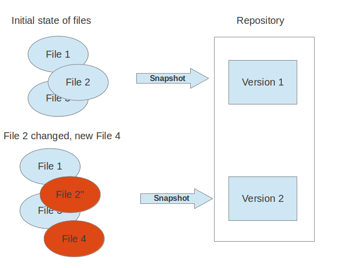
.. |image1| image:: media/image2.png
   :width: 7.46875in
   :height: 3.93750in
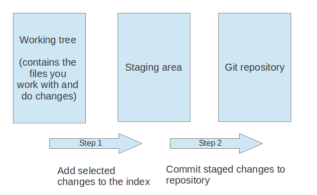
.. |image3| image:: media/image4.png
   :width: 11.17708in
   :height: 5.97917in
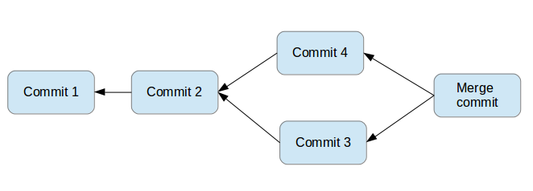
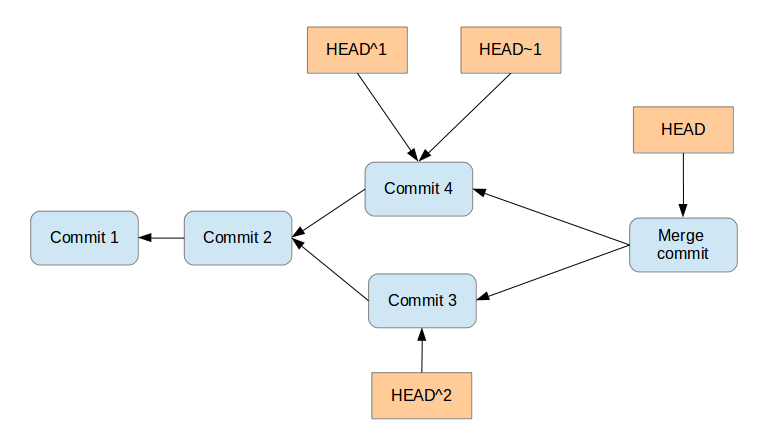
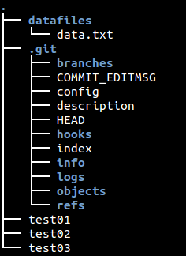
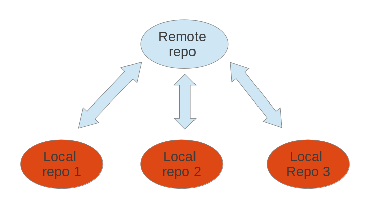
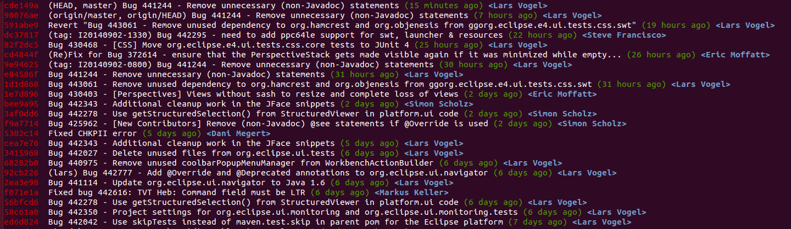
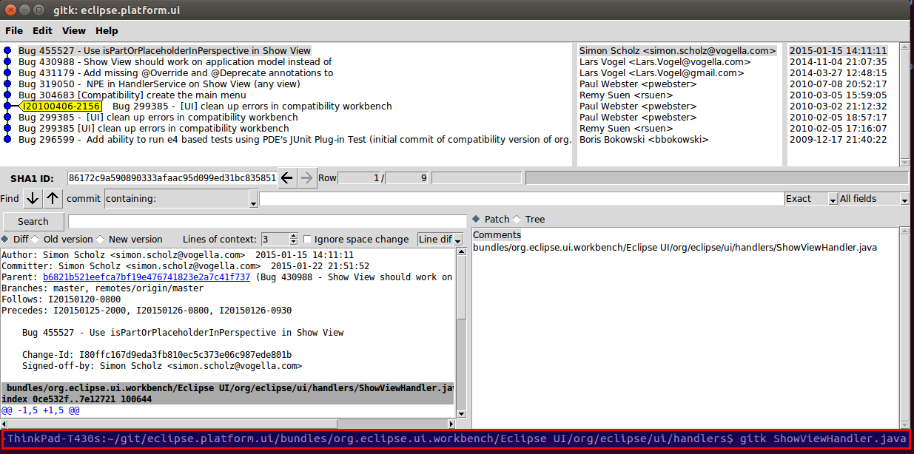
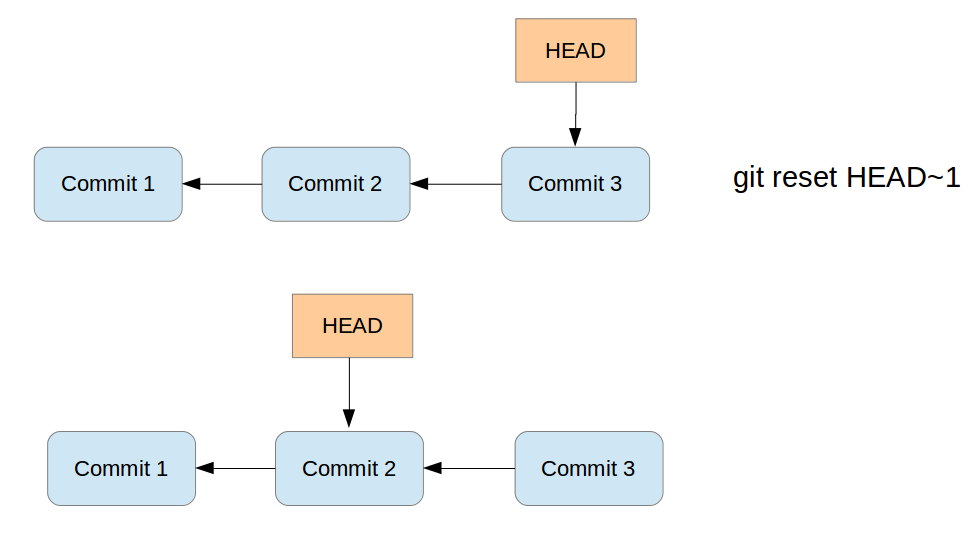
.. |image11| image:: media/image12.png
   :width: 10.38542in
   :height: 6.11458in
.. |image12| image:: media/image13.png
   :width: 8.80208in
   :height: 6.68750in
.. |image13| image:: media/image14.png
   :width: 7.12500in
   :height: 5.26042in
.. |image14| image:: media/image15.png
   :width: 8.84375in
   :height: 5.39583in
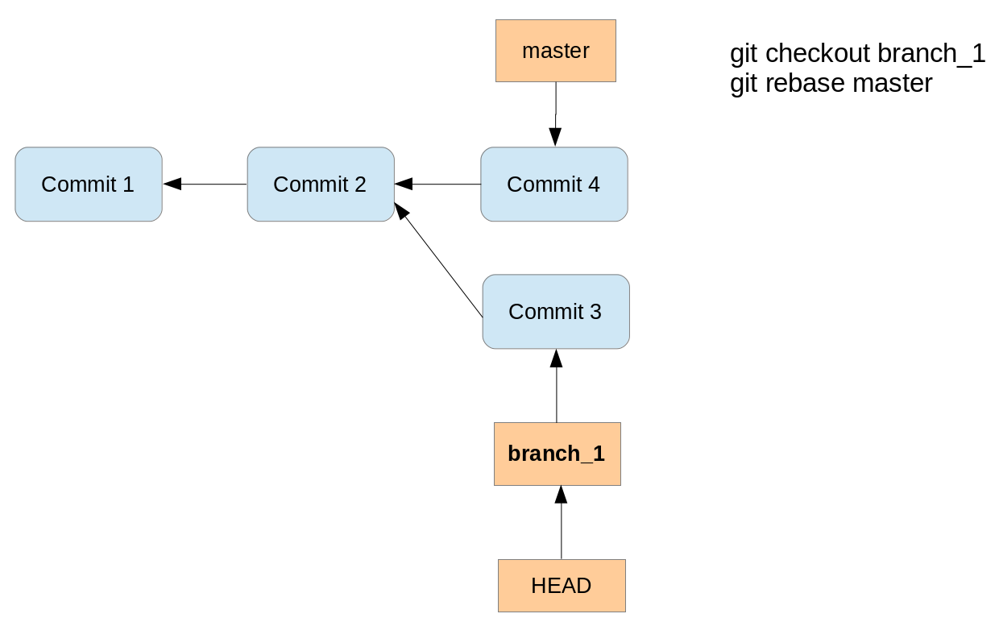
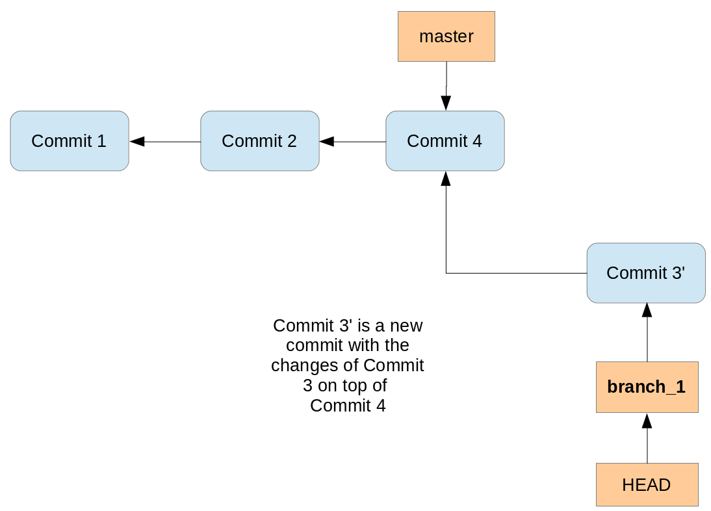
.. |image17| image:: media/image18.png
   :width: 0.56250in
   :height: 0.56250in

